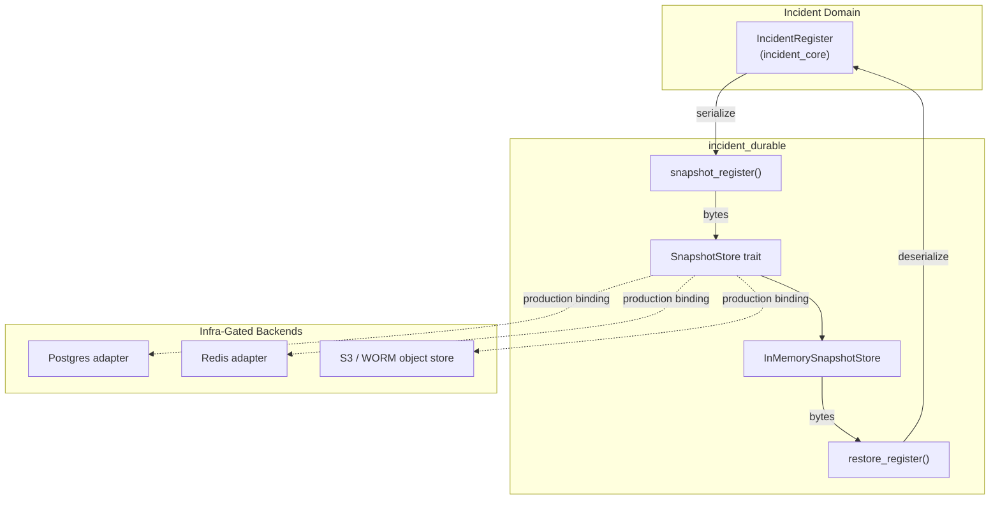
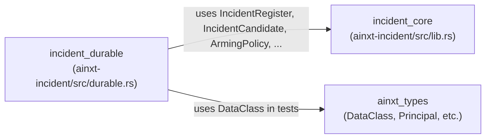
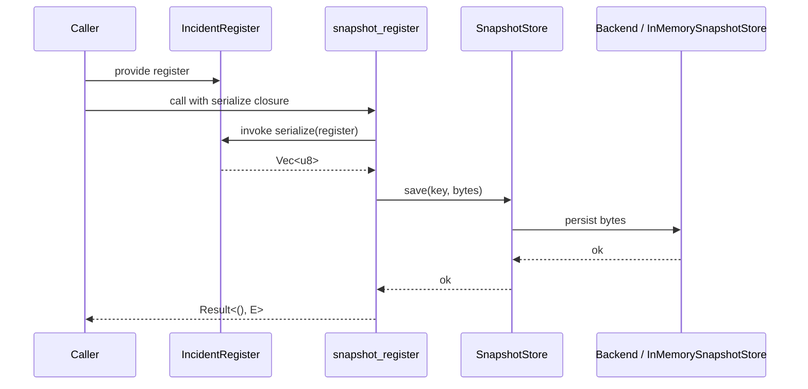
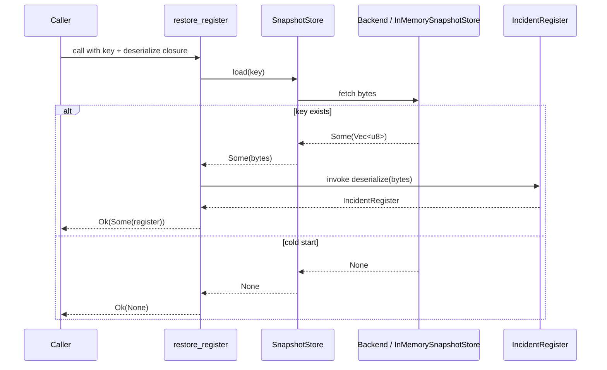
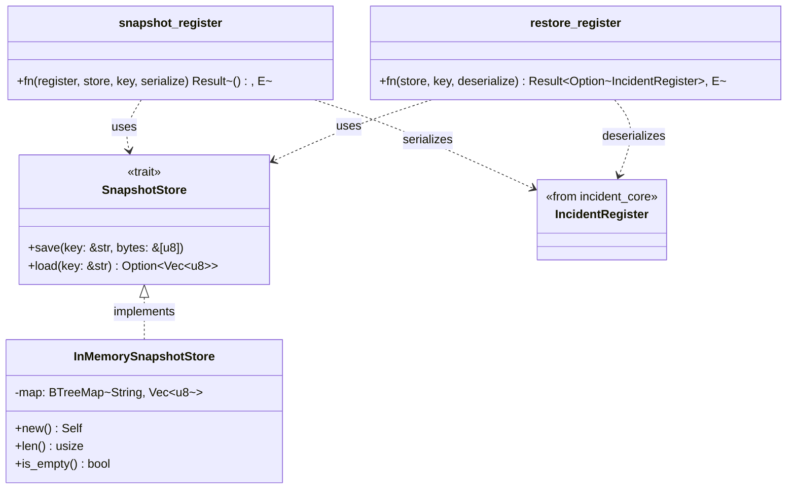
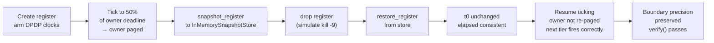
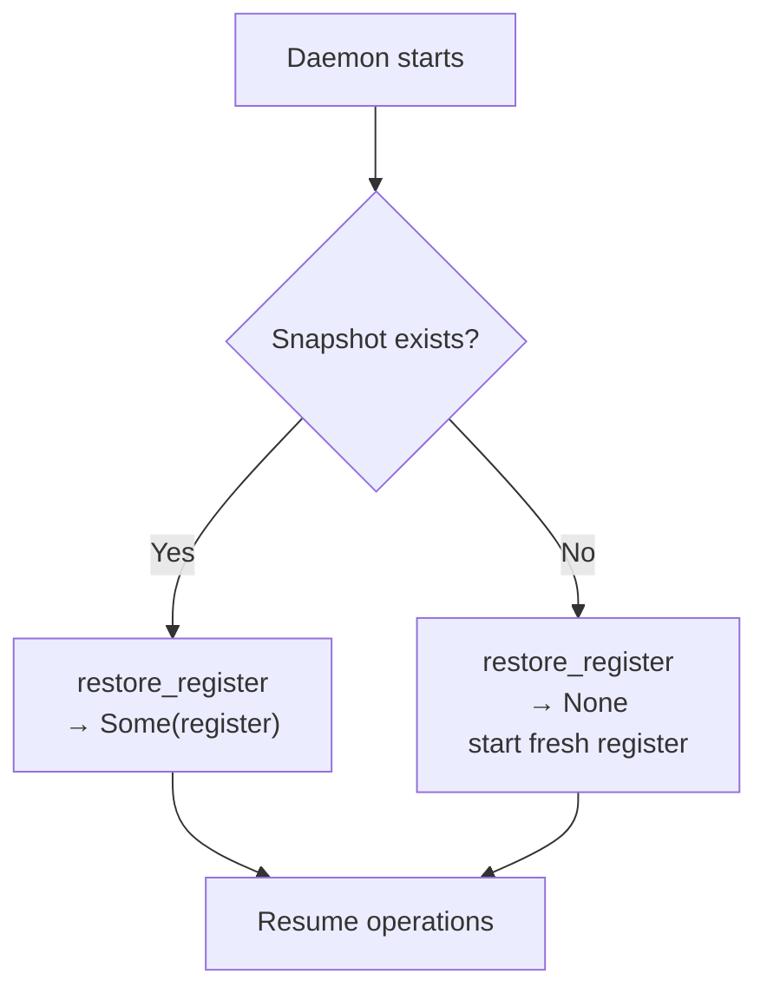

# incident_durable

## Brief Introduction

The `incident_durable` module provides the **crash-survival persistence seam** for the statutory incident register. It decouples the pure, clock-free [`IncidentRegister`](incident_core.md) from durable storage backends (Postgres, Redis, WORM object stores, etc.) by defining a codec-free, byte-oriented `SnapshotStore` trait and an offline `InMemorySnapshotStore` implementation. This lets the register survive a simulated `kill -9` without introducing clocks, RNG, I/O, or serialization dependencies into the core incident crate.

---

## Core Purpose

- **Durability seam**: A small port that moves opaque snapshot bytes under a key, so the register can be serialized, dropped, and restored byte-identically after a crash.
- **Backend decoupling**: Production adapters bind to Postgres/Redis/S3 behind the same trait; this crate ships only the deterministic in-memory version for offline testing.
- **Codec neutrality**: `snapshot_register` and `restore_register` accept caller-supplied `serialize`/`deserialize` closures, so the seam adds no hard serde dependency.

---

## Architecture



### Component Responsibilities

| Component | Responsibility |
|-----------|----------------|
| `SnapshotStore` | Trait defining `save(key, bytes)` and `load(key)`; the persistence port. |
| `InMemorySnapshotStore` | Deterministic, in-memory `BTreeMap` implementation used in tests and offline runs. |
| `snapshot_register` | Serializes an `IncidentRegister` via caller-supplied codec and stores it. |
| `restore_register` | Loads bytes from the store and deserializes them into an `IncidentRegister`. |

---

## Dependencies



- **Upstream**: [`incident_core`](incident_core.md) supplies the `IncidentRegister` and all related types (`IncidentCandidate`, `ArmingPolicy`, `StatutoryClock`, etc.).
- **Test-only**: `ainxt_types::DataClass` is used in the snapshot/restart test to construct a personal-data breach candidate.
- **No external I/O crates**: The durable seam deliberately avoids Postgres/Redis/S3 dependencies in this crate; those live in `infra_gated` deployment adapters.

---

## Data Flow

### Snapshot (save)



### Restore (load)



---

## Component Interaction



---

## Process Flow: Simulated Restart

The test `r10_incident_register_survives_simulated_restart_through_snapshot_seam` demonstrates the intended durability contract:



Key guarantees proven by this flow:

1. **Immutable `t0`**: The statutory clock's origin survives the restart unchanged.
2. **No duplicate paging**: A tier already paged before the crash is not re-paged after restore.
3. **Boundary precision**: Deadlines breach at exactly the same tick as they would have without a crash.
4. **Tamper evidence**: `IncidentRegister::verify()` still passes on the restored register.

---

## Cold-Start Behavior

When `restore_register` is called with a key that has never been written, it returns `Ok(None)` rather than an error. This allows a first-boot daemon to start a fresh register without crash-looping on an empty store.



---

## Design Rationale

- **Codec-free trait**: `SnapshotStore` moves only opaque bytes. Serialization format (`serde_json`, `bincode`, CBOR) is chosen by the caller, keeping the register's supply-chain surface small.
- **No I/O in this crate**: All real backend adapters are `infra_gated`. The crate remains deterministic and testable.
- **Clock-free register**: The register itself has no wall-clock or RNG; persistence is purely a seam concern.
- **Testability**: `InMemorySnapshotStore` lets tests prove crash-survival without requiring a database.

---

## Relationship to Other Modules

- **[`incident_core`](incident_core.md)**: Owns the `IncidentRegister`, statutory clocks, arming policies, and incident lifecycle. `incident_durable` only persists and restores that register.
- **[`incident_cadence`](incident_cadence.md)**: Schedules monitoring cadences; the durable store preserves whatever cadence state is embedded in the register snapshot.
- **[`incident_evidence`](incident_evidence.md)**: Handles evidentiary exports and chain-of-custody; durable snapshots ensure the register's audit hash chain survives restarts.
- **[`incident_ops`](incident_ops.md)**: Operational verifiers (NTP skew, residency) may consult a restored register.
- **[`incident_report`](incident_report.md)**: Report templates and drafts may be generated from a restored register.

---

## Usage Example

```rust
use ainxt_incident::durable::{snapshot_register, restore_register, InMemorySnapshotStore};
use ainxt_incident::{IncidentRegister, ArmingPolicy};

let mut reg = IncidentRegister::new(ArmingPolicy::india_default());
let mut store = InMemorySnapshotStore::new();

// Save
snapshot_register(&reg, &mut store, "incident-register", |r| serde_json::to_vec(r)).unwrap();

// Later, after a restart
let restored = restore_register(&store, "incident-register", |b| serde_json::from_slice(b))
    .unwrap()
    .expect("snapshot exists");
```

For production, replace `InMemorySnapshotStore` with an adapter implementing `SnapshotStore` for Postgres, Redis, or a WORM object store.
