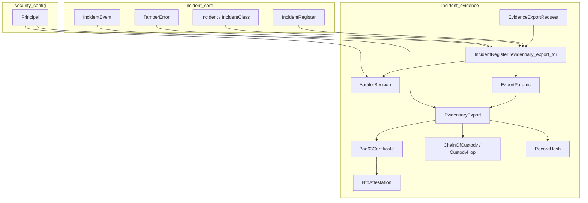
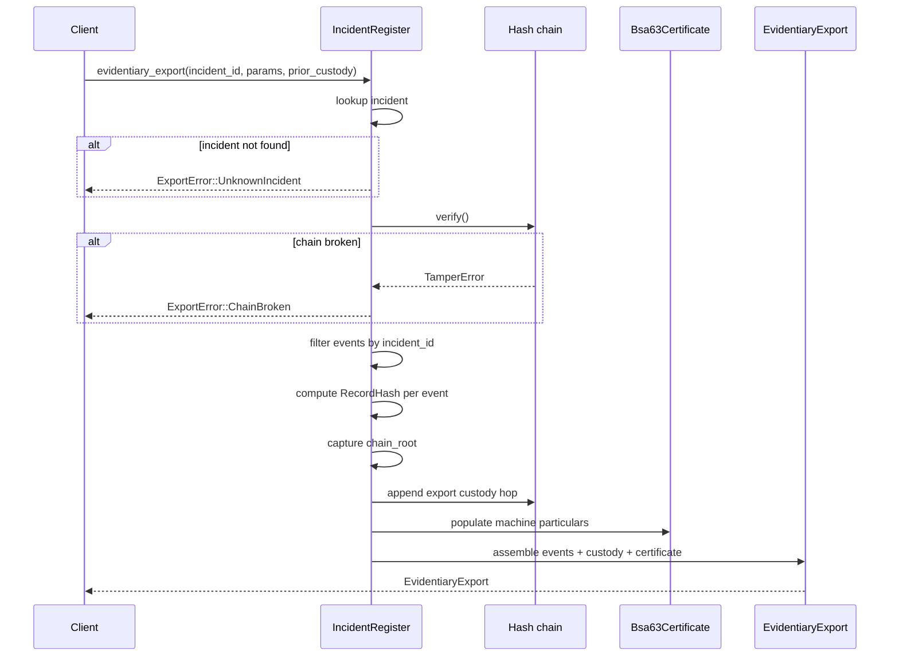
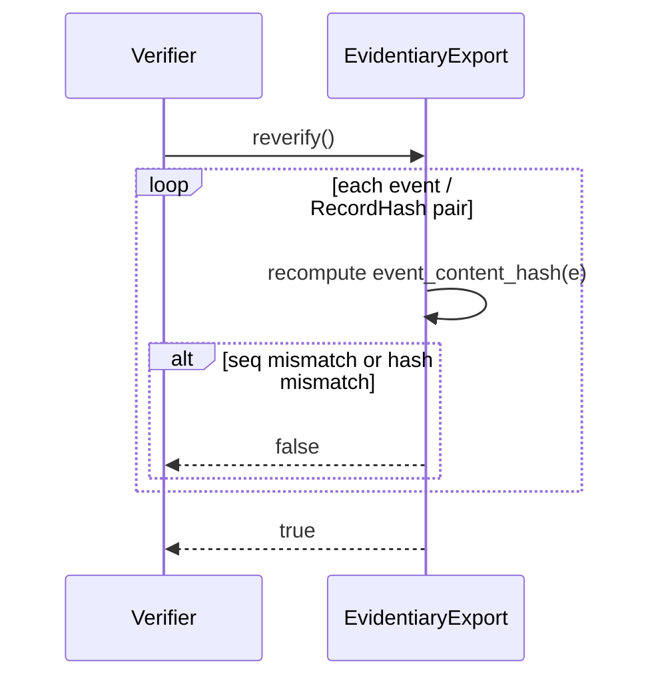
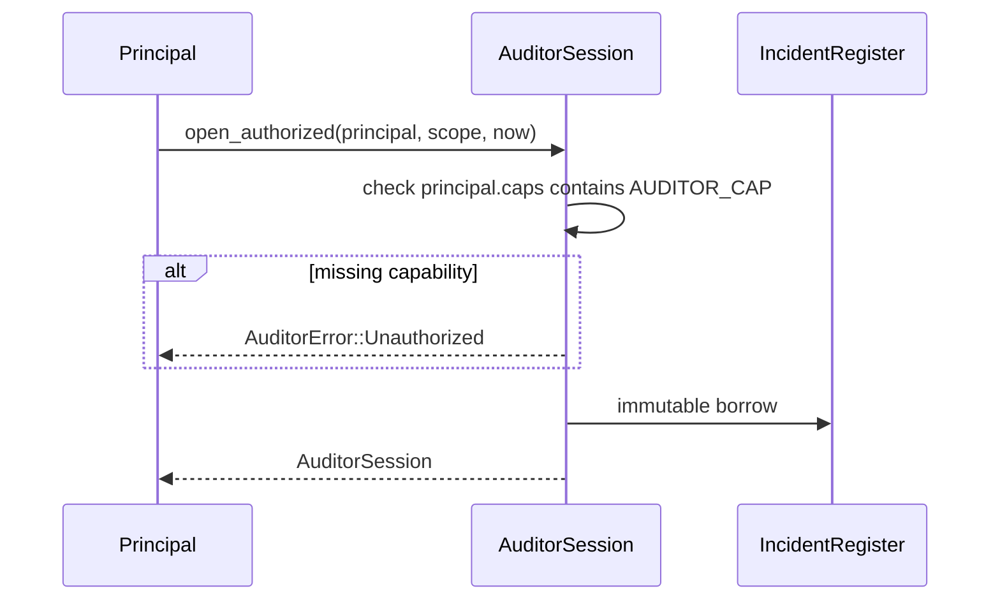
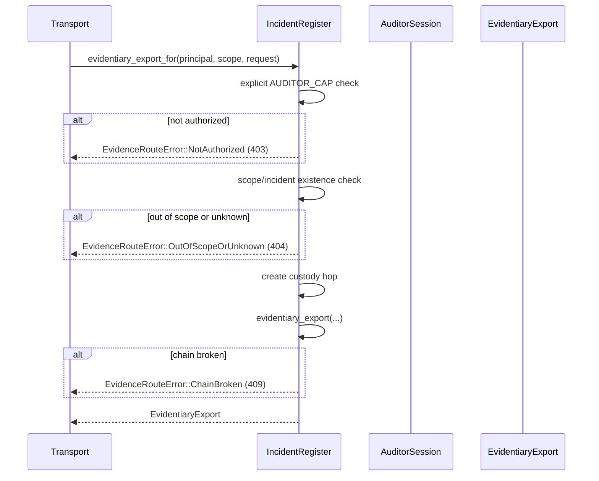
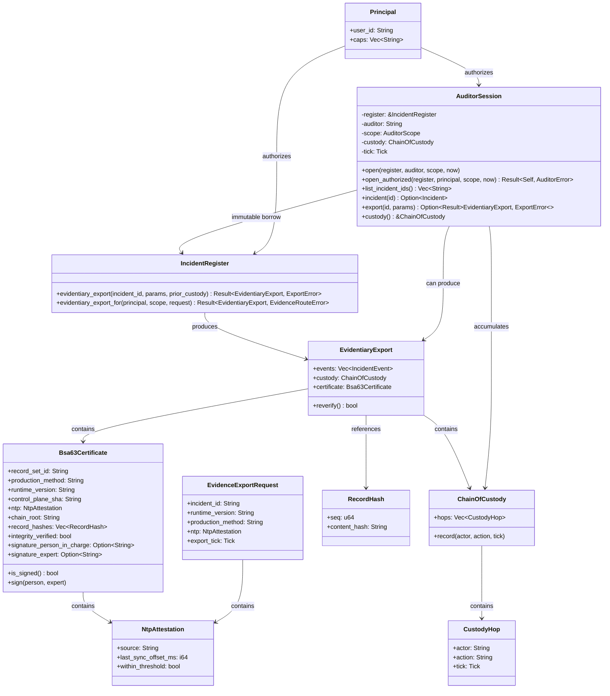

# incident_evidence

The `incident_evidence` module turns the tamper-evident [`incident_core`](incident_core.md) register into a **court-admissible** and **supervisor-examinable** record system. It implements the evidentiary-export and read-only auditor-mode requirements of ADR-025 / `REGULATED_FI_COMPLIANCE_OPS.md` §7–8.

A hash chain proves *integrity*, but under Indian law (Bharatiya Sakshya Adhiniyam 2023, §63) that is not enough: an electronic record must be accompanied by a certificate identifying the record, describing its production, giving the producing system's particulars, and bearing the signatures of the person-in-charge and an expert. This module builds that certificate automatically from machine-knowable particulars, leaving only the two human signatures blank. It also provides `AuditorSession`, a read-only-by-construction supervisory view that filters by scope, hides existence of out-of-scope records, and chain-logs every query so that "who looked at what, when" becomes part of the admissible record itself.

---

## Core responsibilities

1. **Evidentiary export** — produce a self-verifying package (`EvidentiaryExport`) containing the incident's event slice, a chain-of-custody manifest, and a BSA §63-shaped certificate (`Bsa63Certificate`).
2. **Integrity attestation** — recompute per-record content hashes and chain links so any post-export tampering is detectable (`EvidentiaryExport::reverify`).
3. **Supervisory auditor mode** — provide an immutable, scoped, chain-logged session (`AuditorSession`) for examiners who hold the explicit `incident:supervisory-auditor` capability.
4. **Route-ready entrypoint** — expose a single fail-closed, serde-round-trippable call (`IncidentRegister::evidentiary_export_for`) suitable for mounting at `POST /v1/incident/evidence-export`.

---

## Architecture

The module sits on top of [`incident_core`](incident_core.md), which owns the append-only hash-chained register. It consumes [`Principal`](../core_infrastructure/security_config.md) from [`security_config`](../core_infrastructure/security_config.md) for capability checks. The exported package is a pure value type that can be serialized, transmitted, and re-verified without access to the live register.

---

## Key components

### `NtpAttestation`

Captures the provenance of the timestamps used in an export:

- `source` — the configured NIC/NPL-traceable NTP source.
- `last_sync_offset_ms` — last measured local-vs-reference offset.
- `within_threshold` — whether the offset was acceptable at export time.

This is transcribed into the BSA §63 certificate's device particulars so a timestamp's origin is itself provable.

### `CustodyHop` and `ChainOfCustody`

`CustodyHop` records *who* touched the evidence, *what* they did, and *when* (as a logical `Tick`). `ChainOfCustody` is an ordered, append-only list of hops. Every auditor query and every export appends a hop, producing an unbroken custody trail that flows directly into the evidentiary package.

### `RecordHash`

A per-record content hash pairing an event's sequence number with a SHA-256 digest over its canonical, length-prefixed fields (`incident_id`, event tag, `prev_hash`, `hash`, `seq`, `tick`). Because the digest is independent of the chain link, it is a standalone content digest that the certificate can attest and anyone can recompute.

### `Bsa63Certificate`

A BSA §63-shaped certificate. Machine-filled fields include:

- record set id and production method;
- runtime version and live control-plane SHA;
- NTP attestation;
- chain root and per-record content hashes;
- an integrity-verified boolean.

Only `signature_person_in_charge` and `signature_expert` are left blank in the draft. `is_signed()` returns true only when both are present, and `sign(...)` applies the human legal act.

### `EvidentiaryExport`

The three-part evidentiary package:

- `events` — the hash-chained event-log slice for the incident;
- `custody` — the chain-of-custody manifest;
- `certificate` — the BSA §63 certificate draft.

`reverify()` recomputes every content hash and confirms the event count matches the certificate, making post-export tampering detectable.

### `ExportParams`

The machine-knowable particulars supplied by the caller so the export stays pure and testable: runtime version, production method, NTP attestation, exporter identity, and logical export tick.

### `AuditorSession`

A read-only-by-construction supervisory session:

- borrows the register immutably (no mutation is expressible);
- applies an existence-hiding `AuditorScope` (`All`, `Classes`, or `Ids`);
- chain-logs every query into a `ChainOfCustody`;
- can produce an `EvidentiaryExport` that threads the session's custody into the package.

`AuditorSession::open_authorized` requires the principal to hold the explicit `incident:supervisory-auditor` capability; admin status is intentionally **not** sufficient.

### `EvidenceExportRequest` and `EvidenceRouteError`

The wire request body and serializable error enum for the route-ready entrypoint. Errors map cleanly to HTTP semantics:

- `NotAuthorized` → 403;
- `OutOfScopeOrUnknown` → 404 (existence-hiding);
- `ChainBroken` → 409.

---

## Data flow

### Producing an evidentiary export

### Re-verifying an exported package

### Opening an authorized auditor session

### Route-ready export entrypoint

---

## Component interactions

---

## Security model

- **Fail-closed**: an unverifiable register never receives a §63 certificate; the export is refused with `ChainBroken`.
- **Least-privilege**: the supervisory auditor capability (`incident:supervisory-auditor`) must be granted explicitly; admin status is not implied.
- **Existence-hiding**: out-of-scope incidents are indistinguishable from non-existent ones, preventing information leakage by absence.
- **Immutable audit view**: `AuditorSession` holds an immutable reference to the register, so no mutation method can exist on the session.
- **Self-verifying package**: the exported bundle can be re-verified offline; tampering with any event invalidates the certificate's integrity attestation.

---

## Error handling

| Error | When | HTTP mapping |
|-------|------|--------------|
| `ExportError::UnknownIncident` | Incident id not in register | — |
| `ExportError::ChainBroken` | Register hash-chain verification fails | — |
| `AuditorError::Unauthorized` | Principal lacks `AUDITOR_CAP` | — |
| `EvidenceRouteError::NotAuthorized` | Principal lacks `AUDITOR_CAP` | 403 |
| `EvidenceRouteError::OutOfScopeOrUnknown` | Incident absent or outside scope | 404 |
| `EvidenceRouteError::ChainBroken` | Register hash-chain verification fails | 409 |

---

## Integration with the rest of the system

- **incident_core**: owns the register, events, incidents, and chain-verification logic. See [`incident_core`](incident_core.md).
- **incident_durable**: provides snapshot storage for the register. See [`incident_durable`](incident_durable.md).
- **incident_report**: consumes evidentiary exports to draft statutory reports. See [`incident_report`](incident_report.md).
- **security_config / ainxt-types**: supplies the `Principal` type and capability model. See [`security_config`](../core_infrastructure/security_config.md).
- **server_serving / ainxt-server**: the `RegFiEvidenceRequest` route and related HTTP handlers wire `evidentiary_export_for` into the public API. See [`server_serving_core`](../pipeline_runtime/server_serving_core.md).
- **pipeline_runtime / ainxt-runtimed**: injects live runtime version, NTP attestation, and control-plane SHA when producing exports in production. See [`runtime_configuration`](../pipeline_runtime/runtime_configuration.md).

---

## Testing notes

The module's tests cover:

- a valid export produces a machine-populated BSA §63 certificate with blank signatures;
- tampering with an exported event fails `reverify`;
- an export is refused over a broken chain;
- an admin without the explicit auditor capability is refused;
- a scoped auditor cannot see or export out-of-scope incidents;
- every auditor query is recorded as a custody hop.

These tests are co-located in the `#[cfg(test)]` block of `crates/ainxt-incident/src/evidence.rs`.
