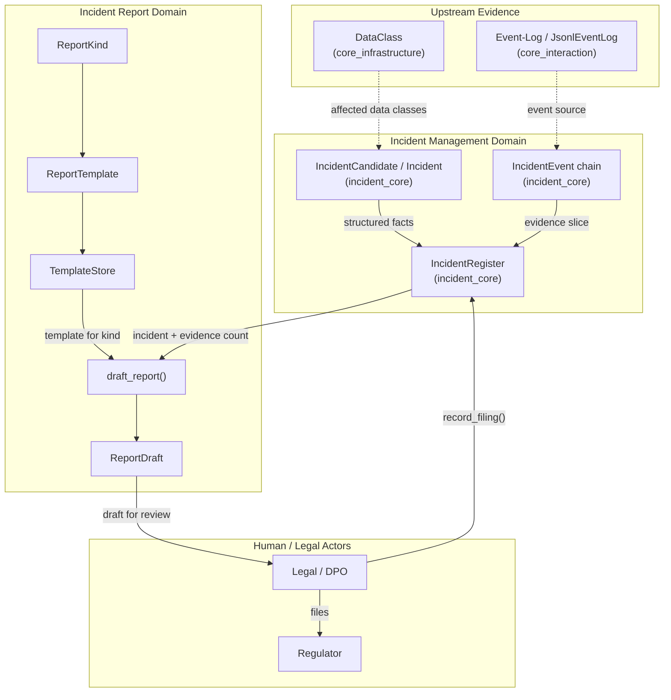
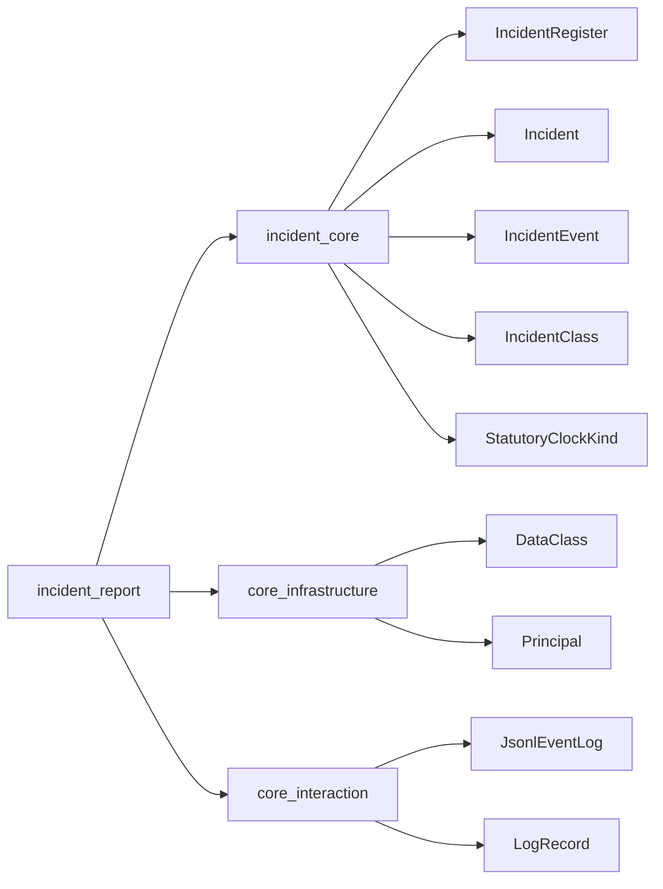
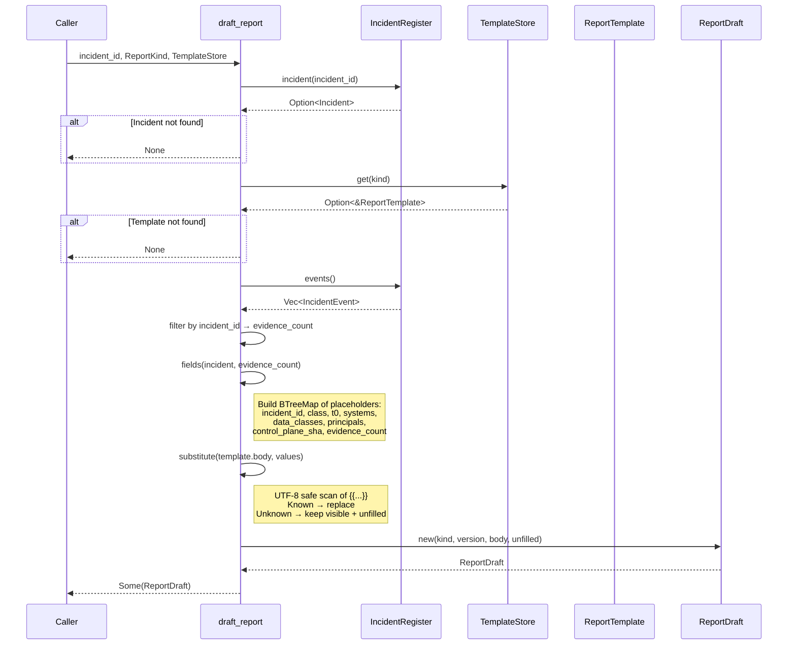
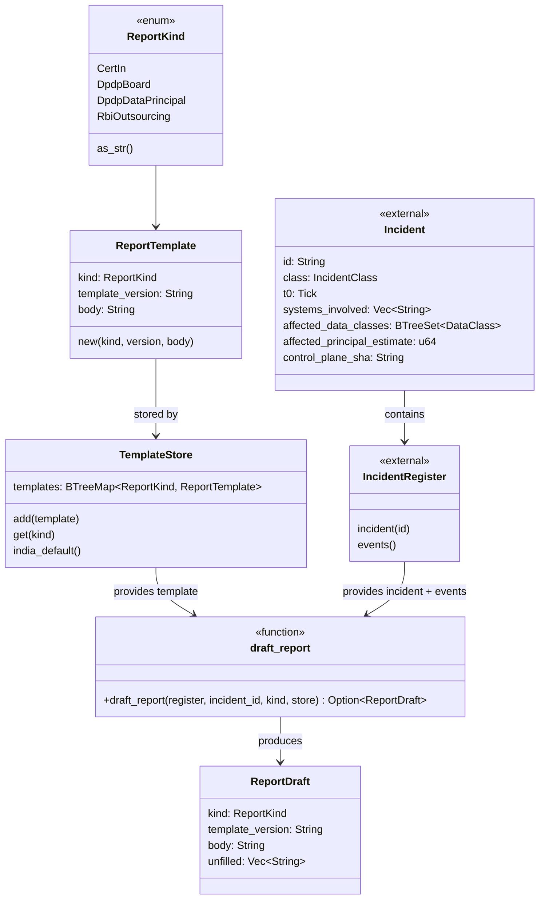
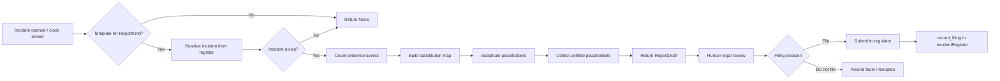
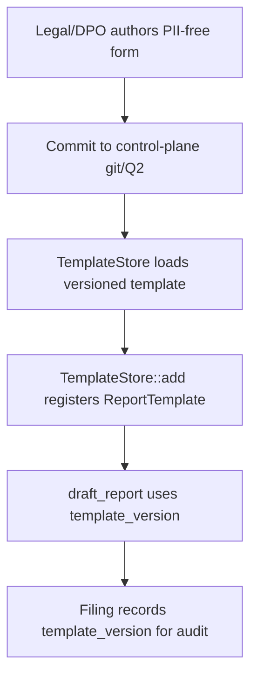

# Incident Report Module

## Brief Introduction

The `incident_report` module (`crates/ainxt-incident/src/report.rs`) is a governance-compliance subsystem that automates the **drafting of statutory breach reports** from structured incident facts and evidentiary event logs. It implements requirement **FI-08** and section **§2.4** of the compliance framework: within minutes of an incident being opened, the module can produce a jurisdiction-specific report draft (CERT-In, DPDP-to-Board, DPDP-to-principal, RBI outsourcing) by filling versioned, PII-free templates with data already held in the [`IncidentRegister`](incident_core.md).

The module is deliberately **non-autonomous**: it generates drafts only; it never files them. Filing remains a human legal act, recorded afterwards via [`IncidentRegister::record_filing`](incident_core.md). Any placeholder that cannot be resolved from structured facts is surfaced explicitly in `ReportDraft::unfilled` so that legal reviewers know exactly which judgments are still required.

---

## Core Concepts

| Concept | Description |
|--------|-------------|
| `ReportKind` | The statutory report type: `CertIn`, `DpdpBoard`, `DpdpDataPrincipal`, `RbiOutsourcing`. |
| `ReportTemplate` | A versioned, PII-free form body containing `{{placeholder}}` slots. Owned by Legal/DPO and tracked by `template_version` (e.g., a git SHA). |
| `TemplateStore` | A control-plane registry holding one template per `ReportKind`. Provides default India templates for end-to-end testing. |
| `ReportDraft` | The output of drafting: the filled body, the template version used, and any `unfilled` placeholders. |
| `draft_report` | The entry-point function that reads an incident and its evidence slice from the register and produces a `ReportDraft`. |

---

## Architecture

### Component Responsibilities

- **`TemplateStore`**: Owns the set of approved report templates. It is a control-plane artifact (git/Q2) and is intentionally separate from runtime incident data so that Legal/DPO can version and audit forms independently.
- **`ReportTemplate`**: Encapsulates a single form, its `ReportKind`, its version, and the placeholder body. The body is PII-free by contract; only structured, non-sensitive facts are substituted.
- **`ReportDraft`**: Represents the result of drafting. It carries the filled body, records which template version was used (for evidentiary reproducibility), and lists any placeholders that could not be filled.
- **`draft_report`**: Orchestrates the drafting process. It resolves the incident, counts matching evidence events, builds a substitution map, and runs a small UTF-8-safe placeholder replacer.

---

## Dependencies

### Direct Dependencies

| Dependency | Module | Role in `incident_report` |
|-----------|--------|---------------------------|
| `IncidentRegister` | [incident_core](incident_core.md) | Source of incident structured facts and the evidence event slice. |
| `Incident` | [incident_core](incident_core.md) | Provides `id`, `class`, `t0`, `systems_involved`, `affected_data_classes`, `affected_principal_estimate`, `control_plane_sha`. |
| `IncidentEvent` | [incident_core](incident_core.md) | Filtered by `incident_id` to produce the `evidence_count` placeholder. |
| `IncidentClass` / `StatutoryClockKind` | [incident_core](incident_core.md) | Drive which statutory clocks and report kinds are armed. |
| `DataClass` | [core_infrastructure](../core_infrastructure/core_infrastructure.md) | Enumerates regulated data classes implicated in the incident. |
| `JsonlEventLog` / `LogRecord` | [core_interaction](../core_infrastructure/core_interaction.md) | Underlying tamper-evident log substrate from which the register's event slice is derived. |

### Sibling Modules in the Incident Subsystem

- [incident_core](incident_core.md): incident lifecycle, register, clocks, triage, and downgrade.
- [incident_cadence](incident_cadence.md): scheduling of statutory-deadline monitors.
- [incident_durable](incident_durable.md): snapshot persistence for the register.
- [incident_evidence](incident_evidence.md): evidentiary exports, chain-of-custody, and BSA §63 certificates.
- [incident_ops](incident_ops.md): operational monitors such as NTP skew and residency verification.

---

## Data Flow

### Placeholder Substitution Rules

1. The template body is scanned for `{{field}}` tokens.
2. If the field exists in the structured-fact map, the placeholder is replaced with the value.
3. If the field is unknown, the placeholder is **left visible** in the body and added to `ReportDraft::unfilled`.
4. The replacer is UTF-8 aware: it advances by the correct byte length of each lead byte so multi-byte characters are never split.

---

## Component Interactions

---

## Process Flows

### Drafting a Statutory Report

### Template Lifecycle

---

## Integration with the Broader System

The `incident_report` module sits at the boundary between **automated incident detection** and **human legal accountability**:

- **Upstream**: It consumes the output of the [incident_core](incident_core.md) register, which is populated by detectors across the platform — compliance egress gates, write-path sink guards, quality circuit breakers, payment-boundary monitors, serving-ops alerts, store sweeps, NTP-skew monitors, and operator declarations.
- **Sidestream**: It leverages the tamper-evident [eventlog](../core_infrastructure/core_interaction.md) chain (via the register's events) to count evidentiary records, ensuring the draft reflects the current evidence slice.
- **Downstream**: The draft is handed to Legal/DPO. After review and any manual completion of `unfilled` placeholders, the human files the report with the regulator. The act of filing is then recorded in the register through [`IncidentRegister::record_filing`](incident_core.md), which stops the corresponding [`StatutoryClock`](incident_core.md).

This design keeps the system **accountable-by-construction**: the runtime can prepare and pre-fill, but it cannot make the legally operative filing decision.

---

## Safety and Compliance Properties

| Property | Mechanism |
|----------|-----------|
| **No silent blanks** | Unknown placeholders remain visible in the body and are listed in `ReportDraft::unfilled`. |
| **Versioned forms** | `ReportTemplate::template_version` and `ReportDraft::template_version` make "which form was filed" auditable. |
| **PII-free by contract** | Templates are PII-free forms; only structured, non-sensitive incident facts are substituted. |
| **No auto-filing** | `draft_report` returns a draft; filing requires a human actor and is recorded separately. |
| **Evidence-aware** | The draft includes `evidence_count` derived from the hash-chained event slice in the register. |
| **UTF-8 safe** | The placeholder scanner advances by lead-byte length, avoiding multi-byte character corruption. |

---

## Testing Notes

The module's unit tests cover three compliance-critical behaviors:

1. **FI-08 fact filling**: A CERT-In draft is produced with all known placeholders substituted and the correct template version recorded.
2. **Unknown placeholder surfacing**: A template referencing an undefined field (`{{remediation_owner}}`) leaves the placeholder visible and reports it in `unfilled`.
3. **Missing inputs**: If the template store lacks the requested kind or the register lacks the incident, `draft_report` returns `None` rather than panicking or producing a partial draft.

---

## References

- [incident_core](incident_core.md): Incident register, incident lifecycle, statutory clocks, and filing records.
- [incident_evidence](incident_evidence.md): Evidentiary exports and chain-of-custody for regulator production.
- [incident_cadence](incident_cadence.md): Deadline monitoring and escalation scheduling.
- [incident_durable](incident_durable.md): Snapshot persistence of the incident register.
- [incident_ops](incident_ops.md): Operational monitors that can raise incidents consumed by the report module.
- [core_interaction](../core_infrastructure/core_interaction.md): Event-log and telemetry substrates underlying incident evidence.
- [core_infrastructure](../core_infrastructure/core_infrastructure.md): `DataClass`, `Principal`, and other shared domain types.
