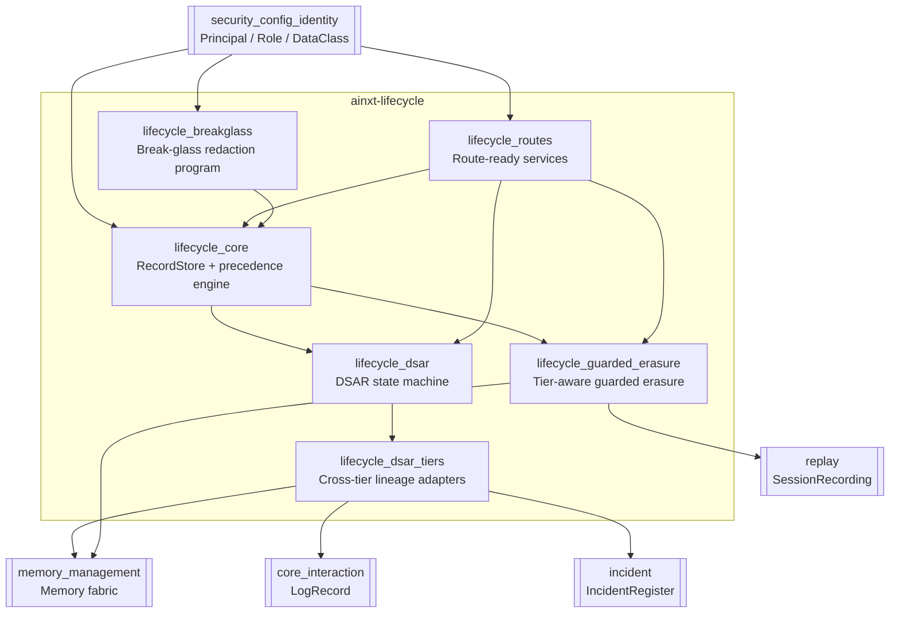
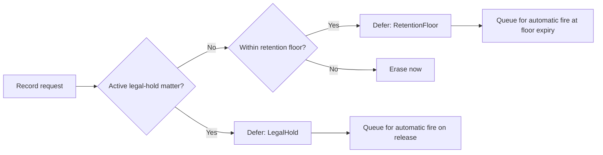
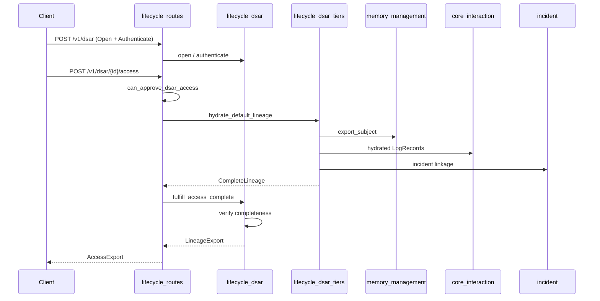
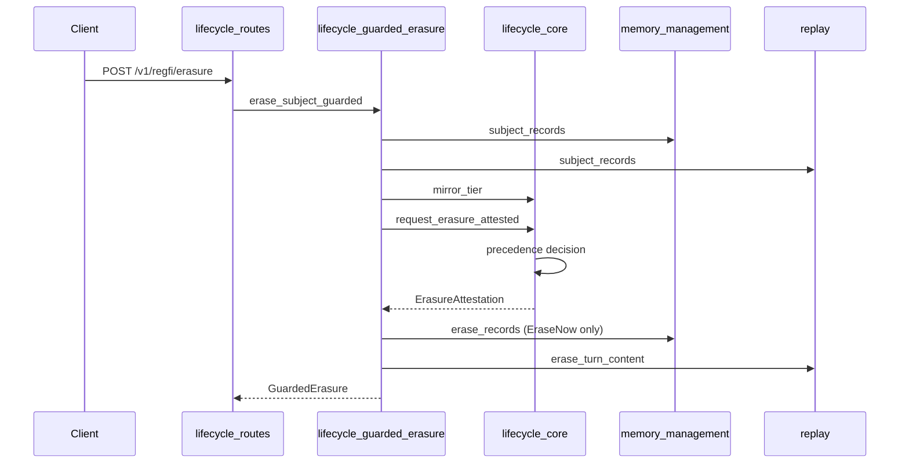
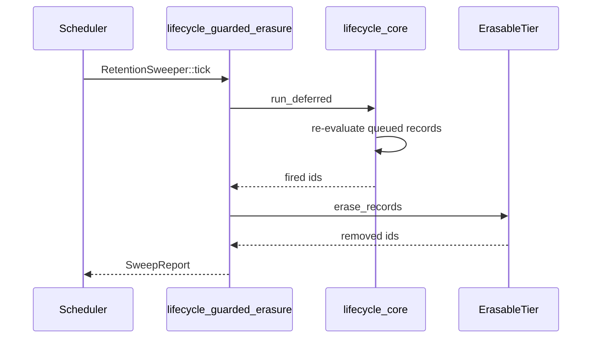

# Lifecycle Module

The **lifecycle** module (`ainxt-lifecycle`) implements the deterministic, auditable data-lifecycle core for the platform. It resolves the tension between three competing obligations:

- **DPDP right-to-erasure** — a data principal can demand their records be erased.
- **Statutory retention (TTL)** — records expire and must be purged once past their window.
- **Legal-hold** — litigation/investigation preservation obligations that override both TTL and erasure.

All operations are pure: logical time is passed in as a tick, with no wall clock, no RNG, and no I/O inside the decision functions. This makes purge, erasure, deferral, and DSAR fulfilment reproducible and regulator-provable.

## Purpose

`ainxt-lifecycle` is the single source of truth for:

1. **Retention policy enforcement** — per-`DataClass` TTL ceilings and statutory retention floors.
2. **Legal-hold matter management** — per-matter preservation scopes that override TTL and erasure.
3. **Right-to-erasure resolution** — deterministic keep/erase/defer decisions with tamper-evident attestations.
4. **DSAR workflow** — identity-proofed, SLA-clocked, hash-chained data-subject access/correction/erasure/grievance requests.
5. **Cross-tier lineage completeness** — proving that a DSAR access export spans every mandated data tier.
6. **Break-glass remediation** — scoped, authorized, checkpointed redaction of PII that slipped into held/floor-bound records.

The module is part of the larger [governance_compliance](governance_compliance.md) domain and depends on identity primitives from [security_config_identity](../core_infrastructure/security_config_identity.md), durable stores from [memory_management](../ai_engine/memory_management.md), event logs from [core_interaction](../core_infrastructure/core_interaction.md), incident records from [incident](incident.md), and replay storage from [replay](../ai_engine/replay.md).

## Architecture Overview

### Precedence Model

The lifecycle engine applies a fixed, model-free precedence (highest first):

1. **Legal-hold matter** — if an active matter's `HoldScope` covers the record, it is preserved and the erasure is deferred.
2. **Statutory retention floor** — if the record is still within its class's minimum retention window, the erasure is deferred.
3. **Erase now** — otherwise the record is removed immediately.

A TTL sweep (`purge_expired`) follows the same precedence: held or floor-bound records are never purged, even when past their TTL ceiling.

## Sub-modules

| Sub-module | File(s) | Responsibility |
|------------|---------|----------------|
| [lifecycle_core](lifecycle_core.md) | `src/lib.rs` | `RecordStore`, `RetentionPolicy`, `LegalHold`, `HoldScope`, `ErasureAttestation`, and the deterministic precedence engine. |
| [lifecycle_dsar](lifecycle_dsar.md) | `src/dsar.rs` | `DsarRegister`, `DsarRequest`, hash-chained `DsarEvent`s, and DSAR fulfilment (access, erasure, correction, grievance). |
| [lifecycle_dsar_tiers](lifecycle_dsar_tiers.md) | `src/dsar_tiers.rs` | `CompleteLineage`, `MultiTierLineage`, and real-tier adapters over memory, event log, incident register, and the DSAR register itself. |
| [lifecycle_guarded_erasure](lifecycle_guarded_erasure.md) | `src/guarded.rs` | `ErasableTier`, `MemoryFabricTier`, `SessionReplayTier`, `RetentionSweeper`, and `erase_subject_guarded` — the single right-to-erasure entrypoint that propagates decisions into real durable tiers. |
| [lifecycle_breakglass](lifecycle_breakglass.md) | `src/breakglass.rs` | `BreakGlassProgram`, `RedactionTarget`, and `RedactionAttestation` for authorized, hash-chained redaction of PII in held/floor-bound records. |
| [lifecycle_routes](lifecycle_routes.md) | `src/routes.rs` | `DsarWorkflow`, `RetentionService`, and their route-ready command/outcome envelopes with RBAC gates. |

## Data Flows

### DSAR Access Fulfilment

### Guarded Erasure

### Deferred-Erasure Sweep

## Integration with the Rest of the System

- **[security_config_identity](../core_infrastructure/security_config_identity.md)** supplies `Principal`, `Role`, and `DataClass`. RBAC gates (`CAP_DSAR_OPERATE`, `CAP_RETENTION_ADMIN`, `BREAK_GLASS_CAP`) are checked against explicit capability grants.
- **[memory_management](../ai_engine/memory_management.md)** is the real backing for the `redis-session`, `postgres-episodic`, `kg-memoryfact`, and `embeddings` DSAR tiers, and for the `MemoryFabricTier` erasure target.
- **[core_interaction](../core_infrastructure/core_interaction.md)** provides the tamper-evident `LogRecord` trace tier used in DSAR access exports.
- **[incident](incident.md)** provides the `IncidentRegister` used for the `incident-register` DSAR tier.
- **[replay](../ai_engine/replay.md)** provides `SessionRecording` and `SessionStore`; the `SessionReplayTier` erases turn content without deleting the turn tree.
- **[governance_compliance](governance_compliance.md)** is the parent module that also includes admission, compliance, governance, identity, incident, payments, responsible AI, teams, and workforce.

## Documentation Index

- [lifecycle.md](lifecycle.md) — this overview.
- [lifecycle_core.md](lifecycle_core.md) — retention policy, legal hold, and precedence engine.
- [lifecycle_dsar.md](lifecycle_dsar.md) — DSAR state machine and hash-chained register.
- [lifecycle_dsar_tiers.md](lifecycle_dsar_tiers.md) — cross-tier lineage adapters.
- [lifecycle_guarded_erasure.md](lifecycle_guarded_erasure.md) — guarded erasure and retention sweeper.
- [lifecycle_breakglass.md](lifecycle_breakglass.md) — break-glass redaction program.
- [lifecycle_routes.md](lifecycle_routes.md) — route-ready DSAR and retention services.

## Key Design Properties

- **Deterministic** — all decisions depend only on the stored state and an injected logical tick.
- **Tamper-evident** — DSAR events, erasure attestations, and break-glass redactions are all hash-chained or content-hashed.
- **Fail-closed** — missing lineage tiers, missing capabilities, or unproofed identity all refuse fulfilment rather than silently under-report.
- **Partial completion as a first-class outcome** — deferred erasures and break-glass programs checkpoint progress and resume after restarts.
- **Redact-and-proceed** — a subject under legal hold receives a reason-coded deferral notice, never a refusal-shaped error.
