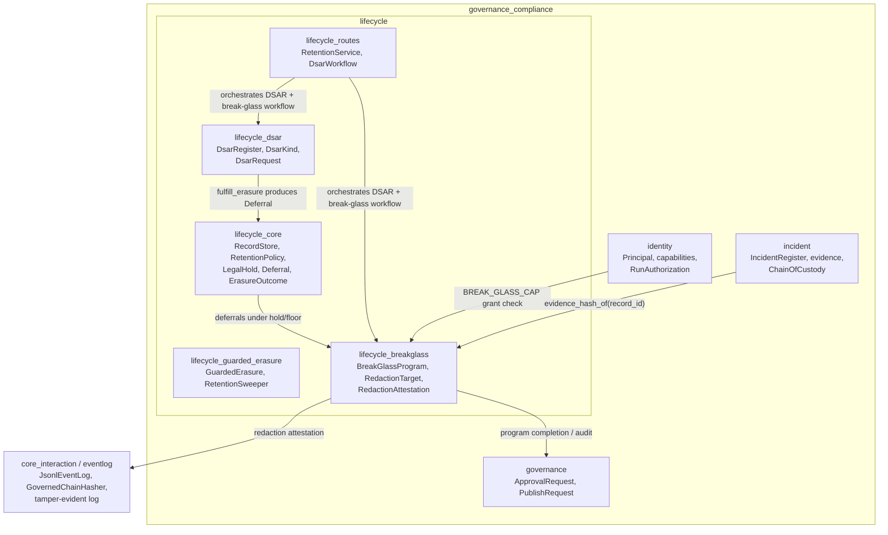
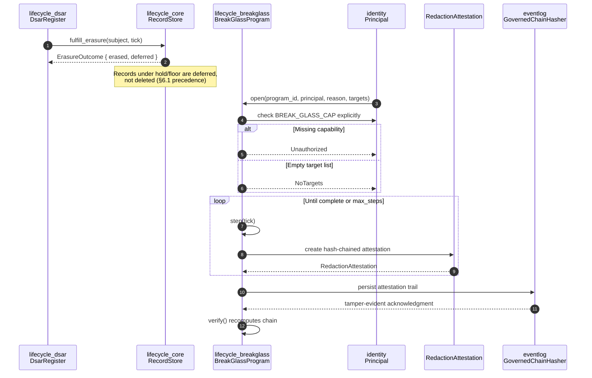
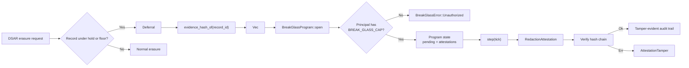
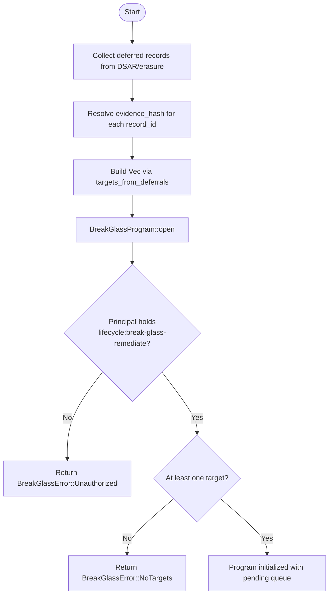
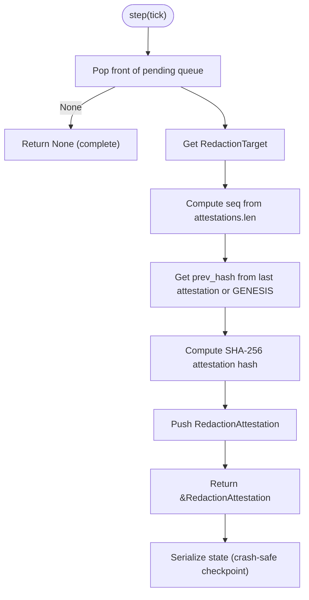
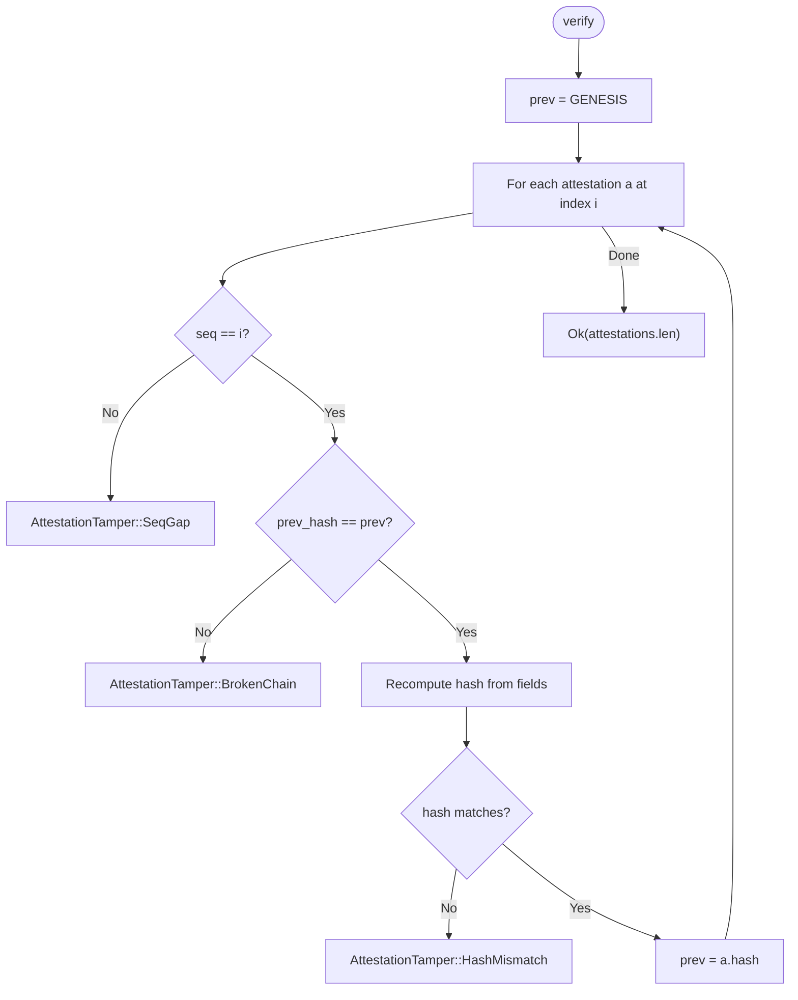

# lifecycle_breakglass

## Brief Introduction

The `lifecycle_breakglass` module implements a **break-glass PII remediation Program** for records that sit at the intersection of two conflicting requirements: a detector miss has left erasable PII inside a record, but that record is protected by a **retention floor** or an active **legal hold** and therefore cannot be deleted. Rather than violating the hold/floor (or leaving the PII in place), the module performs a **scoped, authorized, checkpointed redaction-with-attestation**: the PII payload is removed in place, while the record itself and its evidentiary hash-chain remain intact. Each redaction emits a signed, hash-chained [`RedactionAttestation`](lifecycle_breakglass.md#redactionattestation), making the fact-of-redaction tamper-evident and auditable.

The Program is designed as a **Long-Horizon Program (Q1)**: it is serde-serializable, resumable after a crash, and treats partial completion as a first-class outcome. Authorization is explicit and least-privilege — a principal must hold the dedicated `lifecycle:break-glass-remediate` capability; admin status alone is insufficient.

---

## Core Concepts

| Concept | Description |
|--------|-------------|
| **Break-glass remediation** | Emergency remediation when normal erasure is blocked by retention/hold precedence. |
| **Redaction-with-attestation** | Remove the PII payload while preserving the record and its evidentiary hash; emit a signed attestation. |
| **Hash-chained attestation trail** | Each [`RedactionAttestation`](lifecycle_breakglass.md#redactionattestation) links to the previous one, forming a tamper-evident remediation log. |
| **Long-Horizon Program** | Durable, resumable, deterministic, with partial completion as a first-class outcome. |
| **Least-privilege authorization** | Requires the explicit `lifecycle:break-glass-remediate` capability; admins without it are refused. |

---

## Architecture

The module sits within the [`lifecycle`](lifecycle_core.md) governance area and bridges the DSAR/retention precedence logic with incident-grade evidentiary integrity. It consumes [`Deferral`](lifecycle_core.md) records produced when an erasure cannot proceed due to a hold or floor, and produces a chain of attestations that can be verified independently.



### Module Position

- **Parent module:** [`lifecycle`](lifecycle_core.md)
- **Sibling modules:**
  - [`lifecycle_core`](lifecycle_core.md) — retention policies, legal holds, deferrals, erasure outcomes
  - [`lifecycle_dsar`](lifecycle_dsar.md) — DSAR register and fulfillment workflows
  - [`lifecycle_dsar_tiers`](lifecycle_dsar_tiers.md) — tiered lineage storage for DSARs
  - [`lifecycle_guarded_erasure`](lifecycle_guarded_erasure.md) — guarded, tier-aware erasure sweeps
  - [`lifecycle_routes`](lifecycle_routes.md) — HTTP/service routes for retention and DSAR workflows
- **Cross-cutting concerns:**
  - [`identity`](identity.md) — principal capabilities and authorization
  - [`incident`](incident.md) — incident registration and evidentiary exports
  - [`core_interaction`](../core_infrastructure/core_interaction.md) / [`eventlog`](../core_infrastructure/core_interaction.md#eventlog) — tamper-evident logging infrastructure

---

## Core Components

### `RedactionTarget`

A single record that requires break-glass redaction. It identifies the record, references its position in the evidentiary chain, and carries a human-readable (PII-free) justification.

```rust
pub struct RedactionTarget {
    pub record_id: String,
    pub original_evidence_hash: String,
    pub note: String,
}
```

| Field | Purpose |
|-------|---------|
| `record_id` | Identifier of the held/floored record containing slipped PII. |
| `original_evidence_hash` | The record's hash/position in its evidentiary chain; the redaction attests **against** this value. |
| `note` | PII-free explanation, e.g. "email leaked into a PMLA-floored log". |

The helper [`RedactionTarget::from_deferral`](lifecycle_breakglass.md#redactiontargetfrom_deferral) builds a target from a [`Deferral`](lifecycle_core.md) produced by the normal erasure path, and [`targets_from_deferrals`](lifecycle_breakglass.md#targets_from_deferrals) converts an entire deferred batch.

### `RedactionAttestation`

A signed, hash-chained attestation that a target's PII payload was redacted in place. The attestation binds together the previous attestation hash, the record id, the original evidence hash, the attestor, the reason code, the sequence number, and the logical tick.

```rust
pub struct RedactionAttestation {
    pub seq: u64,
    pub record_id: String,
    pub original_evidence_hash: String,
    pub attestor: String,
    pub reason_code: String,
    pub tick: u64,
    pub prev_hash: String,
    pub hash: String,
}
```

| Field | Purpose |
|-------|---------|
| `seq` | Monotonic sequence number within the Program. |
| `record_id` | Record that was redacted. |
| `original_evidence_hash` | Preserved reference to the record's original evidentiary hash. |
| `attestor` | Principal who performed the redaction. |
| `reason_code` | Categorized justification for the break-glass action. |
| `tick` | Logical timestamp injected by the caller; keeps the Program clock-free and deterministic. |
| `prev_hash` | Hash of the previous attestation (or `GENESIS`). |
| `hash` | SHA-256 hash of all bound fields, forming the chain link. |

### `BreakGlassProgram`

The durable, resumable state machine that processes [`RedactionTarget`](lifecycle_breakglass.md#redactiontarget)s one at a time and emits [`RedactionAttestation`](lifecycle_breakglass.md#redactionattestation)s.

```rust
pub struct BreakGlassProgram {
    pub program_id: String,
    pub attestor: String,
    pub reason_code: String,
    pending: VecDeque<RedactionTarget>,
    attestations: Vec<RedactionAttestation>,
    total: usize,
}
```

| Method | Behavior |
|--------|----------|
| `open` | Validates the principal holds `BREAK_GLASS_CAP`, checks for at least one target, and initializes the Program. |
| `step` | Pops the next pending target, emits one attestation, and returns it. Idempotent no-op when complete. |
| `run` | Drives `step` up to `max_steps`, bounding work per scheduler tick. |
| `progress` | Returns `(done, total)` for partial-completion visibility. |
| `is_complete` | True when no pending targets remain. |
| `attestations` | Returns the emitted attestation trail. |
| `verify` | Recomputes the hash chain end-to-end and detects sequence gaps, broken links, or hash mismatches. |

---

## Component Interactions



---

## Data Flow



---

## Process Flows

### Opening a Break-Glass Program



### Stepping and Checkpointing



### Verification



---

## Authorization Model

Break-glass remediation is intentionally **not** an implicit admin power. The module checks the principal's capability list directly:

```rust
pub const BREAK_GLASS_CAP: &str = "lifecycle:break-glass-remediate";

if !principal.caps.iter().any(|c| c == BREAK_GLASS_CAP) {
    return Err(BreakGlassError::Unauthorized(principal.user_id.clone()));
}
```

This design aligns with the broader [`identity`](identity.md) and [`governance`](governance.md) least-privilege model: capabilities are granted explicitly, and break-glass access is auditable through the attestation trail.

---

## Integration with DSAR and Retention Precedence

The module's primary trigger is a DSAR erasure that cannot fully complete because some records are protected by a retention floor or legal hold. See [`lifecycle_dsar`](lifecycle_dsar.md) and [`lifecycle_core`](lifecycle_core.md) for the precedence rules. The seam is:

1. [`DsarRegister::fulfill_erasure`](lifecycle_dsar.md) returns an [`ErasureOutcome`](lifecycle_core.md) with `deferred` records.
2. The caller resolves each deferred record's evidentiary-chain hash (typically from the incident/event-log tier).
3. [`targets_from_deferrals`](lifecycle_breakglass.md#targets_from_deferrals) builds the break-glass target list.
4. An authorized DPO opens and runs the [`BreakGlassProgram`](lifecycle_breakglass.md#breakglassprogram).
5. The original records remain intact; only the slipped PII is redacted in place.

This preserves §6.1 precedence (hold/floor beats erasure) while still satisfying the subject's right to have their PII removed from places where it should never have landed.

---

## Determinism and Testability

The Program is intentionally pure and deterministic:

- No wall-clock or RNG usage inside `step`/`run`; the caller injects `tick`.
- No I/O; hash resolution is provided via a callback.
- State is serde-serializable, enabling crash recovery and deterministic tests.
- Partial completion is inspectable via [`progress`](lifecycle_breakglass.md#progress) and [`is_complete`](lifecycle_breakglass.md#is_complete).

These properties make the module compatible with the deterministic replay and evaluation infrastructure described in [`evaluation_testing`](../ai_engine/evaluation_testing.md).

---

## Error Types

| Error | Meaning |
|-------|---------|
| `BreakGlassError::Unauthorized(user)` | The principal does not hold `BREAK_GLASS_CAP`. |
| `BreakGlassError::NoTargets` | The Program was opened with an empty target list. |
| `AttestationTamper::SeqGap` | A sequence number in the chain does not match the expected index. |
| `AttestationTamper::BrokenChain` | An attestation's `prev_hash` does not match the previous attestation's hash. |
| `AttestationTamper::HashMismatch` | The recomputed hash of an attestation does not match its stored `hash`. |

---

## References

- [`lifecycle_core`](lifecycle_core.md) — `Deferral`, `RecordStore`, `RetentionPolicy`, `LegalHold`, `ErasureOutcome`
- [`lifecycle_dsar`](lifecycle_dsar.md) — `DsarRegister`, `DsarKind`, DSAR fulfillment workflow
- [`lifecycle_guarded_erasure`](lifecycle_guarded_erasure.md) — tier-aware guarded erasure sweeps
- [`lifecycle_routes`](lifecycle_routes.md) — service routes that orchestrate retention and DSAR workflows
- [`identity`](identity.md) — `Principal`, capability-based authorization
- [`incident`](incident.md) — incident registration, evidence, and chain-of-custody
- [`evaluation_testing`](../ai_engine/evaluation_testing.md) — deterministic replay and conformance testing
