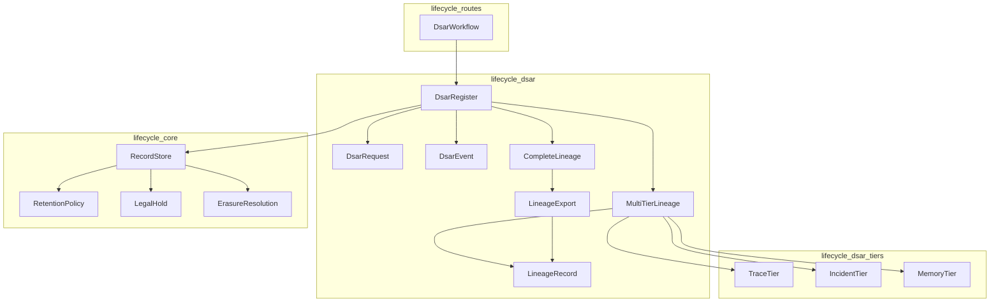
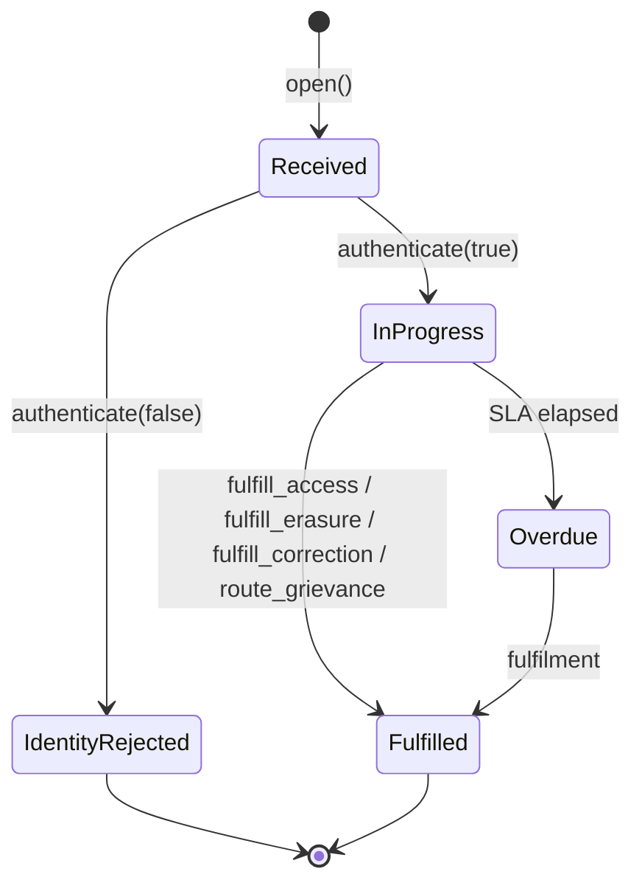
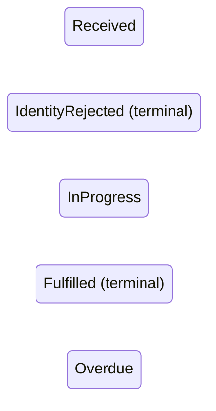
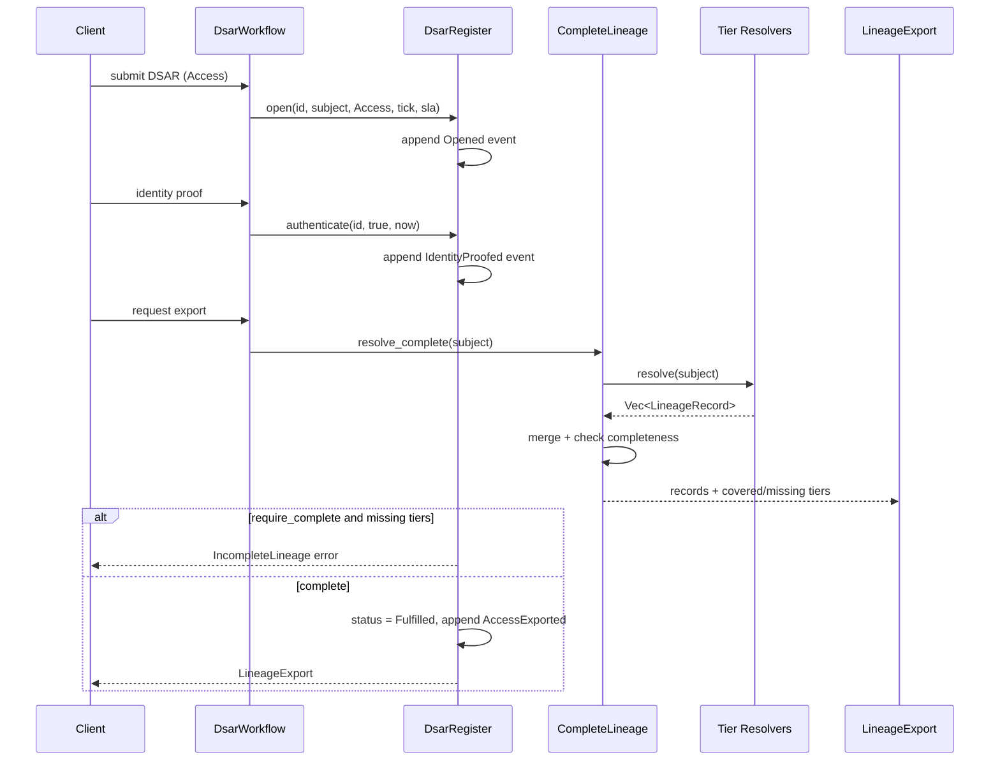
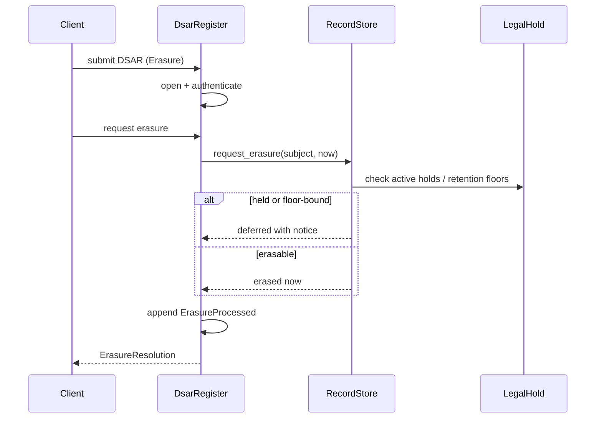

# `lifecycle_dsar` — Data-Subject Access Request (DSAR) Engine

## Brief Introduction

The `lifecycle_dsar` module implements the **governed, SLA-clocked state machine** for Data-Subject Access Requests (DSARs) under the lifecycle governance layer. It supports the DPDP-style rights of **access, portability, correction, erasure, and grievance** in a deterministic, audit-friendly way.

The module is built around four load-bearing guarantees:

1. **Identity-proofing gates every DSAR** — no fulfilment proceeds until the request is authenticated.
2. **Cross-tier lineage resolution** — access/portability exports resolve a subject's data across every registered data tier.
3. **Erasure respects retention/hold precedence** — erasure DSARs are deferred for held or floor-bound records.
4. **Hash-chained, tamper-evident register** — every state transition is append-only and verifiable.

This module is part of the [`lifecycle`](lifecycle.md) subsystem within [`governance_compliance`](governance_compliance.md).

---

## Core Responsibilities

| Responsibility | Description |
|----------------|-------------|
| DSAR lifecycle management | Open, authenticate, fulfil, and close DSAR requests with SLA tracking. |
| Cross-tier lineage resolution | Resolve subject records across multiple data tiers (`lifecycle-store`, `redis-session`, `kg-memoryfact`, etc.). |
| Completeness enforcement | Refuse access exports when required tiers are missing resolvers. |
| Erasure fulfilment | Route erasure requests through [`RecordStore::request_erasure`](lifecycle_core.md) so legal holds and retention floors are respected. |
| Tamper-evident audit | Maintain an append-only, SHA-256 hash-chained event log. |

---

## Architecture

### High-Level Component Diagram



### DSAR State Machine



---

## Core Components

### `DsarRequest`

Represents a single DSAR with its SLA clock and identity-proofing state.

| Field | Purpose |
|-------|---------|
| `id` | Unique request identifier. |
| `subject_id` | The data principal whose data is being requested. |
| `kind` | One of `Access`, `Portability`, `Correction`, `Erasure`, `Grievance`. |
| `opened_tick` | Logical tick when the request was received (SLA anchor). |
| `sla_ticks` | Response window budget in logical ticks. |
| `identity_proofed` | Hard precondition for any fulfilment. |
| `status` | Current lifecycle state. |
| `closed_tick` | Tick when terminal state was reached. |

Key methods:
- `deadline()` — computes the SLA deadline.
- `is_overdue(now)` — true if past deadline and not terminal.

### `DsarStatus`



Terminal states (`IdentityRejected`, `Fulfilled`) stop the SLA clock.

### `DsarRegister`

The central stateful engine. It owns:
- A map of `DsarRequest`s keyed by `id`.
- An append-only, hash-chained `Vec<DsarEvent>`.

Key operations:
- `open(...)` — create a new DSAR.
- `authenticate(id, proof_ok, now)` — identity-proofing gate.
- `fulfill_access(...)` / `fulfill_access_complete(...)` — access/portability exports.
- `fulfill_erasure(...)` — erasure through retention/hold precedence.
- `fulfill_correction(...)` — correction fulfilment.
- `route_grievance(...)` — grievance routing.
- `refresh_overdue(now)` — mark SLA-breached requests.
- `verify()` — recompute and validate the hash chain.

### `DsarEvent` and `DsarAction`

Each state transition appends a `DsarEvent` containing:
- `seq` — monotonic sequence number.
- `request_id` — associated DSAR.
- `action` — one of `DsarAction` variants.
- `tick` — logical timestamp.
- `prev_hash` / `hash` — SHA-256 chain links.

`DsarAction` variants:
- `Opened`
- `IdentityProofed` / `IdentityRejected`
- `AccessExported`
- `Corrected`
- `ErasureProcessed`
- `GrievanceRouted`
- `MarkedOverdue`

### `LineageResolver` Trait

The seam for resolving a subject's records within a single data tier.

```rust
pub trait LineageResolver {
    fn resolve(&self, subject_id: &str) -> Vec<LineageRecord>;
}
```

Implementations include:
- [`RecordStore`](lifecycle_core.md) as the `lifecycle-store` tier.
- [`RedisTier`](lifecycle_dsar_tiers.md), [`KgTier`](lifecycle_dsar_tiers.md), [`TraceTier`](lifecycle_dsar_tiers.md), [`IncidentTier`](lifecycle_dsar_tiers.md), [`MemoryTier`](lifecycle_dsar_tiers.md) for other data planes.

### `MultiTierLineage`

Fans out resolution across every registered tier and merges results deterministically (sorted by tier, then record id). This makes access/portability responses **complete rather than best-effort**.

### `CompleteLineage` and `LineageExport`

`CompleteLineage` enforces **provable cross-tier completeness** (FI-09). It:
- Maintains a required-tier manifest (`REQUIRED_DSAR_TIERS`).
- Tracks which required tiers have registered resolvers.
- Reports `covered_tiers` and `missing_tiers` in `LineageExport`.
- Allows `fulfill_access_complete(..., require_complete=true)` to **refuse** fulfilment when mandated tiers are missing.

`REQUIRED_DSAR_TIERS` includes:
- `lifecycle-store`
- `redis-session`
- `postgres-episodic`
- `kg-memoryfact`
- `embeddings`
- `traces`
- `incident-register`
- `dsar-register`

---

## Data Flow

### Access/Portability Fulfilment Flow



### Erasure Fulfilment Flow



---

## Dependencies

### Within `lifecycle`

| Dependency | Module | Purpose |
|------------|--------|---------|
| `RecordStore` | [`lifecycle_core`](lifecycle_core.md) | Stores records, applies retention policies, and resolves the `lifecycle-store` tier. |
| `RetentionPolicy` | [`lifecycle_core`](lifecycle_core.md) | Defines data-class TTLs and retention floors. |
| `LegalHold` / `HoldScope` | [`lifecycle_core`](lifecycle_core.md) | Determines whether erasure must be deferred. |
| `ErasureResolution` / `Deferral` | [`lifecycle_core`](lifecycle_core.md) | Result type for erasure requests. |
| `TraceTier`, `IncidentTier`, `MemoryTier` | [`lifecycle_dsar_tiers`](lifecycle_dsar_tiers.md) | Concrete lineage resolvers for trace, incident, and memory tiers. |
| `DsarWorkflow` | [`lifecycle_routes`](lifecycle_routes.md) | HTTP/service-facing workflow wrapper around `DsarRegister`. |
| `BreakGlassProgram` | [`lifecycle_breakglass`](lifecycle_breakglass.md) | Emergency redaction path that may interact with DSAR-related erasure. |

### External

| Dependency | Crate | Purpose |
|------------|-------|---------|
| `DataClass` | `ainxt_types` | Classification of data sensitivity. |
| `serde` | external | Serialization for durable register state. |
| `sha2` | external | SHA-256 hash chaining. |

---

## Error Handling

`DsarError` covers the main failure modes:

| Error | Cause |
|-------|-------|
| `UnknownRequest` | DSAR id not found. |
| `DuplicateRequest` | DSAR id already exists. |
| `IdentityNotProofed` | Fulfilment attempted before authentication. |
| `WrongKind` | Operation does not match DSAR kind. |
| `AlreadyTerminal` | Request already closed. |
| `IncompleteLineage` | Required tier missing when completeness is mandatory. |

`DsarTamper` reports hash-chain integrity failures:

| Variant | Cause |
|---------|-------|
| `SeqGap` | Non-sequential event sequence number. |
| `BrokenChain` | `prev_hash` does not match prior event. |
| `HashMismatch` | Recomputed hash differs from stored hash. |

---

## Integration with the Broader System

The DSAR engine sits at the intersection of data governance, identity, and audit:

- **Identity**: Authentication is a hard gate; see [`identity`](identity.md) for workload credentials and attestation.
- **Incident**: Incident records may be part of the lineage export; see [`incident`](incident.md).
- **Memory**: Long-term memory facts are a required DSAR tier; see [`memory_management`](../ai_engine/memory_management.md).
- **Server**: The `RegFiDsarRequest` type in [`server_serving_core`](../pipeline_runtime/server_serving_core.md) exposes DSAR operations over the HTTP API.
- **Compliance**: Redaction and sweep policies in [`compliance`](compliance.md) influence what erasure can physically achieve.

---

## Design Notes

- **Deterministic**: All logic uses logical ticks; no wall clock, no RNG, no I/O inside the core engine.
- **Tamper-evident**: The hash chain makes after-the-fact edits detectable.
- **Fail-closed**: Missing identity proofing or incomplete lineage refuses fulfilment rather than leaking data.
- **SLA-aware**: Overdue status is explicit and queryable.
