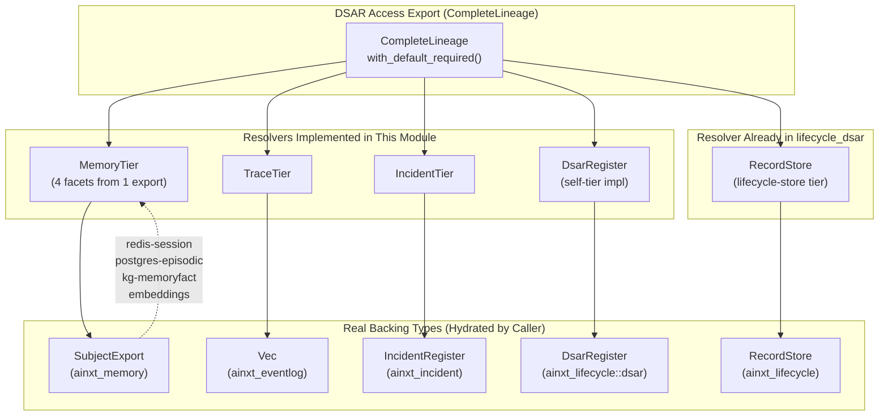
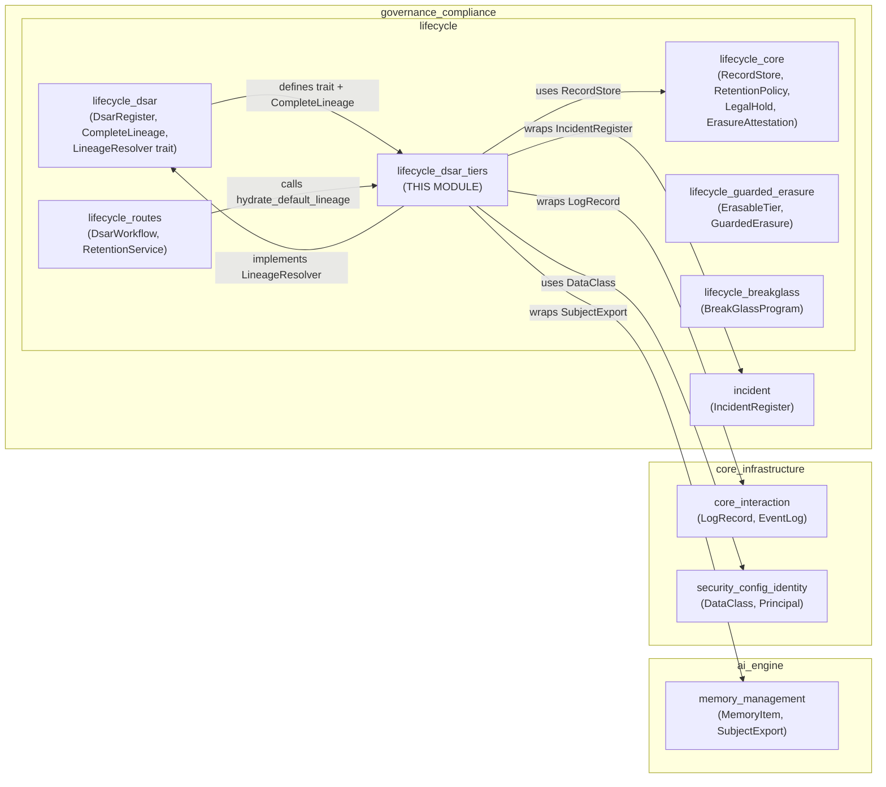
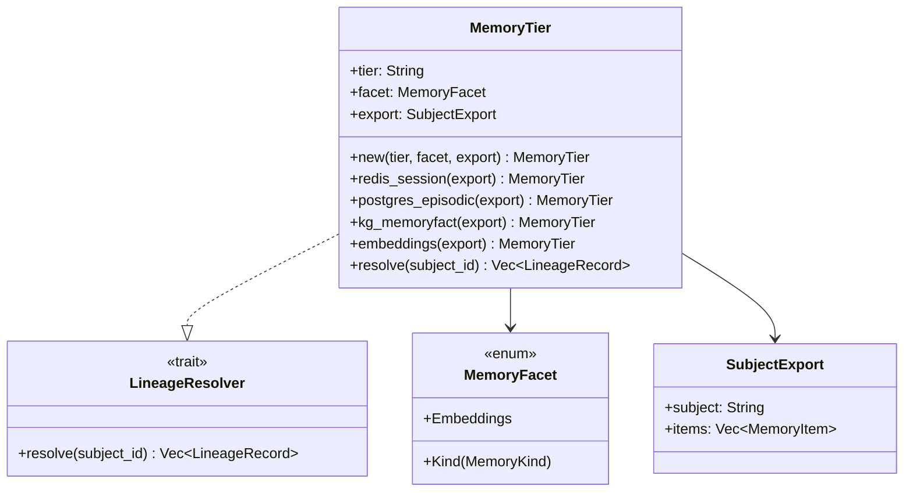
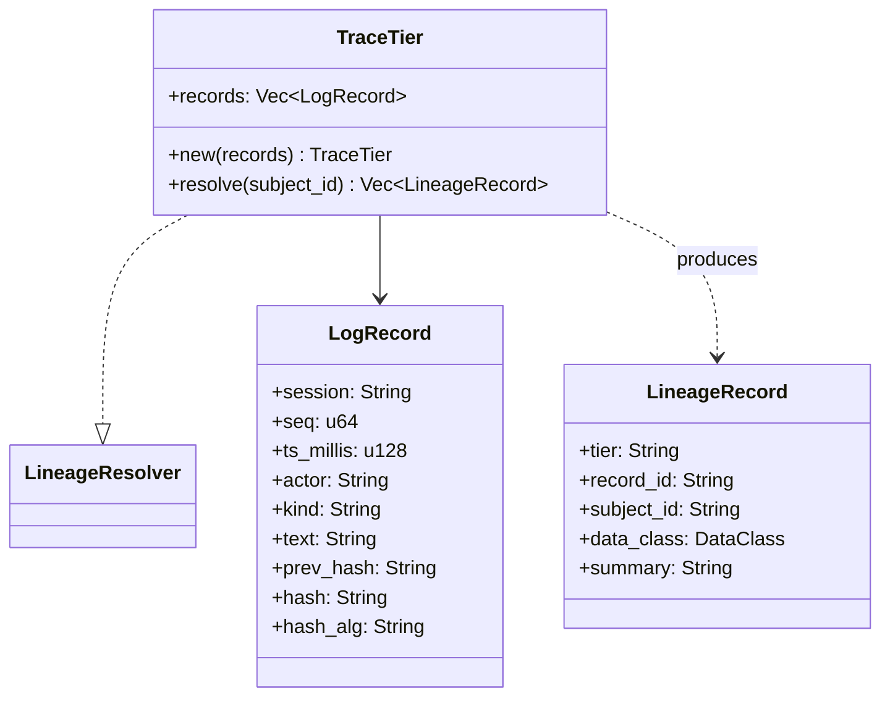
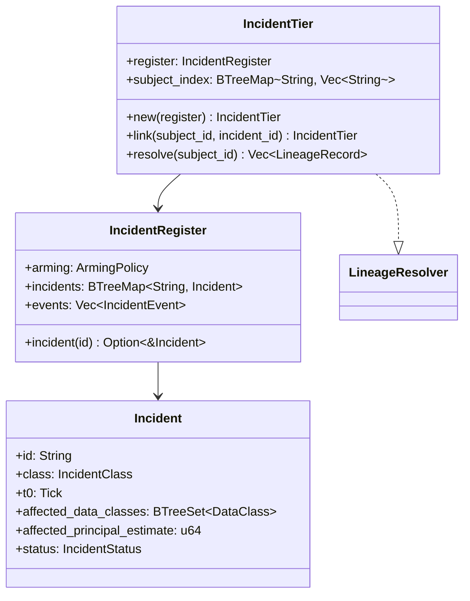
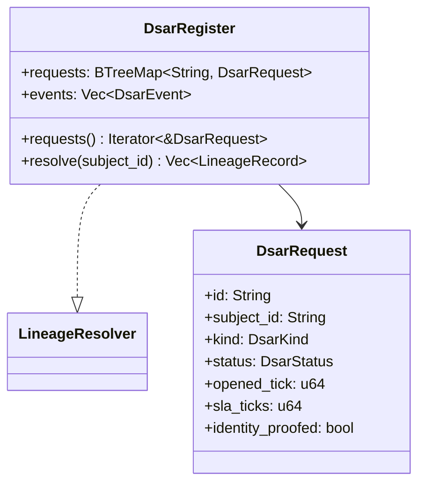
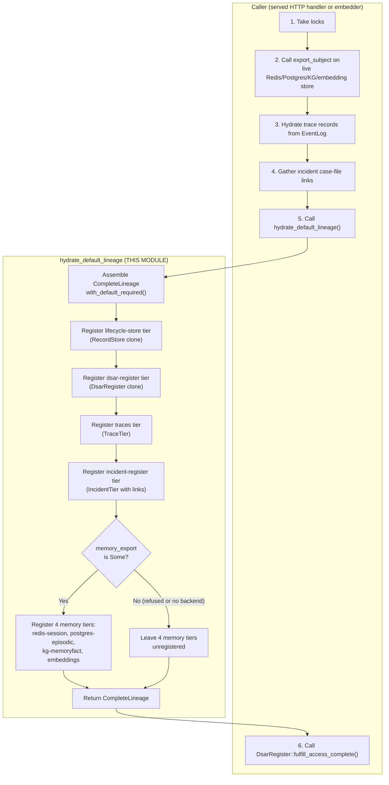
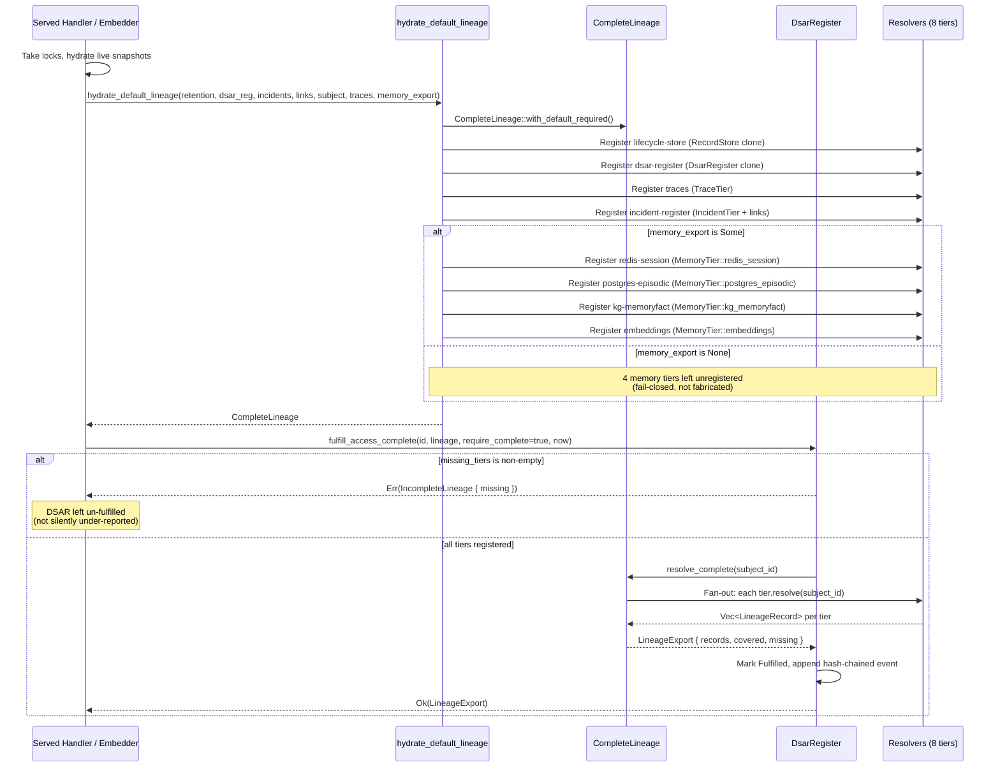
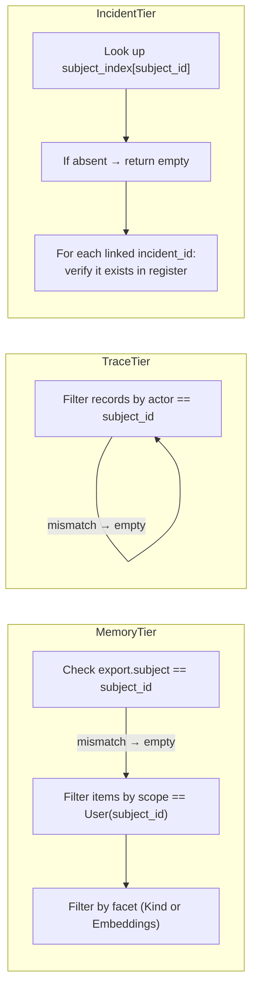
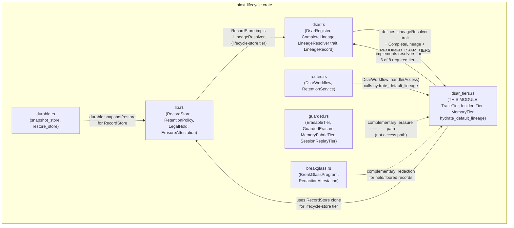

# Lifecycle DSAR Tiers

## Brief Introduction

The `lifecycle_dsar_tiers` module implements **real, production-grade cross-tier lineage resolvers** for Data Subject Access Request (DSAR) compliance. It closes the **FI-09** gap identified in `REGULATED_FI_COMPLIANCE_OPS.md` §4.4 step 2 (ADR-012/015): the sibling [lifecycle_dsar](lifecycle_dsar.md) module built the completeness-checked `LineageResolver` seam and the `CompleteLineage` / `fulfill_access_complete` machinery, but every required tier except `lifecycle-store` was a test double — so real cross-tier completeness was unproven. This module closes that gap by implementing `LineageResolver` over the **real in-memory/offline representations** of the actual data tiers, so a DSAR access export assembled from live objects either resolves the subject across *every* mandated tier or is refused.

All adapters are **pure**: no clock, no RNG, no I/O in `resolve`. The caller (the served HTTP handler or a programmatic embedder) is responsible for taking locks and making the real `export_subject` calls against the actual Redis/Postgres/KG/embedding-store/trace-log/incident-register organs and handing the resulting values in.

---

## Architecture Overview

### The Eight Mandated DSAR Tiers

A DPDP access/portability export must span eight canonical data tiers. Each tier is backed by a real type from the runtime's own already-hydrated, live snapshots:

| Required Tier | Real Backing Type | Resolver in This Module |
|---|---|---|
| `lifecycle-store` | `RecordStore` (in-crate, already wired in [lifecycle_core](lifecycle_core.md)) | `RecordStore` impl of `LineageResolver` (in [lifecycle_dsar](lifecycle_dsar.md)) |
| `redis-session` | `ainxt_memory` fabric — `MemoryKind::Session` items | `MemoryTier::redis_session` |
| `postgres-episodic` | `ainxt_memory` fabric — `MemoryKind::Episodic` items | `MemoryTier::postgres_episodic` |
| `kg-memoryfact` | `ainxt_memory` fabric — `MemoryKind::Semantic` items | `MemoryTier::kg_memoryfact` |
| `embeddings` | `ainxt_memory` fabric — items carrying a derived embedding | `MemoryTier::embeddings` |
| `traces` | `ainxt_eventlog::LogRecord` (offline; no file I/O) | `TraceTier` |
| `incident-register` | `ainxt_incident::IncidentRegister` | `IncidentTier` |
| `dsar-register` | `DsarRegister` itself (the subject's own DSAR history) | `DsarRegister` impl of `LineageResolver` |

### Module Position in the System

This module sits within the `lifecycle` sub-module group under `governance_compliance`. It is the **wiring layer** that connects the DSAR completeness machinery (defined in [lifecycle_dsar](lifecycle_dsar.md)) to the real data-tier types owned by other crates.

---

## Core Components

### `MemoryTier`

A real memory-fabric lineage tier backed by `ainxt_memory`'s DPDP subject export (`SubjectExport`, produced by the live store's `export_subject`). One export feeds **four** logical tiers (one per `MemoryFacet`); registering each is what makes the memory tiers count toward cross-tier completeness.

**Key design decisions:**

- **Subject-scoped**: A mismatched `subject_id` contributes nothing — no cross-subject leak. The export's `subject` field is checked first; only items whose `scope == Scope::User(subject_id)` are considered.
- **Facet filtering**: Each `MemoryTier` instance projects the same `SubjectExport` through one `MemoryFacet`:
  - `MemoryFacet::Kind(MemoryKind::Session)` → `redis-session` tier
  - `MemoryFacet::Kind(MemoryKind::Episodic)` → `postgres-episodic` tier
  - `MemoryFacet::Kind(MemoryKind::Semantic)` → `kg-memoryfact` tier
  - `MemoryFacet::Embeddings` → `embeddings` tier (items where `embedding.is_some()`)
- **Full version history**: Every version of every matching item is surfaced (DPDP portability = full history), with record ids formatted as `"{id}#v{version}"`.
- **PII-in-embeddings captured**: Items carrying a derived embedding are regulated even as vectors — the `embeddings` tier ensures PII baked into embedding vectors appears in the access export (gap AJ).

### `TraceTier`

The `traces` tier — an offline, in-memory representation of the tamper-evident trace log (`ainxt_eventlog::LogRecord`). Resolves the trace records whose `actor` field matches the subject. No file I/O runs in `resolve` (the caller hydrates the records; the resolver is pure).

**Key design decisions:**

- **Actor-based matching**: Only records where `r.actor == subject_id` are surfaced.
- **Operational metadata classification**: Trace records are classified `DataClass::Internal` — the trace log stores control-plane events, not payload PII by design.
- **Deterministic ordering**: Results are sorted by `record_id` (which is `"{session}#{seq}"`).
- **Record id format**: `"{session}#{seq}"` — uniquely identifies a trace record within the log.

### `IncidentTier`

The `incident-register` tier — wraps a real `ainxt_incident::IncidentRegister`. Incidents are aggregate and PII-free by design (they carry an *estimate* of affected principals, never subject ids), so the subject→incident linkage lives in the incident-response case file, supplied here as an explicit `BTreeMap<String, Vec<String>>` index.

**Key design decisions:**

- **Case-file linkage**: The `subject_index` maps subject ids to incident ids known to implicate them. This is populated via the chainable `link()` builder. Unknown ids are simply not surfaced at resolve time (the register is the source of truth).
- **Fail-safe data class**: The most-sensitive class among the incident's `affected_data_classes` is used (max by `sensitivity()`), defaulting to `DataClass::Internal` if none.
- **Register is the source of truth**: `resolve` pulls linked incidents from the *real* register via `register.incident(id)`, proving the register was queried and the referenced incidents actually exist. An incident id in the case-file index that does not exist in the register is silently skipped.

### `DsarRegister` (self-tier impl)

The `dsar-register` self-tier — a subject's DSAR history is itself data held about them, so an access export must include it (§4.4). This is implemented as a `LineageResolver` impl directly on `DsarRegister` (not a wrapper struct). A *snapshot* (`DsarRegister` is `Clone`) is registered so the tier does not alias the live register being fulfilled.

**Key design decisions:**

- **Self-referential by design**: The DSAR register tracks requests *about* a subject; those requests are themselves personal data the subject has a right to see.
- **Snapshot isolation**: Callers register a `clone()` of the register, not a reference, so the tier's view is frozen at hydration time and cannot be mutated by the fulfilment itself.
- **Classification**: DSAR request records are classified `DataClass::Internal` (operational metadata about the request, not the subject's underlying data).

---

## The `hydrate_default_lineage` Assembly Function

This is the **central wiring function** that assembles the mandated `CompleteLineage` for a DSAR access/portability fulfilment from the daemon's own already-hydrated, live snapshots. It is pure (no locking / clock / RNG / I/O) — consistent with every other resolver in this module.

### Parameters

| Parameter | Type | Description |
|---|---|---|
| `retention` | `&RecordStore` | The live retention/precedence store (cloned into the tier). |
| `dsar_register` | `&DsarRegister` | The live DSAR register (cloned as a snapshot for the self-tier). |
| `incidents` | `&IncidentRegister` | The real incident register (cloned into the `IncidentTier`). |
| `incident_links` | `&[String]` | Case-file linkage: incident ids known to implicate `subject_id`. Pass `&[]` when no such index exists. |
| `subject_id` | `&str` | The data principal whose data is being exported. |
| `trace_records` | `Vec<LogRecord>` | Hydrated trace log records (offline; no file I/O in resolve). |
| `memory_export` | `Option<SubjectExport>` | The subject's memory-fabric export. `None` when no live memory backend is configured, OR when the real `export_subject` call refused the operating principal. |

### Memory Export Absence Handling

When `memory_export` is `None`, the four memory-derived tiers (`redis-session`, `postgres-episodic`, `kg-memoryfact`, `embeddings`) are simply left unregistered. This means:

- `CompleteLineage::missing_tiers()` reports them as missing.
- A `require_complete=true` fulfilment is correctly **REFUSED** rather than certifying a partial export.
- **Never** a fabricated/empty stand-in is substituted.

This is the fail-closed posture: a missing tier is a detectable defect, not a silent gap. The caller can still fulfil with `require_complete=false` if a best-effort export is acceptable, but the completeness proof will honestly report the missing tiers.

### Identical Tier-Registration Logic

This function ensures every served caller gets **identical** tier-registration logic — the served HTTP path (`ainxt_server`'s `regfi_dsar_handler`) and the programmatic embedder path (`ainxt_runtimed`'s `AssembledFull`) can never silently diverge on which tiers count toward completeness.

---

## Data Flow: DSAR Access Fulfilment

---

## Subject Isolation Guarantee

Every resolver in this module is **subject-scoped**: querying a different subject yields nothing. This is enforced at three levels:

This is verified by the `tiers_do_not_leak_across_subjects` test: querying `"bob"` against a tier built for `"alice"` returns an empty `Vec` from every resolver.

---

## Relationship to Sibling Modules

### Complementary Modules

- **[lifecycle_dsar](lifecycle_dsar.md)**: Defines the `LineageResolver` trait, `CompleteLineage`, `LineageRecord`, `DsarRegister`, and the `REQUIRED_DSAR_TIERS` manifest. This module implements concrete resolvers for 6 of the 8 required tiers (the other 2 — `lifecycle-store` and `dsar-register` — are implemented directly on `RecordStore` and `DsarRegister` in `dsar.rs` and `lib.rs`).
- **[lifecycle_core](lifecycle_core.md)**: Provides `RecordStore`, `RetentionPolicy`, `LegalHold`, and the §6 precedence core. The `RecordStore` itself implements `LineageResolver` for the `lifecycle-store` tier.
- **[lifecycle_guarded_erasure](lifecycle_guarded_erasure.md)**: The **erasure** counterpart to this module's **access** focus. While this module resolves *what data exists* about a subject across tiers (for access/portability exports), `guarded.rs` resolves *what may be erased* through §6 precedence and propagates erasures into the real durable tiers.
- **[lifecycle_breakglass](lifecycle_breakglass.md)**: Handles remediation of PII that slipped into floor-bound or held records — the one place a normal erasure cannot touch. Operates on `Deferral` records produced by the erasure path.
- **[lifecycle_routes](lifecycle_routes.md)**: The route-ready `DsarWorkflow` and `RetentionService` services. `DsarWorkflow::handle`'s `Access` arm and `DsarWorkflow::fulfill_access` are the served entrypoints that call `hydrate_default_lineage` to assemble the cross-tier lineage before calling `fulfill_access_complete`.

---

## Purity and Determinism

All resolvers in this module are **pure functions** of their inputs:

| Property | Guarantee |
|---|---|
| **No clock** | Logical ticks are passed in by the caller; no `SystemTime::now()`. |
| **No RNG** | No random number generation anywhere in `resolve`. |
| **No I/O** | No file reads, no network calls, no database queries in `resolve`. The caller hydrates all data before calling. |
| **Deterministic ordering** | `TraceTier` sorts by `record_id`; `CompleteLineage::resolve_complete` sorts all merged records by `(tier, record_id)`. |
| **Reproducible** | Same inputs → same outputs, every time. |

This is consistent with the entire `ainxt-lifecycle` crate's design philosophy: purge, erasure, deferral, and lineage resolution are all reproducible and provable to a regulator.

---

## Key Invariants

1. **Completeness is enforced, not best-effort**: A DSAR access fulfilment with `require_complete=true` is REFUSED when any mandated tier has no registered resolver — it can never silently under-report. The refusal is `DsarError::IncompleteLineage { missing }`.

2. **No cross-subject leak**: Every resolver checks the subject id before returning records. A mismatched subject contributes nothing.

3. **PII-in-embeddings is captured**: The `embeddings` tier ensures that PII baked into embedding vectors (a regulated data class even as vectors) appears in the access export.

4. **PII-in-KG is captured**: The `kg-memoryfact` tier surfaces `MemoryKind::Semantic` items, which may carry `DataClass::Pii` (e.g., "this user works in payments-core").

5. **DSAR history is self-included**: A subject's own DSAR request history is data held about them and must appear in their access export (the `dsar-register` self-tier).

6. **Snapshot isolation**: The `DsarRegister` tier uses a clone, not a reference, so the tier's view is frozen at hydration time and cannot be mutated by the fulfilment itself.

7. **Incident linkage is honest**: When no real subject→incident case-file index exists, callers pass `&[]` for `incident_links`; the `incident-register` tier is still registered (satisfying completeness) and honestly resolves empty rather than fabricating a linkage that doesn't exist.

---

## Test Coverage

The module includes two comprehensive tests:

### `wire2_fi_09`

Proves FI-09 on the real assembled object: a completeness-required DSAR access export over live tier objects is REFUSED when a mandated tier is absent, and is certified complete — with records merged across every tier — only when all eight are registered. Specifically verifies:

- Seven of eight tiers → `IncompleteLineage { missing: ["incident-register"] }` → fulfilment REFUSED.
- All eight tiers → `is_complete() == true` → records from every tier merged.
- PII semantic fact and its embedding both surfaced.
- Subject's own DSAR request appears in the `dsar-register` tier.
- Hash-chained register still verifies after the fulfilment.

### `tiers_do_not_leak_across_subjects`

Proves each real resolver is subject-scoped: querying a different subject yields nothing from `MemoryTier`, `TraceTier`, and `IncidentTier`.
