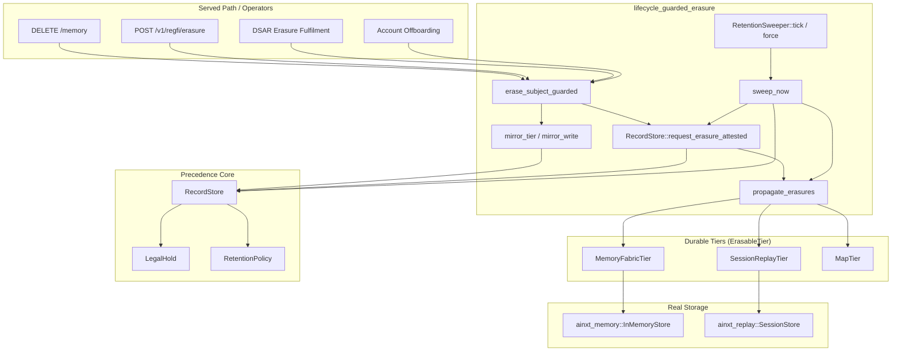
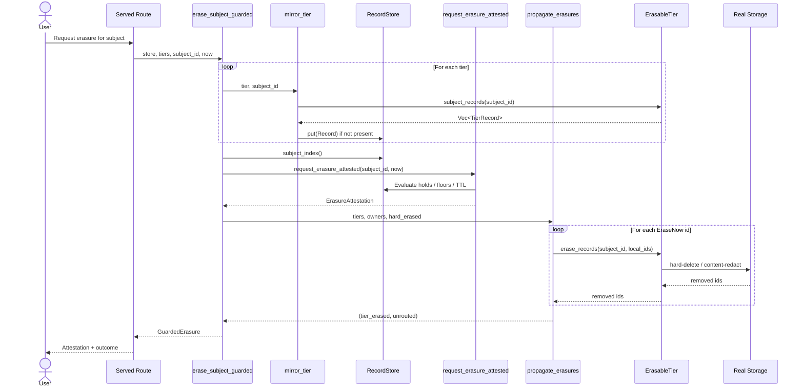
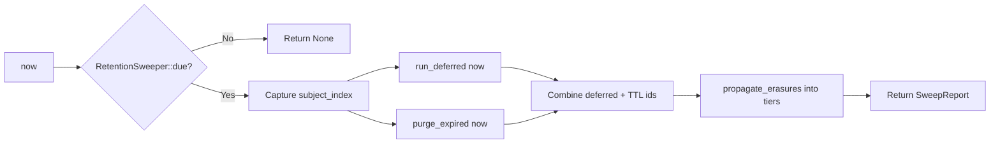

# lifecycle_guarded_erasure

## Brief Introduction

`lifecycle_guarded_erasure` is the bridge between the §6 precedence-based erasure core in [`lifecycle_core`](lifecycle_core.md) and the durable storage tiers that actually hold a data principal's bytes. It ensures that every erasure decision — whether triggered by a user request, a DSAR workflow, account offboarding, or an automatic retention sweep — is propagated into the real tiers only after legal-hold and statutory-retention precedence rules have been evaluated. The module closes two regulator-fatal defects: **spoliation by bypass** (a tier's wholesale `erase_subject` cascade destroying records under active legal hold) and **vacuity** (the precedence store containing policies but no mirrored records, so an attestation certifies erasure over nothing).

The module is pure, deterministic, and clock-free: it receives logical ticks from its caller, performs no I/O of its own, and expresses all side effects through the [`ErasableTier`] trait. Production adapters are provided for the live memory fabric ([`MemoryFabricTier`]) and the session replay store ([`SessionReplayTier`]); a test/offline adapter ([`MapTier`]) is included for deterministic verification and for tiers whose durable binding is external infrastructure.

---

## Core Responsibilities

1. **Mirror durable writes into the precedence store** — [`mirror_write`] and [`mirror_tier`] project tier records into the [`RecordStore`](lifecycle_core.md) under tier-qualified ids, so the store is populated by the same writes the turn path performs.
2. **Guard every erasure request through precedence** — [`erase_subject_guarded`] is the single entrypoint for right-to-erasure requests; it mirrors, decides via [`RecordStore::request_erasure_attested`](lifecycle_core.md), and propagates only `EraseNow` outcomes into the owning tiers.
3. **Drive automatic expiry** — [`RetentionSweeper`] fires deferred erasures and TTL purges on a cadence and propagates both into the durable tiers, making "fires automatically at floor-expiry" true in a running system.
4. **Preserve held/floored bytes** — records under legal hold or statutory floor are left physically intact and reported as preserved, never silently erased.

---

## Architecture



---

## Component Catalog

### `ErasableTier` trait

The contract every durable store must implement to participate in guarded erasure. It requires:

- `tier_name()` — stable slug used as the qualified-id prefix.
- `subject_records(subject_id)` — enumerate all live records for a principal.
- `erase_records(subject_id, ids)` — hard-delete exactly the listed tier-local ids, attributed to the principal exercising their right.

Per-record deletion is the central design choice: a tier that can only erase wholesale cannot express "destroy these three, preserve that one under matter-2026-0042" and therefore must not be driven by this module.

### `TierRecord`

A tier-local view of one record, containing only the metadata needed for precedence: `id`, `data_class`, and `created_tick`. The precedence core never touches content.

### `GuardedErasure`

The result of [`erase_subject_guarded`]. It combines:

- `attestation` — tamper-evident [`ErasureAttestation`](lifecycle_core.md) from the precedence core.
- `tier_erased` — qualified ids whose bytes were hard-deleted.
- `tier_preserved` — qualified ids left physically intact under hold or floor.
- `unrouted` — ids erased from the store but belonging to no tier passed to the call.
- `mirrored` — count of tier records newly projected into the store.

### `MemoryFabricTier`

The production adapter over [`ainxt_memory::store::InMemoryStore`](../ai_engine/memory_management.md). It:

- Exports the subject's own items through the fabric's DPDP subject export.
- Collapses version histories to the current version (the precedence unit is the item).
- Deletes per-item via [`MemoryStore::delete_as`](../ai_engine/memory_management.md), attributed to the subject.
- Uses `unanchored_tick = now` for items with no `effective_from`, failing toward preservation.

### `SessionReplayTier`

The production adapter over [`ainxt_replay::SessionStore`](../ai_engine/evaluation_testing.md). It:

- Enumerates subject-authored turns and attributes assistant replies to the subject via tree position (the `"{turn_id}::assistant"` shape produced by `persist_served_turn`).
- Never deletes a [`Turn`](../ai_engine/evaluation_testing.md); instead it clears event content through `SessionRecording::erase_turn_content`, leaving turn ids and tree structure as audit-visible tombstones.
- Mirrors under the tier name `"served-turn"`, by convention shared with `ainxt_runtimed`.

### `MapTier`

An offline `BTreeMap`-backed adapter for tests, proofs, and tiers with no richer API.

### `RetentionSweeper`

The cadence driver for automatic expiry. It:

- Tracks `interval_ticks` and `last_run`.
- Runs only when `due(now)`.
- Calls [`sweep_now`], which fires the deferred queue, TTL-purges expired records, and propagates both into the tiers.
- Survives restarts when `last_run` is persisted alongside the [`RecordStore`](lifecycle_core.md) snapshot (see [`lifecycle_core`](lifecycle_core.md) durable persistence).

### `SweepReport`

The auditable record of one automatic sweep: tick, deferred-fired ids, TTL-purged ids, tier-erased ids, and unrouted ids.

---

## Data Flow: A Right-to-Erasure Request



---

## Process Flow: Automatic Retention Sweep



The sweep runs **deferred-first**: a record whose hold released and whose TTL expired in the same tick is attributed to the erasure obligation (the subject's right) rather than to housekeeping.

---

## Qualified Identifiers and Tier Routing

Every mirrored record is stored under a tier-qualified id:

```
qualified_id = "{tier}::{local_id}"
```

The separator `::` cannot appear in a tier name (validated as a simple slug) and ambiguity is resolved by splitting on the **first** occurrence, so a local id containing `::` still round-trips. This lets a single [`RecordStore`](lifecycle_core.md) cover many durable tiers without collisions and lets [`erase_subject_guarded`] route each `EraseNow` decision back to the tier that owns the bytes.

---

## Redact-and-Proceed Policy

Nothing in this module blocks a user. An erasure request is always accepted and always returns an attestation. Precedence only decides **which** records are destroyed now versus preserved and queued. A subject under a legal hold receives a reason-coded deferral notice, never a refusal-shaped error. This is the only safe posture for regulated data: fail toward preservation, because an over-preserved record can be erased later, but a wrongly-destroyed one cannot be restored.

---

## Dependencies

| Dependency | Module Doc | Role |
|------------|-----------|------|
| `ainxt_lifecycle` precedence core | [`lifecycle_core`](lifecycle_core.md) | [`RecordStore`](lifecycle_core.md), [`Record`](lifecycle_core.md), [`ErasureAttestation`](lifecycle_core.md), [`RetentionPolicy`](lifecycle_core.md), [`LegalHold`](lifecycle_core.md) |
| `ainxt_lifecycle` DSAR | [`lifecycle_dsar`](lifecycle_dsar.md) | DSAR erasure fulfilment routes that call the guarded entrypoint |
| `ainxt_lifecycle` break-glass | [`lifecycle_breakglass`](lifecycle_breakglass.md) | Emergency redaction programs that may also need tier propagation |
| `ainxt_memory` | [`memory_management`](../ai_engine/memory_management.md) | [`InMemoryStore`](../ai_engine/memory_management.md) adapter via [`MemoryFabricTier`] |
| `ainxt_replay` | [`evaluation_testing`](../ai_engine/evaluation_testing.md) | [`SessionStore`](../ai_engine/evaluation_testing.md) adapter via [`SessionReplayTier`] |
| `ainxt_types` | [`security_config_identity`](../core_infrastructure/security_config_identity.md) | [`DataClass`](../core_infrastructure/security_config_identity.md), [`Principal`](../core_infrastructure/security_config_identity.md) |

---

## Integration Points

- **Served routes** (`DELETE /memory`, `POST /v1/regfi/erasure`) must call [`erase_subject_guarded`] instead of any tier-local `erase_subject` cascade.
- **Write path mirroring** — the turn path should call [`mirror_write`] whenever it writes a regulated record to a durable tier, so the precedence store stays consistent without full reconciliation.
- **DSAR fulfilment** — [`lifecycle_dsar`](lifecycle_dsar.md) erasure branches should route through [`erase_subject_guarded`] to produce a tamper-evident attestation.
- **Cadence scheduling** — a background task (or the composition root in `ainxt_runtimed` / `ainxt_server`) should call [`RetentionSweeper::tick`] on each logical tick and persist `last_run` with the [`RecordStore`](lifecycle_core.md) snapshot.
- **Break-glass** — [`lifecycle_breakglass`](lifecycle_breakglass.md) redaction programs that target real storage should use the same tier adapters rather than direct deletion.

---

## Safety Invariants

1. **No direct tier cascade** — all erasure side effects flow through [`ErasableTier::erase_records`] after a precedence decision.
2. **Idempotent mirroring** — re-mirroring never refreshes `created_tick`, so statutory floors cannot be silently restarted.
3. **Fail-toward-preservation** — unanchored records are dated with `now`, making floors apply rather than expire silently.
4. **Attribution** — every tier delete carries the `subject_id` whose right is being exercised.
5. **Determinism** — no clock, no RNG, no I/O; only logical ticks and trait methods.

---

## Testing Strategy

The module's test suite (in `guarded.rs`) covers:

- Idempotent mirroring and floor anchoring.
- Surfacing of unrouted records.
- Deferred-queue firing into the tier at floor expiry.
- Legal-hold preservation while free siblings are destroyed.
- TTL purge propagation.
- [`SessionReplayTier`] discovery of user turns and attributed assistant replies.
- Byte erasure without turn deletion in the replay store.
- End-to-end guarded erasure + sweeper over the real replay store.

For deterministic tests, [`MapTier`] provides a fully in-memory `ErasableTier`; for integration tests, [`SessionReplayTier`] is exercised against a real [`InMemorySessionStore`](../ai_engine/evaluation_testing.md).
