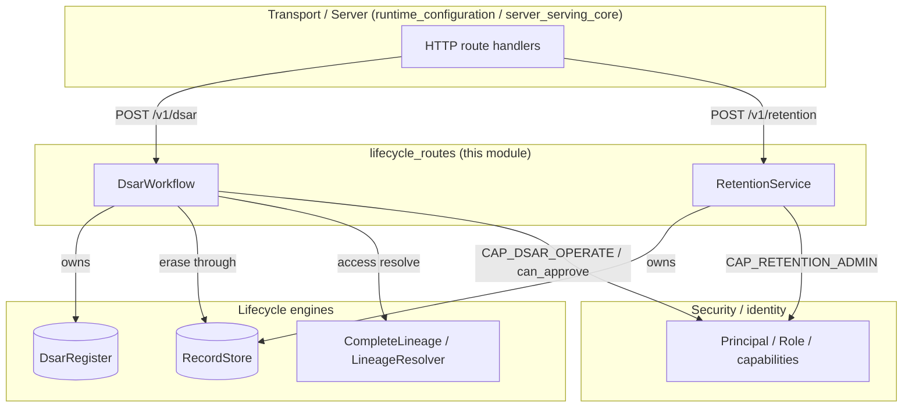
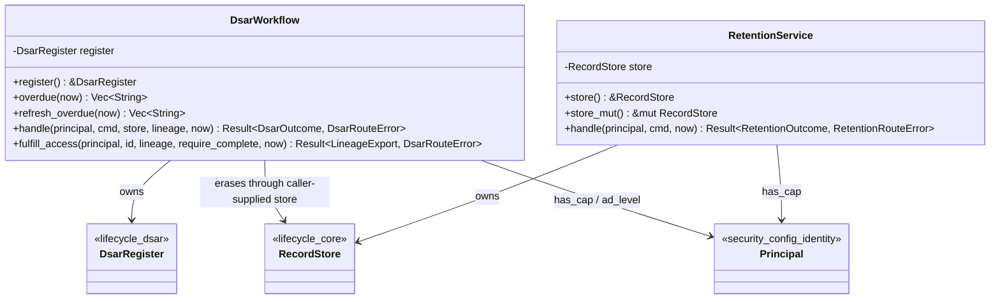
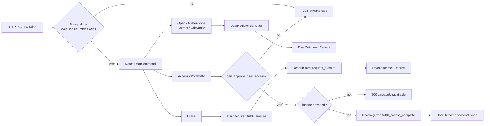
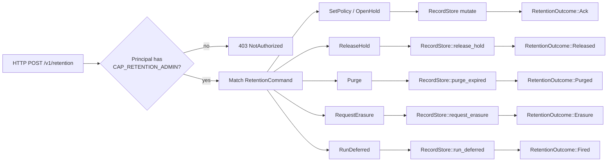

# `lifecycle_routes`

The `lifecycle_routes` module is the **transport-facing seam** for the data-lifecycle surface defined in `REGULATED_FI_COMPLIANCE_OPS.md`. It exposes two route-ready, capability-gated, serde-round-trippable services that a daemon can mount directly on HTTP routes:

- **`DsarWorkflow`** — implements the §4.4 DSAR state machine (access, portability, correction, erasure, grievance).
- **`RetentionService`** — implements the §6 retention-floor / legal-hold / deferred-erasure precedence store.

Both services are intentionally **pure and deterministic**: they accept a logical `now` tick, perform no I/O, use no clocks or RNG, and mutate only their own state. The served daemon (see [runtime_configuration](../pipeline_runtime/runtime_configuration.md) / [server_serving_core](../pipeline_runtime/server_serving_core.md)) is responsible for durable storage, hydration of cross-tier lineage, and hot-wiring the shared [`RecordStore`] into both services.

For the underlying engines, see:

- [lifecycle_core](lifecycle_core.md) — `RecordStore`, `RetentionPolicy`, `LegalHold`, `ErasureResolution`.
- [lifecycle_dsar](lifecycle_dsar.md) — `DsarRegister`, `DsarRequest`, `DsarKind`, `CompleteLineage`, `LineageExport`.
- [lifecycle_guarded_erasure](lifecycle_guarded_erasure.md) — tiered erasure sweep machinery.
- [lifecycle_breakglass](lifecycle_breakglass.md) — emergency redaction programs.
- [security_config_identity](../core_infrastructure/security_config_identity.md) — `Principal`, `Role`, capability model.

---

## Purpose and scope

The lifecycle crate contains the *engines* (`DsarRegister`, `RecordStore`, precedence functions), but a transport layer needs a single call it can make per route. `lifecycle_routes` is that seam. It:

1. Validates RBAC capabilities before touching state (fail-closed).
2. Maps wire commands onto engine operations.
3. Returns serializable outcomes/errors suitable for HTTP responses.
4. Enforces the extra senior-actor gate for cross-tier PII access/portability exports (FI-09).

No infrastructure code lives here. The module does not know about HTTP frameworks, databases, Redis, or the knowledge graph; it only knows about the lifecycle engines and the identity primitives from `ainxt_types`.

---

## Core services

### `DsarWorkflow`

`DsarWorkflow` owns the hash-chained [`DsarRegister`](lifecycle_dsar.md). It dispatches one of the following [`DsarCommand`] variants:

| Command | Engine action | Uses `store` | Uses `lineage` |
|---|---|---|---|
| `Open` | Creates a new `DsarRequest` (status `Received`) | No | No |
| `Authenticate` | Records identity-proofing result | No | No |
| `Correct` | Records a correction fulfilment | No | No |
| `Grievance` | Routes a grievance to the DPO | No | No |
| `Erase` | Fulfils erasure **through §6 precedence** | Yes | No |
| `Access` | Fulfils access/portability with completeness check | No | Yes |

All commands require the caller to hold `CAP_DSAR_OPERATE`. The `Access` command additionally requires the caller to satisfy `can_approve_dsar_access` (`Role::Admin` or `ad_level <= 3`). This mirrors the platform's existing `can_approve` JWT claim and prevents a routine DPO clerk from exporting a subject's entire cross-tier PII footprint.

The service also exposes thin passthroughs for SLA-breach sweeps:

- `overdue(now)` — read-only list of requests past their DPDP deadline.
- `refresh_overdue(now)` — marks newly-overdue requests and returns their ids.

### `RetentionService`

`RetentionService` owns the [`RecordStore`](lifecycle_core.md) and dispatches [`RetentionCommand`]s:

| Command | Engine action |
|---|---|
| `SetPolicy` | Registers/replaces a `RetentionPolicy` for a data class |
| `OpenHold` | Opens (or replaces) a per-matter `LegalHold` |
| `ReleaseHold` | Releases a matter at `now` |
| `Purge` | TTL sweep, skipping held / floor-bound records |
| `RequestErasure` | Right-to-erasure for one subject through §6 precedence |
| `RunDeferred` | Fires queued deferred erasures whose holds have released and floors elapsed |

All commands require the caller to hold `CAP_RETENTION_ADMIN`.

The service exposes:

- `store()` — read-only audit view.
- `store_mut()` — mutable handle the daemon threads into `DsarWorkflow::handle` so both routes operate on the **same** `RecordStore` and see consistent precedence.

---

## Architecture

The diagram shows the module's position as a thin, capability-gated layer between HTTP transport and the lifecycle engines. The same `RecordStore` instance is shared between `RetentionService` and `DsarWorkflow` so erasure decisions are consistent across both routes.

---

## Component relationships

- `DsarWorkflow` wraps `DsarRegister` and delegates all register state transitions to it.
- `RetentionService` wraps `RecordStore` and delegates all precedence operations to it.
- The daemon passes `retention_service.store_mut()` into `dsar_workflow.handle(...)` for `DsarCommand::Erase`, ensuring the same §6 precedence store governs both direct retention calls and DSAR-driven erasure.

---

## Data flow

### DSAR command dispatch

Key points:

- Authorization is checked before any state lookup.
- `Erase` flows through the caller's `RecordStore` so legal holds and retention floors take precedence.
- `Access` is the most sensitive operation: it requires both the base capability and the senior-approver gate, plus a caller-hydrated `CompleteLineage`. If `require_complete` is `true` and a mandated tier has no resolver, the export is refused rather than certified as partial.

### Retention command dispatch

All retention operations are deterministic at the supplied `now` tick. `ReleaseHold` does not itself fire deferred erasures; a follow-up `RunDeferred` command is required.

---

## RBAC and authorization

| Capability | Constant | Granted to | Used by |
|---|---|---|---|
| DSAR operator | `CAP_DSAR_OPERATE` | `dsar.operate` role; `Role::Admin` implies it | `DsarWorkflow::handle` |
| Senior DSAR approver | `can_approve_dsar_access` | `Role::Admin` or `ad_level <= 3` | `DsarCommand::Access`, `DsarWorkflow::fulfill_access` |
| Retention admin | `CAP_RETENTION_ADMIN` | `retention.admin` role; `Role::Admin` implies it | `RetentionService::handle` |

The `can_approve_dsar_access` gate is fail-closed: a principal with no `ad_level` is refused, never allowed by omission. This aligns with the `Principal::ad_level` semantics used elsewhere in the Context-Fabric RBAC axis.

---

## Error mapping for transports

`DsarRouteError` and `RetentionRouteError` are serializable enums tagged for JSON. A typical HTTP transport maps them as follows:

| Error | Suggested HTTP status |
|---|---|
| `DsarRouteError::NotAuthorized` | 403 |
| `DsarRouteError::UnknownRequest` | 404 |
| `DsarRouteError::LineageUnavailable` | 500 (caller bug: access dispatched without hydration) |
| All other `DsarRouteError` variants | 409 / 422 |
| `RetentionRouteError::NotAuthorized` | 403 |

---

## Determinism and serialization

Both services derive `Serialize`/`Deserialize` and store only logical state:

- `DsarWorkflow` serializes its `DsarRegister`.
- `RetentionService` serializes its `RecordStore`.

Because `now` is injected by the caller, the same command sequence replays identically. This makes the services suitable for:

- durable snapshot/rehydration,
- deterministic tests,
- audit replay,
- event-sourced command handling.

---

## Integration with the served daemon

`ainxt-runtimed` (see [runtime_configuration](../pipeline_runtime/runtime_configuration.md)) is expected to:

1. Own one shared, durable `RecordStore`.
2. Construct `RetentionService::with_store(store)`.
3. Construct `DsarWorkflow::new()` (or `from_register` after rehydration).
4. On `DsarCommand::Erase`, pass `retention_service.store_mut()` into `dsar_workflow.handle(...)`.
5. On `DsarCommand::Access`, hydrate `CompleteLineage` from the live Redis / Postgres / KG / embeddings / trace tiers and pass it as `Some(lineage)`.

Nothing in `lifecycle_routes` reaches for infrastructure directly; the daemon provides all external seams.

---

## See also

- [lifecycle_core](lifecycle_core.md) — retention policy, legal hold, and erasure precedence store.
- [lifecycle_dsar](lifecycle_dsar.md) — DSAR register, request lifecycle, and cross-tier lineage resolution.
- [lifecycle_guarded_erasure](lifecycle_guarded_erasure.md) — tiered erasure sweeps and guarded deletion.
- [lifecycle_breakglass](lifecycle_breakglass.md) — break-glass redaction programs.
- [security_config_identity](../core_infrastructure/security_config_identity.md) — `Principal`, `Role`, and capability checks.
- [runtime_configuration](../pipeline_runtime/runtime_configuration.md) — daemon configuration and hot-wiring of lifecycle services.
- [server_serving_core](../pipeline_runtime/server_serving_core.md) — HTTP route mounting and request handling.
