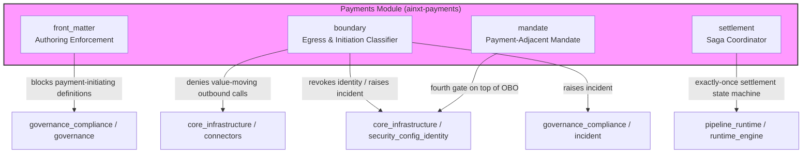
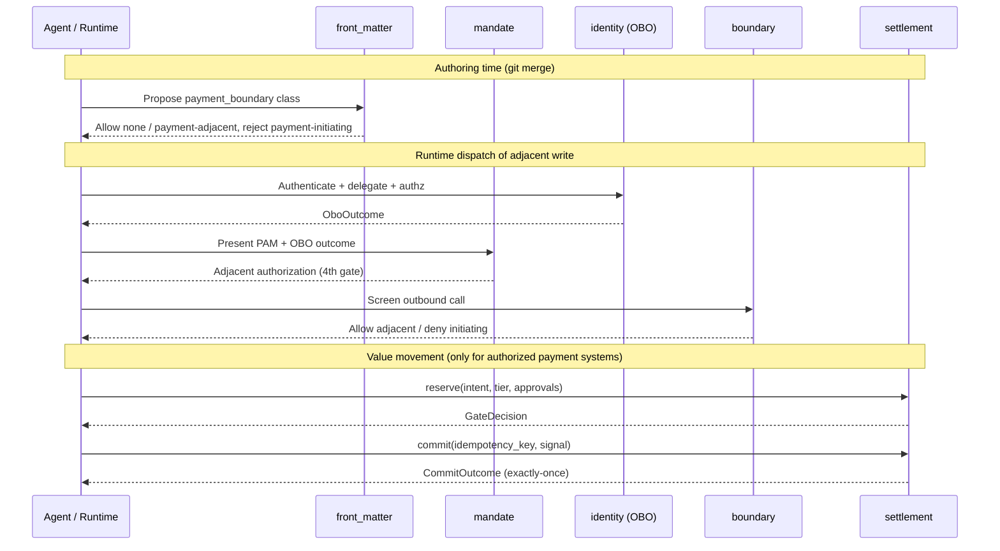

# Payments Module

The **payments** module (`ainxt-payments`) is the governance-compliant payment action boundary for the Ainxt platform. It sits under the broader `governance_compliance` domain and implements the safety substrate that prevents autonomous agents from initiating value movement while still allowing audited, human-authorized, payment-adjacent operations.

## Purpose

Moving value is a categorically harder class of side effect than ordinary mutations: a completed inter-bank settlement is often non-compensable, and an unknown outcome must never be blindly retried. The payments module answers three questions in code, not convention:

1. **Which state transitions are legal?** A settlement moves `Draft → Reserved → Committed`, with `Compensated`, `Failed`, and `InDoubt` as off-ramps. Illegal transitions are always rejected, never silently ignored.
2. **Did we already do this?** Every settlement is keyed on an `idempotency_key`. Committing the same key twice returns the first outcome and applies no second effect — the exactly-once guarantee.
3. **Is this even allowed?** Amount ceilings, dual-control approval, data-class residency, and structural egress boundaries are enforced before any value moves.

The module is intentionally **pure and deterministic**: it reads no clock, draws no randomness, and performs no I/O. Commit results, reconciliation findings, and logical time are injected by callers, making every safety property unit-testable.

## Architecture Overview

The payments module is composed of four sub-systems that work together to enforce the payment boundary end-to-end:

### Data Flow: Payment-Adjacent Dispatch

## Sub-modules

| Sub-module | File | Responsibility | Documentation |
|------------|------|----------------|---------------|
| `payments_front_matter` | `src/front_matter.rs` | Enforces the `payment_boundary` front-matter field at authoring/merge time. Rejects `payment-initiating` and gates `payment-adjacent` on council approval and seniority. | [payments_front_matter.md](payments_front_matter.md) |
| `payments_boundary` | `src/boundary.rs` | Implements the egress settlement-perimeter deny-list and the payment-initiation signature classifier. Composes Layer 5 (egress allow-list) and Layer 6 (pre-dispatch tripwire) of ADR-016. | [payments_boundary.md](payments_boundary.md) |
| `payments_settlement` | `src/lib.rs` | Core settlement saga state machine, idempotency-aware `SettlementCoordinator`, and `PolicyGate` for ceilings, dual control, and residency. | [payments_settlement.md](payments_settlement.md) |
| `payments_mandate` | `src/mandate.rs` | Payment-Adjacent Mandate (PAM) model: human-issued, scoped, expiring, single-use authorizations for payment-adjacent writes. | [payments_mandate.md](payments_mandate.md) |

## Relationship to the Wider System

The payments module does **not** grant agents the ability to move money. That apex guarantee lives in the capability-registry / effect-class layer (see [core_infrastructure](../core_infrastructure/core_infrastructure.md) and [pipeline_runtime](../pipeline_runtime/pipeline_runtime.md)). Instead, `ainxt-payments` provides the correctness core that authorized payment-system code is built on.

- **Authoring time**: `front_matter` is invoked by the CI check and git pre-receive hook logic in [governance_compliance / governance](governance.md) to block `payment-initiating` definitions from merging.
- **Egress time**: `boundary` is called by the connector/http egress path ([core_infrastructure / connectors_http](../core_infrastructure/connectors_http.md)) before any bytes leave. A match triggers identity revocation ([security_config_identity](../core_infrastructure/security_config_identity.md)) and incident filing ([governance_compliance / incident](incident.md)).
- **Adjacent dispatch time**: `mandate` composes with the OBO layers provided by [security_config_identity](../core_infrastructure/security_config_identity.md) as a fourth gate.
- **Settlement time**: `settlement` is used by the runtime engine ([pipeline_runtime / runtime_engine](../pipeline_runtime/runtime_engine.md)) and server ([pipeline_runtime / server_serving_core](../pipeline_runtime/server_serving_core.md)) to move reserved funds exactly once.

## Key Design Principles

1. **Fail-closed by default**: unconfigured tiers, unknown values, and unrecognized destinations are denied.
2. **Deterministic**: no clock, RNG, or I/O inside the decision core.
3. **Defense-in-depth**: multiple independent signatures must all miss for a payment-initiating call to pass.
4. **Exactly-once**: idempotency keys prevent double-pay on replay.
5. **In-doubt is terminal to commit**: reconciliation, not retry, resolves unknown outcomes.
6. **Human-in-the-loop**: payment-adjacent writes require human-signed mandates; value movement has no agent dispatch path.

## Generated Sub-module Documentation

Detailed documentation for each sub-module is available in the following files:

- [payments_boundary.md](payments_boundary.md) — Egress settlement-perimeter and payment-initiation classifier.
- [payments_front_matter.md](payments_front_matter.md) — `payment_boundary` front-matter authoring enforcement.
- [payments_settlement.md](payments_settlement.md) — Settlement saga state machine and coordinator.
- [payments_mandate.md](payments_mandate.md) — Payment-Adjacent Mandate (PAM) fourth-gate authorization.
