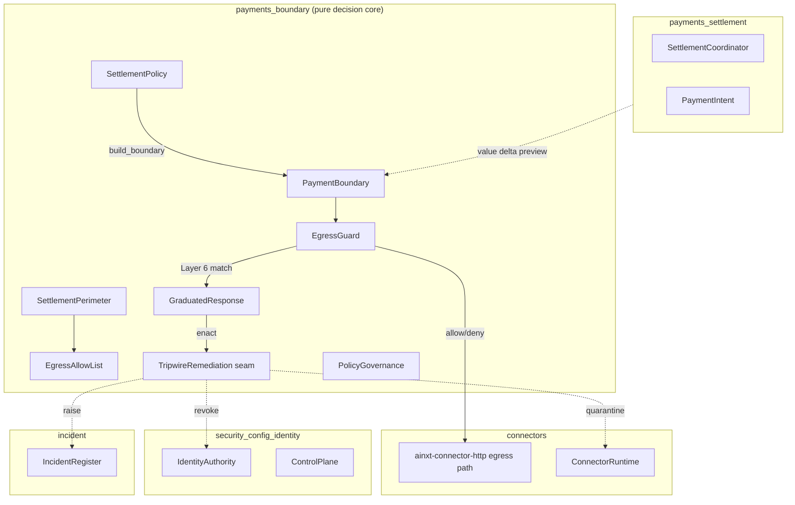
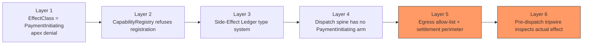
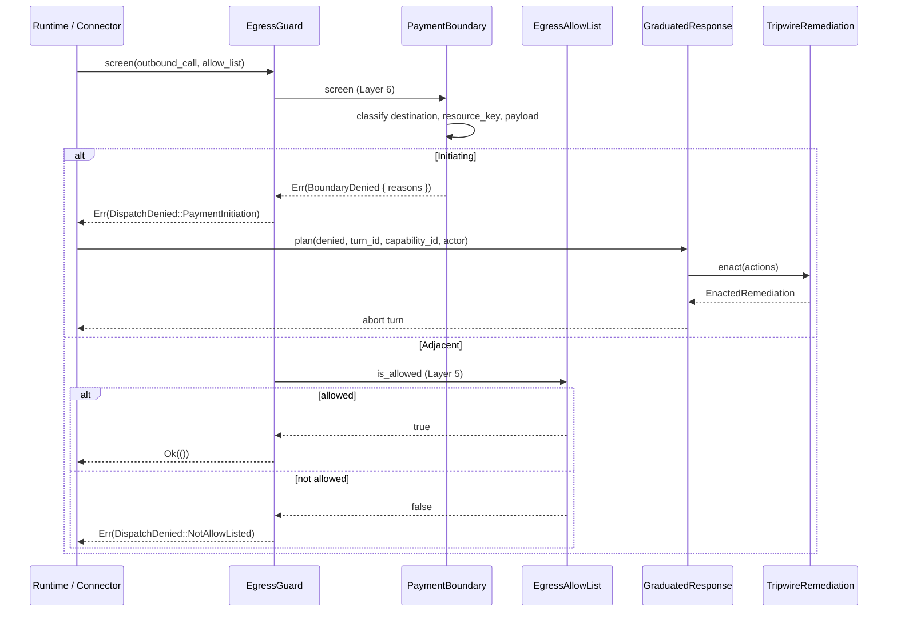
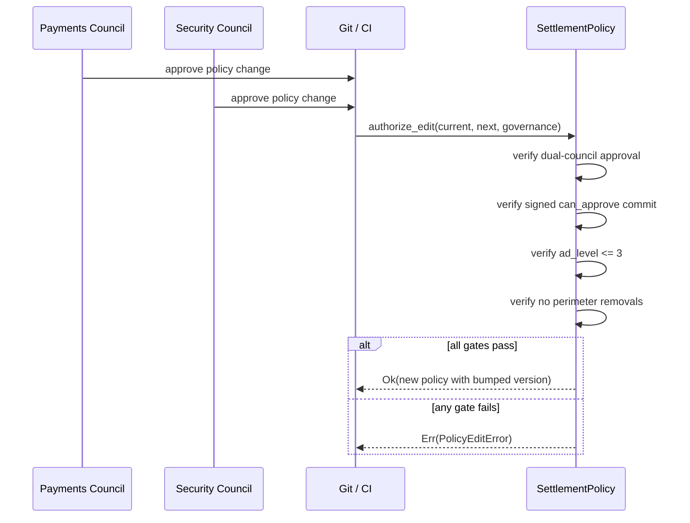
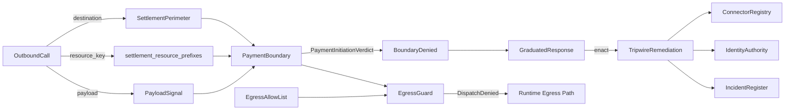

# payments_boundary

The **payments_boundary** module is the pure, deterministic decision core that enforces the payment-initiation boundary defined in ADR-016. It sits at the intersection of egress control and value-movement prevention: it decides whether an outbound call is *payment-initiating* and, if so, aborts the turn, quarantines the capability, revokes the acting identity, and raises a security incident.

This module is intentionally **not** the wiring. It does not perform network I/O, hold a clock, or use randomness. Instead, it supplies the policy, classifier, and graduated-response directives that the runtime, connector, and identity subsystems apply. The result is a versioned, testable, reviewed artifact that defines "what counts as payment initiation" in one place.

---

## Module Purpose

`payments_boundary` implements three independent structural denials from ADR-016:

1. **Settlement Perimeter (§4.4)** — A reserved, un-allow-listable set of value-movement destinations (national rails, core-banking/ledger settlement APIs, and 2026 agent-payment protocols). The perimeter is a one-way ratchet: patterns can be added, never removed.
2. **Payment-Initiation Signature Classifier (§4.5)** — A deterministic, non-LLM recogniser that inspects the *actual effect* of a resolved outbound call (destination + resource key + payload semantics) and decides whether it moves value.
3. **Pre-Dispatch Tripwire (§4.6)** — A fail-closed gate that screens every outbound call before bytes leave, composing the settlement perimeter, egress allow-list, and payment-initiation signature into a single decision. A match triggers a graduated response: abort → quarantine → revoke identity → raise incident.

The module also defines the canonical four-value `PaymentEffectClass` (`Pure | Idempotent | SideEffecting | PaymentInitiating`) that the side-effect ledger adopts directly, making `PaymentInitiating` a type-level non-dispatchable class.

---

## Core Concepts

| Concept | Description |
|---------|-------------|
| **Settlement Perimeter** | Reserved destination patterns that can never appear on an egress allow-list. |
| **Egress Allow-List** | A capability's outbound destination list that is structurally incapable of permitting a perimeter destination. |
| **Outbound Call** | A resolved call with `destination`, `resource_key`, and `payload` semantics, as seen just before dispatch. |
| **Payload Signal** | The payment-relevant meaning of a payload: ISO 20022 message type, UPI operation, NACH mandate, agent-payment credential, or a two-phase commit value delta. |
| **Payment Boundary** | The classifier that maps an `OutboundCall` to `Adjacent` or `Initiating` with a set of matched reasons. |
| **Egress Guard** | The composed Layer 5 + Layer 6 gate that every outbound call passes through. |
| **Graduated Response** | The ordered, fail-closed escalation directives emitted when the tripwire fires. |
| **Settlement Policy** | The git-controlled, dual-council-governed artifact that defines the perimeter patterns and resource prefixes. |

---

## Architecture

### High-Level Component Diagram



### ADR-016 Layer Model



This module owns **Layer 5** (the settlement perimeter and guarded egress allow-list) and **Layer 6** (the payment-initiation signature classifier and tripwire). Layers 1–4 live in the tool, runtime, and connector crates that consume this module.

---

## Key Components

### SettlementPerimeter

`SettlementPerimeter` holds a set of lowercased substring patterns. A destination matches if it contains any pattern. The canonical `npci_reserved()` constructor covers:

- National rails settlement/clearing endpoints (`upi-settlement.`, `imps-settlement.`, `neft.rbi`, `rtgs.rbi`, `nach.npci`, `aeps-settlement.`, `fastag-settlement.`, `settlement.npci`, `netting.npci`)
- Core-banking/ledger settlement APIs (`corebanking-settlement`, `ledger-settlement`)
- 2026 agent-payment protocols (`ap2.`, `agentpayments.google`, `agenticcommerce.`, `acp.stripe`, `trustedagent.visa`, `agentpay.mastercard`, `x402.`, `402.coinbase`)

The perimeter is a **one-way ratchet**: `reserve` adds patterns, but no API removes them. This is enforced at the policy-edit layer by `SettlementPolicy::authorize_edit`.

### EgressAllowList

`EgressAllowList` pairs a `SettlementPerimeter` with an explicit allow-set. Its key property is structural: `allow()` returns `Err(PerimeterViolation)` if the destination is inside the perimeter, and `is_allowed()` re-checks the perimeter even if the allow-set is corrupted. This makes "just allow-list this one settlement endpoint" an unexpressible operation.

### OutboundCall and PayloadSignal

`OutboundCall` is the input to the classifier. It carries:

- `destination`: the resolved network destination
- `resource_key`: the named resource (e.g., `settlement-account:HDFC0001`)
- `payload`: a `PayloadSignal` describing payment semantics

`PayloadSignal` variants include:

- `Benign` — no payment shape
- `Iso20022 { message_type }` — `pacs.*` and `pain.*` move value; `camt.*` is read-only
- `Upi(UpiOperation)` — `Collect`, `RequestToPay`, and `CreditPush` move value
- `NachMandateExecution` — value-moving debit
- `AgentPaymentCredential(AgentPayProtocol)` — all value-bearing 2026 protocols
- `ValueDeltaCommit` — derived from a two-phase `dry_run` preview showing a before/after value delta

`DryRunValueSnapshot` is the only production path that constructs `ValueDeltaCommit`. It compares `before_minor_units` and `after_minor_units`; any difference becomes a value-delta signal. This catches calls whose true effect only reveals itself at preview time.

### PaymentBoundary

`PaymentBoundary` combines the settlement perimeter, a set of reserved settlement resource-key prefixes, and the payload signal classifier. `classify()` returns:

- `PaymentInitiationVerdict::Adjacent` — the call is at most payment-adjacent
- `PaymentInitiationVerdict::Initiating { reasons }` — the call moves value, with every matched reason reported

`screen()` turns a classification into a `Result<(), BoundaryDenied>`. Multiple independent signatures can fire at once, giving defense-in-depth visibility.

### PaymentEffectClass

The canonical four-value effect classification:

```rust
pub enum PaymentEffectClass {
    Pure,
    Idempotent,
    SideEffecting,
    PaymentInitiating,
}
```

- `PaymentInitiating::is_dispatchable()` returns `false` — there is no dispatch arm.
- Only `SideEffecting` requires an exactly-once ledger record.
- `ainxt_tools::EffectClass` re-exports this enum directly (IDN-11), eliminating a previous three-value divergence.

### EgressGuard

`EgressGuard` is the single pre-dispatch gate that the live egress path calls on every outbound call. It composes Layer 5 and Layer 6:

1. **Layer 6 first** — run the payment-initiation tripwire. A match denies regardless of allow-list status.
2. **Layer 5 second** — if adjacent, the destination must be on the capability's `EgressAllowList`.

`screen_with_response()` distinguishes two failure modes:

- `Err(Ok(DispatchDenied::NotAllowListed { .. }))` — a policy denial, no escalation.
- `Err(Err(GraduatedResponse))` — a payment-initiation match, requiring full remediation.

### GraduatedResponse and Remediation

When Layer 6 fires, `GraduatedResponse::plan()` emits four ordered directives:

1. `AbortTurn { turn_id }`
2. `QuarantineCapability { capability_id }`
3. `RevokeActingIdentity { acting_identity }`
4. `RaiseIncident { capability_id, acting_identity, reasons }`

The `TripwireRemediation` trait is the runtime seam that turns these directives into real side effects. `RecordingRemediation` is the default in-memory implementor used in OSS and tests; production binds it to the connector registry, identity control-plane, and incident register.

`EnactedRemediation` proves that all four directives fired. `is_complete()` asserts the invariant.

### SettlementPolicy and PolicyGovernance

`SettlementPolicy` is the git-controlled, serde-serializable source of truth for the perimeter patterns and resource prefixes. `build_boundary()` converts it into a runtime `PaymentBoundary`.

`PolicyGovernance` captures the dual-council approval evidence required to edit the policy:

- Payments-council CODEOWNERS approval
- Security-council CODEOWNERS approval
- Signed commit with `can_approve`
- Author `ad_level <= 3`

`authorize_edit()` enforces all four gates and the one-way perimeter ratchet. A removal of any existing perimeter pattern returns `PolicyEditError::PerimeterRemovalForbidden`.

---

## Data Flow

### Outbound Call Screening Flow



### Policy Edit Governance Flow



---

## Component Interactions



---

## How It Fits into the System

`payments_boundary` is part of the `governance_compliance → payments` subtree. It is consumed by:

- **connectors** — `ainxt-connector-http` calls `EgressGuard::screen` on the live egress path before any bytes leave (IDN-01).
- **runtime_engine** — the dispatch spine uses `PaymentEffectClass` as the canonical effect type and routes `OutboundCall` instances through the boundary.
- **payments_settlement** — settlement coordinators and payment intents may produce `DryRunValueSnapshot` previews that feed `PayloadSignal::ValueDeltaCommit`.
- **security_config_identity** — the `RevokeActingIdentity` directive maps to the identity control-plane's revocation mechanism (ADR-022 §17).
- **incident** — the `RaiseIncident` directive opens a security incident on the breach clock (ADR-017).

The module stays deliberately acyclic: it does not depend on identity, incident, or connector crates. It emits data and directives; the runtime binds them to side effects through the `TripwireRemediation` seam.

---

## Dependencies

`payments_boundary` has minimal external dependencies:

- `serde` — for serializable policy artifacts and verdicts.
- `std::collections::BTreeSet` — for ordered, deterministic sets of patterns and reasons.
- `std::fmt` and `std::error::Error` — for structured error display.

It does **not** depend on:

- `ainxt-identity`
- `ainxt-incident`
- `ainxt-connector`
- `ainxt-runtime`
- Any async runtime, clock, RNG, or network stack

This purity is what makes the classifier deterministic, exhaustively testable, and safe to load as a git-controlled policy artifact.

---

## Security Properties

| Property | Mechanism |
|----------|-----------|
| **Un-allow-listable settlement destinations** | `SettlementPerimeter` + `EgressAllowList::allow` returning `PerimeterViolation` |
| **Perimeter wins over corrupted allow-set** | `EgressAllowList::is_allowed` re-checks the perimeter |
| **Actual-effect inspection** | `PaymentBoundary::classify` inspects resolved destination, resource key, and payload semantics, not declared effect class |
| **No LLM in the loop** | All matching is prefix/pattern/enum based; deterministic and reviewable |
| **Fail-closed default-deny egress** | `EgressGuard` denies unlisted destinations |
| **Type-level apex denial** | `PaymentEffectClass::PaymentInitiating` is non-dispatchable |
| **Atomic graduated response** | `GraduatedResponse::plan` always emits abort → quarantine → revoke → incident |
| **Enforced, not advisory** | `TripwireRemediation` seam + `EnactedRemediation` proof |
| **Governed policy evolution** | Dual-council CODEOWNERS + signed commit + ad_level + one-way ratchet |

---

## Testing Strategy

The module's test suite (embedded in `boundary.rs`) covers:

- Perimeter matching for rails and agent-payment endpoints.
- `EgressAllowList` refusing perimeter destinations and allowing benign ones.
- Perimeter winning even if the allow-set is corrupted.
- Classifier behavior for each `PayloadSignal` variant.
- Settlement resource keys matching while settlement reports do not.
- Multiple independent signatures firing on a single mis-declared call.
- Genuinely adjacent calls passing.
- `PaymentEffectClass` properties (IDN-11).
- `EgressGuard` Layer 5 + Layer 6 behavior (IDN-01).
- `GraduatedResponse` enactment emitting all three side effects (IDN-09 / R14).

Because the module is pure, all tests are deterministic and require no external services.

---

## References

- [payments_settlement](payments_settlement.md) — settlement coordination, payment intents, and saga records.
- [payments_mandate](payments_mandate.md) — payment-adjacent mandates and mandate registry.
- [payments_front_matter](payments_front_matter.md) — authoring context and blocked/changed definitions.
- [security_config_identity](../core_infrastructure/security_config_identity.md) — identity authority, revocation, and control plane.
- [incident](incident.md) — incident register, evidence, and breach-clock handling.
- [connectors_http](../core_infrastructure/connectors_http.md) — HTTP egress path and connector gateway.
- [runtime_engine](../pipeline_runtime/runtime_engine.md) — dispatch spine and effect-class integration.
- [core_engine](../pipeline_runtime/core_engine.md) — core runtime engine and turn execution.
