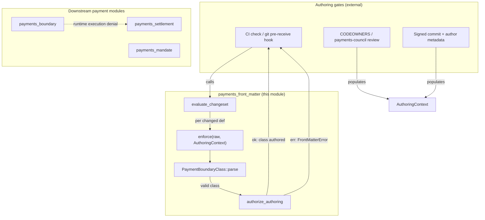
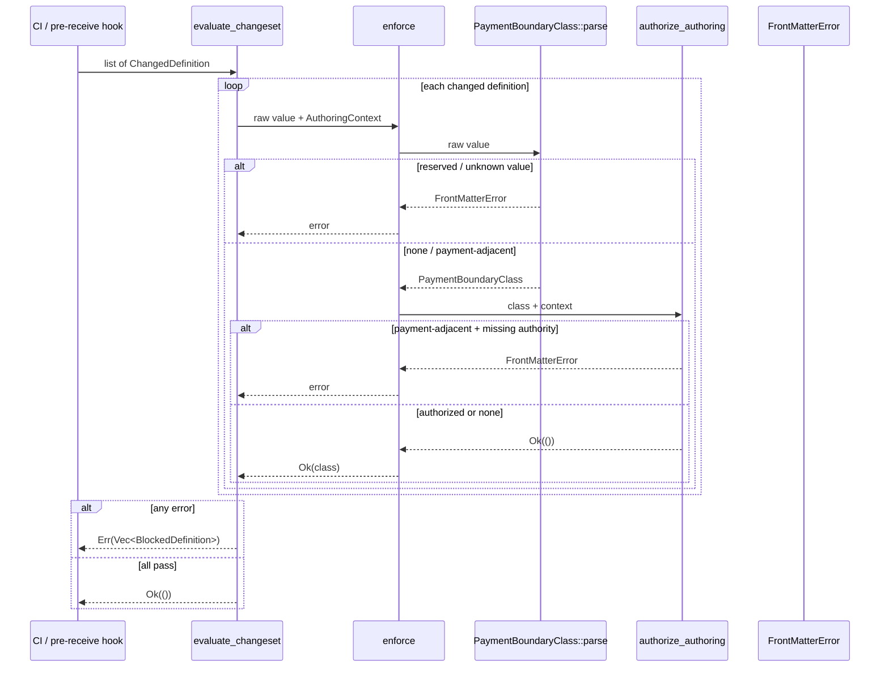
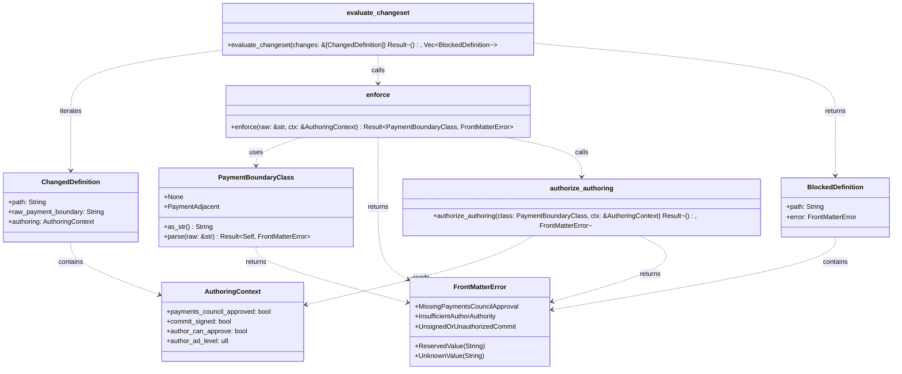
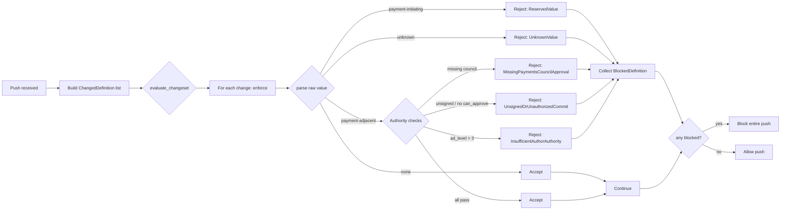

# payments_front_matter

The **payments_front_matter** module is the pure, versioned policy core that enforces the `payment_boundary` front-matter field on control-plane definitions at authoring time. It is the Layer-4 "authoring catch" that sits orthogonally above runtime execution denials: even if a definition is git-approved as `payment-adjacent`, it can still be denied a value-moving dispatch at runtime by [payments_boundary](payments_boundary.md) and [payments_settlement](payments_settlement.md).

This module is intentionally not a CI runner, git pre-receive hook, or CODEOWNERS parser. Those integration points live in [governance](governance.md), [admission](admission.md), and the CI control plane. Instead, `payments_front_matter` owns the payment-domain policy decision so that "what may be authored" is a single, testable artifact rather than logic scattered across shell scripts.

---

## Core responsibilities

1. **Parse `payment_boundary` front-matter values** — accept only `none` and `payment-adjacent`; reject the reserved `payment-initiating` value and any unknown value.
2. **Authorize authoring** — require payments-council CODEOWNERS approval, a cryptographically signed commit, `author_can_approve`, and `ad_level <= 3` for any `payment-adjacent` definition.
3. **Evaluate entire changesets** — provide a single fail-closed entry point for CI checks and git pre-receive hooks to reject a whole push if any changed control-plane definition violates policy.

---

## Architecture

The module is a pure decision core with no I/O. It receives structured evidence about a commit (`AuthoringContext`) and the raw front-matter string, then returns either an accepted `PaymentBoundaryClass` or a `FrontMatterError` that the caller must translate into a blocked merge.

---

## Core components

### `PaymentBoundaryClass`

An enum representing the permitted values of the `payment_boundary` front-matter field:

- `None` — the definition does not touch the payment perimeter. This is the safe default when the field is missing or empty.
- `PaymentAdjacent` — the definition touches payment systems but does not move value.

The reserved value `payment-initiating` is **not** a variant. `PaymentBoundaryClass::parse` recognizes it only to reject it with `FrontMatterError::ReservedValue`, ensuring a definition that claims to initiate payment can never merge.

### `FrontMatterError`

A fail-closed error enum that explains why a front-matter value or its authoring context was rejected:

| Variant | Meaning |
|---------|---------|
| `ReservedValue` | The value `payment-initiating` was supplied. |
| `UnknownValue` | An unrecognized value (e.g., typo). |
| `MissingPaymentsCouncilApproval` | `payment-adjacent` without payments-council CODEOWNERS approval. |
| `InsufficientAuthorAuthority` | Author `ad_level` exceeds the maximum of `3`. |
| `UnsignedOrUnauthorizedCommit` | Commit is not signed or author lacks `can_approve`. |

### `AuthoringContext`

The evidence a CI check or pre-receive hook presents about the commit authoring a definition:

- `payments_council_approved` — whether the payments-council CODEOWNERS group approved the change.
- `commit_signed` — whether the commit is cryptographically signed.
- `author_can_approve` — whether the author claims `can_approve`.
- `author_ad_level` — the author's AD seniority level (lower is more senior).

### `ChangedDefinition` and `BlockedDefinition`

`ChangedDefinition` describes one changed control-plane definition in a push: its repo path, raw `payment_boundary` value, and authoring context. `BlockedDefinition` pairs a path with the `FrontMatterError` that caused it to be rejected.

### Decision functions

- `authorize_authoring(class, ctx)` — authorizes authoring for a parsed class. `None` is unrestricted; `PaymentAdjacent` requires council approval, signed commit, `can_approve`, and `ad_level <= 3`.
- `enforce(raw, ctx)` — the single Layer-4 decision: parse the raw value, then authorize authoring. This is the primary entry point for per-definition checks.
- `evaluate_changeset(changes)` — runs `enforce` over every changed definition in a push and rejects the entire push if any definition fails, returning all blocked definitions so authors can fix every issue in one pass.

---

## Data flow

The flow is deliberately fail-closed:

1. The raw value is parsed first. Reserved or unknown values are rejected before any authority check is consulted.
2. For `payment-adjacent`, all authority conditions must be satisfied.
3. For `none`, no extra authority is required.
4. A changeset is accepted only if every definition passes.

---

## Component interaction

---

## Process flow: pre-receive / CI gate

---

## Relationship to the broader system

`payments_front_matter` is one layer of a multi-layer payment safety model:

| Layer | Module | Enforcement point |
|-------|--------|-------------------|
| Authoring (Layer 4) | **payments_front_matter** | CI / pre-receive hook |
| Perimeter (runtime) | [payments_boundary](payments_boundary.md) | Outbound call / egress guard |
| Value movement | [payments_settlement](payments_settlement.md) | Saga commit / settlement coordinator |
| Mandate / OBO | [payments_mandate](payments_mandate.md) | On-behalf-of request approval |

The authoring layer prevents payment-class definitions from entering the repository unless they meet strict governance requirements. The runtime layers then enforce that even an approved `payment-adjacent` definition cannot move value or cross the settlement perimeter without additional runtime gates.

Other related modules:

- [governance](governance.md) — owns the CODEOWNERS-based prereceive gate and publish-request flow that this module relies on for `payments_council_approved` evidence.
- [admission](admission.md) — provides harness runtime, approval resolvers, and compliance-backed prereceive gates that may invoke this policy.
- [identity](identity.md) — supplies delegation, attestation, and authority primitives (AD level, signed commits, `can_approve`) consumed by `AuthoringContext`.
- [compliance](compliance.md) — provides redaction, sink guards, and composite gates that may be layered with payment boundary enforcement.

---

## Fail-closed design

The module follows a fail-closed philosophy:

- An empty or missing `payment_boundary` defaults to `None`, the safest class.
- `payment-initiating` is rejected regardless of who signed the commit.
- `payment-adjacent` requires multiple independent authority conditions; any missing condition blocks the merge.
- A changeset is rejected if **any** definition fails, preventing a malicious or mistaken definition from being smuggled in alongside legitimate changes.
- All error variants implement `std::error::Error` and provide human-readable messages suitable for CI logs and pre-receive hook output.

---

## Integration seam

As noted in the source comments, the integration seam is the git transport and CI runner themselves. This crate does not host the pre-receive hook process or the CI job; it exposes the pure decision functions that those hooks call. This keeps "what may merge" as a versioned, tested policy artifact inside the payments crate rather than logic re-implemented in shell scripts per gate.

---

## Constants

- `PAYMENT_AUTHOR_MAX_AD_LEVEL` — the maximum author AD seniority level permitted to author a payment-class definition (`3`).
