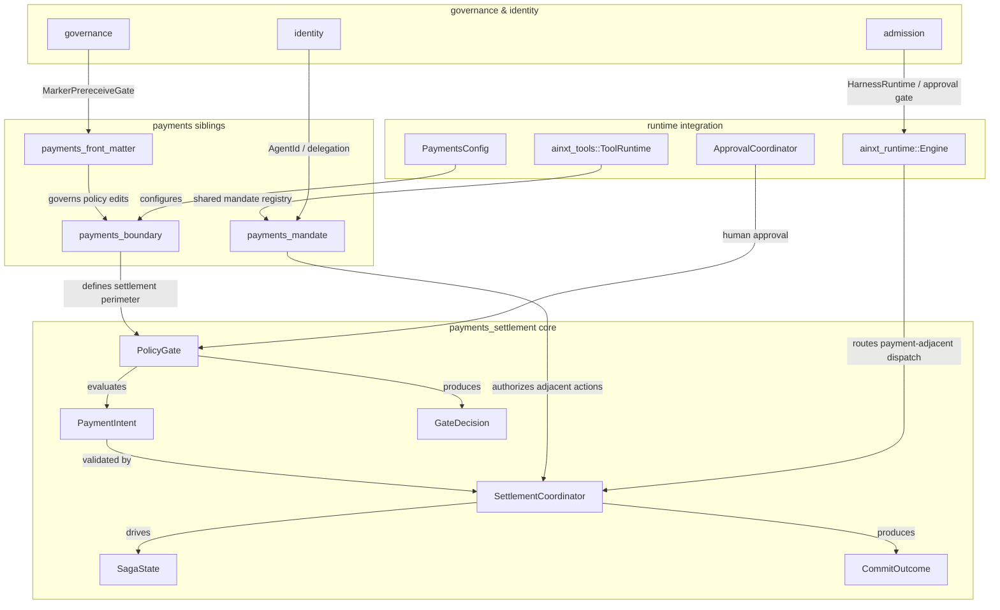
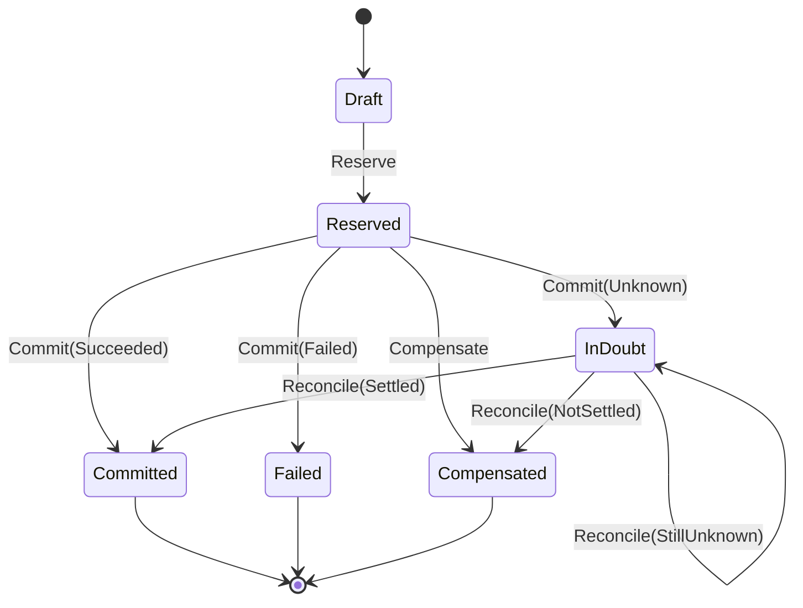
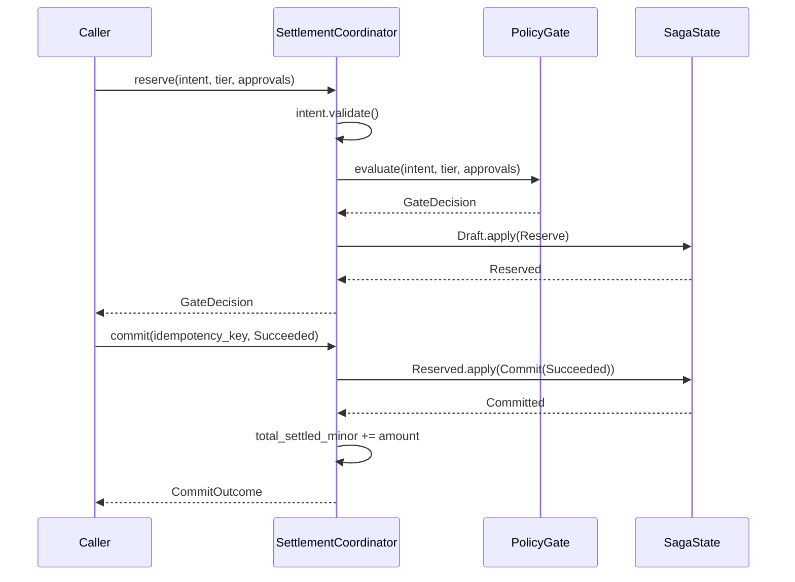
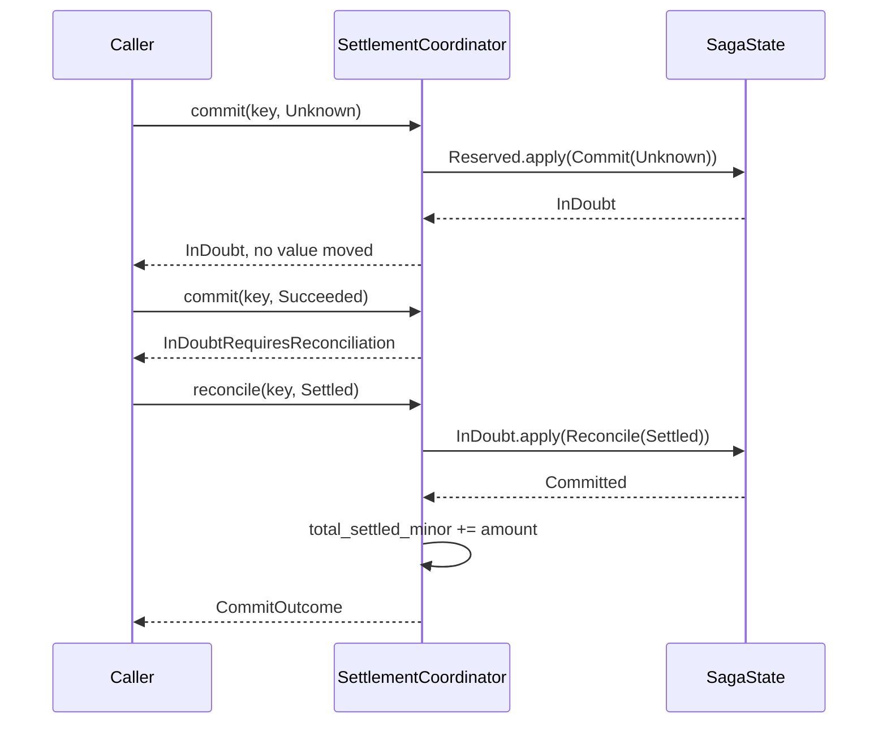
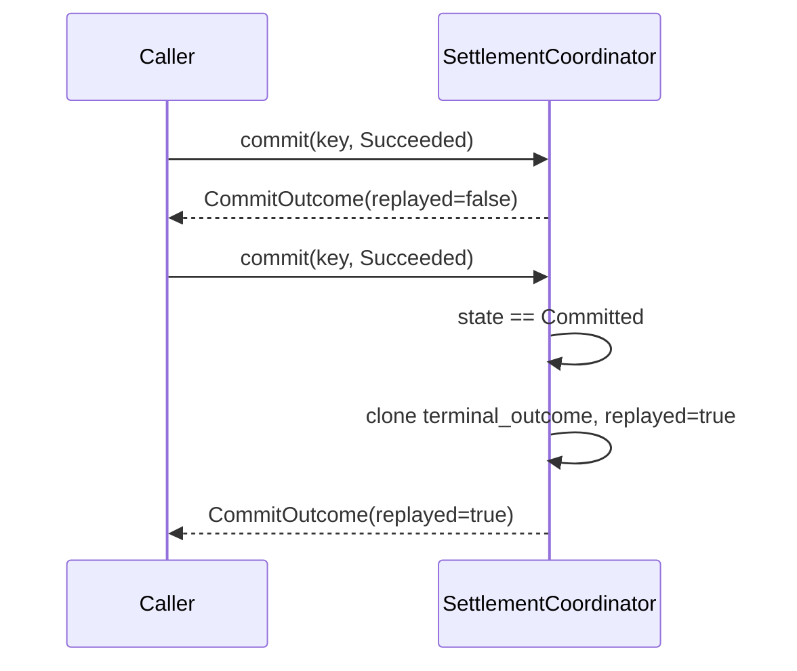
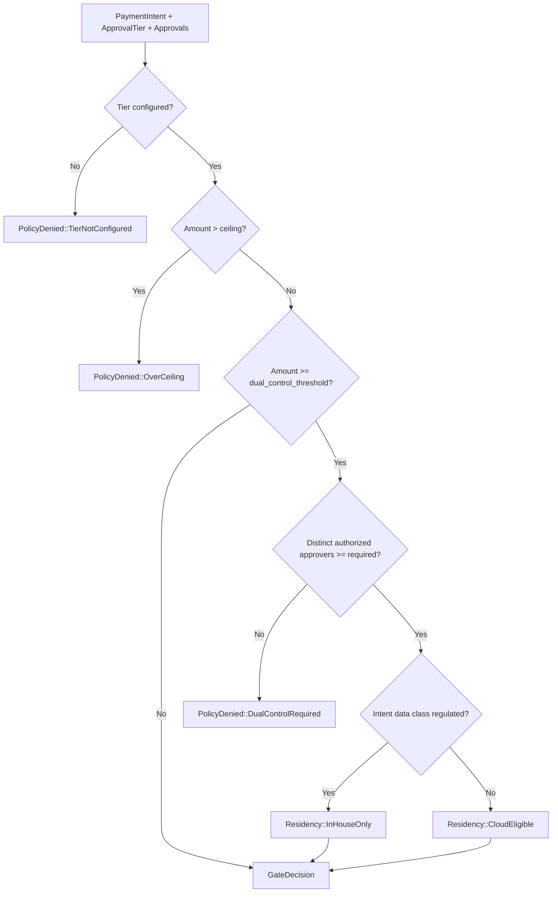
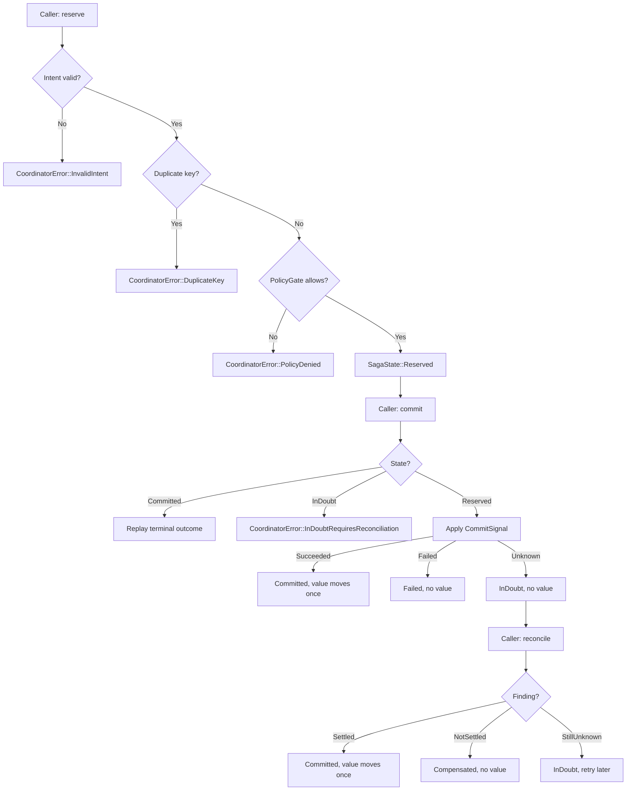

# payments_settlement

The **payments_settlement** module is the pure, deterministic core of value-movement safety in the `ainxt-payments` crate. It models the settlement state machine, idempotency guarantees, and policy gates that decide whether a payment intent may reserve funds, commit value, or be reconciled after an uncertain downstream result.

This module does **not** perform I/O, talk to banks, or hold secrets. It answers three questions in code:

1. **Which state transitions are legal?** — via [`SagaState`](payments_settlement.md#saga-state-machine).
2. **Did we already do this?** — via [`SettlementCoordinator`](payments_settlement.md#settlement-coordinator) keyed on `idempotency_key`.
3. **Is this even allowed?** — via [`PolicyGate`](payments_settlement.md#policy-gate) enforcing ceilings, dual control, and data residency.

The design is driven by ADR-016: Agent Identity and Payment Boundary, layered on the side-effect ledger's exactly-once saga substrate (ADR-013) and the data-class residency rule (ADR-012).

---

## Core responsibilities

| Responsibility | Component | Guarantee |
|---|---|---|
| Validate payment intent structure | [`PaymentIntent`](payments_settlement.md#paymentintent) | Non-zero amount, distinct debtor/creditor, valid currency, non-empty idempotency key |
| Enforce pre-reservation policy | [`PolicyGate`](payments_settlement.md#policygate) | Tier ceiling, dual control, approver authority, in-house-only residency |
| Drive legal settlement lifecycle | [`SagaState`](payments_settlement.md#sagastate) | Illegal transitions are rejected, never silent no-ops |
| Guarantee exactly-once settlement | [`SettlementCoordinator`](payments_settlement.md#settlementcoordinator) | Same `idempotency_key` commits once; replays return the first outcome |
| Resolve uncertain outcomes | [`ReconcileFinding`](payments_settlement.md#reconcilefinding) | `InDoubt` exits only through explicit reconciliation |

---

## Architecture

---

## Component reference

### PaymentIntent

A request to move a fixed amount from `debtor` to `creditor`.

- Amounts are stored in **minor units** (`u64`) — no floating-point drift.
- Carries an `idempotency_key` that makes the settlement exactly-once.
- Carries a `data_class` ([`ainxt_types::DataClass`](../core_infrastructure/security_config_identity.md#dataclass)) that drives residency: regulated/PII intents are forced in-house.

Validation rejects:
- zero amounts
- self-payments (`debtor == creditor`)
- empty `id` or `idempotency_key`
- malformed currency codes

### PolicyGate

Enforces the three pre-conditions **before** a reservation is taken:

1. **Tier ceiling** — per [`ApprovalTier`](payments_settlement.md#approvaltier) amount limit; unconfigured tiers fail closed.
2. **Dual control** — amounts at/above `dual_control_threshold_minor` require `DUAL_CONTROL_APPROVERS` (default 2) distinct *authorized* approvers.
3. **Data residency** — regulated/PII intents are [`Residency::InHouseOnly`](payments_settlement.md#residency).

Approver authority is checked via [`Approval`](payments_settlement.md#approval):
- `can_approve` must be true.
- If configured via `with_approver_authority(max_ad_level)`, the approver's `ad_level` must be `<= max`.
- Two approvals from the same `ApproverId` count as one (self-collusion is not dual control).

### SagaState

The settlement lifecycle state machine:

Key invariants:
- `Committed` is terminal and treated as non-compensable.
- `InDoubt` is terminal to `commit` — no auto-retry path exists.
- Illegal transitions return [`TransitionError`](payments_settlement.md#transitionerror), never a silent no-op.

### SettlementCoordinator

Coordinates the full settlement lifecycle:

- [`reserve`](payments_settlement.md#reserve) — validates intent, runs `PolicyGate`, creates saga `Draft → Reserved`.
- [`commit`](payments_settlement.md#commit) — applies downstream `CommitSignal`; idempotent on `Committed`; refused on `InDoubt`.
- [`compensate`](payments_settlement.md#compensate) — releases reservation `Reserved → Compensated`.
- [`reconcile`](payments_settlement.md#reconcile) — resolves `InDoubt` using an out-of-band `ReconcileFinding`.

Tracks:
- `total_settled_minor` — sum of value actually moved (`u128` to avoid overflow).
- `settled_count` — number of settlements that moved value.

Exactly-once is enforced by the `idempotency_key`: a replay of a committed key returns the first `CommitOutcome` with `replayed = true` and performs no new effect.

---

## Data flow

### Happy path: reserve → commit

### In-doubt path: commit → reconcile

### Idempotent replay

---

## Dependencies

### Within ainxt-payments

| Module | Relationship |
|---|---|
| [payments_boundary](payments_boundary.md) | Defines the settlement perimeter, egress guard, and policy governance that contextualize the gate's residency and boundary checks. |
| [payments_mandate](payments_mandate.md) | Provides `PaymentAdjacentMandate` and `MandateRegistry` for authorizing payment-adjacent actions that may precede or accompany settlement. |
| [payments_front_matter](payments_front_matter.md) | Governs how settlement policy definitions are authored, signed, and council-approved before they can influence the boundary or gate. |

### Runtime and tool integration

| Module | Relationship |
|---|---|
| [runtime_engine](../pipeline_runtime/runtime_engine.md) | `Engine` routes payment-adjacent tool dispatches through the approval gate and payment-boundary resolver; `EngineObo` layers on-behalf-of policy. |
| [server_serving_core](../pipeline_runtime/server_serving_core.md) | Surfaces such as `SettlePayment` and `ApprovalCoordinator` turn human or API approvals into the `Approval` inputs the gate evaluates. |
| [core_infrastructure](../core_infrastructure/core_infrastructure.md) | Uses `ainxt_types::DataClass` for residency decisions and relies on `eventlog` / `telemetry` for audit and metrics. |
| [security_config_identity](../core_infrastructure/security_config_identity.md) | `Principal`, `AgentId`, and delegation chains feed into mandate and approval identity. |

### Governance and compliance

| Module | Relationship |
|---|---|
| [admission](admission.md) | `HarnessRuntime` and `RuntimeApprovalGateResolver` bridge harness-level approval into the runtime approval path. |
| [governance](governance.md) | `MarkerPrereceiveGate` and `CodeownersApproval` enforce that settlement policy changes are council-approved. |
| [identity](identity.md) | `IdentityAuthority`, `SodPolicy`, and delegation provide the trust basis for approver identity and separation of duties. |
| [compliance](compliance.md) | `CompositeGate` and `GuardedSink` provide the redaction and compliance substrate that settlement-audit records may flow through. |

---

## Process flows

### Policy evaluation flow

### Settlement lifecycle flow

---

## Safety properties

The following properties are asserted by unit tests in `crates/ainxt-payments/src/lib.rs`:

- **Exactly-once effect**: Re-committing the same `idempotency_key` returns the first outcome and does not increment `total_settled_minor` or `settled_count`.
- **No double-pay from InDoubt**: `commit` on `InDoubt` is always refused; only `reconcile` may exit `InDoubt`.
- **No reservation on policy denial**: Over-ceiling or dual-control failures do not create a saga.
- **Distinct authorized approvers**: Two approvals from the same id count as one; unauthorized or too-junior approvers do not count.
- **Regulated/PII in-house only**: `Residency::InHouseOnly` is forced for `DataClass::RegulatedPayment` and `DataClass::Pii`.
- **Illegal transitions are loud**: Every disallowed state/event pair returns `TransitionError` or `CoordinatorError`.

---

## How it fits into the system

`payments_settlement` sits at the intersection of **value movement**, **governance**, and **runtime execution**:

- It is the *pure correctness core* that money-movement code is built on.
- It is invoked by the runtime's payment-boundary resolver and approval path before any value-bearing effect is taken.
- It relies on sibling `payments_boundary` and `payments_mandate` modules for perimeter and action authorization context.
- It consumes identity, governance, and compliance services to validate approvers and audit decisions.
- It does **not** grant agents the ability to move money; that guarantee lives at the capability-registry / effect-class layer in [admission](admission.md) and [runtime_engine](../pipeline_runtime/runtime_engine.md).

---

## See also

- [payments_boundary](payments_boundary.md) — settlement perimeter, egress guard, and policy governance
- [payments_mandate](payments_mandate.md) — payment-adjacent mandate registry and OBO authorization
- [payments_front_matter](payments_front_matter.md) — policy authoring and change governance
- [runtime_engine](../pipeline_runtime/runtime_engine.md) — engine dispatch, approval gates, and payment-boundary resolver
- [server_serving_core](../pipeline_runtime/server_serving_core.md) — served surfaces including `SettlePayment` and `ApprovalCoordinator`
- [admission](admission.md) — harness runtime and capability authorization
- [identity](identity.md) — agent identity, delegation, and separation of duties
- [governance](governance.md) — control-plane approval gates for policy changes
- [security_config_identity](../core_infrastructure/security_config_identity.md) — `Principal` and `DataClass` definitions
