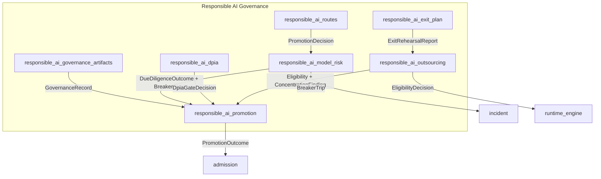

# Responsible AI Module

## Purpose

The `responsible_ai` module (`ainxt-responsibleai`) implements AI-specific governance controls required by RBI-regulated payment switches and EU-AI-Act-style regimes. It provides pure, deterministic, fail-closed gates that prevent deployment or promotion of AI features, models, and outsourcing routes that lack required documentation, fairness validation, due diligence, or exit planning.

The module is part of the larger `governance_compliance` domain. It does not perform I/O, read clocks, or use RNG; all temporal values and audit ticks are caller-supplied.

## Architecture Overview

## Sub-modules

### Governance Artifacts
Documents model cards, system cards, bias assessment, and the fail-closed deploy gate. See [responsible_ai_governance_artifacts](responsible_ai_governance_artifacts.md).

### Model Risk
Documents SR-11-7 model risk records, the algorithmic due-diligence gate, and the live quality circuit breaker. See [responsible_ai_model_risk](responsible_ai_model_risk.md).

### DPIA
Documents the DPDP Data Protection Impact Assessment promotion gate that blocks personal-data features from reaching `env/prod` without an approved, current DPIA. See [responsible_ai_dpia](responsible_ai_dpia.md).

### Outsourcing
Documents the RBI IT/cloud outsourcing register, route eligibility checks, sub-processor pinning, and concentration-risk analysis. See [responsible_ai_outsourcing](responsible_ai_outsourcing.md).

### Exit Plan
Documents rehearsable, fail-stop exit plans for outsourcing routes. See [responsible_ai_exit_plan](responsible_ai_exit_plan.md).

### Promotion
Documents the composed governance promotion gate that unifies DPIA, model-risk due diligence, and the quality circuit breaker into a single admission decision. See [responsible_ai_promotion](responsible_ai_promotion.md).

### Routes
Documents route-ready wire types for model-risk preview endpoints. See [responsible_ai_routes](responsible_ai_routes.md).

All generated sub-module documentation files for this module are cross-referenced above: [responsible_ai_governance_artifacts.md](responsible_ai_governance_artifacts.md), [responsible_ai_model_risk.md](responsible_ai_model_risk.md), [responsible_ai_dpia.md](responsible_ai_dpia.md), [responsible_ai_outsourcing.md](responsible_ai_outsourcing.md), [responsible_ai_exit_plan.md](responsible_ai_exit_plan.md), [responsible_ai_promotion.md](responsible_ai_promotion.md), and [responsible_ai_routes.md](responsible_ai_routes.md).

## Integration with Other Modules

- [admission](admission.md): promotion decisions feed harness runtime and approval gates.
- [ai_engine](../ai_engine/ai_engine.md): quality verification and evaluation testing provide monitoring scores consumed by the due-diligence gate.
- [pipeline_runtime](../pipeline_runtime/pipeline_runtime.md): runtime engine and serving infrastructure consume route eligibility and promotion decisions.
- [incident](incident.md): circuit breaker trips and concentration findings map to incident candidates.
- [lifecycle](lifecycle.md): retention and erasure policies align with data-class governance.
- [identity](identity.md): principal capabilities authorize approvals and model-risk reads.
