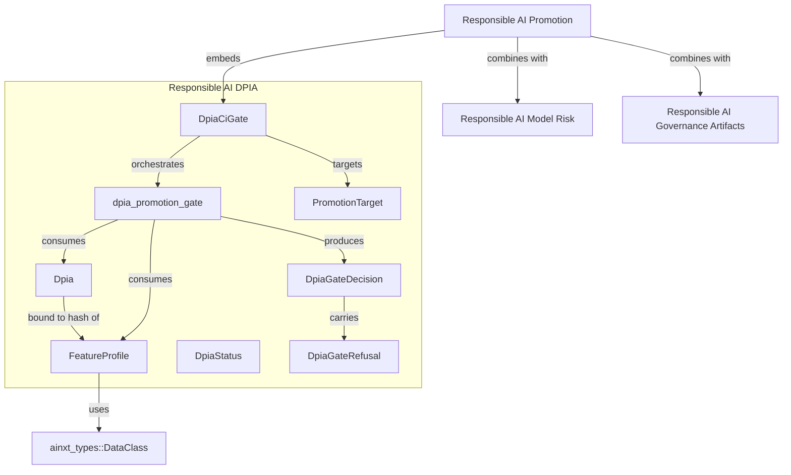
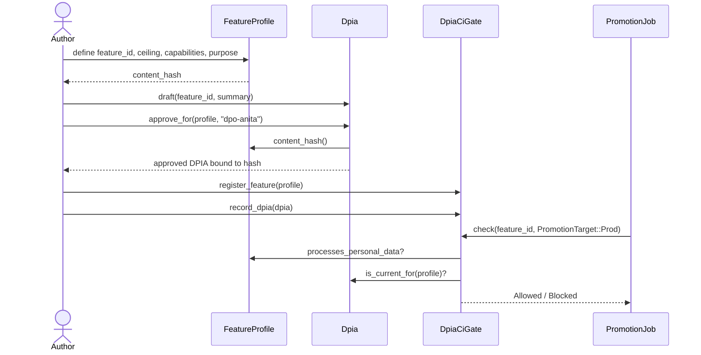
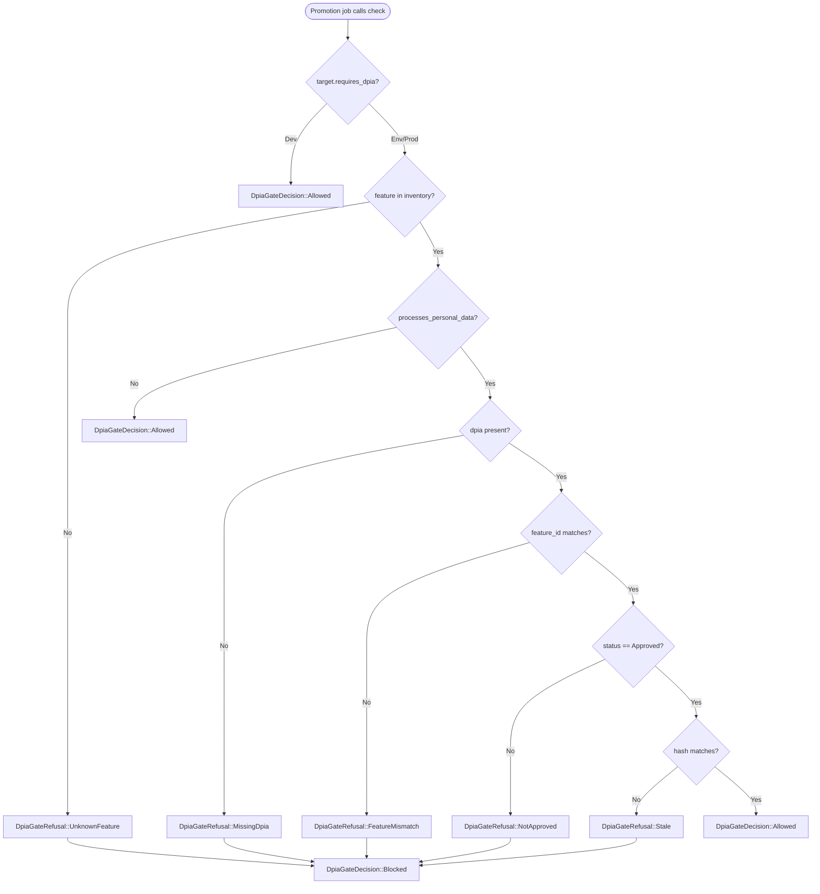
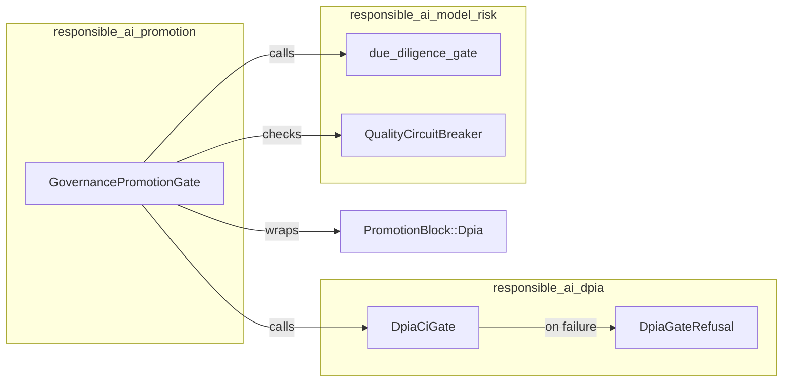

# Responsible AI — DPIA-per-Feature Promotion Gate

The `responsible_ai_dpia` module implements **FI-06**, the Data Protection Impact Assessment (DPIA) gate required by DPDP §10 for SDF-class fiduciary deployments. It treats a DPIA not as a one-time form, but as a **precondition of promotion** that is enforced automatically before a personal-data feature can reach `env/prod`.

A feature that processes personal data must reference an `approved`, *current* DPIA. The DPIA is cryptographically bound to the feature's data-processing profile through a content hash; any material change to the feature's data class, capabilities, or purpose invalidates the approval and blocks re-promotion until the DPO re-assesses.

---

## 1. Purpose and Core Functionality

### 1.1 What problem it solves

In regulated deployments, a feature cannot be promoted to environments that handle real personal data until a Data Protection Officer has assessed its data-processing risks. The module answers two questions deterministically:

1. **Does this feature require a DPIA?**  
   A DPIA is required when the feature's `data_class_ceiling` is a regulated class (`Pii`, `RegulatedPayment`) **or** when any of its capabilities reference a personal-data connector (e.g. `outlook`, `graph`, `crm`).

2. **Is the DPIA current and valid for promotion?**  
   The DPIA must be `Approved`, must belong to the same feature, and must have been approved against the feature's current content hash.

### 1.2 Fail-closed design

The gate is intentionally fail-closed:

- An un-inventoried feature cannot be promoted to `env/prod`.
- A missing DPIA blocks promotion.
- A stale DPIA (content-hash mismatch after a material change) blocks promotion.
- A DPIA for the wrong feature is rejected.
- Dev/sandbox promotions are always allowed, so teams can iterate without filing a DPIA for every experiment.

### 1.3 Pure and deterministic

The gate contains no clock, randomness, or I/O. It operates on serde-serializable control-plane definitions, making it suitable for unit tests, CI gates, and deterministic policy-as-code.

---

## 2. Architecture

### 2.1 Component overview



### 2.2 Core types

| Type | Responsibility |
|------|----------------|
| `FeatureProfile` | Describes a feature's data-processing ceiling, capabilities, and purpose. Computes the content hash that a DPIA is bound to. |
| `Dpia` | The DPIA artifact itself: status, approver, summary, and the hash it was approved against. |
| `DpiaStatus` | Lifecycle of a DPIA: `Draft`, `Approved`, `Rejected`. |
| `DpiaGateDecision` | Outcome of a gate check: `Allowed` or `Blocked(refusal)`. |
| `DpiaGateRefusal` | Concrete reason a promotion was blocked. |
| `PromotionTarget` | The environment being promoted to: `Dev`, `Env`, `Prod`. |
| `DpiaCiGate` | Stateful CI gate that inventories features and DPIAs and answers promotion checks. |
| `dpia_promotion_gate` | Pure function that implements the core DPIA logic. |

### 2.3 Content-hash binding

The `FeatureProfile::content_hash` is a SHA-256 digest over:

1. The `data_class_ceiling` as a string.
2. The sorted list of capability strings.
3. The declared `purpose` string.

Each segment is length-prefixed to avoid collision between concatenations. When `Dpia::approve_for(profile, approver)` is called, the DPIA records `profile.content_hash()`. Later, `Dpia::is_current_for(profile)` succeeds only if the recorded hash still matches.

This means the following changes automatically invalidate a DPIA:

- Raising the data class (e.g. `Pii` → `RegulatedPayment`).
- Adding or removing a capability.
- Changing the processing purpose.



---

## 3. Data Flow

### 3.1 Promotion check flow



### 3.2 Personal-data trigger

A feature is considered to process personal data if either:

- `data_class_ceiling.is_regulated()` returns true (i.e. `Pii` or `RegulatedPayment`).
- Any capability string contains a substring from the configured `personal_data_connectors` list.

The substring match is intentional: a capability like `connector.outlook.read` will match the `outlook` connector fragment, ensuring that mislabelled ceilings cannot bypass the gate.

---

## 4. Integration with the Broader System

### 4.1 Within `responsible_ai`

`responsible_ai_dpia` is one of several governance sub-modules in the `ainxt-responsibleai` crate:

- [responsible_ai_governance_artifacts](responsible_ai_governance_artifacts.md) — model cards, system cards, bias reports, and deploy-time approval.
- [responsible_ai_model_risk](responsible_ai_model_risk.md) — model-risk records, due-diligence gating, and quality circuit breakers.
- [responsible_ai_promotion](responsible_ai_promotion.md) — the composite `GovernancePromotionGate` that combines DPIA, due-diligence, and quality-breaker checks.
- [responsible_ai_routes](responsible_ai_routes.md) — route-level promotion decisions and model-risk routing.
- [responsible_ai_outsourcing](responsible_ai_outsourcing.md) — sub-processor registers and outsourcing eligibility.
- [responsible_ai_exit_plan](responsible_ai_exit_plan.md) — exit-plan rehearsal for outsourcing routes.

The `GovernancePromotionGate` embeds a `DpiaCiGate` and maps a `DpiaGateRefusal` into a `PromotionBlock::Dpia(...)`:



### 4.2 Within `governance_compliance`

The `responsible_ai` family sits alongside:

- [admission](admission.md) — harness runtime, capability authorization, and compliant run reports.
- [compliance](compliance.md) — redaction, sinks, and composite gates.
- [governance](governance.md) — publish requests, marketplace gates, and codeowners approval.
- [identity](identity.md) — workload credentials, attestation, and delegation.
- [lifecycle](lifecycle.md) — retention, legal hold, erasure, and DSAR workflows.
- [payments](payments.md) — payment boundaries, settlement, and mandates.
- [teams](teams.md) and [workforce](workforce.md) — role definitions, agent teams, and workforce controls.

The DPIA gate consumes `DataClass` from [security_config_identity](../core_infrastructure/security_config_identity.md) (via `ainxt_types::DataClass`) and is conceptually aligned with lifecycle erasure and identity access controls: a feature that cannot pass the DPIA gate must not be promoted to an environment where it could process real principals' data.

### 4.3 Upstream consumers

The most likely upstream callers are CI promotion jobs and the runtime promotion surface. The module is pure, so the caller is responsible for:

1. Hydrating the `DpiaCiGate` inventory from the control-plane store.
2. Supplying the deployment-specific `personal_data_connectors` list.
3. Acting on `DpiaGateDecision::Blocked(...)` by aborting the promotion.

---

## 5. API and Usage Patterns

### 5.1 Basic gate usage

```rust
use ainxt_responsibleai::dpia::{DpiaCiGate, FeatureProfile, Dpia, PromotionTarget};
use ainxt_types::DataClass;

let mut gate = DpiaCiGate::new(&["outlook", "graph", "crm"]);

let profile = FeatureProfile::new("summarizer", DataClass::Internal, "summarize inbox")
    .with_capability("connector.outlook.read");

gate.register_feature(profile.clone());

let mut dpia = Dpia::draft("summarizer", "risks + mitigations");
dpia.approve_for(&profile, "dpo-anita");
gate.record_dpia(dpia);

assert!(gate.check("summarizer", PromotionTarget::Prod).is_allowed());
```

### 5.2 Dev iteration without a DPIA

```rust
// Dev promotions do not require a DPIA even for personal-data features.
let decision = gate.check("summarizer", PromotionTarget::Dev);
assert!(decision.is_allowed());
```

### 5.3 Material change invalidates approval

```rust
let expanded = FeatureProfile::new("summarizer", DataClass::RegulatedPayment, "summarize inbox")
    .with_capability("connector.outlook.read");

// The previously approved DPIA is now stale because the content hash changed.
let decision = gate.check("summarizer", PromotionTarget::Prod);
assert!(!decision.is_allowed());
```

---

## 6. Testing and Compliance Mapping

The module's unit tests map directly to the FI-06 compliance requirements:

| Test | Requirement |
|------|-------------|
| `personal_data_feature_without_dpia_is_blocked` | A personal-data feature with no approved DPIA cannot promote. |
| `data_class_change_invalidates_dpia_approval` | Material expansion of data processing invalidates the DPIA until re-assessment. |
| `non_personal_feature_needs_no_dpia` | Features that do not process personal data require no DPIA. |
| `purpose_change_invalidates_and_wrong_feature_rejected` | Purpose drift invalidates approval; DPIAs cannot be reused across features. |

---

## 7. Design Decisions and Trade-offs

| Decision | Rationale |
|----------|-----------|
| Content-hash binding | Prevents silent scope creep. A feature cannot expand data processing without DPO re-approval. |
| Substring connector matching | Catches mislabelled ceilings when a capability clearly implies personal data. |
| Fail-closed for unknown features | An un-inventoried feature is unassessable and therefore unsafe for `env/prod`. |
| Dev promotions allowed | Supports rapid iteration; the gate only protects environments with real data principals. |
| Pure/deterministic logic | Enables deterministic CI gates, easy unit testing, and policy-as-code reproducibility. |
| PII-free DPIA artifact | The `Dpia` struct stores only data classes, purposes, and risk summaries — never actual personal data. |

---

## 8. References

- [responsible_ai_promotion](responsible_ai_promotion.md) — composite promotion gate that embeds the DPIA check.
- [responsible_ai_model_risk](responsible_ai_model_risk.md) — model-risk due diligence and quality circuit breakers.
- [responsible_ai_governance_artifacts](responsible_ai_governance_artifacts.md) — model cards, system cards, and deploy approval.
- [responsible_ai_outsourcing](responsible_ai_outsourcing.md) — outsourcing registers and sub-processor governance.
- [responsible_ai_exit_plan](responsible_ai_exit_plan.md) — exit-plan rehearsal for outsourcing routes.
- [security_config_identity](../core_infrastructure/security_config_identity.md) — `DataClass` and `Principal` definitions.
- [admission](admission.md) — harness runtime and capability authorization.
- [lifecycle](lifecycle.md) — retention, erasure, and DSAR workflows.
