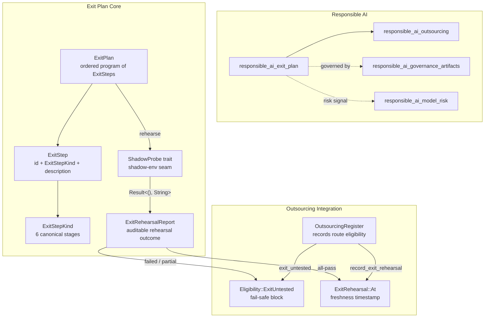
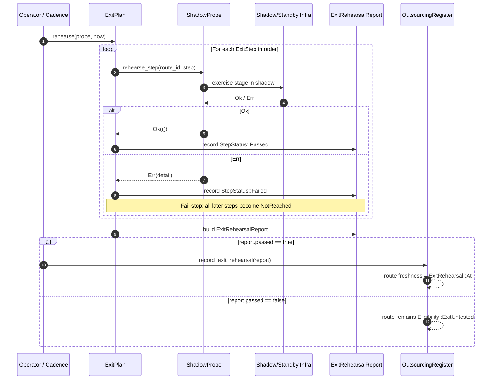
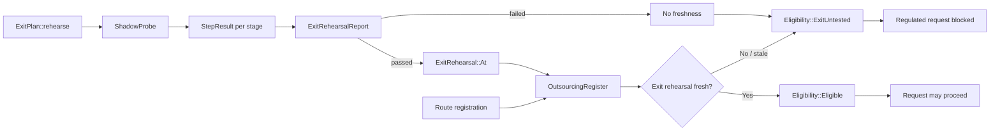
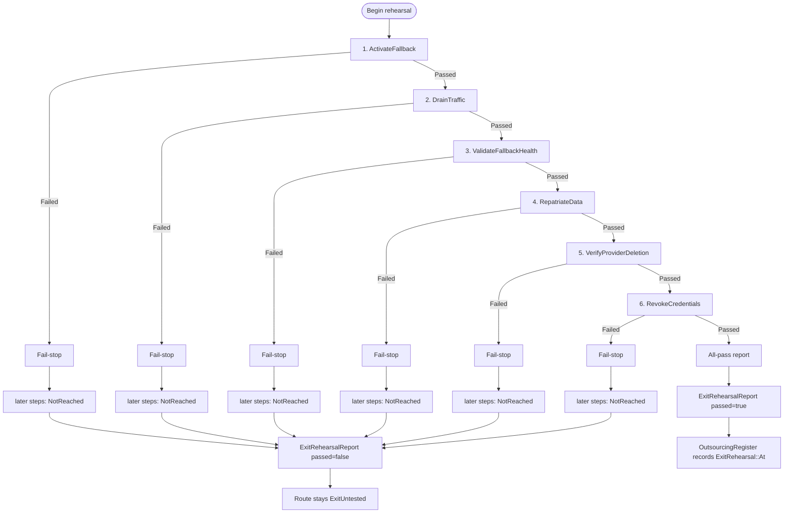

# Responsible AI Exit Plan

The `responsible_ai_exit_plan` module turns a vendor-exit runbook from a static document into a **rehearsable, deterministic, shadow-executed program**. It implements the RBI outsourcing expectation (§3.4 / ADR-027) that an exit plan must be *rehearsable and rehearsed*: the fallback is activated, traffic is drained, fallback health is validated, data is repatriated, provider deletion is verified, and credentials are revoked — all against a standby/shadow environment, never production.

For details on how routes are registered and why an untested exit blocks regulated traffic, see [`responsible_ai_outsourcing.md`](responsible_ai_outsourcing.md). For the broader governance context (model cards, system cards, DPIA gates, and promotion gates), see [`responsible_ai_governance_artifacts.md`](responsible_ai_governance_artifacts.md) and [`responsible_ai_promotion.md`](responsible_ai_promotion.md).

---

## What problem this solves

A route's exit plan can be recorded as "tested" simply because an operator asserted a date. A stale runbook that has silently rotted still reads as fresh until its cadence lapses, and nothing ever *ran* it. This module closes that gap by making the exit plan an **executable program** whose freshness is produced only by an actual end-to-end rehearsal.

Key properties:

- **Ordered program**: [`ExitPlan`](responsible_ai_exit_plan.md#exitplan) is an ordered sequence of [`ExitStep`](responsible_ai_exit_plan.md#exitstep)s. Order is prerequisite order — you cannot validate fallback health before activating the fallback.
- **Shadow-only execution**: [`ExitPlan::rehearse`](responsible_ai_exit_plan.md#exitplanrehearse) drives the program through an injected [`ShadowProbe`](responsible_ai_exit_plan.md#shadowprobe). The probe exercises each stage against a standby/shadow environment. Production is never touched.
- **Fail-stop semantics**: The first failed stage halts execution. Every later stage is recorded as [`StepStatus::NotReached`](responsible_ai_exit_plan.md#stepstatus). A partial rehearsal is **not** a tested exit.
- **Auditable artifact**: A rehearsal yields an [`ExitRehearsalReport`](responsible_ai_exit_plan.md#exitrehearsalreport). Only an all-pass report freshens the route's exit-rehearsal timestamp; a failed rehearsal leaves the route [`ExitUntested`](responsible_ai_outsourcing.md#eligibility).

---

## Core concepts

### `ExitStepKind`

The canonical stages of an RBI exit runbook. Each variant maps to a rehearsable shadow operation:

| Variant | Purpose |
|---------|---------|
| `ActivateFallback` | Stand up or confirm the fallback route (in-house model or alternate provider) is reachable. |
| `DrainTraffic` | Mirror live traffic onto the fallback in shadow — not a production cut-over. |
| `ValidateFallbackHealth` | Confirm the fallback meets SLO/quality under the drained load. |
| `RepatriateData` | Bring provider-held data back in-country (residency). |
| `VerifyProviderDeletion` | Confirm the provider deleted the repatriated data. |
| `RevokeCredentials` | Revoke the provider's credentials and access. |

### `ExitStep`

A single step in an exit plan, identified by `id`, classified by [`ExitStepKind`](responsible_ai_exit_plan.md#exitstepkind), and described by a human-readable `description`.

### `ExitPlan`

An ordered Long-Horizon program of [`ExitStep`](responsible_ai_exit_plan.md#exitstep)s bound to a specific `route_id`. The module provides:

- `ExitPlan::new(route_id)` — start with an empty plan.
- `ExitPlan::with_step(step)` — append a step in prerequisite order.
- `ExitPlan::standard(route_id)` — the canonical 6-stage RBI runbook.
- `ExitPlan::rehearse(probe, now)` — execute the plan in shadow and produce an [`ExitRehearsalReport`](responsible_ai_exit_plan.md#exitrehearsalreport).

### `ShadowProbe`

The seam between the pure exit-plan program and real shadow infrastructure. A deployment binds a `ShadowProbe` to the actual standby environment. Tests inject deterministic probes. The trait has one method:

```rust
fn rehearse_step(&self, route_id: &str, step: &ExitStep) -> Result<(), String>;
```

`Ok(())` means the stage succeeded; `Err(detail)` records a PII-free failure on the report.

### `StepStatus`

Outcome of one stage:

- `Passed` — succeeded in shadow.
- `Failed(String)` — failed with PII-free detail.
- `NotReached` — a prior stage failed, so this stage was never reached.

### `StepResult`

Records the `step_id`, [`ExitStepKind`](responsible_ai_exit_plan.md#exitstepkind), and [`StepStatus`](responsible_ai_exit_plan.md#stepstatus) for one stage.

### `ExitRehearsalReport`

The auditable artifact of a full rehearsal. Contains:

- `route_id`
- `at_tick` — logical time the rehearsal ran at
- `steps` — [`StepResult`](responsible_ai_exit_plan.md#stepresult) for every stage
- `passed` — true iff every stage passed

It also provides:

- `as_rehearsal()` — converts to an [`ExitRehearsal::At`](responsible_ai_outsourcing.md#exitrehearsal) freshness stamp on all-pass, or `None` otherwise.
- `first_failure()` — returns the first failed stage for audit drill-down.

---

## Architecture



---

## Component interaction



---

## Data flow



---

## Process flow: standard RBI exit rehearsal



---

## How it fits into the system

The exit-plan module sits inside the `governance_compliance → responsible_ai` subsystem. It is a specialized component that closes the loop between outsourcing governance and operational readiness:

- **Upstream**: [`responsible_ai_outsourcing.md`](responsible_ai_outsourcing.md) defines `OutsourcingRegister`, `RegisteredRoute`, `Eligibility`, and `ExitRehearsal`. The register uses the exit-plan rehearsal report as the only legitimate source of exit-plan freshness.
- **Downstream**: A route that is `ExitUntested` is excluded from regulated request routing. This fail-safe prevents a broken or stale exit plan from being relied upon for sensitive workloads.
- **Sibling modules**:
  - [`responsible_ai_dpia.md`](responsible_ai_dpia.md) — DPIA gates may require exit-plan evidence before promotion.
  - [`responsible_ai_promotion.md`](responsible_ai_promotion.md) — promotion gates may block a route whose exit rehearsal is stale.
  - [`responsible_ai_model_risk.md`](responsible_ai_model_risk.md) — model-risk records may capture exit-rehearsal failures as breaker trips.
  - [`responsible_ai_outsourcing.md`](responsible_ai_outsourcing.md) — owns the register and eligibility decisions.

---

## Design notes and current limitations

- **Pure and deterministic**: `ExitPlan::rehearse` has no clock, RNG, or I/O. Logical `now` is injected, and the `ShadowProbe` is the caller's responsibility.
- **Infra-gated probe**: The module deliberately does not bind `ShadowProbe` to real standby infrastructure. That binding is deployment-specific and must be provided by the operator.
- **No automatic trigger today**: As noted in the source, `rehearse` currently has no served callers. There is no admin route or cadence tick that runs exit rehearsals automatically. Wiring it requires both a genuine trigger (e.g., `POST /admin/exit-rehearsal/{route_id}` or a periodic sweep over `exit_untested` routes) and a real `ShadowProbe` bound to live standby infrastructure.
- **Fail-safe by default**: An empty plan never passes, and a failed or partial rehearsal produces no freshness. This prevents a vacuous or broken rehearsal from being misrepresented as a tested exit.

---

## References

- [`responsible_ai_outsourcing.md`](responsible_ai_outsourcing.md) — route registration, `ExitRehearsal`, and `Eligibility::ExitUntested`
- [`responsible_ai_governance_artifacts.md`](responsible_ai_governance_artifacts.md) — model cards, system cards, and governance records
- [`responsible_ai_dpia.md`](responsible_ai_dpia.md) — DPIA promotion gates
- [`responsible_ai_promotion.md`](responsible_ai_promotion.md) — governance promotion gates
- [`responsible_ai_model_risk.md`](responsible_ai_model_risk.md) — model risk records and quality circuit breakers
