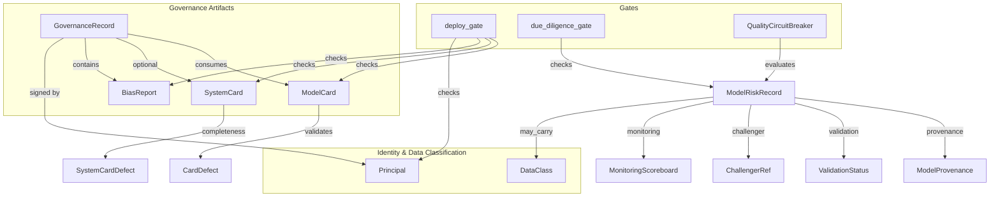
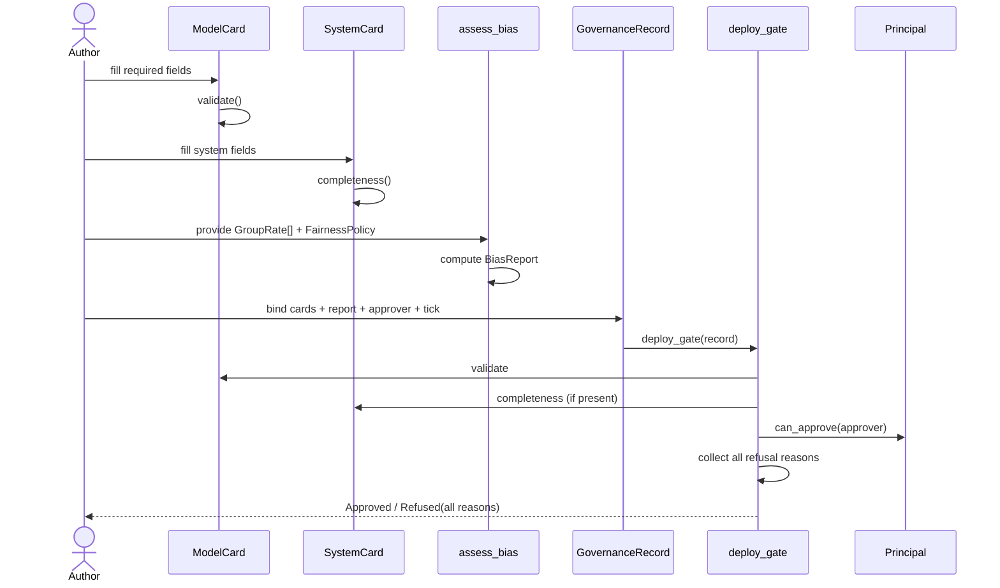
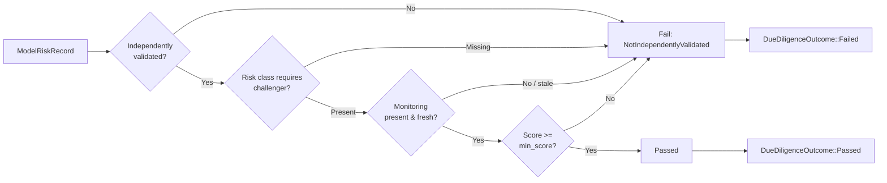

# Responsible AI Governance Artifacts

The `responsible_ai_governance_artifacts` module implements the AI-specific governance artifacts and fail-closed gates required for regulated, high-risk AI deployments. It provides pure, deterministic, clock-free logic for model cards, system cards, bias/fairness assessment, human approval records, and the deploy gate that consumes them. The module is part of the broader [`responsible_ai`](responsible_ai.md) subsystem under [`governance_compliance`](governance_compliance.md).

In RBI-regulated payment-switch and EU-AI-Act-style regimes, AI governance is mandatory: a model cannot ship without documented intended use, limitations, risk classification, fairness testing, and an auditable human sign-off. This crate supplies those artifacts as serializable data types plus the deterministic gates that refuse deployment when any requirement is unmet.

---

## Core Responsibilities

1. **Model Cards** — structured documentation of a model's intended use, out-of-scope uses, limitations, training/evaluation summaries, and risk class.
2. **System Cards** — documentation of composed systems: component models, data flows, and human-oversight mechanisms.
3. **Bias / Fairness Assessment** — deterministic computation of disparity between per-group favorable-outcome rates using ratio or difference metrics.
4. **Governance Records & Deploy Gate** — binds cards, bias reports, and an approver principal; the gate collects every refusal reason and fails closed.
5. **Model Risk Records & Due-Diligence Gate** — SR-11-7 / DPDP §10 algorithmic due diligence: provenance, independent validation, challenger benchmarking, continuous monitoring, and a fail-closed promotion gate.
6. **Quality Circuit-Breaker** — runtime trip signal when a live monitoring scoreboard drops below bar, enabling incident escalation for regulated routes.

---

## Architecture

---

## Component Reference

### Risk Classification

`RiskClass` is an EU-AI-Act-style ordered enum:

- `Minimal` — negligible risk (e.g., spam filtering).
- `Limited` — transparency obligations apply.
- `High` — regulated high-risk; deployable only with conformity evidence and human oversight.
- `Unacceptable` — prohibited; never deployable.

`RiskClass::deployable()` returns `false` only for `Unacceptable`. The ordering is least-to-most severe and drives gating logic such as challenger-model requirements.

### Model Card

`ModelCard` captures:

- `model_id`
- `intended_use`
- `out_of_scope_uses`
- `limitations`
- `training_data_summary`
- `eval_summary`
- `risk_class`

`ModelCard::validate()` returns `Ok(())` or a `Vec<CardDefect>` listing every missing/blank required field in stable order. A card can be structurally valid yet non-deployable (e.g., `Unacceptable` risk); validation is separate from the deploy gate.

### System Card

`SystemCard` captures:

- `system_id`
- `components` — model ids composed into the system
- `data_flows` — human-readable data-movement descriptions
- `human_oversight` — how humans stay in/over the loop

`SystemCard::completeness()` returns `Ok(())` or a `Vec<SystemCardDefect>`.

### Bias & Fairness

`GroupRate` represents a group's favorable-outcome rate, built directly or from counts.

`FairnessMetric` supports:

- `RateRatio` — `max_rate / min_rate` (four-fifths-rule style; `1.0` = parity).
- `RateDifference` — `max_rate − min_rate` (`0.0` = parity).

`FairnessPolicy` pairs a metric with a threshold.

`assess_bias(groups, policy)` returns a `BiasReport` containing:

- `disparity`, `min_rate`, `max_rate`
- `disadvantaged` / `advantaged` group pair
- `flagged` — `disparity > threshold`

The function is deterministic: ties break by lexicographically smallest group name. With fewer than two groups, disparity is parity and the report is never flagged.

### Governance Record & Deploy Gate

`GovernanceRecord` binds:

- a `ModelCard`
- an optional `SystemCard`
- a `BiasReport`
- an `approver` [`Principal`](../core_infrastructure/security_config_identity.md)
- an `approval_note`
- a caller-supplied `recorded_tick` (no wall clock in the crate)

`deploy_gate(record)` is fail-closed. It refuses deployment if any of the following hold, collecting **all** reasons:

- model card is invalid
- system card is present but incomplete
- risk class is `Unacceptable`
- bias exceeds threshold
- approver lacks the `governance:approve` capability (or is not an admin)

`can_approve(principal)` checks for the `APPROVE_CAP` capability or admin status. See [`security_config_identity`](../core_infrastructure/security_config_identity.md) for `Principal` details.

### Model Risk Record

`ModelRiskRecord` is the control-plane SR-11-7 inventory entry for a model route:

- `model_id`
- `provenance` — `ModelProvenance::InHouse`, `CloudApi { vendor }`, or `OpenWeights { origin }`
- `permitted_data_class` — maximum [`DataClass`](../core_infrastructure/security_config_identity.md) the model may carry
- `intended_use`
- `risk_class`
- `validation` — `NotValidated` or `IndependentlyValidated { at_tick }`
- `challenger` — optional `ChallengerRef`
- `monitoring` — optional `MonitoringScoreboard`
- `limitations`

`ModelRiskRecord::may_carry(class)` enforces both the data-class ceiling and the regulated-data provenance invariant: a `CloudApi` provenance can never carry regulated data, even if the ceiling is mis-set.

### Due-Diligence Gate

`DueDiligenceConfig` defines:

- `min_score` — minimum acceptable monitoring score
- `require_challenger_at_or_above` — risk class at or above which a challenger is mandatory
- `max_monitoring_staleness` — maximum tolerated staleness in logical ticks

`due_diligence_gate(record, cfg, now)` is fail-closed. It fails if:

- the model is not independently validated
- its risk class requires a challenger and none is recorded
- no monitoring scoreboard exists
- the latest score is below `min_score`
- the monitoring is staler than `max_monitoring_staleness` at `now`

It returns `DueDiligenceOutcome::Passed` or `Failed(Vec<DueDiligenceDefect>)`.

### Quality Circuit-Breaker

`QualityCircuitBreaker` evaluates a `ModelRiskRecord`'s live `MonitoringScoreboard`. It returns:

- `BreakerState::Closed` — score present and at/above bar
- `BreakerState::Open(BreakerTrip)` — score missing or below bar

`BreakerTrip` carries `route_id`, `score`, `bar`, and `regulated_route`, giving the parent enough facts to open a §2 operational-risk incident for regulated routes. See [`incident`](incident.md) for incident handling.

`route_promotable(record, cfg, now)` is the FI-07 promotion/router admission entrypoint; it delegates to `due_diligence_gate`.

---

## Data Flow

---

## Process Flow: Model Route Promotion

---

## Dependencies

| Dependency | Module | Purpose |
|------------|--------|---------|
| `Principal` | [`security_config_identity`](../core_infrastructure/security_config_identity.md) | Approver identity and capability checks |
| `DataClass` | [`security_config_identity`](../core_infrastructure/security_config_identity.md) | Data-class ceiling and regulated-data provenance rules |
| `GovernancePromotionGate` | [`responsible_ai_promotion`](responsible_ai_promotion.md) | Composes DPIA, due-diligence, and circuit-breaker gates |
| `DpiaCiGate` | [`responsible_ai_dpia`](responsible_ai_dpia.md) | Data-protection impact assessment gate |
| `PromotionDecision` | [`responsible_ai_routes`](responsible_ai_routes.md) | Promotion outcome consumed by routing layer |
| `IncidentCandidate` | [`incident`](incident.md) | Parent maps `BreakerTrip` to operational-risk incidents |

---

## Integration with the Broader System

- **Lifecycle / Governance**: Cards and governance records are versioned under the git-native DRAFT→PRODUCTION lifecycle (ADR-026). See [`governance`](governance.md) and [`lifecycle`](lifecycle.md).
- **Promotion**: `route_promotable` is called by the promotion path and model router before a route enters service. See [`responsible_ai_promotion`](responsible_ai_promotion.md) and [`responsible_ai_routes`](responsible_ai_routes.md).
- **Runtime Serving**: The `QualityCircuitBreaker` provides typed trip facts to the serving/runtime layer, which can contain the route and escalate. See [`runtime_engine`](../pipeline_runtime/runtime_engine.md) and [`server_serving`](../pipeline_runtime/server_serving.md).
- **Evaluation & Quality**: Bias reports and monitoring scoreboards consume evaluation signals produced by the AI engine's quality verification subsystem. See [`quality_verification`](../ai_engine/quality_verification.md).

---

## Design Principles

- **Fail-closed**: Any missing, invalid, or non-compliant artifact results in refusal.
- **Collect-all-errors**: Gates return every failing reason so authors can fix all gaps in one pass.
- **Deterministic**: No clock, RNG, or filesystem access; logical ticks and pure functions only.
- **Separation of concerns**: Structural validation (cards) is separate from policy gating (deploy/due-diligence).
- **Defense in depth**: `may_carry` enforces the regulated-data provenance invariant independently of the configured data-class ceiling.
