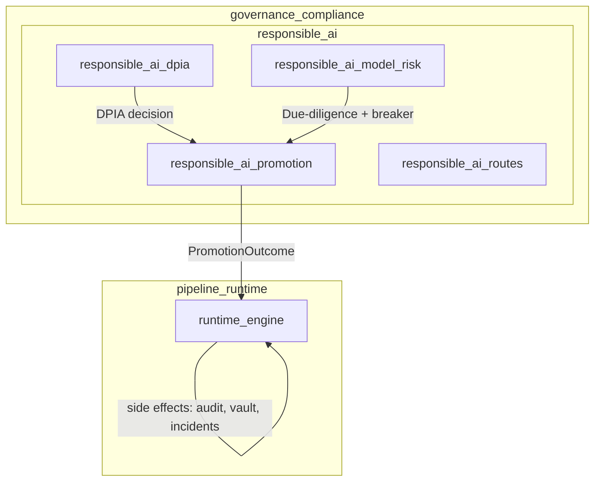
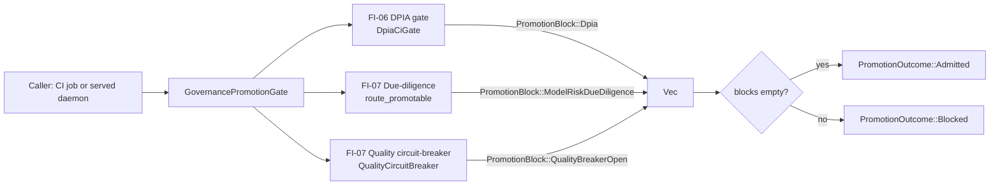
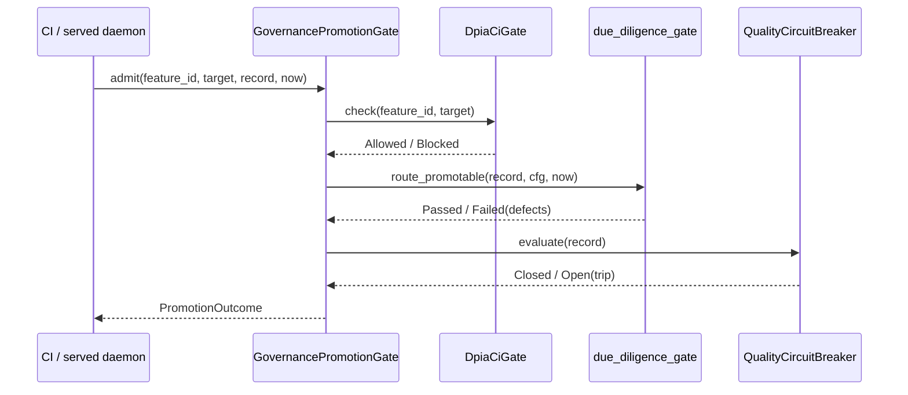
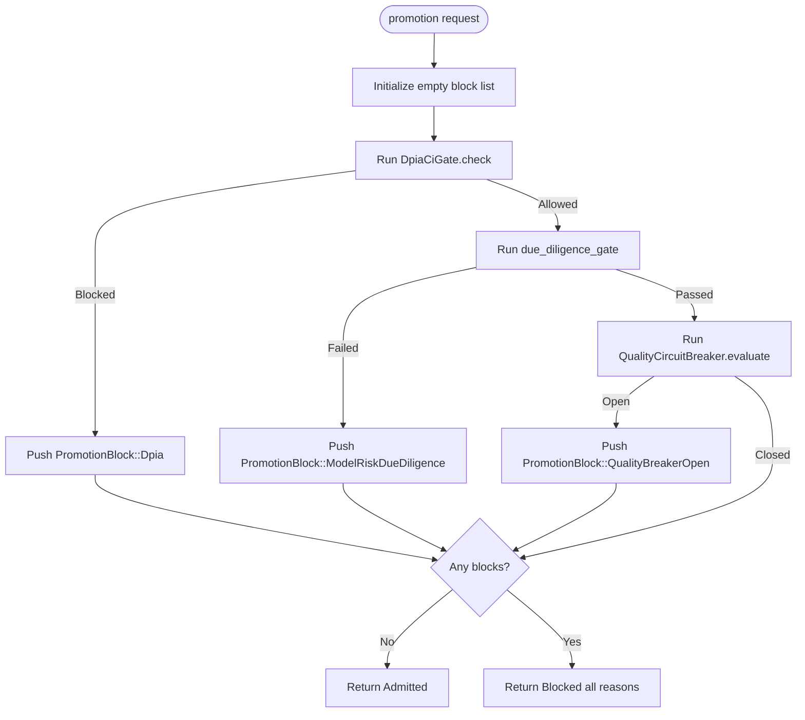
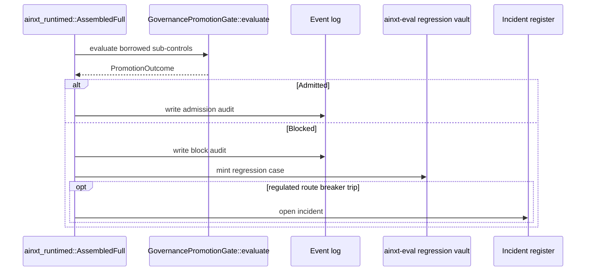

# Responsible AI Promotion

The **Responsible AI Promotion** module (`responsible_ai_promotion`) implements the composed governance promotion gate that decides whether a feature or model-route may advance toward regulated production environments. It is the single fail-closed checkpoint that unifies two previously separate controls:

- **FI-06 — DPDP DPIA-per-feature**: personal-data features must carry an approved, content-current Data Protection Impact Assessment (DPIA) before reaching `env` or `prod`.
- **FI-07 — SR-11-7 model-risk / quality**: the serving model-route must pass algorithmic due-diligence AND its live quality circuit-breaker must be closed.

Before this composition, the DPIA gate had no single caller on the promotion path. A personal-data feature could reach production with a clean model-risk record and no DPIA. `GovernancePromotionGate::admit` fixes that by running both controls together, collecting every blocking reason, and returning one deterministic decision.

The module is intentionally pure: it performs no I/O, uses no clock or RNG, and receives the logical time `now` as an injected parameter. Side effects such as event-log audit, regression-vault case minting, and incident opening are layered on by the served daemon (`ainxt_runtimed::AssembledFull::admit_promotion`) after calling this gate.

---

## Core Components

| Component | File | Responsibility |
|-----------|------|----------------|
| `GovernancePromotionGate` | `crates/ainxt-responsibleai/src/promotion.rs` | Composed gate that runs DPIA, due-diligence, and quality-circuit-breaker checks. |
| `PromotionOutcome` | `crates/ainxt-responsibleai/src/promotion.rs` | Decision enum: `Admitted` or `Blocked(Vec<PromotionBlock>)`. |
| `PromotionBlock` | `crates/ainxt-responsibleai/src/promotion.rs` | Typed blocking reason from FI-06 or FI-07. |

---

## Architecture

### High-level placement

`responsible_ai_promotion` sits inside the `governance_compliance → responsible_ai` subsystem. It composes the lower-level `responsible_ai_dpia` and `responsible_ai_model_risk` modules into one promotion-time decision. The served runtime (`pipeline_runtime → runtime_engine`) consumes this decision and adds operational side effects.



### Component interaction

The gate owns three sub-controls and evaluates them in sequence. Each control can contribute zero or one `PromotionBlock`. The outcome is `Admitted` only when the block list remains empty.



---

## Data Flow

A promotion request carries:

- `feature_id`: the feature being promoted.
- `target`: `Dev`, `Env`, or `Prod`.
- `record`: the `ModelRiskRecord` of the serving model-route.
- `now`: logical tick for staleness checks.

The gate returns a `PromotionOutcome` that the caller routes to audit, regression vaults, or incident filing.



---

## Promotion Controls

### FI-06 — DPIA gate

The DPIA gate is provided by [`responsible_ai_dpia`](responsible_ai_dpia.md). It decides whether the feature requires a DPIA and, if so, whether an approved, current DPIA exists.

- `Dev` promotions are DPIA-free.
- `Env`/`Prod` promotions of personal-data features require an approved DPIA whose content hash matches the current feature profile.
- Un-inventoried features are refused fail-safe.

When blocked, the gate emits `PromotionBlock::Dpia(DpiaGateRefusal)`.

### FI-07 — Model-risk due-diligence

Algorithmic due-diligence is provided by [`responsible_ai_model_risk`](responsible_ai_model_risk.md) via `route_promotable` / `due_diligence_gate`. It checks:

- Independent validation status.
- Challenger presence for high-risk routes.
- Monitoring scoreboard presence, score above `min_score`, and freshness within `max_monitoring_staleness`.

When blocked, the gate emits `PromotionBlock::ModelRiskDueDiligence(Vec<String>)`.

### FI-07 — Live quality circuit-breaker

The quality circuit-breaker is also provided by [`responsible_ai_model_risk`](responsible_ai_model_risk.md). It evaluates the route's live monitoring scoreboard against a configured bar. If the score is missing or below the bar, the breaker is `Open` and the gate emits `PromotionBlock::QualityBreakerOpen`.

---

## API Reference

### `GovernancePromotionGate`

```rust
pub struct GovernancePromotionGate {
    dpia: DpiaCiGate,
    dd_cfg: DueDiligenceConfig,
    breaker: QualityCircuitBreaker,
}
```

Owned composition of the three sub-controls.

| Method | Description |
|--------|-------------|
| `new(dpia, dd_cfg, breaker)` | Construct the gate. |
| `dpia_gate()` / `dpia_gate_mut()` | Borrow or mutate the embedded DPIA gate. |
| `admit(feature_id, target, record, now)` | Owned-state convenience entry point. |
| `evaluate(dpia, dd_cfg, breaker, feature_id, target, record, now)` | Borrowed-parts core used by the served daemon to avoid cloning locked state. |

### `PromotionOutcome`

```rust
pub enum PromotionOutcome {
    Admitted,
    Blocked(Vec<PromotionBlock>),
}
```

| Method | Description |
|--------|-------------|
| `is_admitted()` | Returns `true` only for `Admitted`. |
| `blocks()` | Returns the blocking reasons (empty when admitted). |

### `PromotionBlock`

```rust
pub enum PromotionBlock {
    Dpia(DpiaGateRefusal),
    ModelRiskDueDiligence(Vec<String>),
    QualityBreakerOpen { route_id, score, bar, regulated_route },
}
```

Typed blocking reasons let callers route FI-06 blocks to DPO reassessment and FI-07 blocks to model-risk remediation.

---

## Process Flow

### Promotion decision



### Served daemon integration

The served daemon's `AssembledFull::admit_promotion` originally reimplemented the same three-check sequence inline. After the cleanup described in the module comments, it now calls `GovernancePromotionGate::evaluate` for the pure decision and layers its own side effects on top:

- Event-log audit entry.
- `ainxt-eval` regression-vault case minting.
- §2 incident opening on a regulated-route breaker trip.



---

## Dependencies

### Internal modules

| Module | Relationship |
|--------|--------------|
| [`responsible_ai_dpia`](responsible_ai_dpia.md) | Supplies `DpiaCiGate`, `PromotionTarget`, and `DpiaGateRefusal` for FI-06. |
| [`responsible_ai_model_risk`](responsible_ai_model_risk.md) | Supplies `route_promotable`, `DueDiligenceConfig`, `ModelRiskRecord`, and `QualityCircuitBreaker` for FI-07. |
| [`responsible_ai_routes`](responsible_ai_routes.md) | Related routing decision types (`PromotionDecision`, `ModelRiskRouteError`) used by callers. |

### External crates

- `ainxt_types::DataClass` — used in tests to construct `ModelRiskRecord` examples.

---

## Design Principles

1. **Fail-closed**: any missing, stale, or un-inventoried artifact blocks promotion.
2. **Collect every reason**: instead of stopping at the first failure, the gate accumulates all blocking reasons so operators can fix them in one pass.
3. **Pure / deterministic**: no I/O, clock, or RNG; `now` is injected.
4. **Single source of truth**: `evaluate` is the one implementation of the promotion-gate logic; `admit` is a convenience wrapper for callers that own the gate outright.
5. **Separation of decision from side effects**: audit, vault, and incident handling live in the served runtime, not in this crate.

---

## Testing

The module includes unit tests that prove the composition behavior:

- A personal-data feature without a DPIA is blocked even with a clean model-risk record.
- Both controls passing admits the promotion.
- `Dev` targets are DPIA-free but still model-risk gated.
- When both FI-06 and FI-07 fail, every reason is returned together.

The served daemon's own tests prove that `admit_promotion` reaches this same logic on the real served path.
