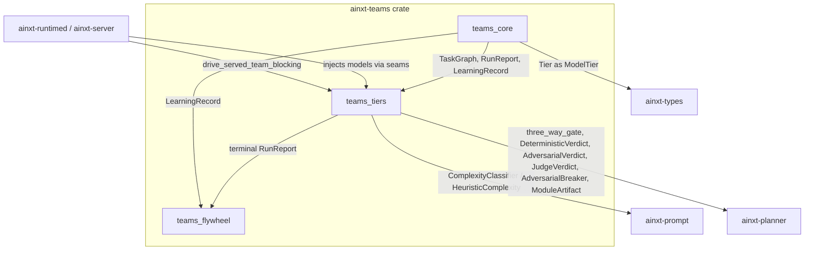
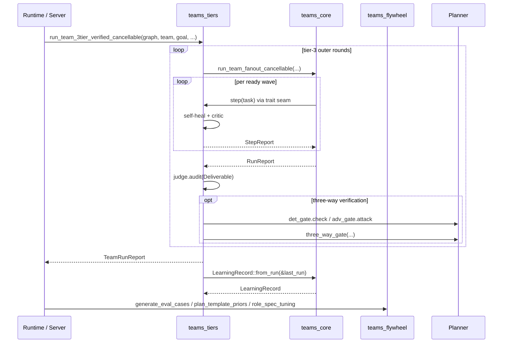

# Teams Module

The `teams` module (`ainxt-teams`) is the pure, deterministic core for hierarchical multi-agent team orchestration within the Ainxt system. It implements the scheduling, verification, and learning-flywheel primitives described in `LOOP_AND_AGENT_TEAMS.md` and `LONG_HORIZON_PROGRAMS.md` (ADR-027).

## Purpose

`ainxt-teams` provides a testable, I/O-free foundation for long-horizon program execution by agent teams. It deliberately contains no model calls, no threads, and no I/O; every LLM interaction is injected through trait seams. This purity makes the scheduler's guarantees unit-testable: the same task graph with the same step behavior always produces the same `RunReport`.

The module closes several architectural gaps:

- **Bulkhead failure isolation** — a failed or refused task blocks only its transitive dependents; independent branches continue running.
- **Cost roll-up and enforcement** — sub-agent call-tree costs aggregate into a single Run total, and a hard budget ceiling can stop admission of new work.
- **Structured handoffs** — roles never exchange free text; missing required inputs cause an explicit `HandoffRefused` rather than silent ambiguity.
- **Three-tier verification** — per-step critic, bounded self-heal, and fresh-context judge audit combine to decide when a deliverable is proven done.
- **Learning flywheel** — terminal Runs emit `LearningRecord`s that are distilled into regression eval cases, plan-template priors, and role-spec tuning recommendations.

## Architecture Overview

The crate is organized into three sub-modules:

1. **[teams_core](teams_core.md)** — identifiers, roles, teams, task graphs, handoff contracts, cost accounting, the shared scheduler engine (`run_team*` family), and the terminal `LearningRecord`.
2. **[teams_tiers](teams_tiers.md)** — the 3-tier team loop (`run_team_3tier*` family): tier-1 executor seam, tier-2 per-step critic, bounded self-heal, tier-3 fresh-context judge, and the optional three-proof verification gate.
3. **[teams_flywheel](teams_flywheel.md)** — downstream consumers of `LearningRecord`s: eval-case generation, plan-template priors, and role-spec tuning recommendations.

## Data Flow

## Key Design Principles

- **Pure core** — no I/O, no RNG, no clock. All non-determinism lives in injected trait implementations (`TaskExecutor`, `StepCritic`, `SelfHealer`, `GoalJudge`, etc.).
- **Deterministic scheduling** — `TaskGraph::topological_order` and `TaskGraph::ready_wave` use Kahn's algorithm with task-id tie-breaking, yielding reproducible admission order.
- **Fan-out admission** — `run_team_fanout*` exposes a real `fan_out_ceiling` so independent tasks can be admitted into the same wave; the default one-task-at-a-time behavior is recovered with ceiling `1`.
- **Hard boundaries** — depth cap, budget ceiling, cancellation, and handoff refusal are enforced at the kernel boundary rather than left as role conventions.
- **Anti-sycophancy** — the tier-3 judge audits only the goal, acceptance criteria, and produced outputs, never the executor's own narrative. In the verified variant, the judge's confirmation is further backed by deterministic and adversarial proofs.

## Module Boundaries and Dependencies

| Dependency | Usage |
|------------|-------|
| ainxt-types | Re-exports `Tier` as `ModelTier` for role routing. |
| ainxt-prompt | Uses `ComplexityClassifier` / `HeuristicComplexity` to adapt task model tier from the task description. |
| ainxt-planner | Reuses `three_way_gate`, `DeterministicVerdict`, `AdversarialVerdict`, `JudgeVerdict`, `AdversarialBreaker`, and `ModuleArtifact` for the LOOP §7 three-proof verification gate. |
| ainxt-runtimed / ainxt-server | Production composition roots inject live model-backed implementations of the trait seams and call `run_team_3tier_verified_cancellable` on the served `/v1/chat` team path. |

## Sub-module Documentation

- [teams_core — scheduling, task graphs, roles, and cost accounting](teams_core.md)
- [teams_tiers — 3-tier loop, self-heal, critics, and judges](teams_tiers.md)
- [teams_flywheel — learning records, eval cases, priors, and role tuning](teams_flywheel.md)

All three sub-module files are saved alongside this document in the same flat documentation folder.

