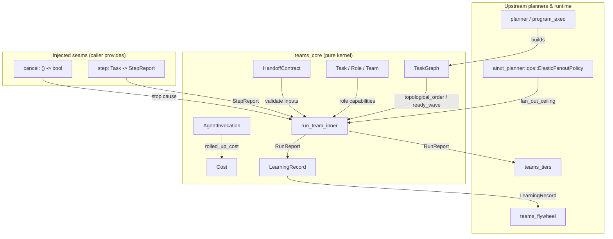
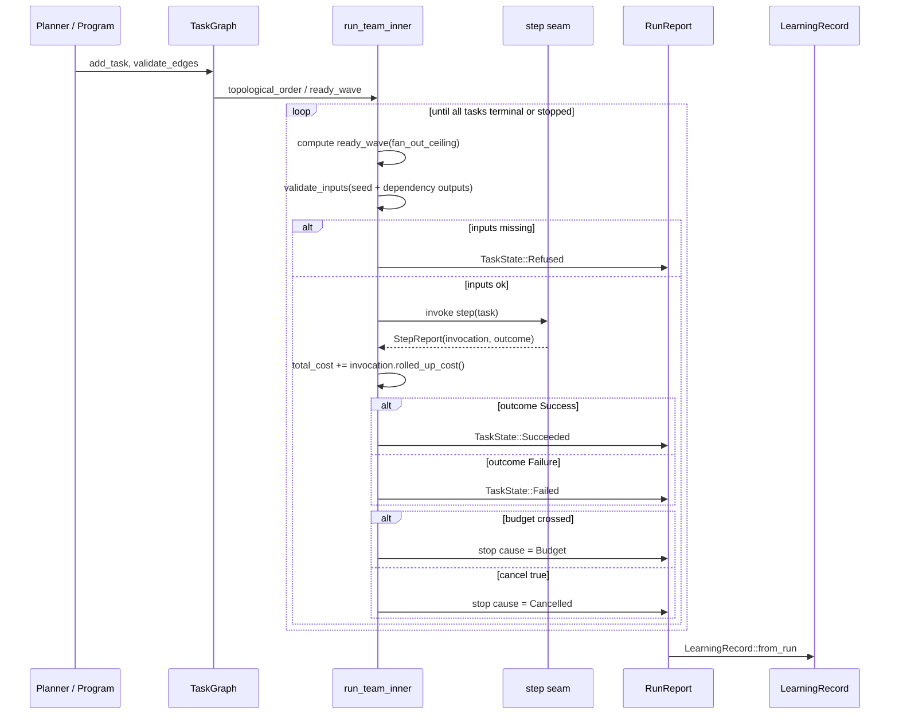
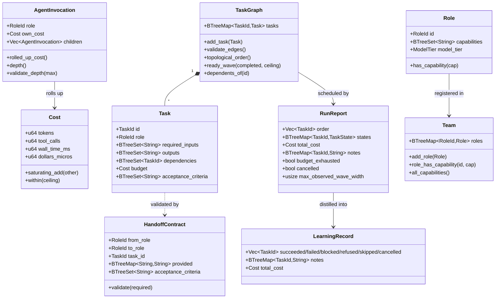
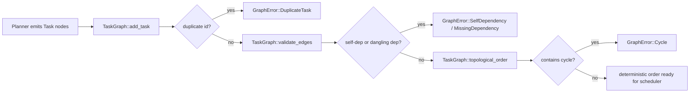
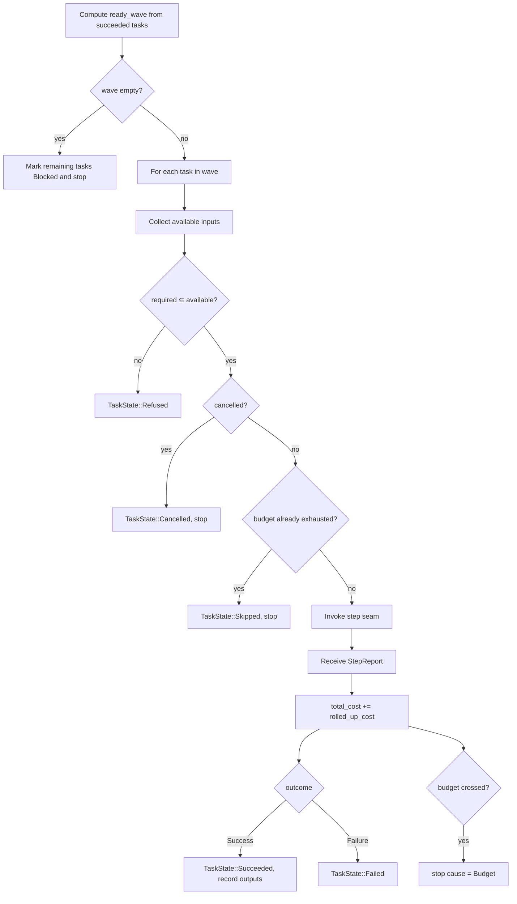
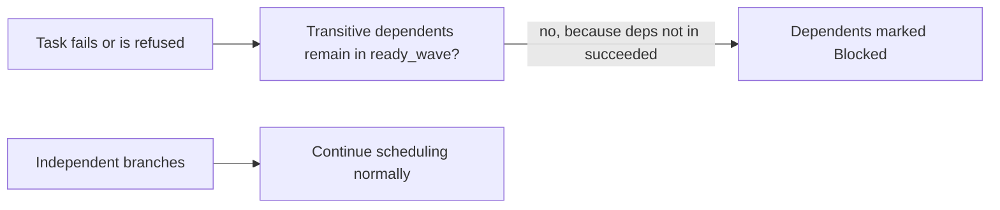

# teams_core

The `teams_core` module is the pure, deterministic kernel of the runtime's multi-agent team orchestration. It lives in `crates/ainxt-teams/src/lib.rs` and owns the invariants that make long-horizon agent programs safe to schedule, test, and audit: task-graph validation, deterministic topological scheduling, structured role-to-role handoffs, sub-agent cost roll-up, hierarchy depth caps, hard budget ceilings, cancellation propagation, and failure bulkheads. The crate deliberately performs no I/O, spawns no threads, and calls no model; every LLM interaction is injected through the `step` closure. This purity makes every guarantee a unit-testable property rather than an operational hope.

---

## Architecture

`teams_core` sits at the bottom of the `teams` module hierarchy. It defines the data structures and scheduling primitives that `teams_tiers` (three-tier critic/judge loops) and `teams_flywheel` (post-run learning and role tuning) build on. The live runtime in `pipeline_runtime` (`ainxt-runtimed/src/program_exec.rs`) calls into tiered and fan-out wrappers rather than into the raw scheduler directly, but those wrappers share the same `run_team_inner` engine byte-for-byte.

---

## Core Components

### Identifiers

- **`RoleId`** — Stable string identity of a role within a team (e.g. `"architect"`).
- **`TaskId`** — Stable string identity of a task across replans.

Both are transparent newtypes with `From<&str>`, `From<String>`, `Display`, and total ordering so that deterministic tie-breaking is built in.

### Cost

- **`Cost`** — Exact, integer resource accounting: `tokens`, `tool_calls`, `wall_time_ms`, and `dollars_micros` (1 USD = 1,000,000 micro-dollars). Uses saturating arithmetic so aggregates can never wrap silently. Provides `within(ceiling)` for budget-gate checks.

### AgentInvocation

- **`AgentInvocation`** — One node in the sub-agent call tree. Carries `role`, `own_cost`, and `children`.
  - `rolled_up_cost()` sums the invocation and every descendant using saturating addition.
  - `depth()` measures the deepest chain.
  - `validate_depth(max)` enforces the hard hierarchy depth cap (default [`DEFAULT_MAX_DEPTH`] = 3).

This closes the budget-escape loophole where spawning many sub-agents would bypass a per-role ceiling: the Run budget is checked against the rolled-up tree total, not a per-role slice.

### Role & Team

- **`Role`** — A team identity with a `RoleId`, a `BTreeSet<String>` of capabilities, and a `ModelTier` (re-exported from `ainxt-types`).
- **`Team`** — Registry of roles. Provides least-privilege lookups and `all_capabilities()`, the team-wide authority envelope that per-task OBO delegations narrow from.

See [security_config_identity.md](../core_infrastructure/security_config_identity.md) for the `Principal` and identity primitives that roles ultimately resolve against.

### HandoffContract

- **`HandoffContract`** — Structured handoff between two roles. Never free text. Fields include:
  - `from_role`, `to_role`, `task_id`
  - `provided`: input name → artifact reference
  - `confidence`: producer self-estimate
  - `open_questions`: ambiguities the receiver must resolve explicitly
  - `cost_used`: running cost carried through the handoff
  - `acceptance_criteria`: definition of "done" inherited by the receiver

`validate(required)` returns `HandoffRefused` if any required input is missing. `missing_acceptance_criteria(required)` flags undefined acceptance criteria before work proceeds.

### Task & TaskGraph

- **`Task`** — One node in the agent-authored plan. Fields include `id`, `role`, `description`, `required_inputs`, `outputs`, `dependencies`, `budget`, and `acceptance_criteria`.
- **`TaskGraph`** — A dependency-ordered set of tasks.
  - `add_task` rejects duplicate ids.
  - `validate_edges` rejects self-dependencies and dangling dependencies.
  - `topological_order()` runs deterministic Kahn sorting (ties broken by `TaskId` order) and returns `GraphError::Cycle` if the graph is not a DAG.
  - `ready_wave(completed, fan_out_ceiling)` returns the next admissible batch of independent tasks.
  - `dependents_of(id)` supports bulkhead cascade analysis.

### Scheduler

The scheduler is implemented in `run_team_inner` and exposed through several convenience wrappers:

- `run_team` — sequential, one task per wave.
- `run_team_fanout` — admits a wave of independent tasks up to `fan_out_ceiling`.
- `run_team_budgeted` — hard Run budget ceiling.
- `run_team_cancellable` — cancellation seam.
- `run_team_fanout_budgeted`, `run_team_fanout_cancellable` — combinations.

Guarantees:

- **Handoff validity**: a task is refused if its required inputs are not provided by `seed_inputs` or succeeded-dependency outputs.
- **Failure isolation (bulkhead)**: a Failed or Refused task blocks only its transitive dependents; independent branches continue.
- **Cost roll-up**: `RunReport.total_cost` is the saturating sum of `rolled_up_cost()` over every executed task.
- **Hard budget ceiling**: once the rolled-up cost crosses `ceiling`, the crossing task completes and every remaining task is `Skipped`.
- **Cancellation propagation**: one shared `cancel` signal stops the whole team; tasks reached after cancel are `Cancelled` and never invoke `step`.

### RunReport & LearningRecord

- **`RunReport`** — Terminal result of a Run: topological `order`, per-task `states`, `total_cost`, human-readable `notes`, `budget_exhausted`, `cancelled`, and `max_observed_wave_width` telemetry.
- **`LearningRecord`** — Pure projection of a `RunReport` into the structured summary consumed by the improvement flywheel. Categorizes tasks by terminal state and preserves failure notes.

---

## Data Flow

---

## Component Interactions

---

## Process Flows

### Building and validating a task graph

### Running one wave

### Failure bulkhead

---

## Module Relationships

- **`teams_core`** is the pure foundation. It defines `TaskGraph`, `Role`, `HandoffContract`, `AgentInvocation`, `Cost`, and the scheduler.
- **`teams_tiers`** wraps the scheduler in a three-tier verification loop (executor, critic, judge) and adds `ThreeTierConfig` with `max_attempts_per_task`, `stuck_repeat_cap`, `max_judge_rounds`, and `fan_out_ceiling`. See [teams_tiers.md](teams_tiers.md).
- **`teams_flywheel`** consumes `LearningRecord` and produces `TaskPrior` and `RoleTuning` recommendations for the improvement engine. See [teams_flywheel.md](teams_flywheel.md).
- **`pipeline_runtime`** (`ainxt-runtimed/src/program_exec.rs`) drives served team runs using the fan-out/cancellable wrappers. See [pipeline_runtime.md](../pipeline_runtime/pipeline_runtime.md).
- **`ai_engine`** planners such as `ainxt-planner::qos::ElasticFanoutPolicy` compute the `fan_out_ceiling` fed into `run_team_fanout`. See [ai_engine.md](../ai_engine/ai_engine.md).
- **`core_infrastructure`** provides `ModelTier` (from `ainxt-types`) and the identity, security, and runtime config layers that roles and capabilities resolve against. See [core_infrastructure.md](../core_infrastructure/core_infrastructure.md).

---

## Key Design Decisions

1. **Pure core, injected seams** — No I/O, threads, or LLM calls inside `teams_core`. The `step` closure and `cancel` predicate are caller-provided seams.
2. **Deterministic scheduling** — Kahn topological sort and `ready_wave` both use `BTreeSet`/`BTreeMap` ordering, so the same graph always yields the same schedule.
3. **Structured handoffs** — Roles never exchange free text. Missing required inputs or acceptance criteria produce explicit `HandoffRefused` errors.
4. **Tree cost roll-up** — `AgentInvocation::rolled_up_cost` aggregates the entire sub-agent tree, closing the multi-sub-agent budget-escape loophole.
5. **Hard depth cap** — `AgentInvocation::validate_depth` rejects runaway agent-spawns-agent recursion at the kernel boundary.
6. **Bulkhead failure isolation** — Only transitive dependents of a failed/refused task are blocked; independent branches continue.
7. **Budget and cancellation as first-class stop causes** — Crossed ceilings and cancellation signals are recorded in `RunReport` and propagated to `LearningRecord`.

---

## References

- [teams_tiers.md](teams_tiers.md) — Three-tier critic/judge execution wrappers.
- [teams_flywheel.md](teams_flywheel.md) — Post-run learning and role tuning.
- [pipeline_runtime.md](../pipeline_runtime/pipeline_runtime.md) — Live runtime that drives served team runs.
- [ai_engine.md](../ai_engine/ai_engine.md) — Planners and fan-out policy.
- [core_infrastructure.md](../core_infrastructure/core_infrastructure.md) — Identity, security, and runtime configuration primitives.
- [security_config_identity.md](../core_infrastructure/security_config_identity.md) — `Principal` and identity types underlying role authorization.
