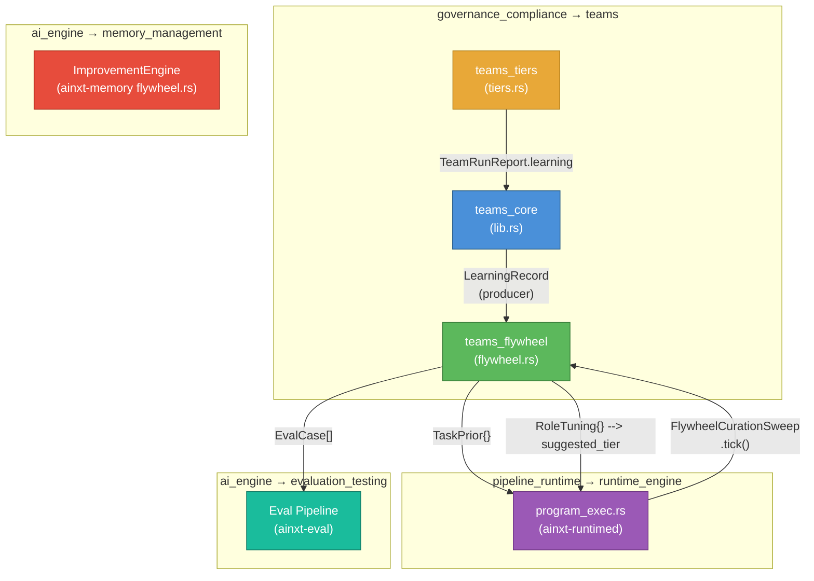
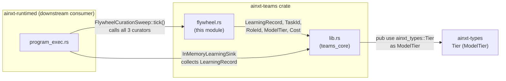
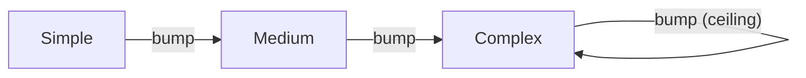
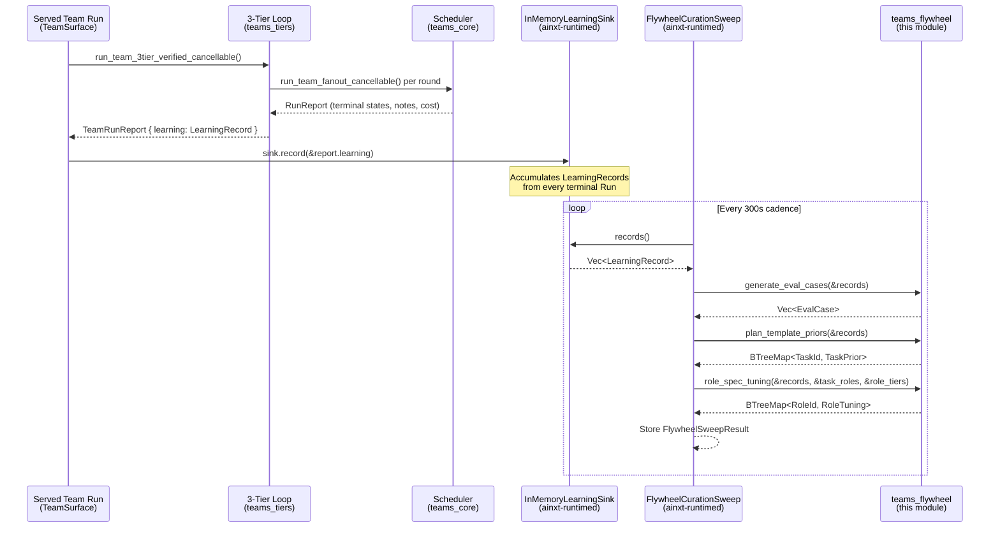
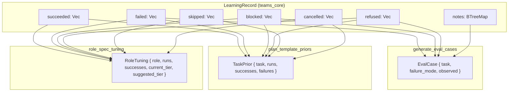
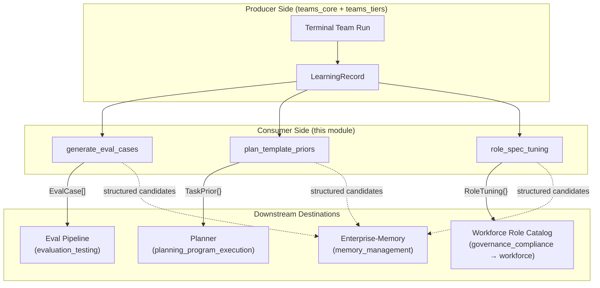
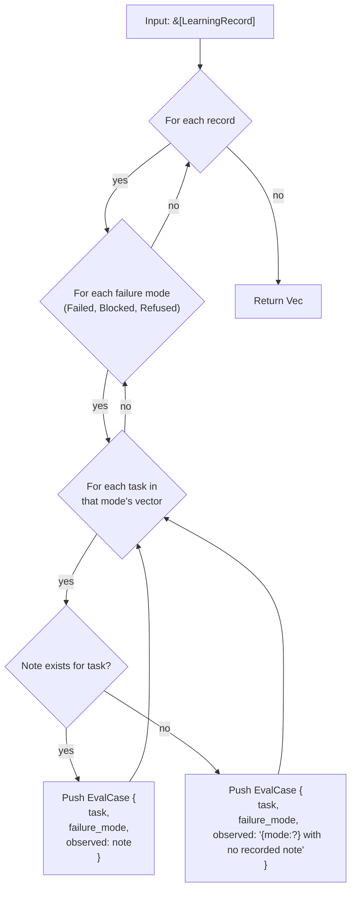
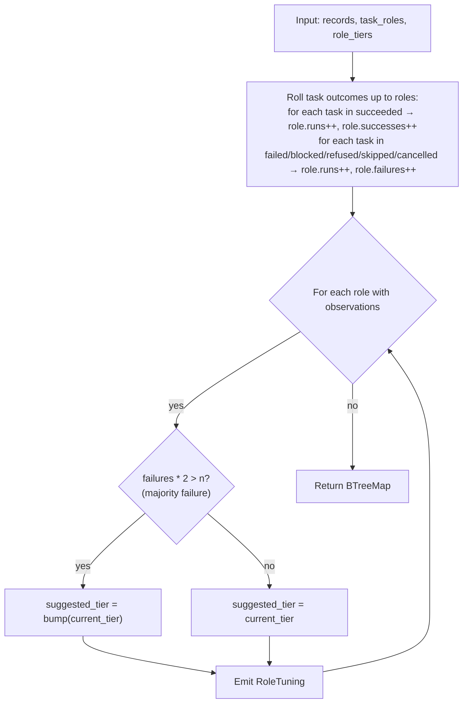

# teams_flywheel

## Brief Introduction

The `teams_flywheel` module (`crates/ainxt-teams/src/flywheel.rs`) is the **consumer side** of the hierarchical agent-team learning flywheel (LOOP §10 / ADR-027 §13). While the producer side — [`LearningRecord`](teams_core.md) — is emitted on every terminal team Run to capture what succeeded, what failed and *why*, this module reads batches of those accumulated records and distils them into three structured improvement artifacts:

1. **Eval-set generation** — every failed/blocked/refused task becomes a regression eval case so the *same* failure is caught automatically next time.
2. **Plan-template priors** — per-task success/failure counts yield a failure-rate prior that biases future task decomposition.
3. **Role-spec tuning** — per-role success rates yield a suggested model-tier bump for roles whose Runs fail too often.

The module is **pure and deterministic** — no clock, RNG, or I/O — so every curation rule is a unit-test property. The gating and curation of *which* signal to act on lives downstream in Enterprise-Memory; this crate produces the structured candidates it curates.

---

## Architecture

### Module Position

`teams_flywheel` is a submodule of the `teams` crate, which itself sits under the `governance_compliance` top-level domain. It has two sibling submodules:

| Sibling | File | Responsibility |
|---|---|---|
| [`teams_core`](teams_core.md) | `lib.rs` | Pure scheduler core: `Role`, `TaskGraph`, `HandoffContract`, `run_team`, `LearningRecord` (the flywheel's **producer**) |
| [`teams_tiers`](teams_tiers.md) | `tiers.rs` | 3-tier intelligence loop: tier-1 executor, tier-2 critic, tier-3 judge, self-heal, three-way verification gate |
| **`teams_flywheel`** (this module) | `flywheel.rs` | Downstream **consumer** curators that turn accumulated `LearningRecord`s into improvement signal |

### High-Level Architecture Diagram



### Dependency Graph



---

## Core Components

### EvalCase — Regression Eval-Set Generation

```rust
pub struct EvalCase {
    pub task: TaskId,
    pub failure_mode: FailureMode,
    pub observed: String,
}

pub enum FailureMode {
    Failed,    // task executed and failed (highest-value eval)
    Blocked,   // task blocked by upstream failure (dependency eval)
    Refused,   // task refused by policy/compliance/capability (guardrail eval)
}
```

**`generate_eval_cases(records: &[LearningRecord]) -> Vec<EvalCase>`**

Distils regression eval cases from a batch of terminal `LearningRecord`s. Every task in a `Failed`, `Blocked`, or `Refused` terminal state becomes a case, tagged with its failure mode and the verbatim note from the run (never swallowed). A run where everything succeeded contributes no cases.

**Deterministic order**: records in input order, then tasks in the record's stored order.

| Property | Guarantee |
|---|---|
| Completeness | Every non-succeeded task across all records becomes a case |
| Fidelity | The verbatim run note is carried — the eval case names *why* it failed |
| No false positives | A fully-succeeded run contributes zero cases |

### TaskPrior — Plan-Template Priors

```rust
pub struct TaskPrior {
    pub task: TaskId,
    pub runs: u32,
    pub successes: u32,
    pub failures: u32,
}

impl TaskPrior {
    pub fn failure_rate_bps(&self) -> u32  // 0..=10000, integer (no float)
    pub fn is_risky(&self) -> bool          // failure_rate_bps() > 5000
}
```

**`plan_template_priors(records: &[LearningRecord]) -> BTreeMap<TaskId, TaskPrior>`**

Aggregates per-task success/failure priors across a batch of `LearningRecord`s. A task counts one observation per record it appears in — as a success iff it is in that record's `succeeded` set, as a failure otherwise (failed / blocked / refused / skipped / cancelled).

**Design decisions**:
- Failure rate is in **basis points** (integer, 0–10000) so the prior is deterministic — no floating-point ambiguity.
- `is_risky()` flags a majority-failure task (>50% failure rate) for extra scrutiny the next time the planner emits it (a checkpoint, a smaller window).
- Returns a `BTreeMap` keyed by `TaskId` — sorted, deterministic.

### RoleTuning — Role-Spec Tuning

```rust
pub struct RoleTuning {
    pub role: RoleId,
    pub runs: u32,
    pub successes: u32,
    pub current_tier: ModelTier,
    pub suggested_tier: ModelTier,
}

impl RoleTuning {
    pub fn recommends_change(&self) -> bool  // suggested_tier != current_tier
}
```

**`role_spec_tuning(records, task_roles, role_tiers) -> BTreeMap<RoleId, RoleTuning>`**

Tunes role specs from accumulated outcomes. `task_roles` maps each task to the role that ran it; `role_tiers` gives each role's current model tier. A role whose tasks fail in the **majority** of observations earns a one-rung tier-bump recommendation.

**Model tier escalation ladder** (`Simple → Medium → Complex`, `Complex` is the ceiling):



**Key invariants**:
- A role is only bumped when `failures * 2 > n` (strict majority failure).
- The recommendation **never auto-mutates** the role spec — a deployment reviews and applies it.
- Roles with no observations are omitted from the output.
- Unknown roles default to `ModelTier::Medium`.

---

## Data Flow

### The Complete Flywheel Cycle



### LearningRecord → Curator Input Mapping

The `LearningRecord` (produced by [`teams_core`](teams_core.md)) carries six terminal-state vectors. Each curator reads a different projection:



---

## Component Interaction

### How the Curators Relate to the Broader System



### Runtime Composition (ainxt-runtimed)

The `FlywheelCurationSweep` in `ainxt-runtimed`'s `program_exec.rs` is the composition-root entrypoint that wires this module to a live daemon cadence:

| Component | Role |
|---|---|
| `InMemoryLearningSink` | Collects `LearningRecord`s from every terminal team Run via `TeamSurface::with_learning_sink()` |
| `FlywheelCurationSweep` | Calls all three curators (`generate_eval_cases`, `plan_template_priors`, `role_spec_tuning`) on every tick over the sink's full accumulated history |
| `FlywheelSweepResult` | Holds the curated output: `eval_cases`, `template_priors`, `role_tuning`, `records_curated` |
| `spawn_flywheel_sweep()` | Spawns a `tokio::time::interval` loop (default 300s) that calls `tick()` automatically |
| `flywheel_role_maps_from_served_team()` | Derives the static `task_roles` / `role_tiers` maps from the canonical served team topology (`compose_served_team`) — never a hand-duplicated literal |

**Key design property**: A tick re-curates the sink's **full** accumulated history every time (never merely incremental), so a tick is always consistent with the sink's current record set.

---

## Process Flows

### Eval-Set Generation Flow



### Role-Spec Tuning Flow



---

## Design Principles

### 1. Pure and Deterministic

No clock, RNG, or I/O. Every curation rule is a pure function of its inputs, so:
- The same batch of `LearningRecord`s always produces the same output.
- Every rule is a unit-test property that can be asserted on concrete inputs.
- The module can be tested exhaustively without a model, a database, or a network.

### 2. Producer/Consumer Separation

The flywheel is split across two modules:
- **Producer** ([`teams_core`](teams_core.md)): `LearningRecord::from_run()` distils a terminal `RunReport` into a structured summary. Emitted once on every terminal Run.
- **Consumer** (this module): three curators that read batches of records and emit improvement artifacts.

This separation means the producer has zero coupling to *what happens* with the records — it just emits them. The consumer has zero coupling to *how* records are produced — it just reads them.

### 3. Propose, Don't Mutate

`RoleTuning` produces a **suggestion** (`suggested_tier`), never an auto-applied mutation. A deployment reviews the recommendation before applying it to the role spec. This mirrors the broader system's "flywheel proposes, a human legislates" posture (see [`memory_management`](../ai_engine/memory_management.md)'s `ImprovementEngine`).

### 4. Integer Arithmetic Only

Failure rates are in basis points (0–10000), not floats. This keeps the prior deterministic across platforms and avoids floating-point comparison ambiguity in tests.

### 5. Verbatim Notes, Never Swallowed

Every `EvalCase` carries the verbatim run note (the error / refusal / blocker reason). The flywheel's core promise — "turn a production failure into a permanent test" — depends on the eval case naming *why* it failed, not just *that* it failed.

---

## Relationship to the Broader Flywheel

The system has **two flywheel implementations** that operate at different altitudes:

| Aspect | `teams_flywheel` (this module) | `memory_management` ImprovementEngine |
|---|---|---|
| **Altitude** | Team Run level (hierarchical agent teams) | Turn level (individual chat/runtime turns) |
| **Input** | `LearningRecord` (task-level terminal states) | `FeedbackEvent` (thumbs, corrections, edits, trajectories) |
| **Outputs** | Eval cases, task priors, role tuning | Prompt/retrieval/eval/OKI/fine-tune candidates |
| **Curation** | Pure deterministic curators | Rule + LLM-judge triage with human-review flags |
| **Gating** | Downstream in Enterprise-Memory | Per-destination independent gates (`DestinationGates`) |
| **Cadence** | `FlywheelCurationSweep` (300s interval) | On-demand `propose()` + `dispatch_gated()` |

Both share the same design philosophy: **the flywheel proposes, a human legislates**. Neither auto-mutates production state; both produce structured candidates that downstream gates review before acting.

---

## Key Types Reference

| Type | Module | Role |
|---|---|---|
| [`LearningRecord`](teams_core.md) | `teams_core` | Producer: terminal-Run structured summary |
| [`TaskId`](teams_core.md) | `teams_core` | Stable task identity (newtype over `String`) |
| [`RoleId`](teams_core.md) | `teams_core` | Stable role identity (newtype over `String`) |
| [`ModelTier`](teams_core.md) | `teams_core` (re-exported from `ainxt-types` as `Tier`) | Complexity tier: `Simple` / `Medium` / `Complex` |
| [`Cost`](teams_core.md) | `teams_core` | Resource cost (tokens, tool_calls, wall_time_ms, dollars_micros) |
| [`RunReport`](teams_core.md) | `teams_core` | Scheduler output: terminal states, notes, aggregate cost |
| [`TeamRunReport`](teams_tiers.md) | `teams_tiers` | 3-tier loop output: outcome, rounds, cost, `learning: LearningRecord` |
| `EvalCase` | **this module** | Consumer: regression eval case from a real failure |
| `TaskPrior` | **this module** | Consumer: per-task failure-rate prior |
| `RoleTuning` | **this module** | Consumer: per-role model-tier bump recommendation |
| `FlywheelCurationSweep` | `ainxt-runtimed` (`program_exec.rs`) | Composition root: cadence-driven curation over the learning sink |
| `InMemoryLearningSink` | `ainxt-runtimed` (`program_exec.rs`) | Collects `LearningRecord`s from terminal team Runs |

---

## Test Coverage

The module's tests (inline in `flywheel.rs`) prove four key properties:

1. **Eval cases are generated from failures with notes** — a failed task with a verbatim note becomes an `EvalCase` carrying that note.
2. **Eval cases are empty when everything succeeded** — a fully-succeeded run contributes zero cases.
3. **Plan priors accumulate success and failure rates** — a task that failed twice and succeeded once has `failure_rate_bps() == 6666` and `is_risky() == true`.
4. **Role tuning bumps a majority-failing role** — a coder role that fails 2 of 3 times earns a `Medium → Complex` bump; a reviewer role that succeeds every time is unchanged.

All tests use the same `LearningRecord` builder helper, ensuring the curators are exercised against realistic record shapes (not hand-crafted edge cases).
