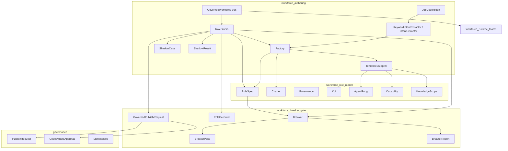
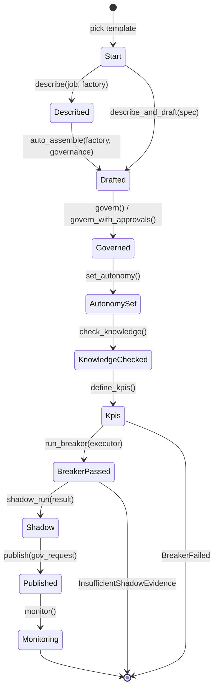
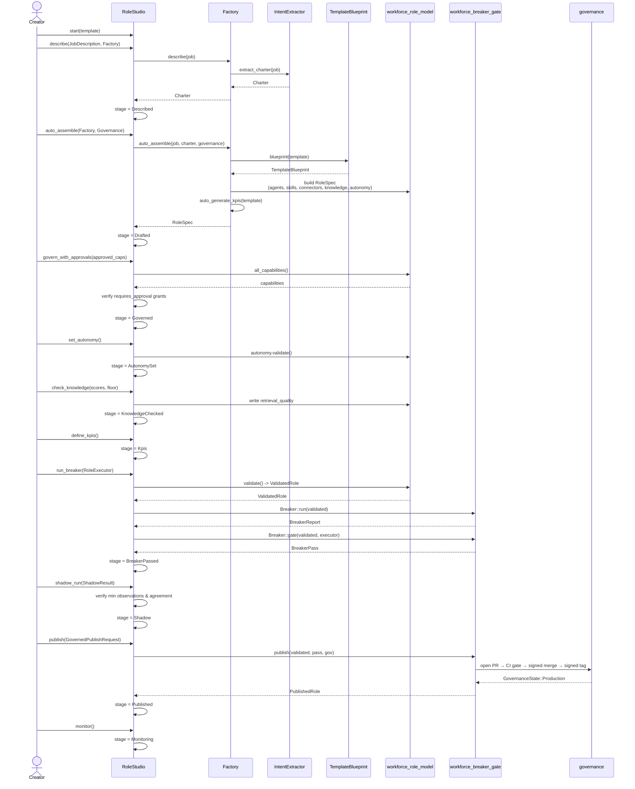
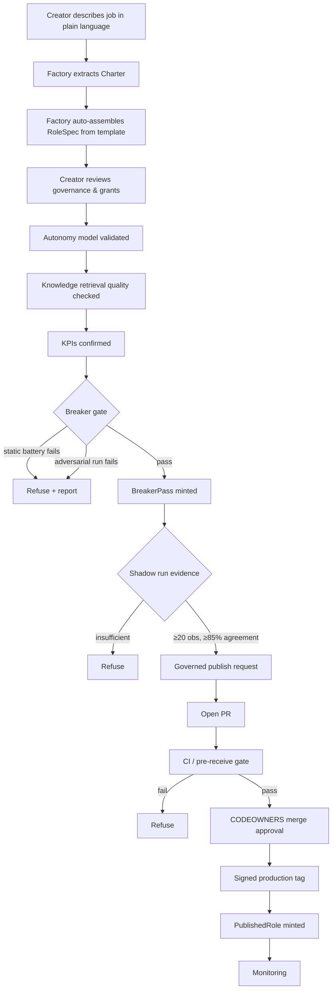
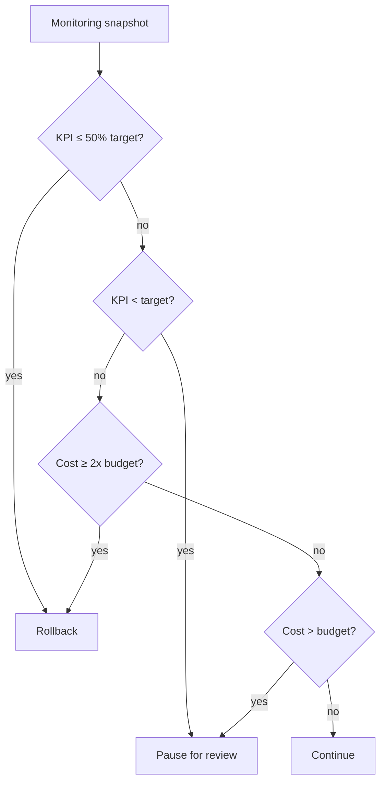
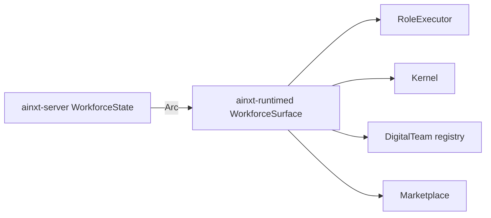

# workforce_authoring

## Brief Introduction

The `workforce_authoring` module is the **conversational factory for creating governed digital workers (roles)**. It transforms a plain-language job description into a fully validated, published, and monitorable `RoleSpec` through a strict, ten-step state machine. The module's core philosophy is **"intelligence, not configuration"**: a human describes a job in prose, and the module auto-assembles a structured role from pre-vetted templates, governance defaults, and quality KPIs. Every role must pass a non-skippable adversarial **Breaker gate**, earn shadow-run evidence, and be published through a git-native governance lifecycle before it can enter production.

This module sits inside the broader [`workforce`](workforce.md) subsystem and is the entry point for the **role lifecycle** defined in AINXT_OS §4. It depends on [`workforce_role_model`](workforce_role_model.md) for the role data model, [`workforce_breaker_gate`](workforce_breaker_gate.md) for adversarial validation, and integrates with [`governance`](governance.md) for signed, CODEOWNERS-approved publication.

---

## Core Responsibilities

1. **Conversational Role Creation** — Convert free-form job descriptions into structured `Charter` objects via the `IntentExtractor` seam.
2. **Template-Based Auto-Assembly** — Expand a chosen `Template` into a draft `RoleSpec` with capabilities, skills, connectors, knowledge scopes, autonomy model, and KPIs.
3. **Governance-Aware Defaults** — Stamp in-house-first provider policies, data-class ceilings, retention, and least-privilege governance blocks.
4. **Deterministic Offline Authoring** — Ship a fully deterministic `KeywordIntentExtractor` so the entire flow is testable without models, clocks, or RNG.
5. **State-Machine Workflow** — Enforce the ten-step Studio flow (`Start` → `Monitoring`) with fail-closed transitions.
6. **Trust-Before-Publish Evidence** — Require a passing Breaker gate and a shadow-run agreement bar before minting a `PublishedRole`.
7. **Cross-Crate Integration Seam** — Expose `GovernedWorkforce` so transport crates (e.g., `ainxt-server`) can drive real publish/team flows without circular dependencies.

---

## Architecture

### High-Level Component Diagram

### State Machine: The Ten-Step Studio Flow

---

## Core Components

### `JobDescription`

A creator's plain-language request to build a digital worker. It carries:

- `id`: the role identifier the published worker will carry.
- `title`: human-facing title (e.g., "L1 Support Engineer").
- `text`: the free-form job description.
- `template`: the pre-vetted golden-path template chosen at Step 0.

This is the **Step 0–1 input** to the authoring pipeline.

### `IntentExtractor` and `KeywordIntentExtractor`

`IntentExtractor` is the **Step-1 seam** that turns free-form prose into a structured `Charter`. The genuinely intelligent implementation is an LLM call (data-plane, infra-gated). The crate ships `KeywordIntentExtractor`, a deterministic default that:

- Splits the description into clauses on sentence/phrase boundaries and conjunctions.
- Classifies each clause by cue words:
  - **Escalation**: "escalate", "hand off", "everything else", "otherwise", "unrecognized".
  - **Inputs**: "from", "read", "ingest", "receive", "input".
  - **Outputs**: "resolve", "answer", "produce", "generate", "draft", "output", "reply".
- Ensures a safe default escalation rule exists if none was stated.

Because it is deterministic, the entire authoring flow is exhaustively testable offline with no model, clock, or RNG.

### `Factory` and `FactoryConfig`

The `Factory` is the deterministic conversational role builder. It is generic over `IntentExtractor` (defaulting to `KeywordIntentExtractor`) and configured with `FactoryConfig`.

Key methods:

- `describe(job)` → `Charter` (Step 1).
- `auto_assemble(job, charter, governance)` → `RoleSpec` (Step 2).
- `auto_generate_kpis(template)` → `Vec<Kpi>` (Step 6).
- `blueprint(template)` → `TemplateBlueprint` (template expansion).
- `default_governance(owner, codeowners_group)` → `Governance` (pre-filled Step-3 block).

`FactoryConfig` carries deployment-level defaults:

- `default_retention_days`: 365 by default.
- `default_providers`: `["in-house", "openai"]` by default.
- `in_house_providers`: `["in-house"]` by default.

The Factory automatically selects **in-house-first providers** when the assembled role touches regulated or PII data classes (gap N).

### `TemplateBlueprint`

The pure-data, pre-vetted golden-path assembly a template expands into. Each blueprint defines:

- `persona`: the role's behavioral persona.
- `capabilities`: required capabilities and their data-class ceilings.
- `skills`: skill references.
- `connectors`: connector references.
- `knowledge_namespaces`: knowledge namespaces with data classes.
- `autonomy`: the default autonomy model and per-task overrides.
- `payment_boundary`: payment boundary classification.
- `model_risk_class`: model risk classification.
- `kpis`: pre-defined quality KPIs.

Supported templates: `Support`, `Developer`, `Tester`, `Ops`, `Analyst`, `Blank`.

### `RoleStudio`

The **conversational factory as a typed state machine**. It enforces the ten-step AINXT_OS §4 flow and prevents out-of-order transitions. Each step method returns `Result<&mut Self, StudioError>` and advances `StudioStage` only on success.

| Step | Method | Stage Transition | Key Gate |
|------|--------|------------------|----------|
| 0 | `start(template)` | `Start` | Template selection |
| 1 | `describe(job, factory)` | `Start` → `Described` | Intent extraction |
| 2 | `auto_assemble(factory, governance)` | `Described` → `Drafted` | Template expansion + KPI seeding |
| 2-alt | `describe_and_draft(spec)` | `Start` → `Drafted` | External spec import |
| 3 | `govern()` / `govern_with_approvals(...)` | `Drafted` → `Governed` | Least-privilege capability approval |
| 4 | `set_autonomy()` | `Governed` → `AutonomySet` | Autonomy model validation |
| 5 | `check_knowledge(scores, floor)` | `AutonomySet` → `KnowledgeChecked` | Retrieval-quality floor |
| 6 | `define_kpis()` | `KnowledgeChecked` → `Kpis` | At least one KPI |
| 7 | `run_breaker(executor)` | `Kpis` → `BreakerPassed` | Static battery + adversarial run |
| 8 | `shadow_run(result)` | `BreakerPassed` → `Shadow` | Min 20 observations, ≥85% human agreement |
| 9 | `publish(gov_request)` | `Shadow` → `Published` | Git-native CODEOWNERS-signed publish |
| 10 | `monitor()` | `Published` → `Monitoring` | Live monitoring transition |

`RoleStudio` also provides `evaluate_monitoring`, the continuous Step-10 decision logic that derives `MonitorDecision::Continue`, `PauseForReview`, or `Rollback` from KPI observations and cost actuals.

### `ShadowCase` and `ShadowResult`

- `ShadowCase`: one real historical decision used for Step-8 shadow observation. Contains `id`, `input`, and the real `human_action` a human on the team took.
- `ShadowResult`: the outcome of a shadow run — `observed` count and `agreed_with_human` count. `agreement()` computes the human-agreement rate.
- `run_shadow_observation(executor, role, cases)` runs the role through the same `RoleExecutor` seam the Breaker uses and compares each model decision to the real human decision.

Constants:

- `MIN_SHADOW_OBSERVATIONS = 20`
- `MIN_SHADOW_AGREEMENT = 0.85`
- `KNOWLEDGE_RETRIEVAL_QUALITY_FLOOR = 0.75`

### `GovernedWorkforce`

A **cross-crate-safe seam** so transport crates (e.g., `ainxt-server`) can drive real governed role publish and team assembly without depending on the composition root that builds the live `RoleExecutor`. This mirrors the adapter pattern used elsewhere in the workspace (e.g., `ainxt-admission::StepExecutor`, `ainxt-client::CapabilityInvoker`).

Methods:

- `publish_role(spec, approved_capabilities, shadow_cases, gov) -> Result<PublishedRole, String>`
- `assemble_team(id, department, owner, role_ids, collaborations) -> Result<DigitalTeam, String>`

The error type is intentionally a plain `String` to avoid sharing rich error enums across crate boundaries.

---

## Data Flow: From Job Description to Published Role

---

## Dependencies

### Internal Workforce Subsystem

- [`workforce_role_model`](workforce_role_model.md): Provides `RoleSpec`, `Charter`, `Governance`, `Kpi`, `AgentRung`, `Capability`, `SkillRef`, `ConnectorRef`, `KnowledgeScope`, `PublishedRole`, and `ValidatedRole`.
- [`workforce_breaker_gate`](workforce_breaker_gate.md): Provides the `Breaker` static battery, adversarial `RoleExecutor` seam, `BreakerPass`, `BreakerReport`, `GovernedPublishRequest`, and the `publish` function.
- [`workforce_lifecycle_controls`](workforce_lifecycle_controls.md): Consumes published roles for recertification, decay monitoring, nightly controls, and oversight metrics (Step 10).
- [`workforce_runtime_teams`](workforce_runtime_teams.md): Consumes `PublishedRole` via `GovernedWorkforce::assemble_team` to build `DigitalTeam` collaborations.

### Governance & Compliance

- [`governance`](governance.md): Provides `PublishRequest`, `CodeownersApproval`, `Marketplace`, and the git-native lifecycle (PR → pre-receive gate → signed merge → signed production tag).
- [`admission`](admission.md): Related harness/runtime admission controls for governed program execution.
- [`compliance`](compliance.md): Related data redaction and sink guards for sensitive role outputs.

### Core Infrastructure

- [`security_config_identity`](../core_infrastructure/security_config_identity.md): Provides `Principal` and identity primitives used in governance and role ownership.
- [`security_config_runtime`](../core_infrastructure/security_config_runtime.md): Provides `LimitsConfig`, `RuntimeConfig`, and `ModelsConfig` that inform model policy selection.
- [`core_interaction`](../core_infrastructure/core_interaction.md): Provides session, protocol, and telemetry primitives used by runtime surfaces that execute published roles.

### AI Engine

- [`knowledge_retrieval`](../ai_engine/knowledge_retrieval.md): Provides retrieval and context primitives used in Step 5 knowledge-quality checks.
- [`quality_verification`](../ai_engine/quality_verification.md): Provides judge and quality primitives that inform KPIs and Breaker probes.
- [`prompt_engineering`](../ai_engine/prompt_engineering.md): Provides prompt assembly and constrained decoding used by the live `RoleExecutor` implementations.

---

## Process Flows

### Publishing a Role (End-to-End)

### Monitoring a Published Role

---

## Integration with Runtime Surfaces

The `GovernedWorkforce` trait is implemented by the composition root's [`runtime_engine`](../pipeline_runtime/runtime_engine.md) surface (e.g., `WorkforceSurface` in `ainxt-runtimed`). This allows the HTTP server ([`server_serving_core`](../pipeline_runtime/server_serving_core.md)) to expose workforce endpoints without circular crate dependencies.

The server accepts `WorkforcePublishRequest` and `WorkforceShadowCaseInput` DTOs, delegates to the `GovernedWorkforce` surface, and returns the minted `PublishedRole` or a fail-closed refusal.

---

## Fail-Closed Design Guarantees

1. **No publish without Breaker pass**: `RoleStudio::publish` requires `BreakerPassed` → `Shadow` → `Published`. The `BreakerPass` is unforgeable (private `_seal` field).
2. **No shadow without evidence**: `MIN_SHADOW_OBSERVATIONS` and `MIN_SHADOW_AGREEMENT` are hard constants; callers cannot lower them.
3. **No knowledge gap bypass**: `KNOWLEDGE_RETRIEVAL_QUALITY_FLOOR` is fixed at `0.75`; unmeasured namespaces default to `0.0`.
4. **No silent sensitive grants**: `govern_with_approvals` refuses to advance until every `requires_approval` capability is explicitly listed.
5. **In-house-first for regulated data**: The Factory selects only in-house providers when the role touches `DataClass::RegulatedPayment` or `DataClass::Pii`.
6. **Git-native publication**: Publishing emits a PR, runs a CI/pre-receive gate, requires CODEOWNERS approval, and mints only at a signed production tag — never a direct DB write.

---

## Testing & Offline Authoring

The module is designed for deterministic, model-free testing:

- `KeywordIntentExtractor` has no RNG or external calls.
- `Factory` with `KeywordIntentExtractor` produces the same `RoleSpec` for the same `JobDescription`.
- `CompliantExecutor` and `ScriptedExecutor` in [`workforce_breaker_gate`](workforce_breaker_gate.md) provide offline `RoleExecutor` implementations.
- `RoleStudio` can be driven through all ten stages in unit tests without a live model or network.

---

## See Also

- [`workforce`](workforce.md) — parent module overview
- [`workforce_role_model`](workforce_role_model.md) — role data model
- [`workforce_breaker_gate`](workforce_breaker_gate.md) — adversarial validation and publish gate
- [`workforce_lifecycle_controls`](workforce_lifecycle_controls.md) — recertification, decay, and monitoring
- [`workforce_runtime_teams`](workforce_runtime_teams.md) — team assembly and runtime execution
- [`governance`](governance.md) — git-native publication lifecycle
- [`runtime_engine`](../pipeline_runtime/runtime_engine.md) — composition-root runtime surface
- [`server_serving_core`](../pipeline_runtime/server_serving_core.md) — HTTP API surface
