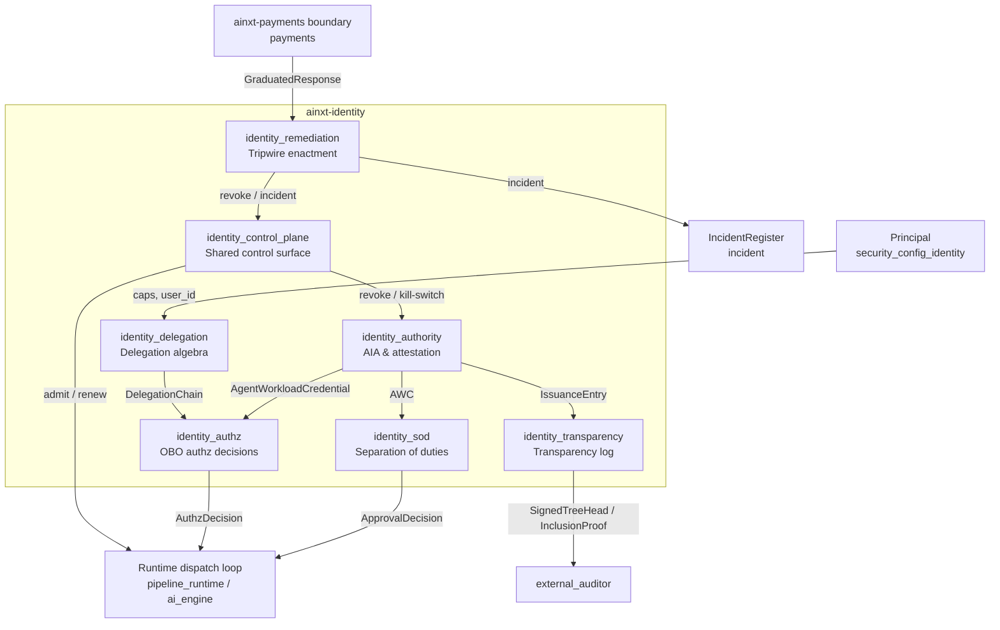
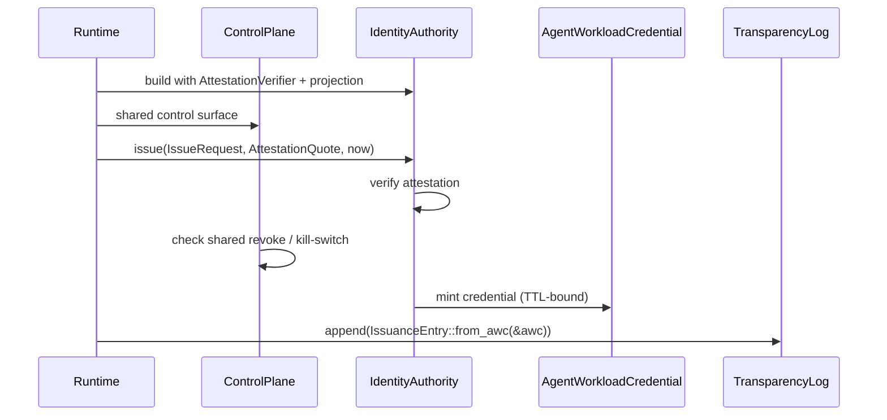
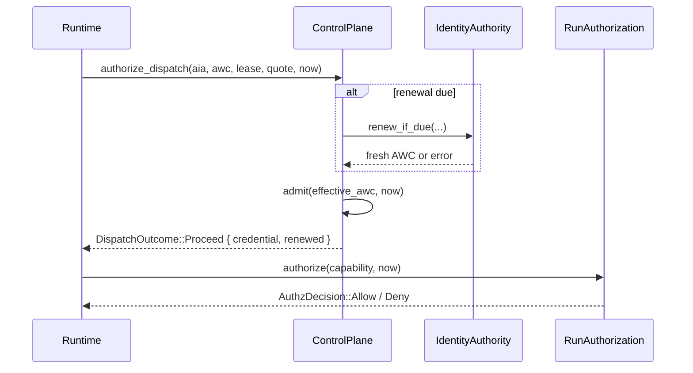

# Identity Module

The **identity** module (`ainxt-identity`) is the trust anchor for the non-human workforce. It implements the pure, deterministic core of agent workload identity, on-behalf-of (OBO) delegation, short-TTL credential issuance, runtime admission control, separation-of-duties enforcement, and cryptographic transparency logging. Every agent action in the system is attributed to a verifiable, per-Run identity acting under a narrowing chain of human-granted authority.

## Purpose

The module guarantees that:

1. **Agents act as their human delegators**, never with authority that exceeds what the human holds.
2. **Identity is per-Run and short-lived** — there are no standing service-account tokens; each Run receives a distinct, time-bound credential.
3. **Credentials are issued only after attestation** — the workload must prove it is running approved, unmodified code.
4. **Control actions are immediate and total** — revocation, kill-switch, and anomaly flags reach both in-flight dispatches and future renewals through a shared control plane.
5. **Critical operations require separation of duties** — a Run cannot approve its own output, and handoffs are cryptographically signed.
6. **Issuance is externally auditable** — a Merkle transparency log produces inclusion proofs that third parties can verify without trusting the runtime.

## Architecture Overview

The module is organized into seven sub-modules, each documented separately. The file names below are the final generated documentation names:

| Sub-module | Responsibility | Core File |
|------------|----------------|-----------|
| [identity_delegation](identity_delegation.md) | Pure OBO delegation algebra: actors, capabilities, delegation chains, narrowing, verification | `src/lib.rs` |
| [identity_authority](identity_authority.md) | Agent Identity Authority: per-Run AWC issuance, attestation, revocation, kill-switch, anomaly monitor | `src/authority.rs` |
| [identity_control_plane](identity_control_plane.md) | Shared live control surface: in-flight admission, short-TTL renewal lease, `authorize_dispatch` | `src/control.rs` |
| [identity_authz](identity_authz.md) | Bridge from delegation algebra to per-action allow/deny decisions | `src/authz.rs` |
| [identity_sod](identity_sod.md) | Producer≠approver separation of duties and signed handoffs | `src/sod.rs` |
| [identity_transparency](identity_transparency.md) | Append-only Merkle issuance log with external inclusion proofs and signed tree heads | `src/transparency.rs` |
| [identity_remediation](identity_remediation.md) | Enact payment-boundary tripwire responses against real identity/incident organs | `src/remediation.rs` |

## Core Design Principles

### Per-Run, Not Shared

Every execution instance receives a unique `run_id`. Two Runs of the same role are distinct identities, so revoking one has zero collateral on siblings. This is enforced structurally by [`AgentId`](identity_delegation.md#agentid) and [`AgentWorkloadCredential`](identity_authority.md#agentworkloadcredential).

### Attestation-Before-Issuance

The [`IdentityAuthority`](identity_authority.md#identityauthority) refuses to mint a credential unless the workload presents an [`AttestationQuote`](identity_authority.md#attestationquote) that verifies against a reference-value allow-list. TEE Runs must additionally present a trusted TEE quote on every renewal.

### Conditional Continuation

Long-lived Runs are not granted long-lived tokens. They renew short-TTL credentials repeatedly, and every renewal re-runs attestation, definition validity, revocation, kill-switch, and anomaly checks. A denied renewal causes the Run to drain within one TTL.

### Fail-Closed Everywhere

Every gate returns a named error rather than a bare boolean. Stale control-plane projections, missing attestations, revoked identities, active kill-switch scopes, and anomaly flags all deny by default.

### Pure and Deterministic

The crate contains no clock, no RNG, and no I/O. Logical time, `run_id`, `key_id`, attestation evidence, and reference values are supplied by callers, making every decision reproducible and unit-testable.

## Data Flow

### Issuing a Run's First Credential

### Authorizing Every Dispatch

## Integration with the Rest of the System

- **[security_config_identity](security_config_identity.md)** supplies the [`Principal`](security_config_identity.md) that roots every OBO delegation chain.
- **[payments](payments.md)** emits [`GraduatedResponse`](payments.md) directives that [`ControlPlaneRemediator`](identity_remediation.md#controlplaneremediator) enacts as real revocations, quarantines, and incidents.
- **[incident](incident.md)** receives the security incidents raised by the remediator so they participate in the statutory breach clock.
- **[pipeline_runtime](pipeline_runtime.md)** and **[ai_engine](ai_engine.md)** surfaces consult [`ControlPlane::authorize_dispatch`](identity_control_plane.md#controlpane) and [`RunAuthorization::authorize`](identity_authz.md#runauthorization) before every capability-bearing action.
- **[core_infrastructure](core_infrastructure.md)** crates such as `ainxt-eventlog` consume the [`ActorRecord`](identity_authority.md#actorrecord) produced by an AWC to attribute every action to a composite actor of record.

## Key Invariants

| Invariant | Where Enforced |
|-----------|----------------|
| Authority only narrows down a delegation chain | [`DelegationChain::verify`](identity_delegation.md#delegationchain) |
| Payment-initiation capabilities are not grantable | [`Capability::is_reserved_payment_initiation`](identity_delegation.md#capability) |
| Credentials are per-Run and short-TTL | [`IdentityAuthority::issue`](identity_authority.md#identityauthority) |
| Attestation is required before issuance | [`AttestationVerifier`](identity_authority.md#attestationverifier) |
| Kill-switch authority requires `can_approve` and seniority | [`KillSwitch::pull_authorized`](identity_authority.md#killswitch) |
| In-flight dispatches consult shared deny-state | [`ControlPlane::admit`](identity_control_plane.md#controlpane) |
| A Run cannot approve its own output | [`SodPolicy::evaluate_approval`](identity_sod.md#sodpolicy) |
| Handoff signatures bind producer, receiver, and artifact digest | [`Handoff::signing_material`](identity_sod.md#handoff) |
| Issuance is externally verifiable | [`InclusionProof::verify`](identity_transparency.md#inclusionproof) |

## See Also

- [identity_delegation](identity_delegation.md) — delegation algebra
- [identity_authority](identity_authority.md) — credential issuance and lifecycle
- [identity_control_plane](identity_control_plane.md) — runtime admission and renewal
- [identity_authz](identity_authz.md) — per-action authorization
- [identity_sod](identity_sod.md) — separation of duties
- [identity_transparency](identity_transparency.md) — transparency logging
- [identity_remediation](identity_remediation.md) — tripwire remediation
