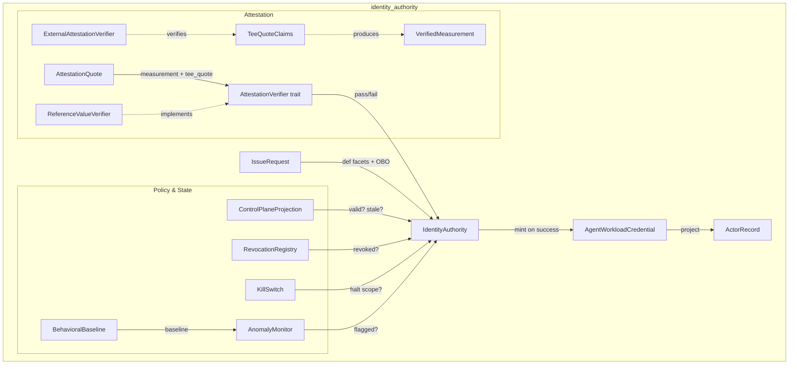
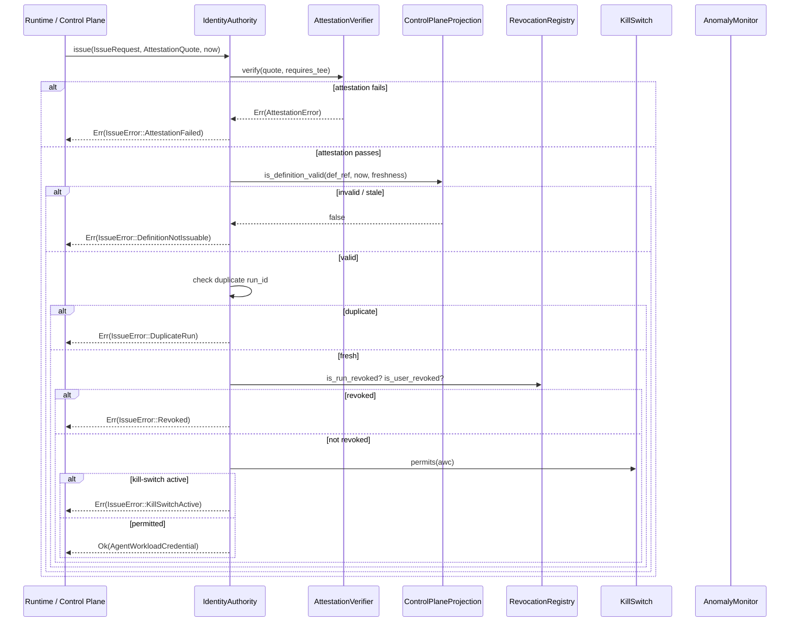
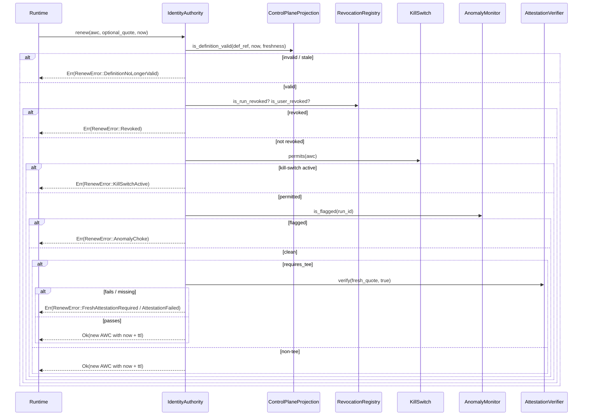
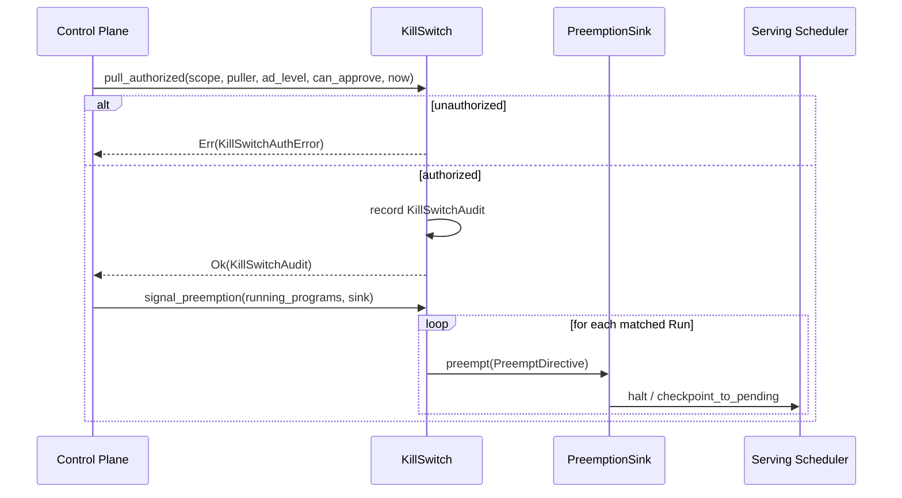
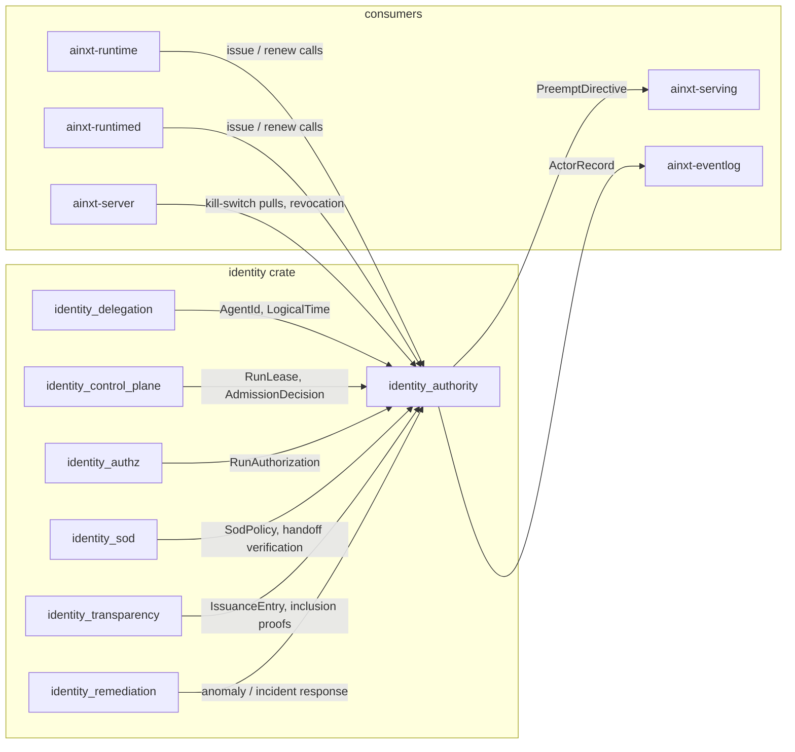

# identity_authority

The **identity_authority** module implements the **Agent Identity Authority (AIA)** — the pure, deterministic core that mints and renews short-TTL, per-Run **Agent Workload Credentials (AWCs)**. It is the trust anchor that turns hardware/software attestation, control-plane policy, revocation state, kill-switch scope, and behavioral anomaly signals into a single fail-closed issuance decision. Every non-human action in the system is ultimately attributable to an AWC, making "who did this" answerable from a single credential rather than a shared service account or long-lived API key.

This module lives inside the larger [`identity`](identity.md) subsystem under [`governance_compliance`](governance_compliance.md). It works closely with [`identity_delegation`](identity_delegation.md) (agent identity primitives and delegation chains), [`identity_control_plane`](identity_control_plane.md) (run leases and admission decisions), [`identity_authz`](identity_authz.md) (run-time authorization), [`identity_sod`](identity_sod.md) (segregation of duties for handoffs), [`identity_transparency`](identity_transparency.md) (cryptographic issuance logs), and [`identity_remediation`](identity_remediation.md) (automated response to anomalies and incidents).

---

## Architecture

The AIA is intentionally **stateful but deterministic**: it owns in-memory policy projections and revocation/kill-switch/anomaly state, yet contains no clock, no RNG, and no I/O. Logical time, run identifiers, key identifiers, and attestation evidence are all supplied by callers, so every decision is reproducible and unit-testable.

---

## Core Components

### `AgentWorkloadCredential`

The composite credential issued to a single Run. It binds three facets:

- **Definition facet**: `def_kind`, `def_id`, `def_version`, `def_content_hash`, `control_commit_sha` — ties the Run to a git-rooted, reviewed, content-addressed role definition.
- **Workload facet**: `run_id`, `issued_at`, `expires_at`, `data_class`, `requires_tee` — the ephemeral Run instance, its short validity window, and its operational context.
- **OBO delegation facet**: `obo_user_id`, `obo_department`, `obo_ad_level`, `obo_can_approve` — the human or principal on whose behalf the Run acts.

It also carries `attestation_ref` and `key_id` for external verification and crypto-agility. Two Runs of the same role receive distinct credentials, so revoking one never collaterally affects another.

### `IdentityAuthority`

The sole issuer and renewer of AWCs. It composes:

- an `AttestationVerifier`
- a `ControlPlaneProjection`
- a `RevocationRegistry`
- a `KillSwitch`
- an `AnomalyMonitor`
- a short TTL and freshness threshold
- a rotatable signing `key_id`

`IdentityAuthority::issue` mints a credential only after all fail-closed checks pass. `IdentityAuthority::renew` re-runs the same checks on every TTL cycle, turning long-lived Programs into a *chain of re-authorized identities* rather than a standing grant.

### `AttestationQuote` and `AttestationVerifier`

`AttestationQuote` is the evidence a workload presents: a code/image `measurement`, the definition hash it loaded, the control-plane commit SHA, and an optional TEE `tee_quote`. The `AttestationVerifier` trait is the seam for real hardware remote attestation; `ReferenceValueVerifier` is the deterministic, allow-list-based implementation used in tests and offline verification.

### `TeeQuoteClaims`, `ExternalAttestationVerifier`, `VerifiedMeasurement`

For confidential-computing Runs, `TeeQuoteClaims` binds measurement, definition hash, freshness nonce, and attestation root. `ExternalAttestationVerifier` performs the pure, auditor-side reference-value + binding + freshness check, producing a `VerifiedMeasurement` that can be trusted without relying on the runtime's word.

### `ControlPlaneProjection`

An in-memory projection of which definitions are currently valid in the git control plane. It is content-addressed to a `commit_sha` and carries a `synced_at` tick. If the projection's lag exceeds the configured freshness threshold, it **fails closed** and treats every definition as deprecated. This keeps the hot issuance/renewal path free of git reads.

### `RevocationRegistry`

Supports both individual and en-masse revocation:

- `revoke_run(run_id)` — zero-collateral revocation of a single Run.
- `revoke_user(user_id)` — revocation of every AWC carrying that OBO user.

Because AWCs are short-TTL and renewal re-checks revocation, a revocation safely degrades: even a missed deny-push drains the affected Run within one TTL.

### `KillSwitch` and `KillScope`

A precision instrument and a big-red-button. `KillScope` supports:

- `Run(run_id)`
- `Role(def_ref)`
- `Department(department)`
- `DataClass(DataClass)`
- `Workforce`

`KillSwitch::pull_authorized` gates pulls on `can_approve` and seniority (`ad_level <= 3`), records an immutable `KillSwitchAudit`, and engages the scope. `KillSwitch::preemption_directives` emits `PreemptDirective`s for in-flight Program Runs, optionally checkpointing resumable Programs to `PENDING`.

### `AnomalyMonitor` and `BehavioralBaseline`

The UEBA renewal-choke. `BehavioralBaseline` defines the expected capability mix, egress destinations, action rate, and cost velocity for a role. `BehavioralBaseline::learn_from_history` derives a baseline from historical `ActivitySample`s with a configurable slack multiplier. `AnomalyMonitor::assess` scores a sample; `observe` flags the Run on deviation, causing its next renewal to be denied.

### `IssueRequest` and `ActorRecord`

`IssueRequest` carries the candidate facets for a new AWC. `ActorRecord` is the composite actor identity written to the event log — never a service account, never a bare role name. `AgentWorkloadCredential::actor_of_record` and `actor_label` produce the court-grade attribution the [`eventlog`](core_interaction.md#event-logging) subsystem records.

---

## Data Flow

### Issuing a Credential

### Renewing a Credential

### Kill-Switch Preemption

---

## Component Interactions

- **identity_delegation** supplies the primitive identity types (`AgentId`, `LogicalTime`, `Delegation`, `DelegationChain`) that the AIA builds on.
- **identity_control_plane** owns `RunLease` and admission decisions; the AIA's `ControlPlaneProjection` is the fast, fail-closed mirror of control-plane validity.
- **identity_authz** consumes AWCs to make run-time authorization decisions.
- **identity_sod** enforces segregation of duties for handoffs and produced artifacts.
- **identity_transparency** logs credential issuance into an append-only, independently verifiable transparency log.
- **identity_remediation** reacts to anomaly flags and kill-switch events.
- **ainxt-eventlog** receives `ActorRecord` attribution for every agent action.
- **ainxt-serving** receives `PreemptDirective`s to halt or checkpoint in-flight Runs.
- **ainxt-runtime / ainxt-runtimed / ainxt-server** call `issue` and `renew` on behalf of starting and continuing Runs.

---

## Process Flows

### Starting a New Run

1. The runtime prepares an `IssueRequest` with definition facets, Run id, data class, TEE requirement, and OBO delegation claims.
2. The workload produces an `AttestationQuote` (measurement + optional TEE quote).
3. `IdentityAuthority::issue` verifies attestation, checks the control-plane projection, ensures the run id is fresh, checks revocation, and checks the kill-switch.
4. On success, the AIA returns an `AgentWorkloadCredential`.
5. The runtime writes `awc.actor_of_record()` (or `actor_label()`) into the event log for every subsequent action.

### Continuing a Long-Lived Program Run

1. Before expiry, the runtime calls `IdentityAuthority::renew` with the current AWC and (for TEE Runs) a fresh attestation quote.
2. The AIA re-checks definition validity, revocation, kill-switch, anomaly flags, and TEE attestation.
3. On success, a new AWC is issued with `issued_at = now`, `expires_at = now + ttl`, and the current `key_id`.
4. On failure, the existing AWC remains valid through its original expiry, then the Run drains.

### Revoking a Compromised Run

1. An operator or automated system calls `RevocationRegistry::revoke_run` or `revoke_user`.
2. The next `issue` or `renew` for the affected Run or user fails with `Revoked`.
3. Existing in-flight AWCs expire naturally within one TTL.

### Pulling the Workforce Kill-Switch

1. An authorized human (`can_approve` and `ad_level <= 3`) calls `KillSwitch::pull_authorized`.
2. The AIA records a `KillSwitchAudit` and engages the scope.
3. For in-flight Program Runs, `KillSwitch::signal_preemption` emits `PreemptDirective`s to the serving scheduler, checkpointing resumable Programs to `PENDING`.
4. New issuances and renewals matching the scope are denied.

### Detecting and Choking an Anomalous Run

1. Telemetry produces an `ActivitySample` for a Run.
2. `AnomalyMonitor::observe` scores it against the role's `BehavioralBaseline`.
3. If deviations exist, the Run is flagged.
4. The Run's next `renew` fails with `AnomalyChoke`; the Run drains at TTL.

---

## Design Principles

- **Per-Run, never shared**: every Run gets a distinct `run_id` and credential.
- **Attestation-before-issuance**: no AWC is minted without passing attestation.
- **Short-TTL and JIT**: credentials expire quickly; long-lived work is a chain of renewals.
- **Conditional continuation**: every renewal re-checks policy, revocation, kill-switch, anomaly, and TEE attestation.
- **Fail-closed**: stale projections, missing attestations, active kill-switches, and anomaly flags all deny issuance/renewal.
- **Safe degradation**: revocation and kill-switch take effect at the next renewal, and existing credentials drain within one TTL even if a push fails.
- **Deterministic**: no clock, no RNG, no I/O — all inputs are supplied.
- **Crypto-agility**: `key_id` rotation is a non-event; old credentials verify-then-expire, new credentials use the new key.
- **Court-grade attribution**: `ActorRecord` binds run, definition, commit, attestation, and OBO identity for the event log.

---

## Error Handling

| Error | Meaning |
|-------|---------|
| `IssueError::AttestationFailed` | Attestation evidence did not verify. |
| `IssueError::DefinitionNotIssuable` | Definition is deprecated, unknown, or projection is stale. |
| `IssueError::DuplicateRun` | A credential was already issued for this `run_id`. |
| `IssueError::Revoked` | The Run or OBO user is revoked. |
| `IssueError::KillSwitchActive` | An active kill-switch scope halts this Run. |
| `RenewError::DefinitionNoLongerValid` | Definition became invalid mid-run. |
| `RenewError::Revoked` | Run or user was revoked. |
| `RenewError::KillSwitchActive` | Kill-switch scope now matches. |
| `RenewError::AnomalyChoke` | Run is flagged anomalous. |
| `RenewError::FreshAttestationRequired` | TEE Run did not present a fresh quote. |
| `RenewError::AttestationFailed` | Fresh TEE quote did not verify. |
| `KillSwitchAuthError::NotApprover` | Puller lacks `can_approve`. |
| `KillSwitchAuthError::InsufficientSeniority` | Puller is too junior. |
| `AttestationError::UnknownMeasurement` | Measurement not in reference allow-list. |
| `AttestationError::UntrustedTeeQuote` | TEE quote not in trusted set. |
| `AttestationError::TeeQuoteRequired` | TEE Run presented no quote. |

---

## Integration Points

- **Security config**: `DataClass` from [`security_config_identity`](security_config_identity.md) drives kill-switch scope and TEE requirements.
- **Core interaction**: [`core_interaction`](core_interaction.md) event logging consumes `ActorRecord` for attribution.
- **Serving infrastructure**: [`server_serving`](server_serving.md) receives `PreemptDirective`s and manages checkpointing.
- **Runtime engine**: [`runtime_engine`](runtime_engine.md) calls `issue`/`renew` and routes Runs.
- **Governance & compliance**: [`governance_compliance`](governance_compliance.md) provides the broader policy, incident, and lifecycle context.

---

## References

- [`identity`](identity.md) — parent identity subsystem.
- [`identity_delegation`](identity_delegation.md) — `AgentId`, `Delegation`, `LogicalTime`.
- [`identity_control_plane`](identity_control_plane.md) — `RunLease`, admission decisions.
- [`identity_authz`](identity_authz.md) — run-time authorization using AWCs.
- [`identity_sod`](identity_sod.md) — segregation of duties for handoffs.
- [`identity_transparency`](identity_transparency.md) — issuance transparency log.
- [`identity_remediation`](identity_remediation.md) — automated incident response.
- [`security_config_identity`](security_config_identity.md) — `DataClass` and `Principal`.
- [`core_interaction`](core_interaction.md) — event logging and session infrastructure.
- [`runtime_engine`](runtime_engine.md) — engine that drives Runs and calls the AIA.
- [`server_serving`](server_serving.md) — serving scheduler that consumes preemption directives.
