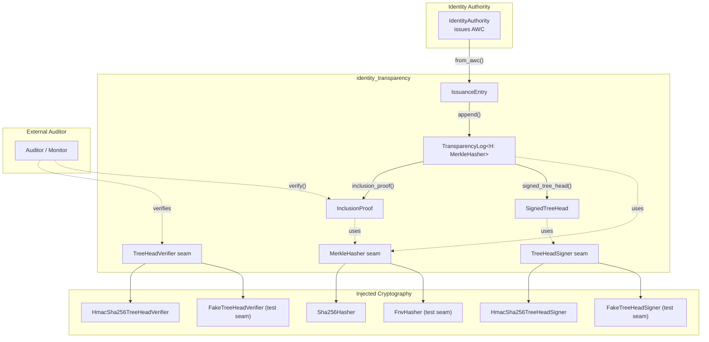
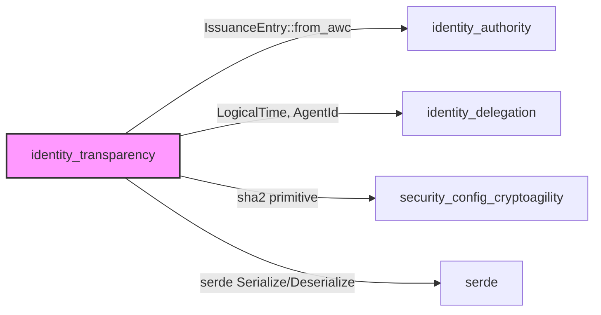
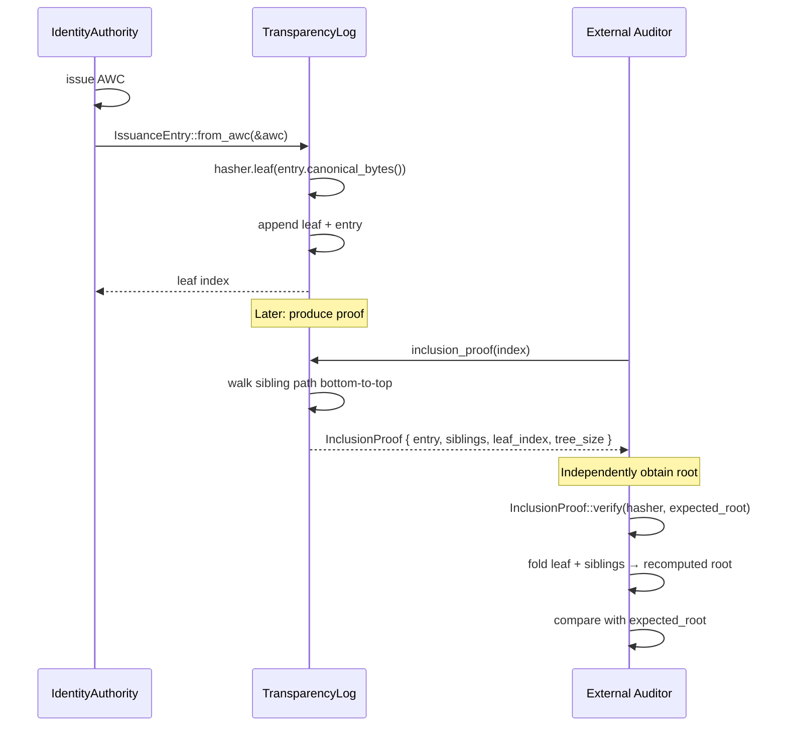
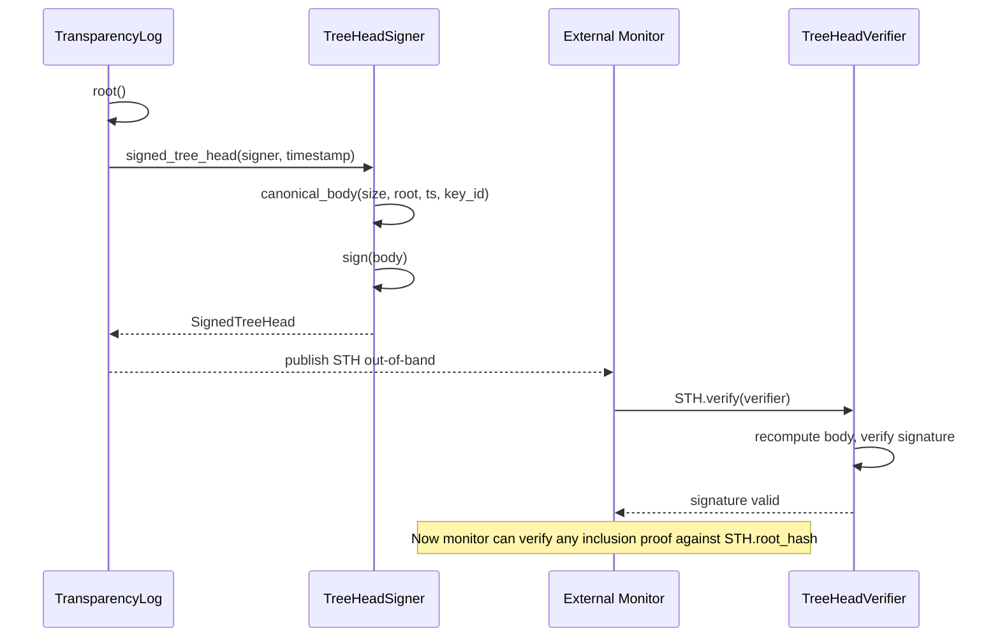
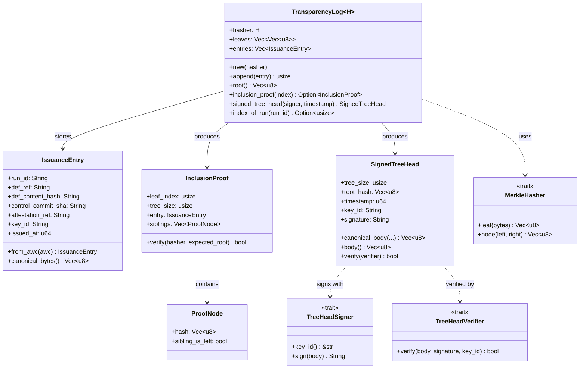
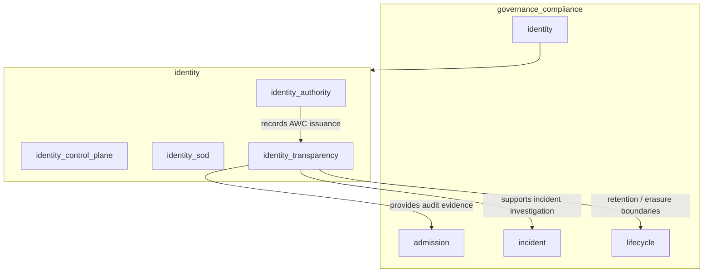

# identity_transparency

## Brief Introduction

The `identity_transparency` module implements an **append-only, Merkle-tree-based transparency log** for [Agent Workload Credential (AWC)](identity_authority.md) issuances. It provides cryptographically verifiable evidence that a specific identity was issued at a specific time, bound to a specific code measurement and attestation reference, without requiring external parties to trust the runtime that produced the credential.

This module is the implementation of the transparency-log requirements in ADR-022 §13 and §22 #3. Every AWC issuance appends an immutable [`IssuanceEntry`] to a Merkle tree; the resulting root can be published as a [`SignedTreeHead`] (STH), and any third party can verify inclusion of an entry using a compact [`InclusionProof`] and an independently obtained root.

The cryptographic primitives are injected through traits so the module remains testable and crypto-agile: production code uses real SHA-256 for hashing and HMAC-SHA256 for checkpoint signing, while deterministic non-cryptographic seams are available for offline algorithm testing.

---

## Core Responsibilities

1. **Tamper-evident issuance logging** — Append AWC issuances to a Merkle tree whose root changes if any leaf is altered, reordered, or removed.
2. **External inclusion proofs** — Produce compact audit paths that an external auditor can fold to recompute the root and confirm an entry is in the log.
3. **Signed checkpoints** — Sign the current `(tree_size, root_hash, timestamp, key_id)` as a Signed Tree Head, making the root itself non-repudiable.
4. **Crypto-agile seams** — Allow hash and signing primitives to be swapped via [`MerkleHasher`], [`TreeHeadSigner`], and [`TreeHeadVerifier`].

---

## Architecture

### Component Breakdown

| Component | Purpose |
|-----------|---------|
| [`TransparencyLog`] | Append-only Merkle tree storing leaf hashes and raw [`IssuanceEntry`] records. |
| [`IssuanceEntry`] | Minimal, immutable audit record derived from an AWC: run_id, def_ref, def_content_hash, control_commit_sha, attestation_ref, key_id, issued_at. |
| [`InclusionProof`] | Self-contained proof containing leaf index, tree size, entry, and sibling audit path. |
| [`ProofNode`] | One sibling hash on the audit path plus a flag indicating whether it sits on the left. |
| [`SignedTreeHead`] | Cryptographically signed checkpoint: tree size, root hash, timestamp, key_id, signature. |
| [`MerkleHasher`] | Hash primitive seam; real impl is SHA-256 with RFC-6962 domain separation. |
| [`TreeHeadSigner`] / [`TreeHeadVerifier`] | Checkpoint signing seam; real impl is HMAC-SHA256. |

---

## Dependencies

### Internal Module Dependencies

- **[`identity_authority`](identity_authority.md)** — Supplies [`AgentWorkloadCredential`](identity_authority.md) from which [`IssuanceEntry::from_awc`] derives the log record. The transparency log does not issue credentials; it only records that an issuance occurred.
- **[`identity_delegation`](identity_delegation.md)** — Provides the [`AgentId`](identity_delegation.md) and [`LogicalTime`](identity_delegation.md) concepts used by the broader identity subsystem. The timestamp stored in [`IssuanceEntry`] is sourced from the logical clock used by the authority.
- **[`security_config_cryptoagility`](security_config_cryptoagility.md)** — Shares the same vetted RustCrypto `sha2` primitive used across the system. The transparency log does not introduce a new cryptographic dependency category.

### External Dependencies

- **`sha2`** — Real SHA-256 hashing for [`Sha256Hasher`].
- **`serde`** — Serialization for [`IssuanceEntry`], [`InclusionProof`], [`ProofNode`], and [`SignedTreeHead`].

---

## Data Flow

### Issuance → Log Entry → Inclusion Proof

### Checkpoint Signing and Verification

---

## Component Interactions

---

## Process Flows

### Appending an Entry

1. An AWC is issued by [`IdentityAuthority`](identity_authority.md).
2. [`IssuanceEntry::from_awc`] extracts the audit-relevant fields.
3. [`TransparencyLog::append`] computes the leaf hash via [`MerkleHasher::leaf`] over the canonical byte encoding.
4. The leaf hash and raw entry are pushed in parallel vectors.
5. The leaf index is returned.

### Computing the Merkle Root

1. Start with the vector of leaf hashes.
2. While more than one node remains:
   - Pair adjacent nodes left-to-right.
   - For an odd number of nodes, promote the last node by hashing it with itself.
   - Compute each parent with [`MerkleHasher::node`].
3. The remaining value is the root.

### Generating an Inclusion Proof

1. Validate the requested index is in range.
2. Walk from the leaf level to the root:
   - Record the sibling hash and whether it is on the left.
   - If the sibling index is out of range (odd promotion), use the current node as its own sibling.
   - Fold the level to its parents.
3. Return an [`InclusionProof`] containing the entry, index, tree size, and sibling path.

### Verifying an Inclusion Proof

1. Recompute the leaf hash from the entry's canonical bytes.
2. Fold the accumulator with each sibling:
   - If `sibling_is_left`, hash `sibling || acc`.
   - Otherwise, hash `acc || sibling`.
3. Compare the final accumulator to the expected root.

### Signing a Checkpoint

1. Compute the current root and tree size.
2. Build the canonical checkpoint body with domain tag `sth`.
3. Sign with the injected [`TreeHeadSigner`].
4. Return a [`SignedTreeHead`] stamped with the `key_id`.

---

## Security Properties

| Threat | Mitigation |
|--------|------------|
| Tampered leaf | [`InclusionProof::verify`] recomputes the leaf hash; a changed entry yields a different root. |
| Reordered leaves | Merkle root is order-sensitive; reordering changes the root and invalidates the STH. |
| Removed entry | Append-only structure prevents deletion; any deletion changes all later roots. |
| Forged checkpoint | [`SignedTreeHead::verify`] checks the signature over `(size, root, ts, key_id)` under a key held outside the log. |
| Second-preimage attack | [`Sha256Hasher`] uses RFC-6962 domain separation (`0x00` for leaves, `0x01` for nodes). |
| Timing side-channel | [`HmacSha256TreeHeadVerifier`] uses a constant-time byte comparison. |

---

## Crypto-Agility and Seams

The module deliberately does not hard-code a hash or signature algorithm. Instead it defines three traits:

- **[`MerkleHasher`]** — Hash primitive for leaves and internal nodes.
- **[`TreeHeadSigner`]** — Signs checkpoint bodies; `key_id` enables key rotation without rewriting history.
- **[`TreeHeadVerifier`]** — Verifies checkpoint signatures using externally held key material.

### Provided Implementations

| Trait | Production | Test / Offline |
|-------|------------|----------------|
| [`MerkleHasher`] | [`Sha256Hasher`] (SHA-256, RFC-6962) | [`FnvHasher`] (deterministic, non-cryptographic) |
| [`TreeHeadSigner`] | [`HmacSha256TreeHeadSigner`] (RFC-2104 HMAC-SHA256) | [`FakeTreeHeadSigner`] |
| [`TreeHeadVerifier`] | [`HmacSha256TreeHeadVerifier`] | [`FakeTreeHeadVerifier`] |

The real HMAC-SHA256 implementation is hand-rolled on the vetted `sha2` primitive to avoid adding a new `hmac` crate to the supply-chain surface.

---

## Integration with the Broader System

- **[`identity_authority`](identity_authority.md)** creates the AWCs that [`IssuanceEntry`] records.
- **[`identity_control_plane`](identity_control_plane.md)** may use the log to reason about lease validity and revocation.
- **[`identity_sod`](identity_sod.md)** can reference log entries as part of signed handoff evidence.
- **[`admission`](admission.md)** may require a transparency-log inclusion proof before admitting a run.
- **[`incident`](incident.md)** can use the immutable log during evidentiary export.
- **[`lifecycle`](lifecycle.md)** defines retention and erasure policies; note that erasure of credential *material* is a data-plane action, while the audit *reference* remains immutable in the log.

---

## Testing Strategy

The module includes exhaustive unit tests covering:

- Inclusion proof verification for every entry in a non-power-of-two tree.
- Failure on tampered entries, wrong roots, and swapped sibling sides.
- Out-of-range indices and empty-log behavior.
- End-to-end issuance: issue an AWC via [`IdentityAuthority`](identity_authority.md), log it, and verify inclusion externally.

The tests use [`FnvHasher`] and the fake tree-head signer to exercise the algorithm independently of cryptographic primitives, while production paths are validated with SHA-256 and HMAC-SHA256.

---

## Operational Boundaries

The module implements the cryptographic primitives but explicitly defers to infrastructure for:

- **Key provisioning and custody** — The HMAC secret or eventual asymmetric ADR-023 signing key must live in a KMS/HSM.
- **Key rotation** — Supported via `key_id` versioning in [`TreeHeadSigner`] and [`SignedTreeHead`].
- **STH distribution** — Publishing the [`SignedTreeHead`] to an external monitor is an out-of-band concern.
- **Log replication** — Durability and replication of the append-only log are storage/infra responsibilities.

---

## See Also

- **[`identity_authority`](identity_authority.md)** — Issues AWCs and defines attestation semantics.
- **[`identity_delegation`](identity_delegation.md)** — Defines agent identity and delegation chains.
- **[`identity_control_plane`](identity_control_plane.md)** — Manages run leases and kill switches.
- **[`identity_sod`](identity_sod.md)** — Separation-of-duties handoff verification.
- **[`security_config_cryptoagility`](security_config_cryptoagility.md)** — System-wide cryptographic algorithm registry.
- **[`admission`](admission.md)** — Harness admission and compliance gates that may consume transparency proofs.
- **[`incident`](incident.md)** — Incident register and evidentiary export.
