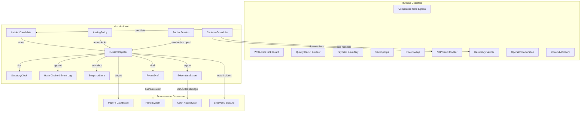
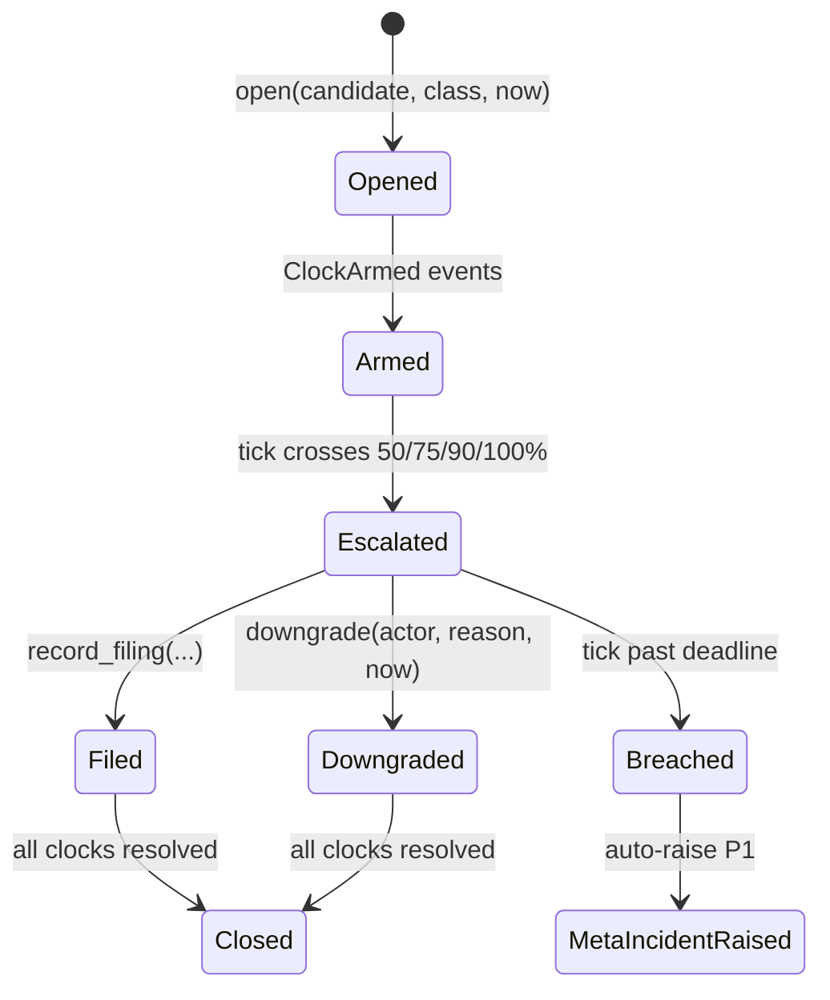
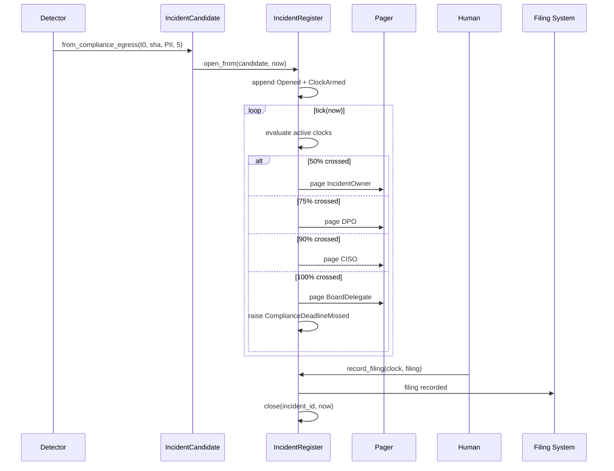
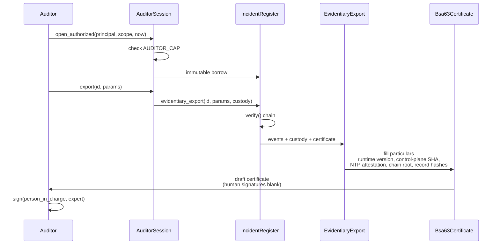

# incident Module

## Introduction

The `ainxt-incident` crate is the statutory AI-incident breach-notification engine for the regulated financial infrastructure stack. It closes the gap between "we have a runbook" and "the system cannot miss a statutory deadline." India's payment switch is subject to hard statutory clocks the moment it processes a query: CERT-In requires a cyber-incident filing within 6 hours of *noticing*, DPDP imposes breach-notice windows, and RBI requires outsourcing/operational-risk reporting.

The design principle is simple: **every statutory deadline is an SLO with a durable countdown, and missing one is structurally impossible to hide.**

The module is a pure, deterministic, durable state machine:

- **`IncidentCandidate`** — a typed notice from a detection source (compliance gate, sink-guard, quality circuit-breaker, payment boundary, serving-ops, store-sweep, NTP-skew monitor, residency verifier, operator, or inbound advisory). Its `noticed_tick` is the legally operative **t0**.
- **`ArmingPolicy`** — the control-plane table (git-native) that maps *incident class → which statutory clocks fire, with what budget*. The model classifies; the policy arms. Fail-safe: arm early, disarm only on an authenticated, reason-coded downgrade.
- **`StatutoryClock`** — a durable countdown from an immutable t0 with a config budget, a 50/75/90% → owner/DPO/CISO + 100% → board-delegate escalation ladder, and a crash-survival property: the clock lives in the serde register, never in a process.
- **`IncidentRegister`** — the append-only, SHA-256 hash-chained register that opens incidents, arms clocks, pages the ladder, and auto-raises a P1 compliance meta-incident the instant a clock crosses its budget without a recorded filing.

The module contains no wall clock, no RNG, and no I/O in its core. Logical time is the injected `Tick`; control-plane SHA and NTP particulars are injected strings. The same register advanced to the same `now` always produces the same pages, meta-incidents, and hash chain, so every property is unit-testable offline.

## Module Position

`ainxt-incident` lives under the `governance_compliance` branch of the system. It consumes detection signals from the broader runtime (compliance gates, serving infrastructure, payment boundaries, quality breakers) and produces statutory obligations, escalations, and court-admissible evidence. It depends on `ainxt_types` for `Principal` and `DataClass`, and on `ainxt_cryptoagility` for the governed hash policy that seals the evidentiary chain.

## Architecture Overview

### Core State Machine

The register is the heart of the module. It maintains:

1. **`incidents`** — a `BTreeMap<String, Incident>` of all incidents, id-sorted.
2. **`events`** — the append-only, hash-chained event log (the evidentiary spine).
3. **`arming`** — the `ArmingPolicy` in force.
4. **`hash_policy`** — the crypto-agility policy governing the hash primitive used to seal each link.

Opening an incident appends an `Opened` event and one `ClockArmed` event per armed clock. Advancing the register via `tick(now)` evaluates every active clock, pages newly crossed ladder tiers once, and raises a `ComplianceDeadlineMissed` meta-incident if a clock is breached without a filing or downgrade.

### Statutory Clocks

A `StatutoryClock` is a durable countdown from an immutable `t0` with a `budget_ticks`. It supports:

- `CERT-In` (6h default)
- `DPDPDataPrincipal` (without undue delay)
- `DPDPBoard` (72h default)
- `RbiOutsourcing`
- `PaymentBoundaryEscalation`

The escalation ladder is:

| % of budget | Tier |
|-------------|------|
| 50% | IncidentOwner |
| 75% | DPO |
| 90% | CISO |
| 100% | BoardDelegate |

Crossing 100% without a filing or downgrade triggers a meta-incident.

### Determinism & Time Unit

The canonical time unit is **1 tick = 60 wall-clock seconds** (one minute). The `india_default` budgets assume this unit:

- CERT-In 6h = 360 ticks
- DPDP board 72h = 4320 ticks
- DPDP data principal 24h = 1440 ticks
- RBI outsourcing 24h = 1440 ticks
- Payment boundary escalation 1h = 60 ticks

A live driver must project Unix-epoch seconds onto the tick axis with `ticks_from_unix_secs` rather than feeding raw seconds, or clocks will breach 60× early.

### Tamper-Evident Event Log

Every event is a link in a hash chain. Each link includes the previous hash, sequence number, incident id, canonical event tag, and tick. The digest primitive is resolved from the crypto-agility policy at the link's tick and recorded on the event, so an event sealed under a since-deprecated algorithm still verifies with the algorithm of record. `verify()` recomputes the chain end-to-end and reports the first break.

### Crash Survival

The register is pure serde state. The `SnapshotStore` trait provides a codec-free persistence seam; `snapshot_register` and `restore_register` serialize/deserialize through a caller-supplied codec. A `kill -9` mid-clock is survived by restoring the snapshot: `t0` is immutable, elapsed wall-clock continues from real time, and already-fired pages are not re-fired.

## Sub-Modules

The incident module is split into focused sub-modules:

| Sub-module | File(s) | Responsibility |
|------------|---------|----------------|
| [incident_core](incident_core.md) | `src/lib.rs` | Core state machine: `IncidentRegister`, `StatutoryClock`, `ArmingPolicy`, `IncidentCandidate`, `IncidentEvent`, hash chain, escalation, filing, downgrade. |
| [incident_cadence](incident_cadence.md) | `src/cadence.rs` | Deterministic cadence scheduler for supervisory monitors. |
| [incident_durable](incident_durable.md) | `src/durable.rs` | Codec-free snapshot/restore seam for crash survival. |
| [incident_evidence](incident_evidence.md) | `src/evidence.rs` | BSA §63 evidentiary export, chain-of-custody, and read-only auditor mode. |
| [incident_ops](incident_ops.md) | `src/ops.rs` | NTP-skew monitor and India-residency verifier. |
| [incident_report](incident_report.md) | `src/report.rs` | Pre-templated statutory report drafting. |

All six sub-module documents above (`incident_core.md`, `incident_cadence.md`, `incident_durable.md`, `incident_evidence.md`, `incident_ops.md`, `incident_report.md`) were generated from the source components and contain the detailed type-level descriptions, responsibilities, and interaction patterns for each area.

## Data Flow: From Detection to Filing

## Evidence Export Flow

## Integration Points

- **Detectors** raise `IncidentCandidate` via typed constructors (`from_compliance_egress`, `from_sink_guard`, `from_quality_breaker`, `from_payment_boundary`, `from_serving_ops`, `from_store_sweep`).
- **Triage Roles** may propose a classification via `open_from_triage`; the policy floors the armed class to the more-protective of proposal and source default.
- **Downgrades** require the `compliance:downgrade-clock` capability on the `Principal`.
- **Filings** stop a clock; the human legal act is recorded but not performed by the engine.
- **Supervisory auditors** open a read-only, scoped, chain-logged `AuditorSession` with the `incident:supervisory-auditor` capability.
- **Report drafting** consumes `Incident` facts and event-log evidence slices to pre-fill statutory templates.

## Security & Compliance Properties

- **Fail-safe arming**: every detector source has a default class; a confused or absent triage model cannot leave a reportable event unclassified.
- **Authenticated downgrade**: disarming a clock requires an explicit capability and is recorded on the chain.
- **Immutable t0**: the legally operative instant is never reset, even across restarts.
- **Tamper evidence**: any edit, reorder, or deletion in the event log breaks `verify()`.
- **Existence-hiding auditor scope**: out-of-scope incidents return `None`, indistinguishable from not-found.
- **Court admissibility**: `EvidentiaryExport` packages the hash-chained slice, chain-of-custody manifest, and a BSA §63 certificate draft with machine-filled particulars.
