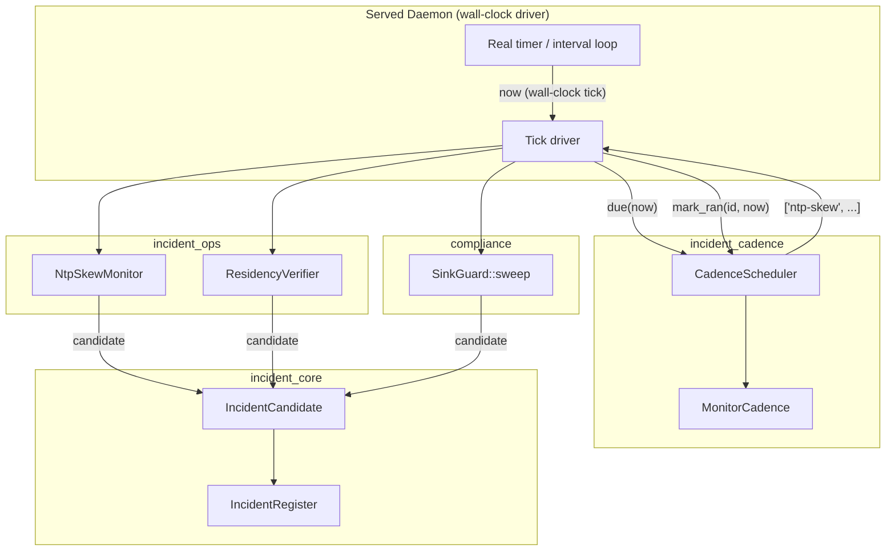
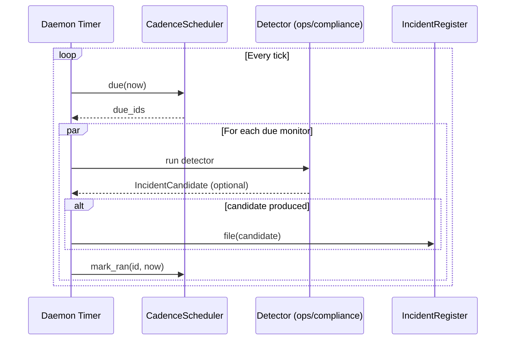
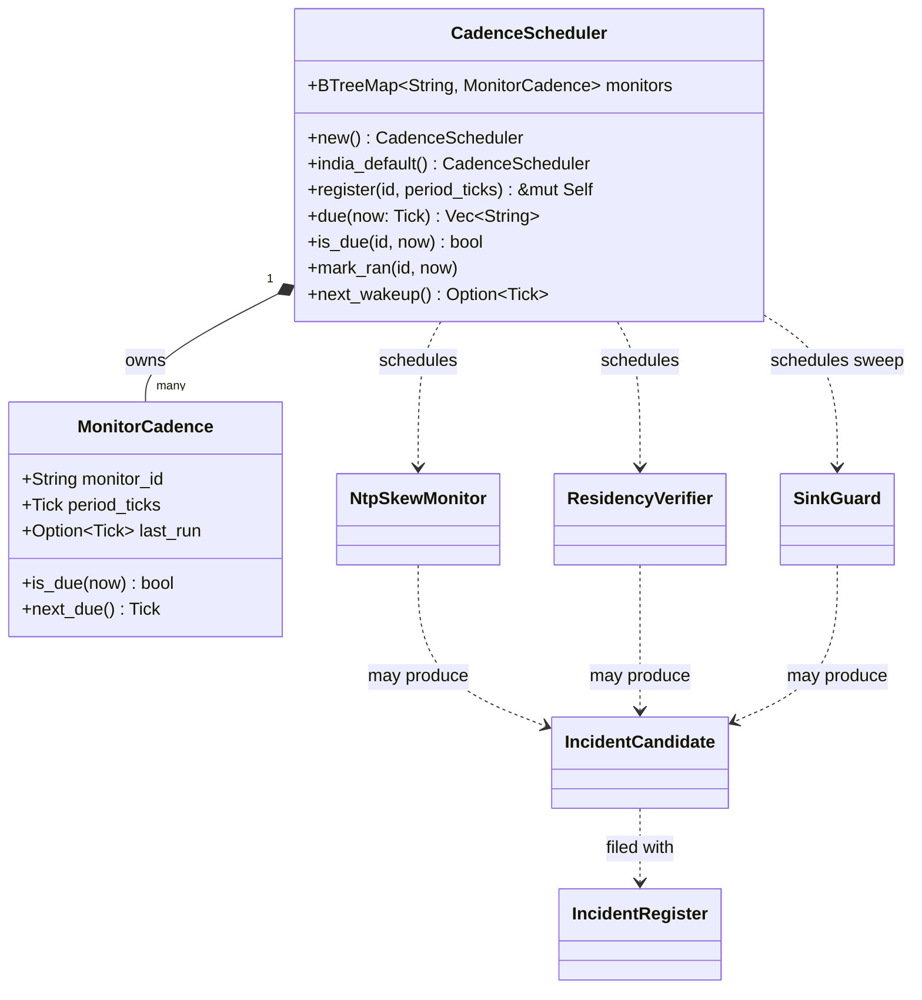
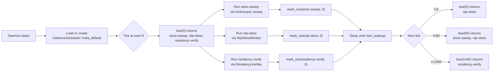

# incident_cadence

The `incident_cadence` module provides deterministic, pure-policy scheduling for the supervisory governance monitors that detect compliance and security incidents. It answers the question: *given a logical `now`, which monitors are due to run?* By separating the scheduling decision from wall-clock I/O, the module remains fully testable offline while the served daemon drives it from a real timer.

This module lives inside the broader [`incident`](incident.md) subsystem under [`governance_compliance`](governance_compliance.md). It orchestrates when detectors such as the CHD store-sweep, NTP-skew monitor, and India-residency verifier execute, and it persists last-run state so the schedule survives restarts.

---

## Core Components

### `MonitorCadence`

A single monitor's schedule entry. It records:

- `monitor_id`: canonical identifier for the monitor.
- `period_ticks`: how many [`Tick`](incident.md#tick) units must elapse between runs.
- `last_run`: the tick at which the monitor last ran, or `None` if it has never run.

`MonitorCadence::is_due(now)` returns `true` when the monitor has never run or when at least `period_ticks` have elapsed since `last_run`. `MonitorCadence::next_due()` computes the earliest future tick at which the monitor becomes due again.

### `CadenceScheduler`

A collection of `MonitorCadence` entries keyed by monitor id. The scheduler is:

- **Deterministic**: the same `now` and state always produce the same due set.
- **Serde-round-trippable**: schedule + last-run state can be serialized and restored, giving the same "survive `kill -9`" property as the incident register.
- **Pure**: no clock, RNG, or I/O. The daemon injects `now`.

Key methods:

- `register(monitor_id, period_ticks)`: add or replace a monitor, marking it never-run (due immediately).
- `due(now)`: return all monitor ids due at `now`, in deterministic order.
- `is_due(monitor_id, now)`: check a specific monitor.
- `mark_ran(monitor_id, now)`: advance `last_run` after the daemon executes the detector.
- `next_wakeup()`: the earliest tick at which any monitor becomes due, useful for sleep-until-next-due drivers.
- `india_default()`: the RBI-default schedule with the three canonical monitors pre-registered.

### Canonical Monitor Identifiers

| Constant | Id | Default Period | Purpose |
|----------|----|----------------|---------|
| `MONITOR_STORE_SWEEP` | `store-sweep` | 60 ticks (hourly) | Durable-store CHD sweep (defense-in-depth). Delegates actual sweeping to [`ainxt_compliance::SinkGuard::sweep`](compliance.md). |
| `MONITOR_NTP_SKEW` | `ntp-skew` | 5 ticks (5 min) | NIC/NPL clock-skew detection. Uses [`NtpSkewMonitor`](incident_ops.md). |
| `MONITOR_RESIDENCY` | `residency-verify` | 1440 ticks (daily) | India-residency verification. Uses [`ResidencyVerifier`](incident_ops.md). |

The default schedule marks all three monitors as never-run, so the first tick runs each monitor once.

---

## Architecture

The diagram shows the separation of concerns: `incident_cadence` only decides *which* monitors are due. The daemon performs the wall-clock wait, invokes the actual detectors in [`incident_ops`](incident_ops.md) and [`compliance`](compliance.md), feeds any resulting [`IncidentCandidate`](incident_core.md) into the [`IncidentRegister`](incident_core.md), and then records that the monitor ran.

---

## Data Flow

1. The daemon's timer fires at a wall-clock tick.
2. It calls `CadenceScheduler::due(now)` to obtain the deterministic set of due monitors.
3. For each due monitor, the daemon runs the corresponding detector.
4. If the detector finds a problem, it produces an [`IncidentCandidate`](incident_core.md) that is filed with the [`IncidentRegister`](incident_core.md).
5. The daemon calls `CadenceScheduler::mark_ran(id, now)` so the monitor is not re-run until its next period elapses.

---

## Component Relationships

`CadenceScheduler` owns zero or more `MonitorCadence` entries. It does not depend on the detectors directly; it only knows their ids and periods. The daemon maps those ids to the concrete detector implementations in [`incident_ops`](incident_ops.md) and [`compliance`](compliance.md).

---

## Process Flow: RBI-Default Schedule

The default schedule is designed so that cheap, high-value monitors run frequently while expensive, slowly-changing monitors run rarely:

- **NTP-skew** runs every 5 ticks because clock skew is doubly dangerous: it can cause double-execution and it can corrupt evidence timestamps.
- **Store-sweep** runs every 60 ticks (hourly) because durable-store CHD sweeps are cheap and provide defense-in-depth.
- **Residency verification** runs every 1440 ticks (daily) because store regions change rarely.

---

## Integration with the System

`incident_cadence` sits at the boundary between the served runtime and the governance compliance detectors:

- It is called by the **daemon** in [`runtime_engine`](runtime_engine.md) / [`server_serving`](server_serving.md), which owns the wall-clock timer loop.
- It drives detectors defined in [`incident_ops`](incident_ops.md): [`NtpSkewMonitor`](incident_ops.md) and [`ResidencyVerifier`](incident_ops.md).
- It drives the store-sweep detector implemented in [`compliance`](compliance.md) via [`SinkGuard::sweep`](compliance.md).
- Its outputs (indirectly, via the daemon) feed [`IncidentCandidate`](incident_core.md) instances into the [`IncidentRegister`](incident_core.md) defined in [`incident_core`](incident_core.md).
- Its persisted state complements the durable snapshot store in [`incident_durable`](incident_durable.md), ensuring that a restart does not lose track of when monitors last ran.

Because the scheduler is pure and serde-round-trippable, it can be unit-tested without timers, databases, or network access. The included tests verify:

- Never-run monitors are due immediately and then respect their period.
- `next_wakeup` returns the earliest due tick.
- A period of zero means "every tick".
- Unknown ids are inert (no panic, never due).
- State survives a JSON round-trip.

---

## References

- [`incident`](incident.md) — parent module overview.
- [`incident_core`](incident_core.md) — incident register, candidates, and statutory clock.
- [`incident_ops`](incident_ops.md) — `NtpSkewMonitor` and `ResidencyVerifier` detectors.
- [`incident_durable`](incident_durable.md) — durable snapshot store for incident state.
- [`incident_evidence`](incident_evidence.md) — evidentiary export and chain of custody.
- [`incident_report`](incident_report.md) — report templates and drafts.
- [`compliance`](compliance.md) — `SinkGuard::sweep` store-sweep implementation.
- [`governance_compliance`](governance_compliance.md) — top-level governance and compliance domain.
