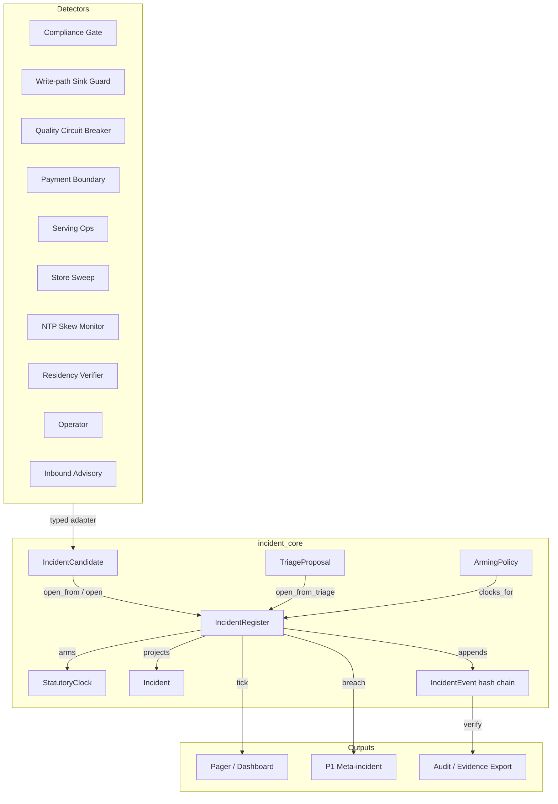
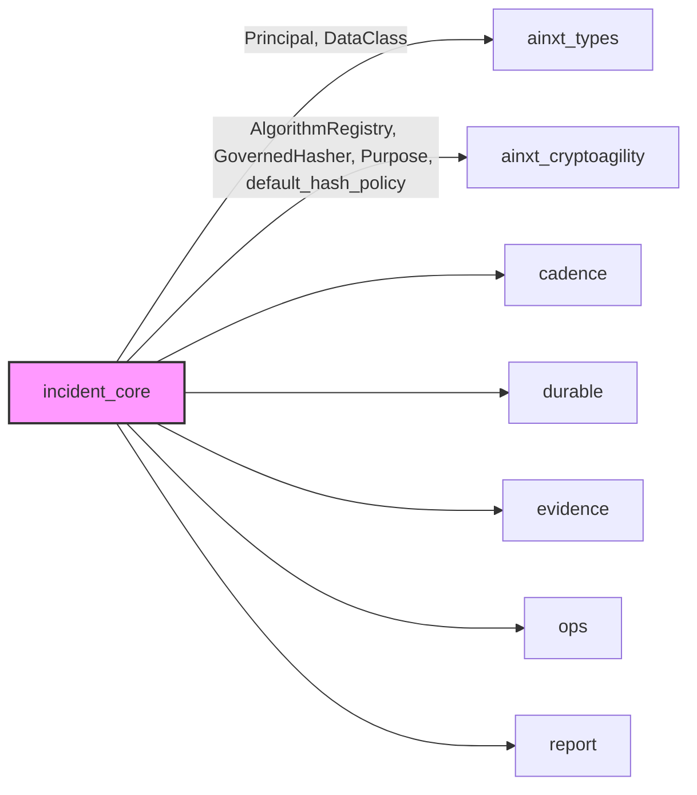
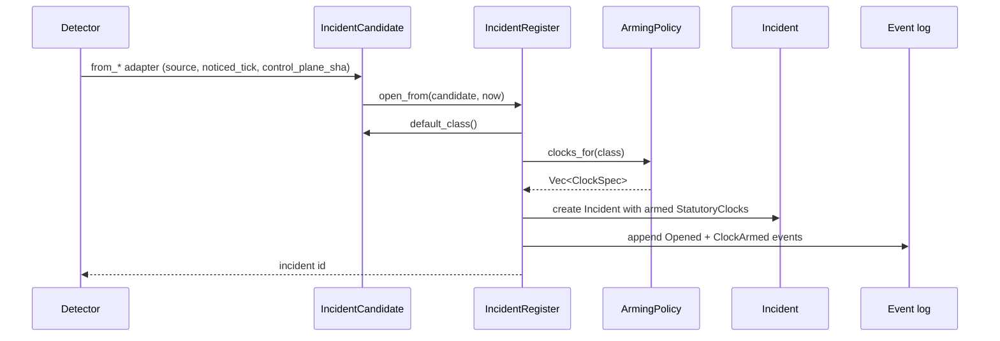
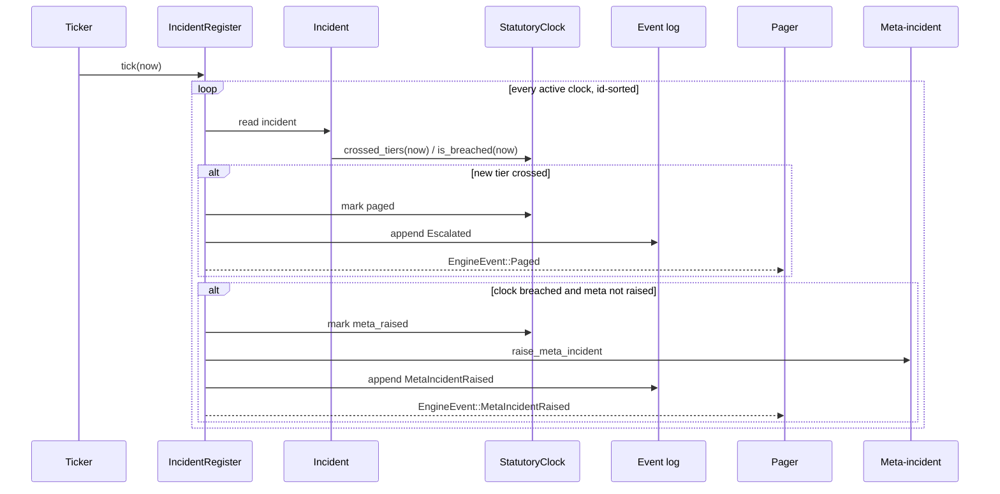
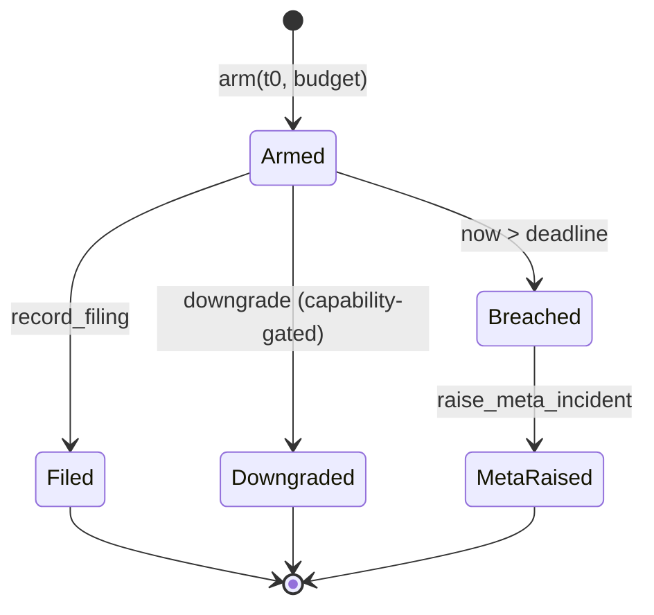

# incident_core

## Brief Introduction

`incident_core` (`crates/ainxt-incident/src/lib.rs`) is the statutory AI-incident breach-notification engine for the regulated financial-services stack. It implements a pure, deterministic, durable state machine that turns every statutory reporting deadline into an SLO with a tamper-evident countdown. The module is designed so that missing a deadline is structurally impossible to hide: each reportable event arms one or more statutory clocks, and if a clock expires without a recorded filing, the engine automatically raises a P1 compliance meta-incident.

The core abstraction is the [`IncidentRegister`](incident_core.md#incidentregister): an append-only, hash-chained register that records candidates, triage proposals, clock arming, escalations, filings, downgrades, and breach meta-incidents. Clocks live in the register (serde), not in a process, so a restart re-projects the same immutable `t0` and continues counting from real elapsed wall-clock time.

For related concerns, see:

- [incident_cadence](incident_cadence.md) — scheduling and monitoring cadences for incident review.
- [incident_durable](incident_durable.md) — durable snapshot storage for the register.
- [incident_evidence](incident_evidence.md) — evidentiary export and chain-of-custody.
- [incident_ops](incident_ops.md) — operational monitors such as NTP skew and residency verification.
- [incident_report](incident_report.md) — report templates and draft generation.
- [security_config](security_config.md) — crypto-agility and principal capabilities used by the register.

---

## Core Concepts

### Statutory Clocks

A [`StatutoryClock`](incident_core.md#statutoryclock) is a durable countdown from an immutable `t0` (time of first notice) with a configured budget. Each clock has:

- A kind (`CertIn`, `DpdpDataPrincipal`, `DpdpBoard`, `RbiOutsourcing`, `PaymentBoundaryEscalation`).
- A budget in logical ticks.
- A provisional flag (armed early, disarmed only by authority).
- Optional `Filing` or `Downgrade` resolution.
- A set of already-paged escalation tiers.
- A flag indicating whether a breach meta-incident has already been raised.

The default India policy maps incident classes to clocks with minute-scaled budgets, e.g. CERT-In 6h = 360 ticks, DPDP board 72h = 4320 ticks. The module exposes [`ticks_from_unix_secs`](incident_core.md#ticks_from_unix_secs) and [`budget_ticks_from_hours`](incident_core.md#budget_ticks_from_hours) to keep wall-clock projections and budgets in the same unit.

### Incident Candidate

An [`IncidentCandidate`](incident_core.md#incidentcandidate) is a typed notice from a detection source. It carries:

- `source` — where the candidate came from (compliance gate, sink-guard, quality circuit-breaker, payment boundary, serving-ops, store sweep, NTP skew, operator, advisory, residency violation, or the engine itself).
- `noticed_tick` — the legally operative `t0`.
- Affected data classes, principal estimate, systems involved.
- Control-plane SHA and description.

Each source has a fail-safe default incident class, so a detector can arm a clock in one call without waiting for a model classification.

### Arming Policy

The [`ArmingPolicy`](incident_core.md#armingpolicy) is the control-plane table that maps an incident class to the clocks that must fire. It is deterministic and intended to be a git-native artifact. The model may propose a class, but the policy arms the clocks — a confused or adversarial model cannot disarm a statutory deadline.

### Incident Register

The [`IncidentRegister`](incident_core.md#incidentregister) is the durable state machine. It:

- Opens incidents from candidates.
- Arms clocks from the policy.
- Records triage proposals.
- Accepts filings and capability-gated downgrades.
- Advances logical time via [`tick`](incident_core.md#incidentregister.tick), paging escalation tiers and raising meta-incidents.
- Maintains an append-only, hash-chained event log that can be verified with [`verify`](incident_core.md#incidentregister.verify).

---

## Architecture

### Component Responsibilities

| Component | Responsibility |
|-----------|----------------|
| `IncidentCandidate` | Typed notice from a detector; carries `noticed_tick` as legally operative `t0`. |
| `CandidateSource` | Enumerates real runtime detectors and their fail-safe default incident classes. |
| `IncidentClass` | Classification taxonomy with protective severity ranking. |
| `TriageProposal` | Advisory model output (proposed class, confidence, rationale) recorded for audit. |
| `ArmingPolicy` | Control-plane table: incident class → ordered statutory clocks. |
| `ClockSpec` | One clock kind + budget to arm for a class. |
| `StatutoryClock` | Durable countdown with escalation ladder, filing, downgrade, and breach state. |
| `Incident` | Operational projection of an open incident and its clocks. |
| `IncidentEvent` / `IncidentEventKind` | Append-only, hash-chained evidentiary events. |
| `IncidentRegister` | Durable state machine that opens incidents, arms clocks, accepts filings/downgrades, and advances time. |
| `EngineEvent` | Pager/dashboard events produced by `tick`. |

---

## Dependencies

- [security_config](security_config.md) provides `ainxt_types::Principal` and `ainxt_cryptoagility` for capability checks and crypto-agile hashing.
- [incident_cadence](incident_cadence.md), [incident_durable](incident_durable.md), [incident_evidence](incident_evidence.md), [incident_ops](incident_cops.md), and [incident_report](incident_report.md) extend the core engine with scheduling, persistence, evidence handling, operational monitors, and report generation.

---

## Data Flow

### Opening an Incident

### Advancing Time (tick)

---

## Statutory Clock State Machine

A clock is active while it has neither a filing nor a downgrade. While active, it pages each escalation tier at most once when the corresponding budget percentage is crossed. If the deadline passes with no resolution, the engine raises a `ComplianceDeadlineMissed` meta-incident.

---

## Escalation Ladder

Each threshold is computed from the immutable `t0` and the clock budget. Crossing a threshold appends an `Escalated` event and emits an `EngineEvent::Paged`. The board-delegate threshold coincides with the deadline; a breach immediately after raises the meta-incident.

---

## Hash Chain and Tamper Evidence

Every event appended to the register is hash-chained to the previous event. The canonical byte layout is length-prefixed and deterministic. The digest primitive is resolved from the crypto-agility policy at the event's tick and recorded on the event, so an event sealed under a since-deprecated algorithm can still be verified with the algorithm of record.

[`verify`](incident_core.md#incidentregister.verify) recomputes the chain and detects:

- `SeqGap` — missing or reordered events.
- `BrokenChain` — `prev_hash` does not match the previous event's hash.
- `HashMismatch` — recomputed digest does not match the stored hash.
- `CryptoUnavailable` — the recorded hash algorithm is not available.

---

## Process Flows

### Fail-Safe Opening from a Detector

1. A detector calls a typed adapter such as `IncidentCandidate::from_compliance_egress`.
2. The candidate carries `source` and `noticed_tick`.
3. `IncidentRegister::open_from` uses the source's fail-safe default class.
4. The arming policy returns the clocks for that class.
5. The register creates the incident, arms the clocks, and appends `Opened` and `ClockArmed` events.

### Agentic Triage

1. A triage Role produces a `TriageProposal` with a proposed class, confidence, and rationale.
2. `IncidentRegister::open_from_triage` compares the proposal's severity rank with the source's fail-safe floor.
3. The armed class is the more protective of the two — a proposal can only escalate, never lower.
4. The proposal is appended to the event log verbatim, even if not adopted.

### Recording a Filing

1. An authorized user submits a filing with template version, submitted tick, and regulator acknowledgement.
2. `record_filing` resolves the incident and clock, verifies the clock is still active, and records the filing.
3. A `Filed` event is appended and the clock stops paging/breaching.

### Downgrading a Clock

1. An authorized principal with `compliance:downgrade-clock` capability requests a downgrade with a reason code.
2. `downgrade` verifies the capability, resolves the active clock, and records the downgrade.
3. A `Downgraded` event is appended. `t0` is never moved.

### Breach Handling

1. `tick(now)` evaluates every active clock.
2. If `now > deadline` and no meta-incident has been raised, `raise_meta_incident` creates a deterministic `ComplianceDeadlineMissed` incident.
3. The source clock is marked `meta_raised` and a `MetaIncidentRaised` event is appended.
4. The new meta-incident itself has no clocks; it exists as an un-hideable escalation.

---

## Time Unit Safety

The register operates on logical [`Tick`](incident_core.md#tick)s. The default India policy assumes one tick equals one minute. To prevent a live driver from breaching clocks 60× early by feeding raw Unix seconds, the module exposes:

- `SECONDS_PER_TICK = 60`
- `ticks_from_unix_secs(unix_secs) -> Tick`
- `budget_ticks_from_hours(hours) -> u64`

All `t0`, `now`, and budget values must use the same tick unit. The register is deterministic: the same register advanced to the same `now` always produces the same pages, meta-incidents, and hash chain.

---

## Error Handling

| Error | Cause |
|-------|-------|
| `UnknownIncident` | Incident id not found. |
| `UnknownClock` | Clock kind not armed for the incident. |
| `Unauthorized` | Principal lacks `compliance:downgrade-clock`. |
| `ClockAlreadyResolved` | Filing or downgrade attempted on a clock that already has one. |
| `TamperError::SeqGap` | Event sequence gap or reordering. |
| `TamperError::BrokenChain` | `prev_hash` mismatch. |
| `TamperError::HashMismatch` | Recomputed digest mismatch. |
| `TamperError::CryptoUnavailable` | Recorded hash algorithm unavailable. |

---

## Integration Points

Detectors integrate through typed `IncidentCandidate` adapters:

- `from_compliance_egress` — [connectors](connectors.md) / [security_config](security_config.md)
- `from_sink_guard` — [core_infrastructure](core_infrastructure.md) / [security_config](security_config.md)
- `from_store_sweep` — [lifecycle](lifecycle.md)
- `from_quality_breaker` — [ai_engine](ai_engine.md) quality / judge modules
- `from_payment_boundary` — [payments](payments.md)
- `from_serving_ops` — [server_serving](server_serving.md)

The register is driven by a logical ticker. In production, the ticker projects wall-clock time through `ticks_from_unix_secs` and calls `tick` at a regular cadence (see [incident_cadence](incident_cadence.md)).

---

## Key Design Properties

1. **Fail-safe arming** — every detector source has a default class; a missing or wrong model cannot leave a reportable event unclassified.
2. **Policy arms, models propose** — the `ArmingPolicy` chooses clocks; a `TriageProposal` can only escalate.
3. **Authority-gated downgrade** — disarming a clock requires `compliance:downgrade-clock`.
4. **Immutable `t0`** — time of first notice never resets, even across restarts.
5. **Durable countdown** — clocks live in the serde register, not a process.
6. **Tamper-evident log** — SHA-256 hash chain with crypto-agility support.
7. **Un-hideable breach** — a missed deadline auto-raises a P1 meta-incident.
8. **Deterministic** — no wall clock, no RNG, no I/O inside the state machine.
