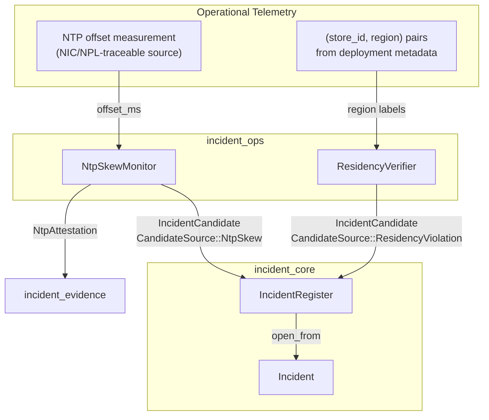
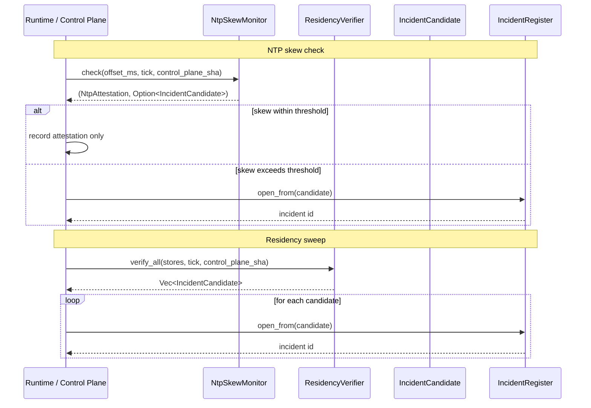
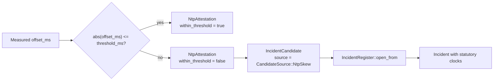
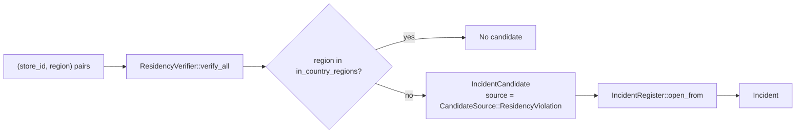

# incident_ops

The `incident_ops` module provides **supervisory infrastructure monitors** that continuously watch two critical operational invariants and arm the breach engine when they fail:

1. **NTP clock-skew monitoring** — ensures every evidentiary timestamp is anchored to a trusted NIC/NPL-traceable time source and that skew does not exceed a statutory threshold.
2. **India data-residency verification** — ensures log and data stores resolve within Indian jurisdiction, preserving the CERT-In 180-day in-India retention floor.

Both detectors are intentionally **pure, deterministic, and I/O-free**. They accept a measurement (clock offset or store region) and decide, by policy, whether that measurement constitutes a reportable incident. When a violation is detected, they emit a ready-to-open [`IncidentCandidate`](incident_core.md), which the parent [`IncidentRegister`](incident_core.md) can promote into a full [`Incident`](incident_core.md).

This module is part of the larger [`incident`](incident.md) subsystem under [`governance_compliance`](governance_compliance.md). It depends on the core incident model and evidence types defined in [`incident_core`](incident_core.md) and [`incident_evidence`](incident_evidence.md), and it is typically invoked by higher-level runtime or control-plane code that supplies the actual measurements.

---

## Core Components

| Component | File | Responsibility |
|-----------|------|----------------|
| `NtpSkewMonitor` | `crates/ainxt-incident/src/ops.rs` | Validates measured NTP offset against a configured threshold; always produces an [`NtpAttestation`](incident_evidence.md) and optionally raises an `NtpSkew` incident candidate. |
| `ResidencyVerifier` | `crates/ainxt-incident/src/ops.rs` | Validates that log/data store regions are within Indian jurisdiction; raises a `ResidencyViolation` incident candidate for each mis-located store. |

---

## Architecture

`incident_ops` sits at the boundary between **operational telemetry** and **incident management**. It does not itself provision NTP sources or storage regions; instead, it acts as a policy-driven alarm layer that translates raw operational facts into structured incident candidates.



### Design Principles

- **Fail-safe alarm semantics**: A skewed clock or mis-located store is treated as a §2 reportable incident, not a warning. This prevents premature saga compensation (double-execution) and preserves evidentiary integrity.
- **Determinism**: Both monitors are pure functions of their inputs. They perform no I/O, no network calls, and no hidden state mutations, making them trivial to test and replay.
- **Evidentiary traceability**: Every NTP check produces an `NtpAttestation` regardless of outcome, so every downstream timestamp can record its source and offset.
- **Policy-driven region acceptance**: `ResidencyVerifier` carries an explicit allow-list of in-country region labels, which can be extended at deployment time.

---

## Component Interactions



---

## Data Flow

### NTP Skew Detection



### Data Residency Verification



---

## Process Flows

### Opening an NTP Skew Incident

1. The runtime measures the local clock offset against the configured NIC/NPL-traceable source.
2. It calls `NtpSkewMonitor::check(offset_ms, noticed_tick, control_plane_sha)`.
3. The monitor always returns an `NtpAttestation` recording the source, offset, and threshold status.
4. If the absolute offset exceeds `threshold_ms`, the monitor constructs an `IncidentCandidate` with:
   - `source = CandidateSource::NtpSkew`
   - `systems_involved` containing the NTP source
   - A PII-free description of the violation
5. The caller passes the candidate to `IncidentRegister::open_from`, which arms the statutory clocks and creates an `Incident`.

### Sweeping Store Residency

1. The runtime resolves the deployment regions for all log and data stores.
2. It calls `ResidencyVerifier::verify_all(stores, noticed_tick, control_plane_sha)`.
3. For each store, the verifier checks whether its lowercased region label is in the allow-list.
4. Mis-located stores produce `IncidentCandidate` values with:
   - `source = CandidateSource::ResidencyViolation`
   - `systems_involved` containing the store id
   - A description citing the non-India region and the 180-day retention floor
5. The caller opens each candidate in the `IncidentRegister`.

---

## Dependencies

`incident_ops` is a leaf module within the `ainxt-incident` crate. It relies directly on:

| Dependency | Module | Purpose |
|------------|--------|---------|
| `IncidentCandidate` | [`incident_core`](incident_core.md) | The alarm payload produced by both monitors. |
| `CandidateSource` | [`incident_core`](incident_core.md) | Classification tags (`NtpSkew`, `ResidencyViolation`). |
| `IncidentRegister` | [`incident_core`](incident_core.md) | The downstream registry that promotes candidates to incidents. |
| `NtpAttestation` | [`incident_evidence`](incident_evidence.md) | The evidentiary record produced on every NTP check. |
| `Tick` | [`incident_core`](incident_core.md) | The time-of-notice type used for `t0`. |

It does **not** depend on network clients, storage drivers, or async runtimes. The caller is responsible for supplying measurements and for persisting the resulting attestations and incidents.

---

## Relationship to the System

`incident_ops` is one of several candidate sources that feed the unified `IncidentRegister`. Other sources — such as compliance egress gates, write-path sink guards, quality circuit breakers, and payment boundaries — are defined in sibling modules and produce candidates with different `CandidateSource` variants. See [`incident_core`](incident_core.md) for the complete enumeration and registration flow.

The module also connects to broader governance themes:

- **Data residency** requirements are enforced here at the incident layer, complementing the lifecycle and retention policies described in [`lifecycle`](lifecycle.md).
- **Evidentiary integrity** produced by `NtpSkewMonitor` supports the chain-of-custody and audit requirements documented in [`incident_evidence`](incident_evidence.md).
- **Kill-switch and control-plane** integration (for preemptive response to severe incidents) is handled upstream by the [`identity`](identity.md) authority and [`runtime_engine`](runtime_engine.md) serving infrastructure.

---

## Configuration & Usage

### `NtpSkewMonitor`

```rust
let mon = NtpSkewMonitor::new("nic-ntp.gov.in", 100);
let (attestation, candidate) = mon.check(42, 500, "sha-x");
```

- `source`: the configured statutory NTP source.
- `threshold_ms`: maximum tolerated absolute skew in milliseconds.
- `check` returns `(NtpAttestation, Option<IncidentCandidate>)`.

### `ResidencyVerifier`

```rust
let verifier = ResidencyVerifier::india()
    .allow_region("my-custom-in-region");

let candidates = verifier.verify_all(
    [("eventlog", "ap-south-1"), ("trace-store", "us-east-1")],
    10,
    "sha",
);
```

- Default allow-list includes common India-region labels: `in`, `india`, `ap-south-1`, `ap-south-2`, `in-central`, `in-west`.
- `allow_region` can add deployment-specific labels.
- `verify_all` returns candidates in input order, one per mis-located store.

---

## See Also

- [`incident`](incident.md) — parent module overview
- [`incident_core`](incident_core.md) — incident model, candidate sources, and registration
- [`incident_evidence`](incident_evidence.md) — evidentiary exports and `NtpAttestation`
- [`incident_cadence`](incident_cadence.md) — scheduling of monitoring checks
- [`incident_durable`](incident_durable.md) — durable snapshot storage for incident state
- [`incident_report`](incident_report.md) — report templates and drafts
- [`lifecycle`](lifecycle.md) — retention, erasure, and DSAR workflows
- [`identity`](identity.md) — kill-switch, attestation, and control-plane identity
