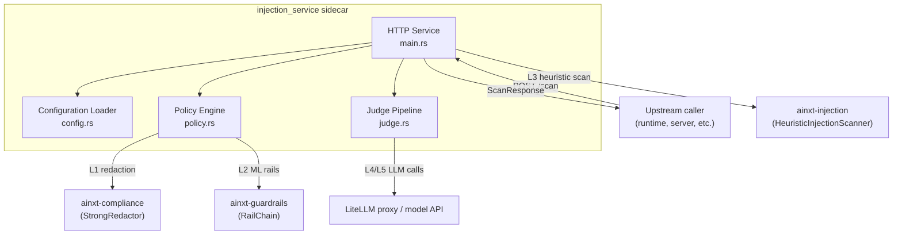
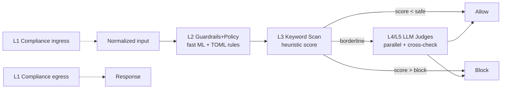

# injection_service

The `injection_service` module is an HTTP sidecar service that implements the ADR-009 prompt-injection and jailbreak defence stack. It exposes a single `/scan` endpoint that inspects incoming text chunks (user prompts, retrieved documents, connector data, tool results) and decides whether to allow, block, or fence the content before it reaches the downstream LLM or user.

## Purpose

- Provide a centralized, configurable defence layer against prompt injection, jailbreaks, prompt obfuscation, and sensitive-data leakage.
- Combine fast deterministic checks (guardrails, keyword scanning, compliance redaction) with slower but more accurate LLM-based judges.
- Operate as a standalone Axum service that can be deployed next to the main inference path or called remotely.

## Architecture Overview

The service is built from four internal source files, each documented in its own sub-module page:

| Sub-module | File | Responsibility |
|------------|------|----------------|
| [injection_service_config](injection_service_config.md) | `config.rs` | Loads and resolves TOML/env configuration, layer toggles, judge settings, and external rule file paths. |
| [injection_service_policy_engine](injection_service_policy_engine.md) | `policy.rs` | Implements L1 Compliance (PII redaction) and L2 Guardrails+Policy (ML rails + custom TOML rules). |
| [injection_service_judge_pipeline](injection_service_judge_pipeline.md) | `judge.rs` | Implements the L4/L5 LLM judge pipeline with circuit breakers, fallbacks, and cross-validation. |
| [injection_service_http_service](injection_service_http_service.md) | `main.rs` | Axum HTTP server, `/scan` and `/health` handlers, request/response wire types, and layer orchestration. |

> **Note:** The L3 keyword-scan detector is provided by the external `ainxt-injection` crate (part of the `ai_engine > safety_guardrails` module). This service configures and invokes it, but the detector implementation itself is documented under [ai_engine_safety_guardrails](../ai_engine/safety_guardrails.md).

## Defence Layers

`POST /scan` runs the following layers in order. Each layer can be enabled or disabled independently via the `[layers]` configuration section.

| Layer | Component | What it does |
|-------|-----------|--------------|
| L1 Compliance ingress | `PolicyEngine::check_compliance_ingress` | Redacts PAN, Aadhaar, card numbers, CVV, secrets from input. Never blocks. |
| L2 Guardrails+Policy | `PolicyEngine::check_guardrails_policy` | Runs `ainxt-guardrails` jailbreak/toxicity rails plus custom TOML deny/flag rules. |
| L3 Keyword Scan | `HeuristicInjectionScanner` (external crate) | Fast (~2 ms) heuristic scoring across six signal categories. |
| L4/L5 LLM Judges | `JudgePipeline::evaluate` | Two parallel LLM judges with optional Stage-2 cross-validation and majority vote. |
| L1 Compliance egress | `PolicyEngine::redact_egress` | Redacts sensitive data from the fenced output before returning it. |

## Request / Response Contract

- `POST /scan` accepts `{ chunks: [string], provenance?: string, tool_names?: [string] }`.
- Returns a `ScanResponse` containing `allowed`, `tainted`, `fenced`, `findings`, per-layer status, and an audit trail.
- `GET /health` returns service liveness, configured mode, and the enablement state of each layer.

## Dependencies on Other Modules

| Dependency | Module | Usage |
|------------|--------|-------|
| `ainxt-injection` | [ai_engine_safety_guardrails](../ai_engine/safety_guardrails.md) | `HeuristicInjectionScanner`, `InjectionDefenseConfig`, `InjectionMode`, `Provenance`, `RetrievalGuard` |
| `ainxt-guardrails` | [ai_engine_safety_guardrails](../ai_engine/safety_guardrails.md) | `GuardrailsConfig`, `RailChain`, `GuardrailOutcome`, `RailMode` |
| `ainxt-compliance` | [governance_compliance_compliance](../governance_compliance/compliance.md) | `StrongRedactor` for PAN/CVV/card/secret redaction |

## Configuration

Configuration is resolved in three layers (highest priority wins):

1. Compiled-in defaults.
2. `config.toml` (path from `AINXT_INJECTION_CONFIG`, or searched in CWD / binary dir / workspace root / crate dir).
3. Environment variables.

Key configuration groups include server bind settings, layer toggles, judge endpoints and models, keyword-scan thresholds, and external rule file paths. See [injection_service_config](injection_service_config.md) for the full reference.

## Operational Modes

The service supports three modes:

- `enforce` (default) — blocks are enforced and sensitive data is redacted.
- `audit` — layers run and log, but the response is always allowed.
- `off` — defence is disabled.

Additionally, individual layers can be toggled via `COMPLIANCE_LAYER`, `GUARDRAILS_POLICY_LAYER`, `KEYWORD_SCAN_LAYER`, and `LLM_JUDGES_LAYER` environment variables or the `[layers]` TOML section.
