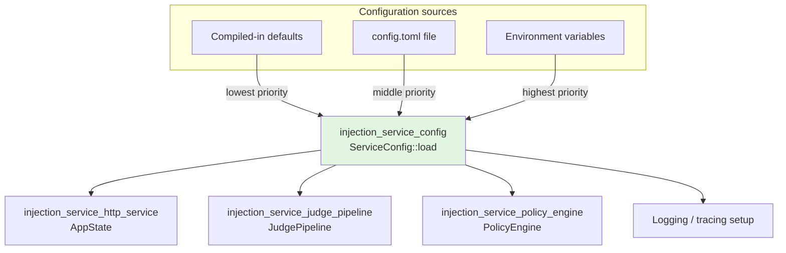
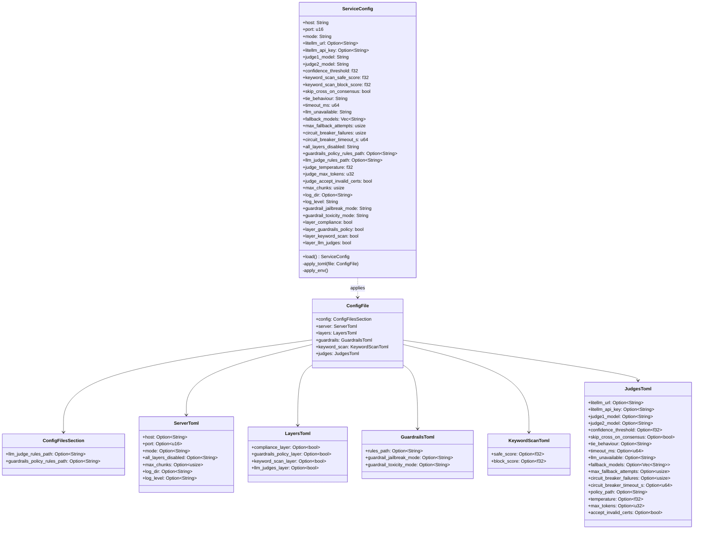
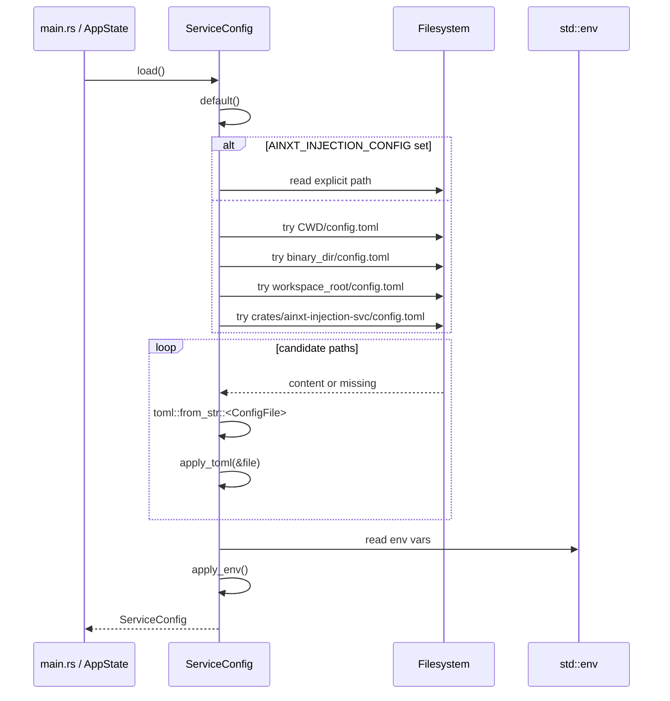
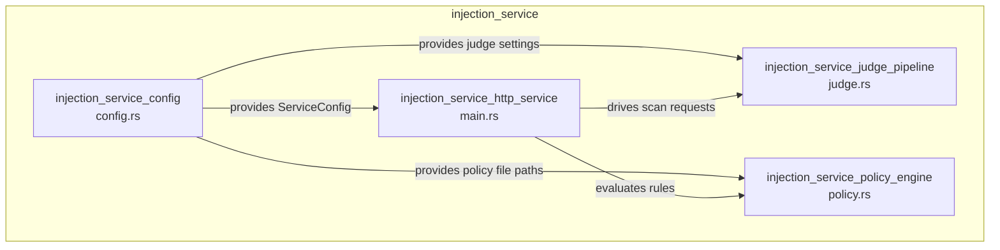
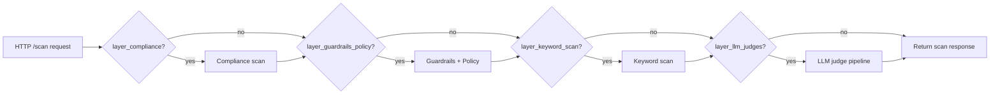

# injection_service_config

The `injection_service_config` module defines how the `ainxt-injection-svc` service is configured at startup. It is responsible for declaring the TOML schema, resolving defaults, and overlaying values from environment variables to produce a single, fully-resolved `ServiceConfig` value that the rest of the service consumes.

This module is intentionally narrow: it does **not** implement scanning, judging, or HTTP handling. Those responsibilities live in sibling modules. Instead, `injection_service_config` provides the central configuration contract that binds the server, the layered defense pipeline, the LLM judge client, and external policy files together.

---

## Core responsibilities

| Responsibility | Description |
| -------------- | ----------- |
| **TOML schema** | Deserialize the `config.toml` file into typed sections (`[server]`, `[judges]`, `[layers]`, `[guardrails]`, `[keyword_scan]`, `[config]`). |
| **Default values** | Provide safe compiled-in defaults so the service can start without any configuration file. |
| **Layered loading** | Apply configuration in priority order: defaults → TOML file → environment variables. |
| **Path resolution** | Search multiple candidate locations for `config.toml` when no explicit path is provided. |
| **Resolved contract** | Expose `ServiceConfig`, a struct with concrete non-optional fields, so downstream code does not need to reason about `Option` values. |

---

## Architecture

The configuration layer sits at the bottom of the injection service stack. It is read once at startup and then immutably shared with the HTTP service, judge pipeline, policy engine, and logging subsystem.

### Component diagram

---

## Configuration loading flow

`ServiceConfig::load()` is the single entry point used by the service binary. It performs three steps:

1. **Start with defaults** — `ServiceConfig::default()`.
2. **Overlay TOML** — search candidate paths for `config.toml` and call `apply_toml`.
3. **Overlay environment variables** — call `apply_env`, which has the highest priority.

### Path resolution

When `AINXT_INJECTION_CONFIG` is not set, the loader tries these locations in order:

1. `config.toml` in the current working directory.
2. `config.toml` next to the running binary.
3. `config.toml` at the workspace root (three directories above the binary).
4. `crates/ainxt-injection-svc/config.toml` relative to the workspace root.

The first readable and parseable file wins. If none are found, the service starts with compiled-in defaults.

---

## Configuration sections

### `[server]` — HTTP server and global behavior

| Field | Default | Description |
| ----- | ------- | ----------- |
| `host` | `127.0.0.1` | Bind address. |
| `port` | `8007` | Bind port. |
| `mode` | `enforce` | Global injection mode: `enforce`, `audit`, or `off`. |
| `all_layers_disabled` | `allow` | Behavior when every layer is disabled: `allow` or `block`. |
| `max_chunks` | `256` | Maximum chunks accepted per `/scan` request. |
| `log_dir` | `None` | Directory for log files; `None` logs to stderr only. |
| `log_level` | `info` | Log level: `trace`, `debug`, `info`, `warn`, or `error`. |

### `[judges]` — LLM judge pipeline

| Field | Default | Description |
| ----- | ------- | ----------- |
| `litellm_url` | `None` | LiteLLM proxy base URL. If unset, the LLM judge layer is disabled. |
| `litellm_api_key` | `None` | API key for the LiteLLM proxy. |
| `judge1_model` | `judge1` | Primary judge model name. |
| `judge2_model` | `judge2` | Secondary judge model name. |
| `confidence_threshold` | `0.8` | Minimum confidence for a verdict to count in the majority vote. |
| `skip_cross_on_consensus` | `true` | Skip Stage 2 cross-validation when Stage 1 judges agree. |
| `tie_behaviour` | `block` | Tie-breaking behavior: `block` or `allow`. |
| `timeout_ms` | `30000` | Per-judge HTTP timeout. |
| `llm_unavailable` | `block` | Behavior when both judges are unavailable: `block` or `allow`. |
| `fallback_models` | `[]` | Ordered list of fallback model names. |
| `max_fallback_attempts` | `3` | Maximum models to try per judge call. |
| `circuit_breaker_failures` | `5` | Consecutive failures before a model is circuit-broken. |
| `circuit_breaker_timeout_s` | `10` | Seconds to skip a failed model before probing again. |
| `policy_path` | `None` | Legacy path to `llm-judge-rules.toml`. |
| `temperature` | `0.0` | LLM sampling temperature. |
| `max_tokens` | `1024` | Maximum tokens in a judge response. |
| `accept_invalid_certs` | `true` | Accept invalid TLS certificates for the LiteLLM proxy. |

### `[keyword_scan]` — L3 keyword scan thresholds

| Field | Default | Description |
| ----- | ------- | ----------- |
| `safe_score` | `0.1` | Score at or below which L2/L3 judges are skipped. |
| `block_score` | `0.8` | Score at or above which the request is blocked immediately. |

### `[guardrails]` — L2 guardrail behavior

| Field | Default | Description |
| ----- | ------- | ----------- |
| `rules_path` | `None` | Legacy path to `guardrails-policy-rules.toml`. |
| `guardrail_jailbreak_mode` | `audit` | Jailbreak detection mode: `audit` or `enforce`. |
| `guardrail_toxicity_mode` | `enforce` | Toxicity detection mode: `enforce` or `audit`. |

### `[layers]` — per-layer enable/disable toggles

| Field | Default | Description |
| ----- | ------- | ----------- |
| `compliance_layer` | `true` | L1 compliance input scan and output redaction. |
| `guardrails_policy_layer` | `true` | L2 guardrails ML + TOML rules. |
| `keyword_scan_layer` | `true` | L3 keyword scan detector. |
| `llm_judges_layer` | `true` | L4/L5 LLM judge pipeline. |

### `[config]` — external file paths

| Field | Default | Description |
| ----- | ------- | ----------- |
| `llm_judge_rules_path` | `None` | Path to `llm-judge-rules.toml` containing LLM judge system prompts. |
| `guardrails_policy_rules_path` | `None` | Path to `guardrails-policy-rules.toml` containing L2 deny/allow rules. |

---

## Environment variable reference

Environment variables always override TOML values. The table below maps each variable to its TOML key.

| Environment variable | TOML key |
| -------------------- | -------- |
| `AINXT_INJECTION_SVC_HOST` | `server.host` |
| `AINXT_INJECTION_SVC_PORT` | `server.port` |
| `AINXT_INJECTION_MODE` | `server.mode` |
| `ALL_LAYERS_DISABLED` | `server.all_layers_disabled` |
| `SERVER_MAX_CHUNKS` | `server.max_chunks` |
| `LOG_DIR` | `server.log_dir` |
| `LOG_LEVEL` | `server.log_level` |
| `JUDGE_LITELLM_URL` | `judges.litellm_url` |
| `JUDGE_LITELLM_API_KEY` | `judges.litellm_api_key` |
| `JUDGE1_MODEL` | `judges.judge1_model` |
| `JUDGE2_MODEL` | `judges.judge2_model` |
| `JUDGE_CONFIDENCE_THRESHOLD` | `judges.confidence_threshold` |
| `KEYWORD_SCAN_SAFE_SCORE` | `keyword_scan.safe_score` |
| `KEYWORD_SCAN_BLOCK_SCORE` | `keyword_scan.block_score` |
| `JUDGE_SKIP_CROSS_ON_CONSENSUS` | `judges.skip_cross_on_consensus` |
| `JUDGE_TIE_BEHAVIOUR` | `judges.tie_behaviour` |
| `JUDGE_TIMEOUT_MS` | `judges.timeout_ms` |
| `JUDGES_LLM_UNAVAILABLE` | `judges.llm_unavailable` |
| `JUDGE_FALLBACK_MODELS` | `judges.fallback_models` |
| `JUDGE_MAX_FALLBACK_ATTEMPTS` | `judges.max_fallback_attempts` |
| `JUDGE_CB_FAILURES` | `judges.circuit_breaker_failures` |
| `JUDGE_CB_TIMEOUT_S` | `judges.circuit_breaker_timeout_s` |
| `JUDGE_TEMPERATURE` | `judges.temperature` |
| `JUDGE_MAX_TOKENS` | `judges.max_tokens` |
| `JUDGE_ACCEPT_INVALID_CERTS` | `judges.accept_invalid_certs` |
| `GUARDRAILS_POLICY_RULES_PATH` | `config.guardrails_policy_rules_path` |
| `LLM_JUDGE_RULES_PATH` | `config.llm_judge_rules_path` |
| `GUARDRAIL_JAILBREAK_MODE` | `guardrails.guardrail_jailbreak_mode` |
| `GUARDRAIL_TOXICITY_MODE` | `guardrails.guardrail_toxicity_mode` |
| `COMPLIANCE_LAYER` | `layers.compliance_layer` |
| `GUARDRAILS_POLICY_LAYER` | `layers.guardrails_policy_layer` |
| `KEYWORD_SCAN_LAYER` | `layers.keyword_scan_layer` |
| `LLM_JUDGES_LAYER` | `layers.llm_judges_layer` |

---

## Relationship to other modules

`injection_service_config` is one of four submodules under `injection_service`:

- **[injection_service_http_service](injection_service_http_service.md)** receives the resolved `ServiceConfig` in `AppState` and uses it to bind the HTTP server, configure logging, and decide which layers to run for each `/scan` request.
- **[injection_service_judge_pipeline](injection_service_judge_pipeline.md)** consumes the judge-related fields (`litellm_url`, `judge1_model`, `fallback_models`, circuit breaker settings, etc.) to call LiteLLM and produce verdicts.
- **[injection_service_policy_engine](injection_service_policy_engine.md)** reads the `guardrails_policy_rules_path` to load `PolicyRulesFile` and evaluate `PolicyRule` entries.

---

## Data flow during a scan request

The resolved `ServiceConfig` controls how a request flows through the layered pipeline. The diagram below shows the configuration gates that are checked at each layer.

If all layers are disabled, the service falls back to `all_layers_disabled` (`allow` or `block`) rather than returning an empty result.

---

## Backward compatibility

The loader supports several legacy TOML locations so older configuration files continue to work:

- `guardrails.rules_path` is mapped to `guardrails_policy_rules_path`.
- `judges.policy_path` is mapped to `llm_judge_rules_path`.
- The modern canonical locations are under `[config]` (`llm_judge_rules_path` and `guardrails_policy_rules_path`).

---

## Testing

The module includes unit tests that verify:

- Default values are sane.
- TOML values overlay correctly onto `ServiceConfig`.
- Environment variables override TOML values.

These tests live in the `tests` submodule of `config.rs` and can be run with `cargo test -p ainxt-injection-svc`.

---

## See also

- [injection_service](injection_service.md) — parent module overview
- [injection_service_http_service](injection_service_http_service.md) — HTTP API and request handling
- [injection_service_judge_pipeline](injection_service_judge_pipeline.md) — LLM judge pipeline
- [injection_service_policy_engine](injection_service_policy_engine.md) — TOML policy rule engine
