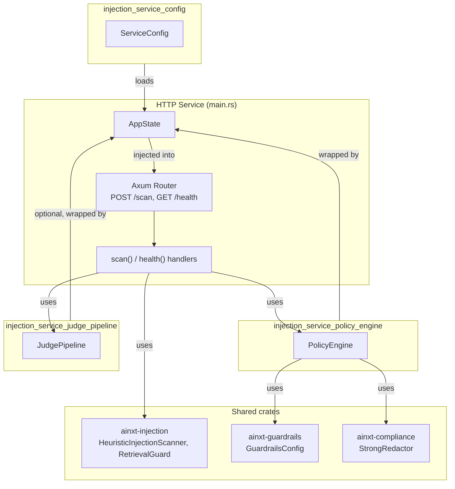
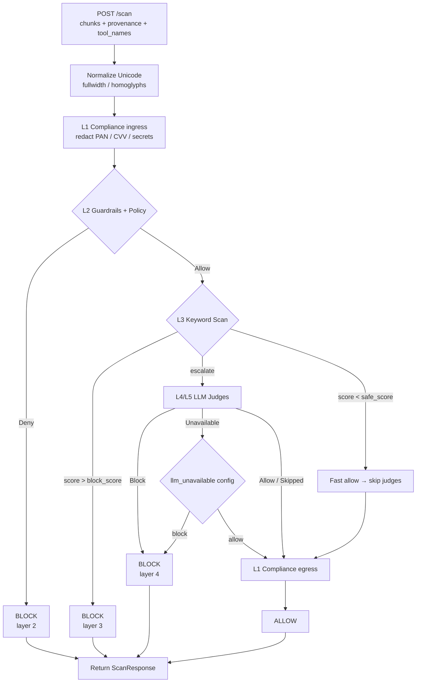
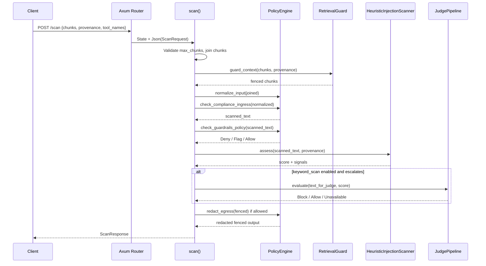
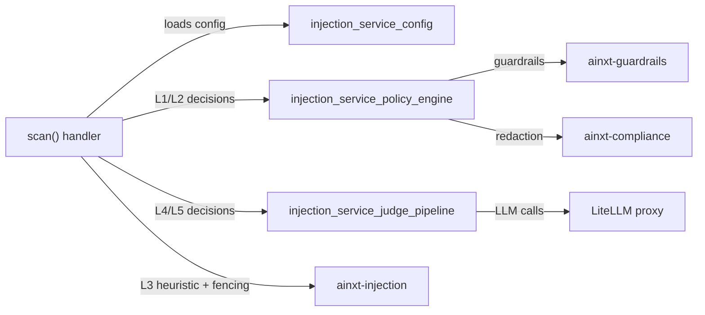
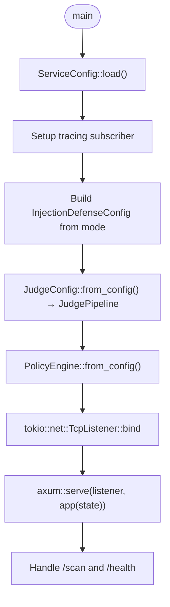

# injection_service_http_service

The `injection_service_http_service` module is the HTTP sidecar entry point for the `ainxt-injection-svc` crate. It exposes the ADR-009 prompt-injection detector over a small REST API and orchestrates the defence layers that inspect incoming text chunks before they reach the downstream AI runtime.

This module does not implement the detection algorithms itself. Instead, it wires together the sibling modules [`injection_service_config`](injection_service_config.md), [`injection_service_judge_pipeline`](injection_service_judge_pipeline.md), and [`injection_service_policy_engine`](injection_service_policy_engine.md), plus the shared `ainxt-injection`, `ainxt-guardrails`, and `ainxt-compliance` libraries, into a runnable Axum service.

## Purpose

- Provide a standalone, horizontally-scalable HTTP sidecar that can be placed in front of any component that ingests untrusted text.
- Offer a single `POST /scan` endpoint that runs configurable defence layers in a deterministic order.
- Offer a `GET /health` endpoint for load-balancer probes and operational visibility.
- Produce a structured, auditable response that tells callers whether the input was allowed, which layer blocked it, and what was redacted.

## Core Components

| Component | File | Responsibility |
|-----------|------|----------------|
| `AppState` | `main.rs` | Shared application state held by Axum: configuration, judge pipeline, policy engine, score thresholds, layer toggles, and failure-mode policies. |
| `ScanRequest` | `main.rs` | Incoming request wire type: `chunks`, optional `provenance`, optional `tool_names`. |
| `ScanResponse` | `main.rs` | Outgoing response wire type: `allowed`, `tainted`, `findings`, `fenced` output, per-layer status, audit log, timing. |
| `LayerStatus` | `main.rs` | Aggregate status object for L1 compliance, L2 guardrails+policy, L3 keyword scan, and L4/L5 LLM judges. |
| `PolicyLayerResult` | `main.rs` | Result shape for policy-style layers (L1/L2). |
| `KeywordScanResult` | `main.rs` | Result shape for the heuristic keyword scan layer (L3). |
| `JudgeResult` | `main.rs` | Result shape for the LLM judge pipeline (L4/L5). |
| `Finding` / `AuditEntry` | `main.rs` | Human-readable findings and structured audit entries. |
| `HealthResponse` | `main.rs` | Response type for the `/health` probe. |
| `IstTimer` | `main.rs` | Custom `tracing-subscriber` timer that formats timestamps in IST (UTC+05:30). |
| `scan` / `health` / `app` / `main` | `main.rs` | Axum handlers, router factory, and Tokio entry point. |

## Architecture

The service is built as a thin Axum wrapper around a multi-layer detection pipeline. All heavy lifting is delegated to the sibling modules and the shared crates they depend on.



## Defence Layers

The `POST /scan` handler evaluates text chunks through a fixed cascade of layers. Each layer can be toggled independently via the `[layers]` section of the service configuration. See [`injection_service_config`](injection_service_config.md) for the exact toggles and thresholds.



### Layer responsibilities

| Layer | Name | Implementation | Typical outcome |
|-------|------|----------------|-----------------|
| L1 | Compliance ingress / egress | [`injection_service_policy_engine`](injection_service_policy_engine.md) via `ainxt-compliance` | Redacts PAN, Aadhaar, card, CVV, OTP, secrets. Ingress runs before other layers; egress runs only when the request is about to be allowed. |
| L2 | Guardrails + Policy | [`injection_service_policy_engine`](injection_service_policy_engine.md) via `ainxt-guardrails` and TOML rules | Fast deterministic deny/flag based on jailbreak, toxicity, and custom policy rules. |
| L3 | Keyword Scan Detector | `ainxt-injection::HeuristicInjectionScanner` | ~2 ms heuristic scan across six signal categories. Scores below `keyword_scan_safe_score` allow immediately; scores above `keyword_scan_block_score` block immediately; everything else escalates. |
| L4/L5 | LLM Judge Pipeline | [`injection_service_judge_pipeline`](injection_service_judge_pipeline.md) | Two parallel LLM judges with optional Stage-2 cross-validation via LiteLLM. Verdicts below `confidence_threshold` are ignored; majority vote decides. |

## Data Flow

A single `POST /scan` request flows through the service as follows:



## Component Interactions

The HTTP handler owns the orchestration logic, but the actual decisions are made by the sibling modules and shared crates:



- [`injection_service_config`](injection_service_config.md) is read once at startup and drives which layers are enabled, which models are used, and what thresholds apply.
- [`injection_service_policy_engine`](injection_service_policy_engine.md) is created from config and reused across requests. It handles Unicode normalization, compliance redaction, guardrails, and TOML policy rules.
- [`injection_service_judge_pipeline`](injection_service_judge_pipeline.md) is optional. It is created only when `litellm_url` and `litellm_api_key` are present and the L4/L5 layer is enabled.
- `ainxt-injection` provides the fast heuristic scanner and the `RetrievalGuard` fencing utility.

## Request / Response Contract

### `POST /scan`

Request body:

```json
{
  "chunks": ["untrusted text chunk 1", "chunk 2"],
  "provenance": "tool-result",
  "tool_names": ["search", "calculator"]
}
```

- `chunks` — required array of text fragments to scan.
- `provenance` — optional hint: `retrieved`, `retrieved-document`, `connector`, `connector-data`, `user`, `user-direct`, or `tool-result` (default).
- `tool_names` — optional list of known tool names; passed to `RetrievalGuard` to improve detection of tool-call injection.

Response body (`ScanResponse`):

```json
{
  "mode": "enforce",
  "allowed": false,
  "tainted": true,
  "timestamp": "2026-08-06T23:53:42.192+05:30",
  "duration_ms": 45,
  "blocked_layer": 2,
  "blocked_by": "L2:guardrails-policy:jailbreak",
  "friendly_message": null,
  "findings": [{"index": 0, "reasons": ["jailbreak: role-play request"]}],
  "fenced": ["<untrusted source=\"tool-result\">..."],
  "audit": [{"timestamp": "...", "layer": "L2:guardrails-policy", "rule_id": "jailbreak", "message": "role-play request"}],
  "layers": {
    "compliance": {"layer": 1, "enabled": true, "called": true, "passed": true, ...},
    "guardrails_policy": {"layer": 2, "enabled": true, "called": true, "passed": false, ...},
    "keyword_scan": {"layer": 3, ...},
    "llm_judges": {"layer": "4/5", ...}
  }
}
```

Key fields:

- `allowed` — final allow/block decision.
- `tainted` — true if any layer flagged or blocked the input.
- `blocked_layer` — numeric layer that caused the block, if any.
- `blocked_by` — human-readable identifier of the blocking rule or layer.
- `findings` — per-chunk reasons when the heuristic scanner fires; otherwise a single aggregated finding at index 0.
- `fenced` — input chunks wrapped in an untrusted-source fence that downstream prompts can use to mark data as non-instructional.
- `layers` — detailed status of every layer for this request.
- `audit` — structured log entries suitable for downstream SIEM ingestion.

### `GET /health`

Response body (`HealthResponse`):

```json
{
  "status": "ok",
  "mode": "enforce",
  "scans_retrieved": true,
  "judges_enabled": true,
  "policy_enabled": true,
  "layer_compliance": true,
  "layer_guardrails_policy": true,
  "layer_keyword_scan": true,
  "layer_llm_judges": true
}
```

## Failure Modes

The service encodes two important failure policies in `AppState`:

| Policy | Config key | Default | Behaviour |
|--------|------------|---------|-----------|
| LLM judges unavailable | `llm_unavailable` | `block` | When the L4/L5 pipeline returns `JudgeOutcome::Unavailable`, the request is blocked unless explicitly set to `allow`. In `allow` mode, the request proceeds to L1 egress and is marked `tainted`. |
| All layers disabled | `all_layers_disabled` | `allow` | When every layer is toggled off, the request is allowed by default unless set to `block`. |

These defaults reflect a safety-first stance for the LLM judge path and a convenience stance for local development when all layers are disabled.

## Logging and Observability

- All scan results are logged via `tracing` at `info` level in a compact, human-readable format.
- Blocked requests include the blocking layer, reason, and an 80-character input preview.
- Full JSON responses are emitted at `debug` level for forensic replay.
- When `log_dir` is configured, logs are written both to stderr and to hourly-rotated files named `ainxt-injection-svc-YYYY-MM-DD-HH.log`.
- Timestamps are formatted in IST (UTC+05:30) by the custom `IstTimer`.

## Process Flow at Startup



## Relationship to the Overall System

The `injection_service_http_service` module belongs to the `injection_service` subsystem, which sits within the broader `ai_engine` / `safety_guardrails` area of the platform. It is a sidecar rather than an embedded library, so it can be deployed independently of the main runtime and scaled based on ingress traffic.

Upstream callers are typically other platform services or gateways that need to sanitize untrusted text before passing it to the prompt engine, retrieval pipeline, or tool executor. Downstream, the service relies on:

- [`injection_service_config`](injection_service_config.md) for configuration parsing.
- [`injection_service_policy_engine`](injection_service_policy_engine.md) for deterministic policy and compliance decisions.
- [`injection_service_judge_pipeline`](injection_service_judge_pipeline.md) for probabilistic LLM-based judgement.
- `ainxt-injection` for fast heuristic detection and fencing.
- `ainxt-guardrails` and `ainxt-compliance` for guardrail and redaction primitives.

## References

- [`injection_service_config`](injection_service_config.md)
- [`injection_service_judge_pipeline`](injection_service_judge_pipeline.md)
- [`injection_service_policy_engine`](injection_service_policy_engine.md)
