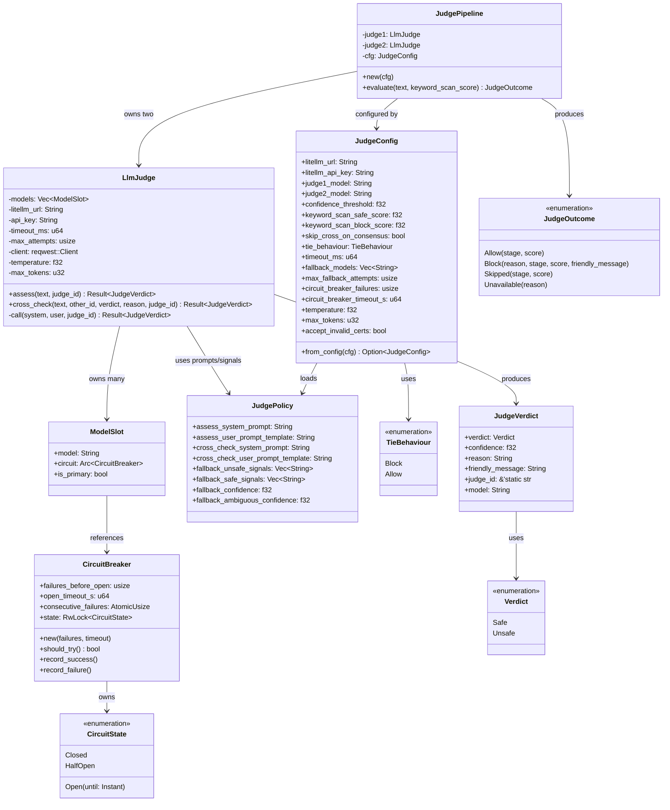
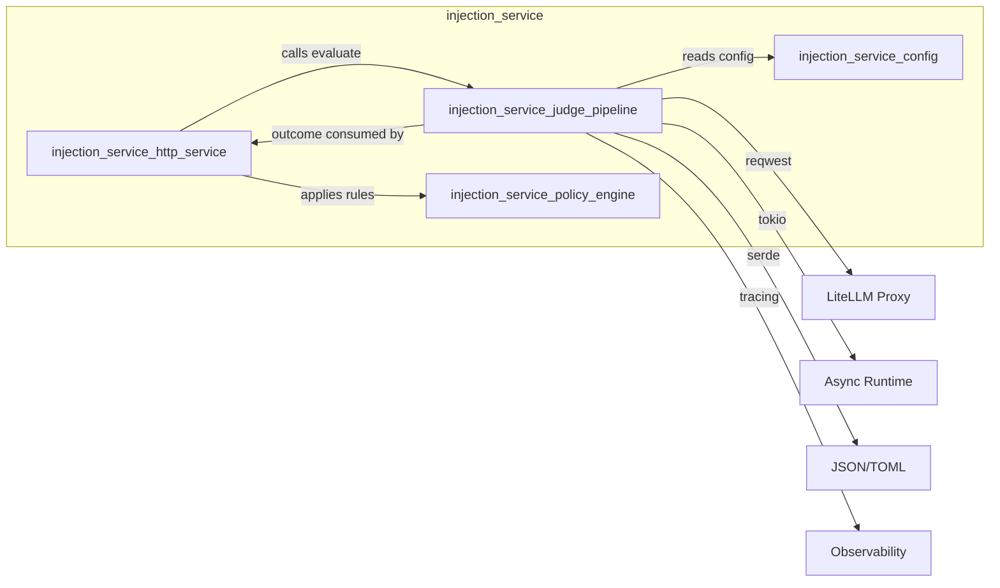
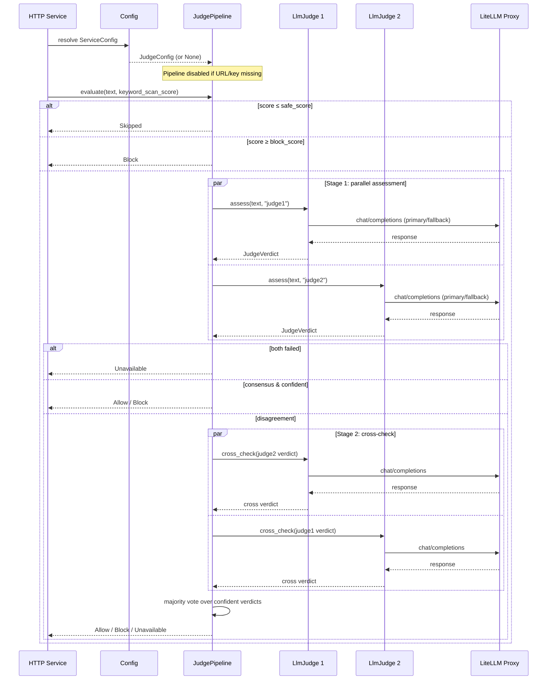
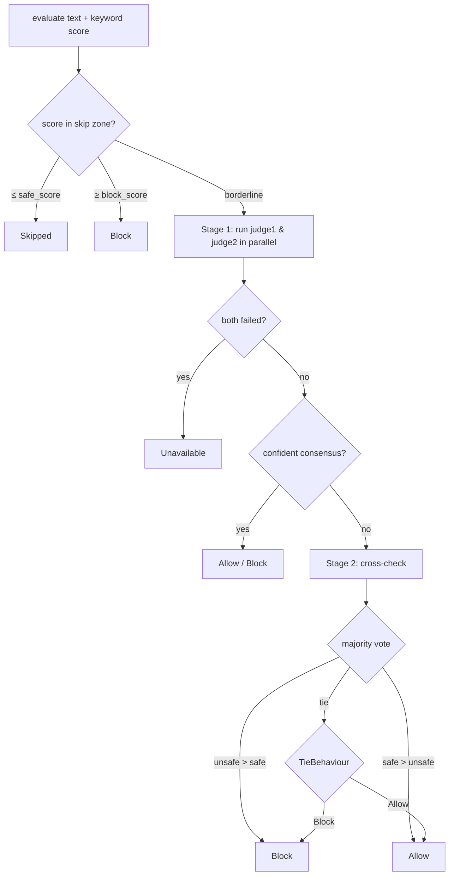
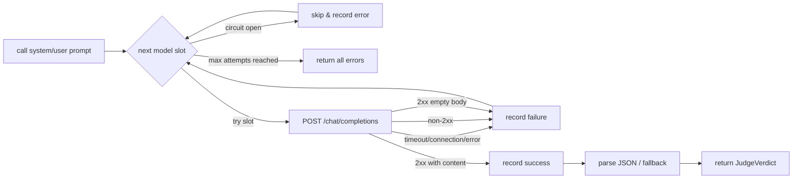

# Injection Service Judge Pipeline

## Introduction

The `injection_service_judge_pipeline` module implements the LLM-based adjudication layer of the `injection_service`. It provides a resilient, model-agnostic **two-stage judge pipeline** that evaluates user text for prompt injection, jailbreak attacks, financial fraud, and unauthorized action requests.

The pipeline is designed to be **fail-closed**: ambiguous or tied outcomes default to blocking unless explicitly configured otherwise. It runs as Layer 2 of the injection defence stack, sitting between the fast heuristic/keyword scan (Layer 1) and the policy engine (Layer 3). For details on how requests enter and leave this layer, see [`injection_service_http_service`](injection_service_http_service.md); for configuration loading, see [`injection_service_config`](injection_service_config.md); and for the policy rules that consume the judge outcome, see [`injection_service_policy_engine`](injection_service_policy_engine.md).

---

## Module Overview

| Aspect | Description |
|--------|-------------|
| **Crate** | `ainxt-injection-svc` |
| **Source file** | `crates/ainxt-injection-svc/src/judge.rs` |
| **Responsibility** | LLM adjudication, consensus/cross-check logic, model fallback, circuit breaking |
| **Deployment role** | Layer 2 judge inside the injection defence microservice |
| **Key abstraction** | `JudgePipeline` orchestrates two `LlmJudge` instances |

The module exposes a small public surface:

- `JudgeConfig` — resolved configuration (prefer `from_config` over `from_env`).
- `JudgePipeline` — the main entry point for evaluating text.
- `JudgeOutcome` / `JudgeVerdict` / `Verdict` — result types consumed by the HTTP service.
- `CircuitBreaker` and `ModelSlot` — internal resilience primitives.

---

## Core Components

### Circuit Breaker & Model Slot

`CircuitBreaker` tracks per-model health using a `Closed → Open → HalfOpen` state machine. After a configurable number of consecutive failures, the breaker opens and skips the model for a cooldown period. A single probe is allowed in `HalfOpen`; success closes the breaker, failure reopens it.

`ModelSlot` pairs a model identifier with its own `Arc<CircuitBreaker>` and a primary/fallback flag. Each `LlmJudge` owns an ordered list of slots: one primary followed by rotated fallbacks.

### Judge Policy

`JudgePolicy` and its TOML counterpart `JudgePolicyFile` load prompt templates and fallback signal keywords from `llm-judge-rules.toml` at startup. If the configured file is missing or invalid, the pipeline falls back to a compiled-in default. The policy supplies:

- Assessment system/user prompts.
- Cross-check system/user prompts.
- Plain-text fallback signal keywords and confidence caps.

### Judge Configuration

`JudgeConfig` is built from a resolved [`ServiceConfig`](injection_service_config.md). It returns `None` when the LiteLLM URL or API key is absent, which disables the judge pipeline so that only Layer 1 and Layer 3 defences run. Key tunables include confidence threshold, keyword-scan skip/block scores, tie behaviour, timeout, fallback pool, and circuit-breaker settings.

### LlmJudge

`LlmJudge` is a generic, model-agnostic judge. For each call it:

1. Iterates over its model slots.
2. Skips slots with an open circuit.
3. Sends a chat-completion request to the LiteLLM proxy.
4. Parses the response, with JSON-first parsing and a plain-text fallback.
5. Records success/failure on the circuit breaker.

Two operations are supported:

- `assess(text, judge_id)` — primary classification.
- `cross_check(text, other_judge_id, other_verdict, other_reason, judge_id)` — Stage 2 review of the other judge's verdict.

### JudgePipeline

`JudgePipeline` owns two `LlmJudge` instances and implements the consensus/cross-check algorithm:

1. **Skip zone** — bypass judges if the keyword scan score is below the safe threshold or above the block threshold.
2. **Stage 1** — run both judges in parallel.
3. **Consensus shortcut** — if both judges agree with confidence above the threshold, return immediately (unless disabled).
4. **Stage 2** — on disagreement, each judge reviews the other's confident verdict.
5. **Majority vote** — count confident verdicts across all available assessments; ties follow `TieBehaviour`.

### Verdict & Wire Types

- `Verdict` — `Safe` or `Unsafe`.
- `JudgeVerdict` — verdict, confidence, reason, friendly message, judge id, and actual model used.
- `JudgeOutcome` — final pipeline result: `Allow`, `Block`, `Skipped`, or `Unavailable`.
- `LiteLlmRequest`, `LiteLlmResponse`, `LiteLlmMessage`, `LiteLlmChoice`, `LiteLlmChoiceMessage`, `LiteLlmProviderFields` — LiteLLM proxy wire types.
- `LlmJudgeReply` — expected JSON schema from the LLM.

---

## Architecture

---

## Dependencies

The judge pipeline depends on:

- [`injection_service_config`](injection_service_config.md) — `ServiceConfig` resolution and environment-driven defaults.
- [`injection_service_http_service`](injection_service_http_service.md) — orchestrates the scan request and consumes `JudgeOutcome`.
- [`injection_service_policy_engine`](injection_service_policy_engine.md) — applies policy rules after the judge layer.
- External crates: `serde`/`toml` for serialization and policy loading, `reqwest` for HTTP, `tokio` for async concurrency, `tracing` for diagnostics.

---

## Data Flow

---

## Process Flows

### Evaluation Flow

### Per-Judge Call & Fallback Flow

### Cross-Validation Flow

Cross-validation is only triggered when Stage 1 judges disagree or lack confident consensus. Each judge reviews the other judge's confident verdict and produces an independent second opinion. The pipeline then performs a majority vote across all confident verdicts from Stage 1 and Stage 2.

---

## Configuration

Configuration is sourced from the resolved [`ServiceConfig`](injection_service_config.md). The following environment variables control the judge pipeline:

| Variable | Default | Purpose |
|----------|---------|---------|
| `LITELLM_URL` | — | LiteLLM proxy base URL |
| `LITELLM_API_KEY` | — | API key for the proxy |
| `JUDGE1_MODEL` | — | Primary model for judge 1 |
| `JUDGE2_MODEL` | — | Primary model for judge 2 |
| `JUDGE_CONFIDENCE_THRESHOLD` | `0.9` | Minimum confidence for a verdict to count |
| `KEYWORD_SCAN_SAFE_SCORE` | `0.1` | Skip judges below this score |
| `KEYWORD_SCAN_BLOCK_SCORE` | `0.8` | Block immediately above this score |
| `JUDGE_SKIP_CROSS_ON_CONSENSUS` | `true` | Skip Stage 2 when Stage 1 agrees |
| `JUDGE_TIE_BEHAVIOUR` | `block` | Tie-breaking policy |
| `JUDGE_TIMEOUT_MS` | `5000` | Per-judge request timeout |
| `FALLBACK_MODELS` | `[]` | Ordered fallback model pool |
| `MAX_FALLBACK_ATTEMPTS` | `2` | Max models tried per judge call |
| `CIRCUIT_BREAKER_FAILURES` | `3` | Failures before opening circuit |
| `CIRCUIT_BREAKER_TIMEOUT_S` | `30` | Cooldown before probing again |
| `JUDGE_TEMPERATURE` | `0.0` | LLM sampling temperature |
| `JUDGE_MAX_TOKENS` | `1024` | Max response tokens |
| `JUDGE_ACCEPT_INVALID_CERTS` | `true` | Accept invalid TLS certificates |
| `LLM_JUDGE_RULES_PATH` | built-in | Path to `llm-judge-rules.toml` |

The fallback pool is deduplicated against `judge1_model` and `judge2_model` at startup, and fallback ordering is rotated between the two judges to reduce correlated failures.

---

## Integration with the Overall System

The judge pipeline is one of four submodules of `injection_service`:

- [`injection_service_config`](injection_service_config.md) loads and validates service configuration.
- [`injection_service_judge_pipeline`](injection_service_judge_pipeline.md) (this module) performs LLM adjudication.
- [`injection_service_policy_engine`](injection_service_policy_engine.md) applies deterministic policy rules.
- [`injection_service_http_service`](injection_service_http_service.md) exposes the HTTP API and orchestrates the scan layers.

Within the broader system, the injection service belongs to the `ai_engine` → `safety_guardrails` domain, alongside dedicated injection detection and guardrail crates. The service itself is a thin HTTP wrapper that combines fast heuristic scans, LLM judges, and policy rules into a single `/scan` endpoint.

---

## Operational Notes

- **Fail-closed by default**: Ties and unavailable judges surface as `Block` or `Unavailable`, letting the HTTP service decide whether to reject the request.
- **No hardcoded models**: All model identifiers, prompts, and thresholds are configuration-driven.
- **Resilience**: Per-model circuit breakers and a rotated fallback pool protect against transient model outages.
- **Observability**: Every judge call is logged via `tracing` with judge id, model, verdict, confidence, and reason.
- **Plain-text fallback**: If the LLM returns prose instead of the expected JSON schema, keyword signal matching provides a degraded but deterministic verdict.
