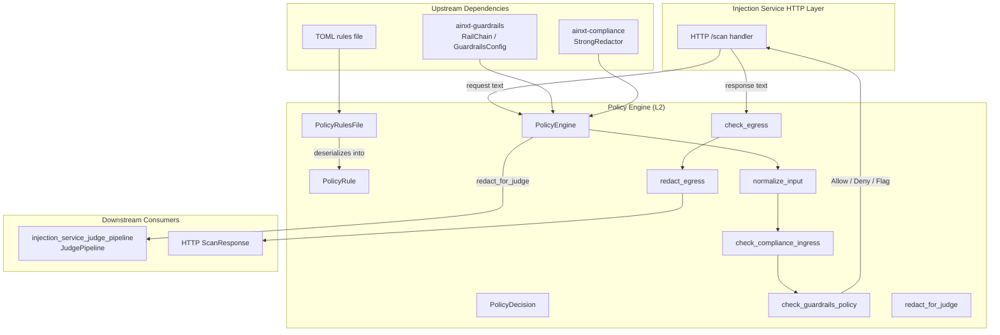
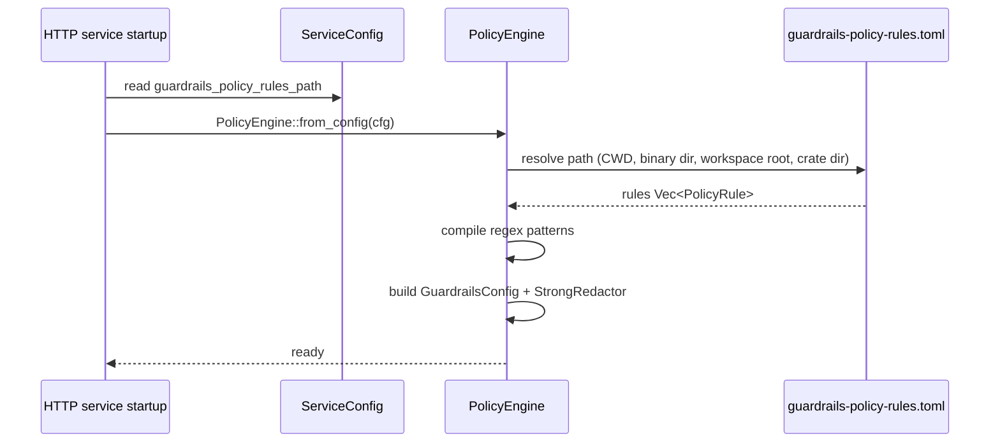
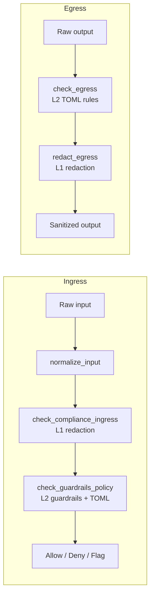
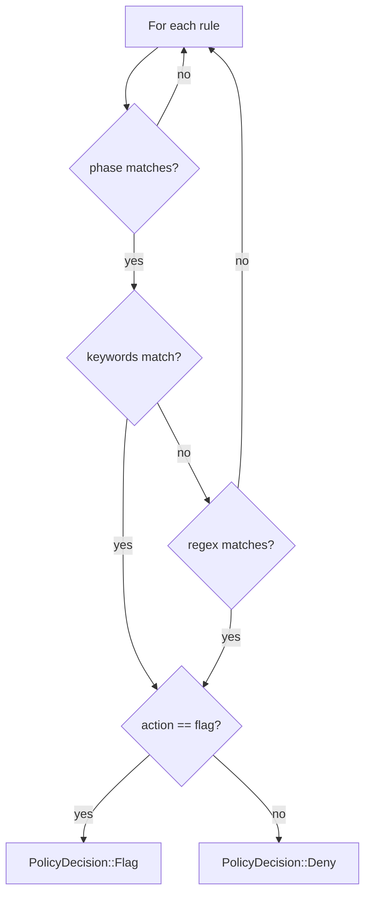
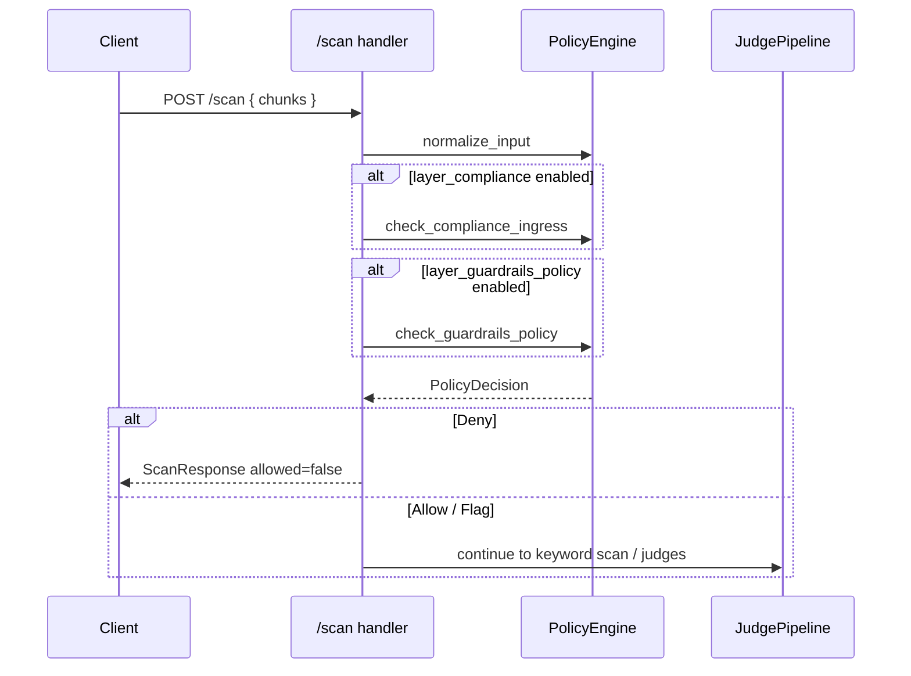

# Injection Service Policy Engine

The **Policy Engine** is the L2 guardrails and policy enforcement layer of the `ainxt-injection-svc` HTTP service. It sits between the L1 compliance redactor and the L3/L4/L5 heuristic and LLM-judge layers, applying configurable content policies to both incoming requests (ingress) and outgoing responses (egress).

For the service as a whole, see [`injection_service_http_service.md`](injection_service_http_service.md). For the configuration model that feeds this engine, see [`injection_service_config.md`](injection_service_config.md). For the LLM judge pipeline that handles deeper semantic analysis, see [`injection_service_judge_pipeline.md`](injection_service_judge_pipeline.md).

---

## Purpose

The policy engine has three responsibilities:

1. **Normalize input text** so that downstream layers see obfuscated attacks in their plain form (fullwidth Unicode, Cyrillic homoglyphs, etc.).
2. **Enforce L2 guardrails + policy** on ingress using the `ainxt-guardrails` `RailChain` (jailbreak and toxicity detection) plus deployment-specific TOML rules.
3. **Enforce egress policy** on outgoing responses using TOML rules, while leaving PCI/DLP redaction to the L1 compliance layer.

It also provides helper redaction utilities used by the LLM judge pipeline to sanitize text before it is sent to external models.

---

## Architecture

---

## Core Components

### `PolicyEngine`

The central stateful evaluator. It is constructed once at startup from [`ServiceConfig`](injection_service_config.md) and reused across all scan requests.

| Field | Purpose |
|-------|---------|
| `guardrails_cfg` | `ainxt-guardrails` configuration controlling jailbreak/toxicity modes. |
| `redactor` | `ainxt-compliance` `StrongRedactor` for PAN, CVV, card numbers, secrets. |
| `rules` | NPCI-specific rules loaded from `guardrails-policy-rules.toml`. |
| `patterns` | Compiled regex cache, one entry per rule. |

Construction path:

### `PolicyRule`

A single TOML-loaded rule. Each rule declares how it matches and what action to take.

| Field | Description |
|-------|-------------|
| `id` | Unique identifier, e.g. `"RBI-UPI-001"`. |
| `description` | Human-readable reason returned in denials. |
| `keywords` | Case-insensitive substrings; any match triggers the rule. |
| `pattern` | Optional regex pattern. |
| `phase` | `"ingress"`, `"egress"`, or `"both"`. |
| `action` | `"deny"` (default) or `"flag"`. |

### `PolicyRulesFile`

Thin deserialization wrapper around the TOML file's top-level `rules` array.

### `PolicyDecision`

The outcome type produced by all policy checks.

| Variant | Meaning |
|---------|---------|
| `Allow` | Content may proceed. |
| `Deny { policy_id, reason }` | Content is blocked; `policy_id` and `reason` are reported. |
| `Flag { policy_id, reason }` | Content is allowed but logged for audit. |

---

## Two-Phase Gate

### Ingress path

1. **`normalize_input`** — converts fullwidth Latin (`Ａ` → `A`) and common Cyrillic homoglyphs (`А`, `В`, `Е`, etc.) to ASCII so obfuscation cannot bypass later layers.
2. **`check_compliance_ingress`** — L1 redaction. Uses `StrongRedactor` plus India-specific PAN and Aadhaar patterns. Does **not** block; returns cleaned text and a redaction count.
3. **`check_guardrails_policy`** — L2 enforcement.
   - Runs `RailChain` for jailbreak and toxicity.
   - If the rail returns `Blocked`, emits `PolicyDecision::Deny`.
   - If the rail returns `Flagged`, logs the flag but continues (audit mode).
   - Evaluates TOML rules whose `phase` is `"ingress"` or `"both"`.

### Egress path

1. **`check_egress`** — evaluates TOML rules whose `phase` is `"egress"` or `"both"`. Hard-denies sensitive patterns such as Aadhaar numbers.
2. **`redact_egress`** — L1 redaction of PAN, CVV, card numbers, and secrets before the response is returned to the user.

---

## Rule Evaluation

Rules are evaluated in file order. The first matching rule wins.

Keyword matching is case-insensitive. Regex matching uses the original (normalized for ingress) text. If both `keywords` and `pattern` are present, keywords are checked first and regex is used only as a fallback.

---

## Judge Redaction Helper

`redact_for_judge` sanitizes text before it is sent to external LLM judges. It performs four steps:

1. Redact India PAN numbers (`ABCDE1234F`).
2. Redact Aadhaar numbers (`1234 5678 9012`).
3. Redact card/CVV/secrets via `StrongRedactor`.
4. Redact Indian mobile numbers (`+91 ...` or 10-digit starting with 6–9).
5. Context-gated redaction of 9–18 digit bank account numbers when banking keywords are present.

This utility is used by the [`JudgePipeline`](injection_service_judge_pipeline.md) to avoid leaking PII into model prompts.

---

## Configuration

The engine is driven by the following fields in `ServiceConfig`:

| Field | Effect |
|-------|--------|
| `guardrails_policy_rules_path` | Path to `guardrails-policy-rules.toml`. If absent, only guardrails + compliance run. |
| `guardrail_jailbreak_mode` | `"enforce"` or `"audit"`. |
| `guardrail_toxicity_mode` | `"enforce"` or `"audit"`. |
| `layer_compliance` | Toggles L1 compliance (controlled by the HTTP layer). |
| `layer_guardrails_policy` | Toggles L2 policy engine (controlled by the HTTP layer). |

See [`injection_service_config.md`](injection_service_config.md) for the full configuration schema.

---

## Dependencies

| Crate / Module | Role |
|----------------|------|
| `ainxt-guardrails` | Provides `RailChain`, `GuardrailsConfig`, `GuardrailOutcome`, `RailMode`, plus jailbreak and toxicity rails. See [`ai_engine/safety_guardrails`](../ai_engine/safety_guardrails.md). |
| `ainxt-compliance` | Provides `StrongRedactor` for PCI/DLP redaction. See [`governance_compliance/compliance`](../governance_compliance/compliance.md). |
| `regex_lite` | Lightweight regex engine for rule patterns and India-specific PII. |
| `serde` + `toml` | Deserialization of `guardrails-policy-rules.toml`. |

---

## Integration with the HTTP Service

The HTTP service constructs one `PolicyEngine` at startup and stores it in `AppState`. On each `/scan` request it invokes the engine according to the layer toggles:

Results are surfaced in `ScanResponse.layers.guardrails_policy` as a [`PolicyLayerResult`](injection_service_http_service.md), which records the layer number, whether it was enabled/called/passed, and the triggering `rule_id` and `reason`.

---

## Error Handling and Resilience

- If the configured rules file cannot be found or parsed, the engine logs a warning and continues with guardrails + compliance only.
- Invalid regex patterns are logged per-rule and skipped; other rules continue to work.
- The engine never panics on malformed input; regex compilation errors are handled gracefully.

---

## Testing

The module includes unit tests covering:

- Clean ingress/egress text is allowed.
- Jailbreak prompts are flagged (audit mode) rather than hard-blocked by guardrails.
- Keyword-based ingress rules deny matching input.
- Phase filtering prevents egress-only rules from firing on ingress.
- Egress card numbers are redacted by compliance.
- Regex-based egress rules deny Aadhaar patterns.
- `"both"` phase rules fire on ingress and egress.
- `"flag"` action returns `Flag`, not `Deny`.

---

## Related Documentation

- [`injection_service_http_service.md`](injection_service_http_service.md) — HTTP service, `AppState`, `ScanRequest`, `ScanResponse`, layer orchestration.
- [`injection_service_config.md`](injection_service_config.md) — `ServiceConfig`, TOML configuration structures.
- [`injection_service_judge_pipeline.md`](injection_service_judge_pipeline.md) — LLM judge pipeline and `redact_for_judge` consumer.
- [`ai_engine_safety_guardrails.md`](../ai_engine/safety_guardrails.md) — `ainxt-guardrails` rail chain and guardrail types.
- [`governance_compliance_compliance.md`](../governance_compliance/compliance.md) — `ainxt-compliance` redaction engine.
