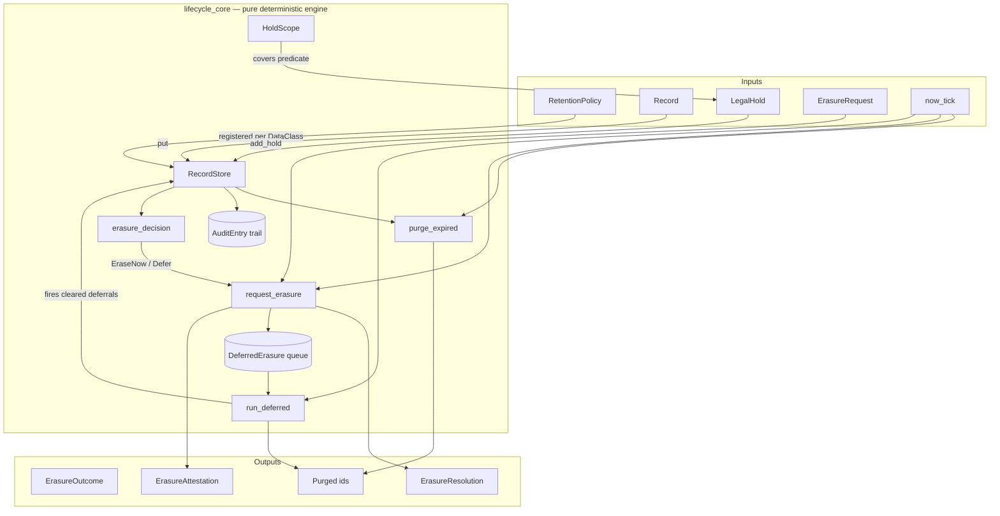
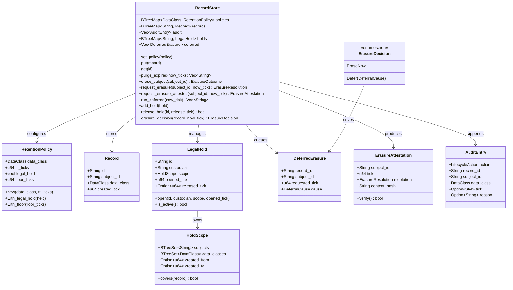
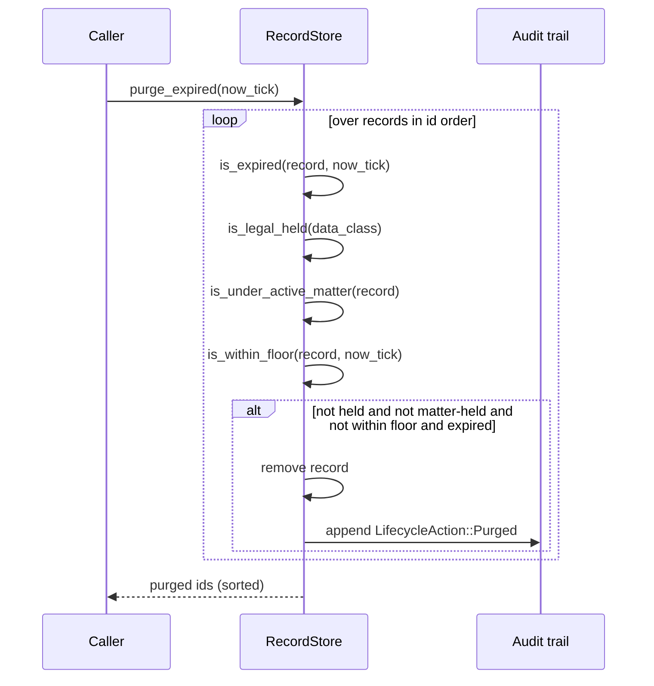
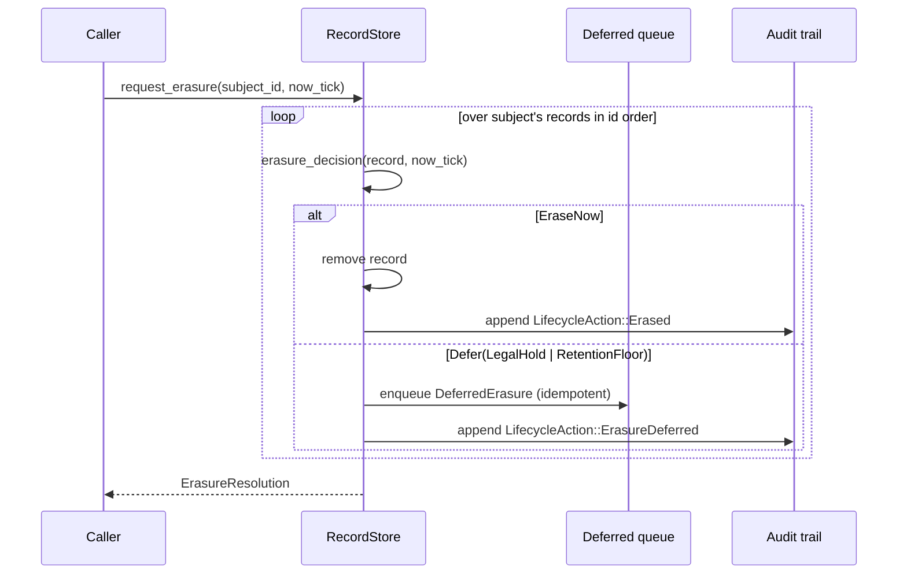
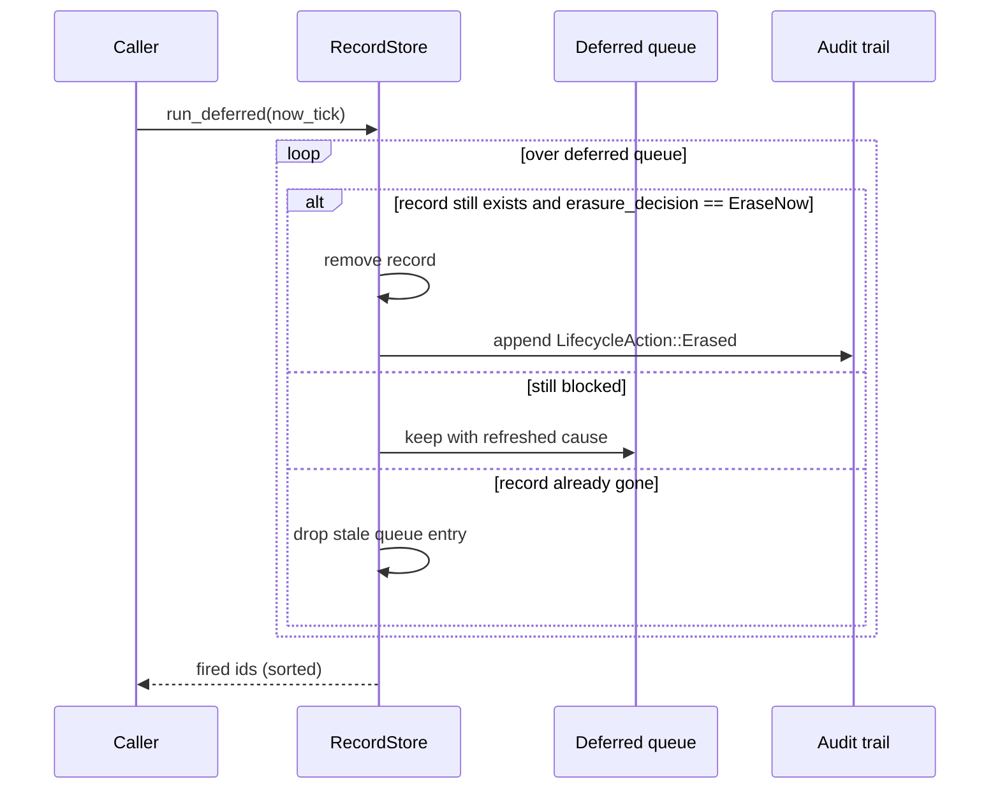
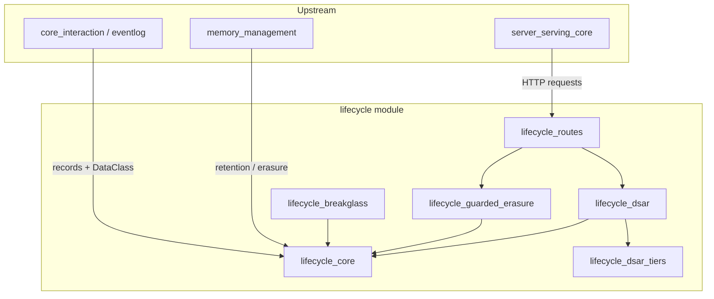

# lifecycle_core

## Brief Introduction

`lifecycle_core` is the deterministic data-lifecycle and retention engine inside the `lifecycle` governance module. It resolves the three-way tension between:

- **DPDP right-to-erasure** — a data principal can demand their records be deleted.
- **Statutory retention (TTL)** — records expire and must be purged once past their window.
- **Legal-hold** — a litigation or investigation preservation obligation that overrides both TTL and erasure.

The crate is intentionally **pure**: logical time is passed in as a tick, there is no wall clock, no RNG, and no I/O. This makes every purge, erasure, deferral, and audit entry reproducible and regulator-auditable. The precedence rule is hard-coded and model-free:

1. **Legal-hold** (class-wide or per-matter) preserves matching records.
2. **Statutory retention floor** defers erasure until the floor elapses.
3. **Erase-now** applies when neither hold nor floor blocks the request.

For the higher-level DSAR workflow, break-glass redaction, guarded tiered erasure, and HTTP route wrappers, see the sibling modules linked below.

---

## Core Concepts

### Records and Policies

A [`Record`](lifecycle_core.md#record) is the unit of governed data:

```rust
pub struct Record {
    pub id: String,
    pub subject_id: String,   // data principal
    pub data_class: DataClass,
    pub created_tick: u64,    // logical creation time
}
```

A [`RetentionPolicy`](lifecycle_core.md#retentionpolicy) defines the lifecycle for one [`DataClass`](security_config_identity.md#dataclass):

- `ttl_ticks` — retention **ceiling**. The record becomes eligible for TTL purge at `created_tick + ttl_ticks`.
- `floor_ticks` — statutory retention **floor**. An erasure request is deferred until `created_tick + floor_ticks`.
- `legal_hold` — class-wide preservation switch.

Records whose class has **no policy** are never TTL-purged (fail-safe), but are still erasable on subject request.

### Legal-Hold Matters

[`LegalHold`](lifecycle_core.md#legalhold) represents a per-matter preservation obligation with a [`HoldScope`](lifecycle_core.md#holdscope) predicate. A scope can narrow the hold by subject, data class, and creation-tick range; an empty scope covers every record. A matter is opened at a tick and released later with a reason. Releasing a matter does **not** itself erase anything — deferred erasures must be fired by [`run_deferred`](lifecycle_core.md#recordstore).

### Erasure Precedence

[`erasure_decision`](lifecycle_core.md#recordstore) returns one of:

- `EraseNow` — no active hold and no floor in the way.
- `Defer(LegalHold { matter_id })` — covered by an active matter.
- `Defer(RetentionFloor { floor_expiry })` — still within statutory floor.

This decision is used by [`request_erasure`](lifecycle_core.md#recordstore), which produces an [`ErasureResolution`](lifecycle_core.md#erasureresolution): records erased now plus records deferred with a reason-coded notice.

### Audit and Attestation

Every lifecycle action is appended to an immutable [`AuditEntry`](lifecycle_core.md#auditentry) trail. Actions include `Purged`, `Erased`, `ErasureRefused` (legacy class-wide hold), and `ErasureDeferred` (precedence-aware deferral).

[`ErasureAttestation`](lifecycle_core.md#erasureattestation) wraps an [`ErasureResolution`](lifecycle_core.md#erasureresolution) with a SHA-256 content hash over canonical, length-prefixed fields. This produces a tamper-evident artifact that a regulator or DPO can verify with [`verify`](lifecycle_core.md#erasureattestation).

---

## Architecture



---

## Component Relationships



---

## Data Flow

### TTL Sweep



### Right-to-Erasure with Precedence



### Firing Deferred Erasures



---

## How It Fits into the System

`lifecycle_core` sits at the bottom of the `lifecycle` governance stack. It is a pure policy engine that sibling modules build on top of:

- **[lifecycle_dsar](lifecycle_dsar.md)** orchestrates cross-tier subject-rights requests and uses `RecordStore::records_for_subject` and `subject_index` to attribute tier-level deletes to the correct data principal.
- **[lifecycle_dsar_tiers](lifecycle_dsar_tiers.md)** models the different storage tiers (trace, incident, memory) that a DSAR request must traverse.
- **[lifecycle_guarded_erasure](lifecycle_guarded_erasure.md)** wraps sweeps in tier-aware guards and produces `SweepReport`s, delegating the actual keep/erase/defer decision to `lifecycle_core`.
- **[lifecycle_breakglass](lifecycle_breakglass.md)** provides emergency redaction programs that still respect the precedence rules encoded here.
- **[lifecycle_routes](lifecycle_routes.md)** exposes HTTP service endpoints (`RetentionService`, `DsarWorkflow`) that drive the store.

Upstream, the engine is consumed by:

- **[core_interaction](core_interaction.md)** — the event log and session layers produce the `Record`s and `DataClass` classifications that this module governs.
- **[memory_management](memory_management.md)** — durable memory stores use the lifecycle engine for retention, erasure, and promotion decisions.
- **[server_serving_core](server_serving_core.md)** — the main server routes erasure, DSAR, and break-glass requests through the lifecycle stack.



---

## Key Design Properties

- **Determinism.** All collections are `BTreeMap`/`BTreeSet`; outputs are id-sorted. Same state + same `now_tick` always yields the same result and audit trail.
- **Fail-safety.** No policy for a class means the class is never TTL-purged, but erasure still honors the subject's request.
- **Precedence, not judgment.** The keep/erase/defer decision is rule-based; no LLM or probabilistic model is involved.
- **Tamper-evident attestation.** `ErasureAttestation` binds the exact resolution with a SHA-256 hash so regulators can verify the outcome.
- **Idempotent deferral.** A record already queued for deferred erasure is not enqueued twice.

---

## References

- [lifecycle_dsar](lifecycle_dsar.md) — DSAR workflow and cross-tier lineage resolution.
- [lifecycle_dsar_tiers](lifecycle_dsar_tiers.md) — tier models for trace, incident, and memory data.
- [lifecycle_guarded_erasure](lifecycle_guarded_erasure.md) — tier-aware guarded sweeps and `SweepReport`.
- [lifecycle_breakglass](lifecycle_breakglass.md) — emergency break-glass redaction programs.
- [lifecycle_routes](lifecycle_routes.md) — HTTP service routes (`RetentionService`, `DsarWorkflow`).
- [security_config_identity](security_config_identity.md) — `Principal` and `DataClass` definitions.
- [core_interaction](core_interaction.md) — event log, session, and telemetry infrastructure that produces governed records.
- [memory_management](memory_management.md) — durable and session memory stores that consume lifecycle decisions.
- [server_serving_core](server_serving_core.md) — top-level server wiring for erasure and DSAR endpoints.
