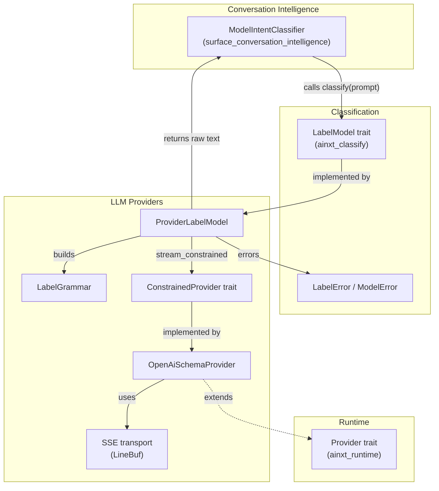
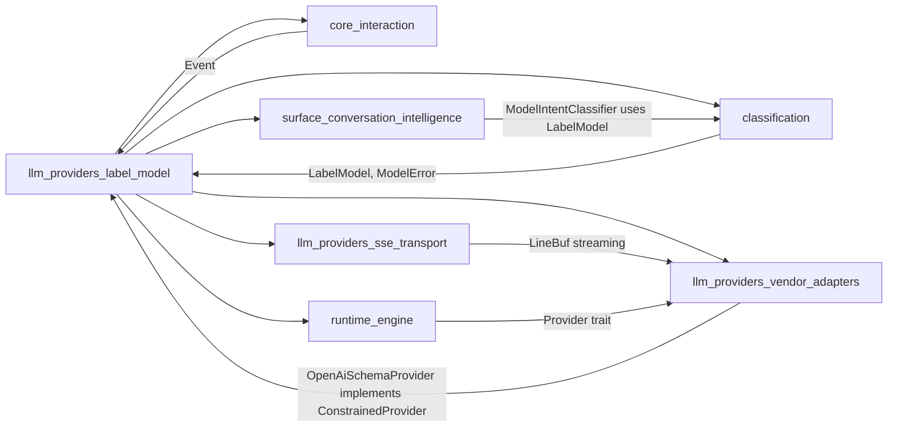
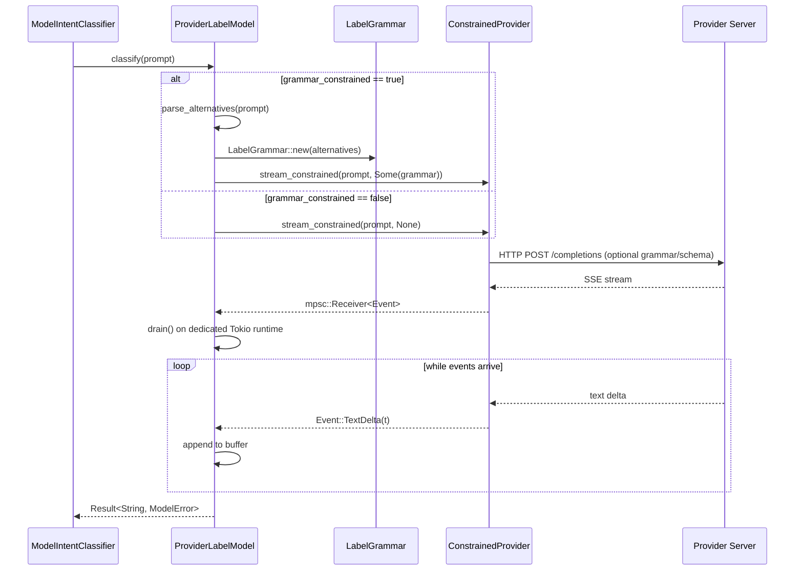
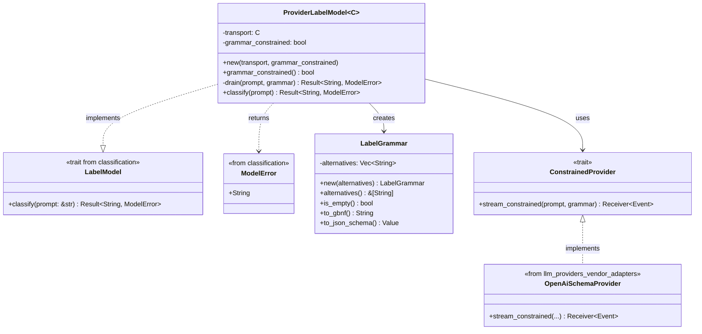
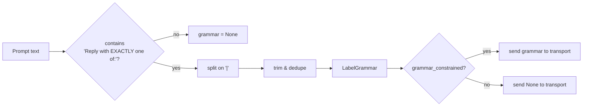
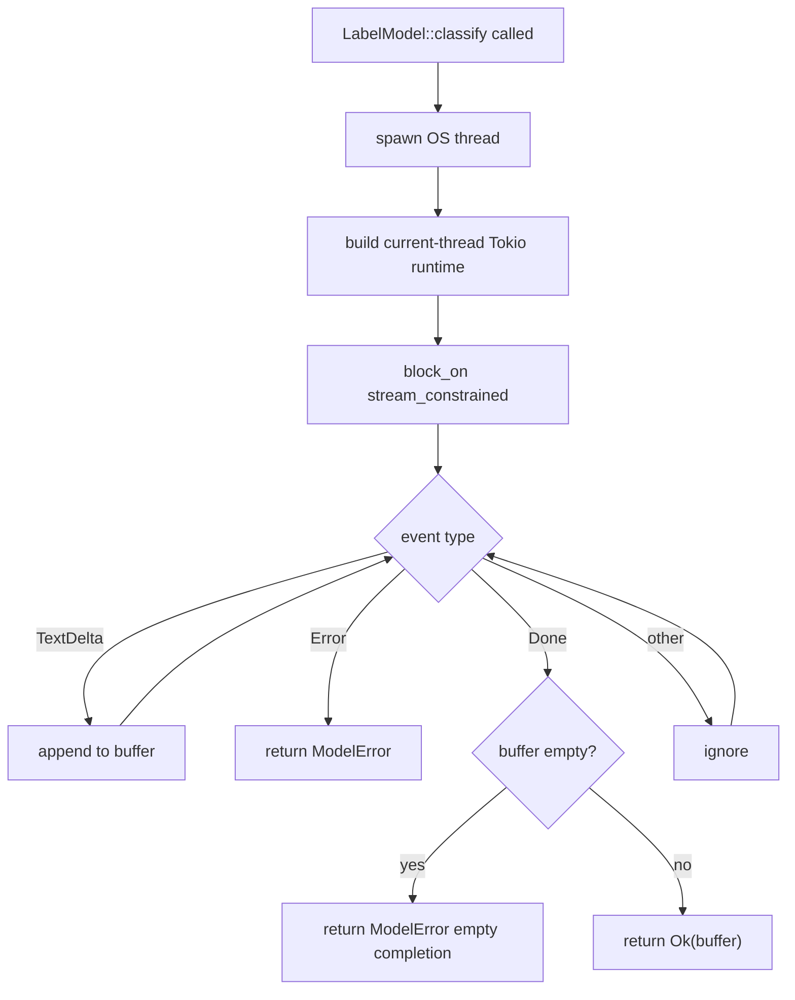

# LLM Providers — Label Model

## Brief Introduction

The `llm_providers_label_model` module is the production bridge between the
synchronous, model-agnostic intent-classification seam in
[`ainxt-classify`](classification.md) and the async, vendor-specific streaming
providers in [`llm_providers_vendor_adapters`](llm_providers_vendor_adapters.md).

It exposes a single concrete type, [`ProviderLabelModel`], which implements the
object-safe [`LabelModel`](classification.md#labelmodel) trait used by the
Stage-2 intent classifier ([`ModelIntentClassifier`](surface_conversation_intelligence.md#modelintentclassifier)).
The adapter is *capability-aware*: when the underlying model advertises
grammar-constrained decoding, it derives a real GBNF grammar or JSON-schema enum
from the classifier's own constraint line and hands it to the transport. When the
model does not support grammar decoding, it falls back to plain prompt steering.
In both cases the raw completion text is returned and parsing/repair is left to
the classifier.

This module closes the gap between the text-only `LabelModel` seam and real
LLM transports, enabling the conversation intelligence layer to run against
production providers instead of test doubles only.

---

## Core Components

### `LabelGrammar`

A constrained-decoding grammar over a fixed set of literal label alternatives.
It renders the same constraint in two interchangeable forms:

- `to_gbnf()` — for llama.cpp / vLLM `guided_grammar`.
- `to_json_schema()` — for OpenAI-style JSON-schema constrained decoding.

The grammar is built from the classifier's `Reply with EXACTLY one of: a | b | c`
constraint line, preserving declaration order (which is the classifier's
tie-break order) and deduplicating entries.

### `ConstrainedProvider`

The transport seam that extends a plain provider with a grammar channel:

```rust
fn stream_constrained(&self, prompt: &str, grammar: Option<&LabelGrammar>)
    -> mpsc::Receiver<Event>;
```

`grammar == None` means "decode freely". Implementations decide whether to honor
the grammar. [`OpenAiSchemaProvider`](llm_providers_vendor_adapters.md#openaischemaprovider)
implements this natively via OpenAI-schema `guided_choice` / `guided_grammar`,
covering every vLLM / llama.cpp endpoint that speaks the OpenAI completions API.

### `ProviderLabelModel<C: ConstrainedProvider>`

The production [`LabelModel`](classification.md#labelmodel) implementation. It:

1. Receives a prompt from the classifier.
2. If `grammar_constrained` is true, parses the alternatives from the constraint
   line and builds a [`LabelGrammar`].
3. Calls `ConstrainedProvider::stream_constrained`.
4. Drains the async stream on a dedicated current-thread Tokio runtime running on
   its own OS thread, so the synchronous `LabelModel::classify` seam is safe
   regardless of whether the caller is already inside a Tokio runtime.
5. Returns the raw completion text, or a [`ModelError`](classification.md#modelerror)
   if the stream errors or is empty.

---

## Architecture



---

## Dependencies



### Direct crate dependencies

| Crate | Module doc | Usage |
|-------|------------|-------|
| `ainxt_classify` | [classification.md](classification.md) | `LabelModel` trait, `ModelError` |
| `ainxt_protocol` | [core_interaction.md](core_interaction.md) | `Event` stream deltas |
| `tokio` | external | `mpsc` channel + current-thread runtime |
| `ainxt_runtime` | [runtime_engine.md](runtime_engine.md) | Base `Provider` trait extended by adapters |
| `ainxt_convo` | [surface_conversation_intelligence.md](surface_conversation_intelligence.md) | Consumer of `LabelModel` via `ModelIntentClassifier` |

### Sibling modules in `llm_providers`

| Module | Doc | Role |
|--------|-----|------|
| `llm_providers_vendor_adapters` | [llm_providers_vendor_adapters.md](llm_providers_vendor_adapters.md) | Vendor-specific providers; `OpenAiSchemaProvider` implements `ConstrainedProvider` |
| `llm_providers_sse_transport` | [llm_providers_sse_transport.md](llm_providers_sse_transport.md) | Server-sent events parsing used by streaming providers |

---

## Data Flow



---

## Component Interaction



---

## Process Flows

### Grammar derivation



### Stream draining



---

## How It Fits into the System

The `llm_providers_label_model` module sits at the boundary between the
**conversation intelligence** layer and the **LLM provider** layer:

- **Upstream**: [`ModelIntentClassifier`](surface_conversation_intelligence.md#modelintentclassifier)
  in `ainxt-convo` drives Stage-2 intent classification through the
  [`LabelModel`](classification.md#labelmodel) trait. It builds a prompt that
  includes a constraint line such as `Reply with EXACTLY one of: chitchat | qa | code`.

- **This module**: `ProviderLabelModel` is the first *production* implementation
  of that trait. It translates the text-only seam into a real provider call while
  remaining model-agnostic. Capability detection (via `grammar_constrained`)
  lets it choose between grammar-constrained decoding and plain prompt steering
  without changing the classifier's contract.

- **Downstream**: [`ConstrainedProvider`](llm_providers_vendor_adapters.md) is
  implemented by [`OpenAiSchemaProvider`](llm_providers_vendor_adapters.md#openaischemaprovider),
  which maps the grammar to OpenAI-schema `guided_choice` / `guided_grammar`
  parameters understood by vLLM, llama.cpp, and similar OSS endpoints. Other
  vendor adapters can implement the same trait and simply ignore the grammar if
  their API does not support constrained decoding.

By keeping parsing and repair logic in [`ainxt-classify`](classification.md) and
keeping transport details in the provider adapters, this module remains a thin,
replaceable seam that enables the rest of the prompt-engineering stack to treat
any supported LLM as a label classifier.

---

## Key Design Decisions

1. **Synchronous `LabelModel` seam preserved**. The classifier is intentionally
   synchronous. Rather than forcing async into the classifier, `ProviderLabelModel`
   bridges async provider streams on a dedicated current-thread runtime in its own
   thread. This avoids `blocking_recv` panics inside async callers and avoids
   requiring a multi-thread Tokio runtime for `block_in_place`.

2. **Grammar derived from prompt text**. The adapter parses the classifier's own
   constraint line instead of threading a structured `LabelSet` through the
   text-only seam. This keeps the `LabelModel` contract minimal while still
   enabling real constrained decoding.

3. **Capability-aware, not vendor-aware**. `ProviderLabelModel` only knows whether
   the model supports grammar decoding; it does not know about vLLM, OpenAI, or
   llama.cpp. Vendor specifics live in the adapter implementations.

4. **Raw text returned, parsing delegated**. A malformed completion is *not* an
   error at this layer. The classifier's clarify/repair budget handles
   unparseable responses, keeping error policy consistent across test doubles and
   production adapters.
