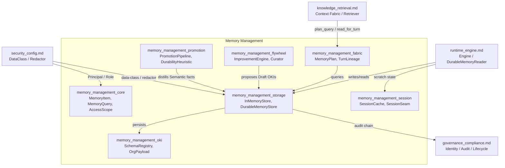
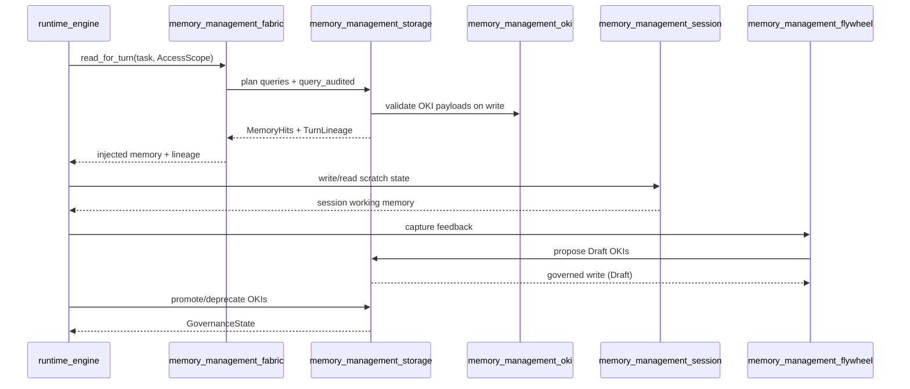

# Memory Management

The `memory_management` module implements the AiNxt runtime's **enterprise memory and learning core**. It provides typed, governed, queryable, and durable memory for the AI engine, ensuring that facts, preferences, organizational knowledge, and session working state are stored, retrieved, and evolved under strict compliance, RBAC, and lifecycle rules.

## Purpose

Memory in AiNxt is not a free-text blob or a per-user afterthought. Every unit is a strongly typed [`MemoryItem`](memory_management_core.md#memoryitem) with a [`MemoryKind`](memory_management_core.md#memorykind), a [`Scope`](memory_management_core.md#scope), a [`DataClass`](security_config.md), a [`Provenance`](memory_management_core.md#provenance) record, and a [`GovernanceState`](memory_management_core.md#governancestate). The module's responsibilities include:

- **Typed knowledge storage** — session scratch state, episodic records, semantic facts, user preferences, and governed organizational knowledge items (OKIs).
- **Identity-derived access control** — scope and data-class filtering happen *pre-rank*, so callers never learn of items they cannot see.
- **Human-gated org knowledge** — OKIs can only enter as `Draft` and require an explicit authorized `promote` to become authoritative.
- **Compliance-on-write** — every write is redacted before persistence; retroactive re-redaction is supported when rules change.
- **Durable persistence** — the in-memory reference store can be backed by a Postgres-compatible [`SqlLike`](memory_management_storage.md#sqllike) seam with full audit-chain hydration.
- **Continuous learning** — feedback events are curated into improvement candidates for prompts, retrieval, eval cases, and governed OKIs.
- **Right-to-erasure** — DPDP-style subject erasure cascades across the durable item store, session tier, and captured feedback.
- **Context-Fabric integration** — memory is read as layer 12 of the Context Fabric, with task-based query planning and per-turn lineage for forensic replay.

## Architecture Overview

## Module Position in the System

`memory_management` sits inside the [`ai_engine`](ai_engine.md) module, alongside `knowledge_retrieval`, `prompt_engineering`, `safety_guardrails`, and `evaluation_testing`. It is consumed primarily by:

- [`runtime_engine`](runtime_engine.md) — the served turn loop reads memory through the Context Fabric and writes session/episodic/semantic memory back.
- [`knowledge_retrieval`](knowledge_retrieval.md) — memory is retrieved via the same Context Optimizer that ranks docs, code, and graph nodes; `memory_management_fabric` provides the planning hooks.
- [`governance_compliance`](governance_compliance.md) — identity, audit, legal hold, and erasure workflows interact with the memory consent surface and audit chain.
- [`security_config`](security_config.md) — `DataClass`, `Principal`, `Role`, and redactor implementations are defined there and consumed here.

## Sub-modules

| Sub-module | Files | Responsibility | Doc |
|------------|-------|----------------|-----|
| `memory_management_core` | `lib.rs`, `access.rs` | Core types (`MemoryItem`, `MemoryQuery`, `MemoryKind`, `Scope`, `RbacScope`, `Provenance`, `GovernanceState`) and identity-derived access control (`AccessScope`). | [memory_management_core.md](memory_management_core.md) |
| `memory_management_oki` | `oki.rs` | The seven canonical organizational-knowledge types, their typed payloads, and the versioned schema registry that validates every OKI write. | [memory_management_oki.md](memory_management_oki.md) |
| `memory_management_storage` | `store.rs`, `durable.rs` | The reference `InMemoryStore`, the durable `DurableMemoryStore` + `SqlLike` seam, audit chain, retention/decay, erasure, and consent surface. | [memory_management_storage.md](memory_management_storage.md) |
| `memory_management_fabric` | `fabric.rs` | Context-Fabric integration: task-based query planning (`MemoryPlan`) and per-turn lineage (`TurnLineage`) for forensic replay. | [memory_management_fabric.md](memory_management_fabric.md) |
| `memory_management_flywheel` | `flywheel.rs` | The continuous-learning Improvement Engine: feedback capture, curation triage, candidate dispatch to gated destinations, and fine-tune corpus filtering. | [memory_management_flywheel.md](memory_management_flywheel.md) |
| `memory_management_promotion` | `promotion.rs` | Episodic → semantic promotion pipeline and durability heuristic that distills session records into durable facts. | [memory_management_promotion.md](memory_management_promotion.md) |
| `memory_management_session` | `session.rs` | The Redis-shaped session working-memory tier with TTL expiry, compliance-on-write, and erasure cascade support. | [memory_management_session.md](memory_management_session.md) |

Each sub-module above links to a dedicated documentation file generated from the crate's core components; the file names match those reported by the documentation generator.

## Key Design Invariants

1. **Org-knowledge is human-gated.** `MemoryKind::OrgKnowledge` always enters as `Draft`; promotion to `Approved`/`Production` requires `CAP_APPROVE`.
2. **Scope isolation is identity-derived.** `AccessScope` is built from the caller's `Principal` + memberships; filtering happens before ranking.
3. **Compliance-on-write.** A `Redactor` runs on every write; no store exists without one.
4. **Edit-free versioning.** Every edit creates a new `MemoryItem` version, enabling point-in-time replay.
5. **Typed OKI payloads.** Invalid `OrgPayload` variants are rejected, never persisted as text.
6. **Instruction/data separation.** Feedback quoted from tool/RAG/connector content can never produce a memory write.
7. **Right-to-erasure cascade.** Erasure reaches the durable store, session tier, and captured feedback, with tamper-evident receipts.

## Data Flow

## See Also

- [memory_management_core.md](memory_management_core.md)
- [memory_management_oki.md](memory_management_oki.md)
- [memory_management_storage.md](memory_management_storage.md)
- [memory_management_fabric.md](memory_management_fabric.md)
- [memory_management_flywheel.md](memory_management_flywheel.md)
- [memory_management_promotion.md](memory_management_promotion.md)
- [memory_management_session.md](memory_management_session.md)
- [ai_engine.md](ai_engine.md)
- [knowledge_retrieval.md](knowledge_retrieval.md)
- [runtime_engine.md](runtime_engine.md)
- [governance_compliance.md](governance_compliance.md)
- [security_config.md](security_config.md)
