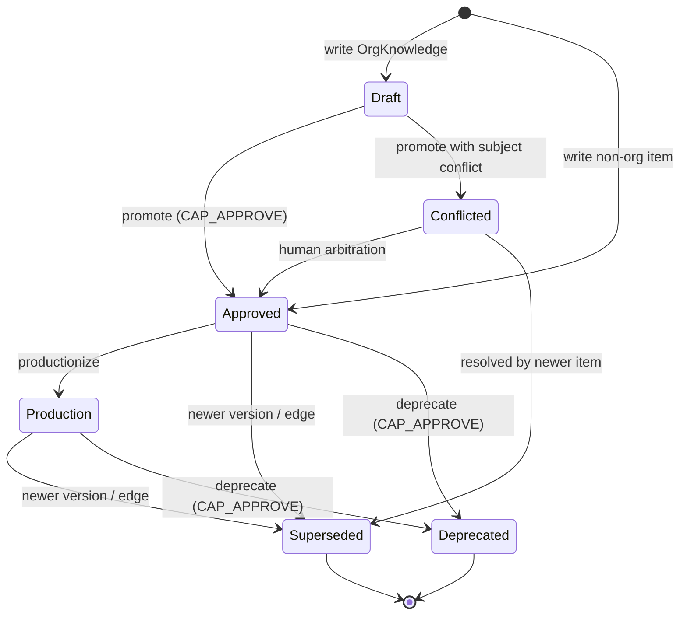
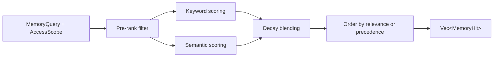
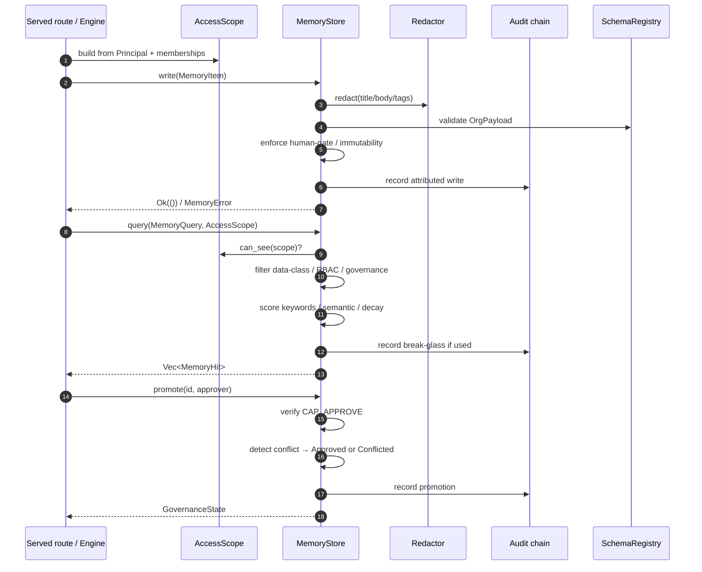
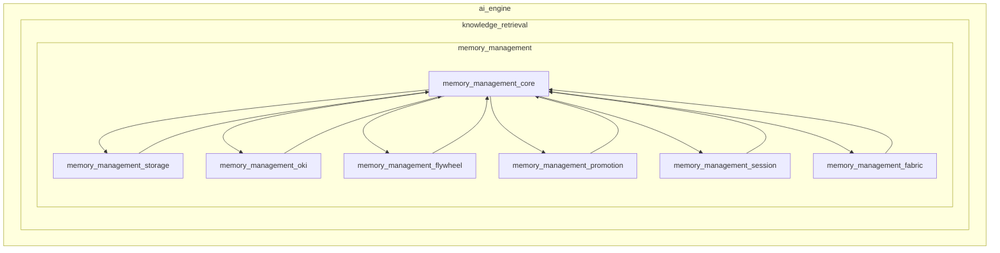

# memory_management_core

The **memory_management_core** module defines the foundational data model, governance vocabulary, access-control contract, and storage interfaces for the AiNxt runtime's enterprise memory and learning subsystem. It lives in `crates/ainxt-memory` and is the shared kernel consumed by the other memory sub-modules (storage, OKI schema, flywheel, promotion, session, and fabric) as well as by higher-level runtime and server surfaces.

In this system, memory is **typed, governed, queryable knowledge** — not free-text blobs or per-user afterthoughts. Every unit of memory is a [`MemoryItem`](#memoryitem) carrying a [`MemoryKind`](#memorykind), a [`Scope`](#scope), a data class, a provenance record, and a governance lifecycle state. Reads are filtered by identity-derived scope and RBAC **before** ranking, so unapproved organizational knowledge is never served as authoritative.

---

## Core responsibilities

- **Typed memory model**: Defines the canonical `MemoryItem` envelope and the six `MemoryKind` tiers (Session, Episodic, Semantic, Procedural, UserPreference, OrgKnowledge).
- **Governance lifecycle**: Defines `GovernanceState` (Draft → Approved → Production, plus Conflicted, Superseded, Deprecated) and the human-gating rules for `OrgKnowledge`.
- **Identity-derived access control**: Defines `AccessScope`, `Scope`, and `RbacScope` so retrieval isolation is derived from the caller's identity and memberships, not from optional query parameters.
- **Query and ranking contract**: Defines `MemoryQuery`, `MemoryHit`, `DecayParams`, and the hybrid keyword/semantic ranking primitives.
- **Storage seams**: Defines `MemoryStore`, `MemoryWriter`, `ConsentSurface`, and `ConsentBacking` so in-memory, durable (Postgres/KG-backed), and served surfaces all share the same contract.
- **Compliance hooks**: Defines the `Redactor` seam applied on every write, plus provenance and embedding-tier rules that support audit, erasure, and data-class routing.

---

## Architecture overview

```mermaid
flowchart TB
    subgraph memory_management_core["memory_management_core (crates/ainxt-memory/src/lib.rs + access.rs)"]
        MI[MemoryItem]
        MK[MemoryKind]
        GS[GovernanceState]
        S[Scope]
        AS[AccessScope]
        RS[RbacScope]
        MQ[MemoryQuery]
        MH[MemoryHit]
        PR[Provenance]
        EM[Embedding / EmbedderKind]
        LI[Link / EdgeKind]
        DP[DecayParams]
        ME[MemoryError]
        MST[MemoryStore trait]
        MWT[MemoryWriter trait]
        CST[ConsentSurface trait]
        CB[ConsentBacking enum]
        RED[Redactor trait]
    end

    subgraph storage["memory_management_storage"]
        IMS[InMemoryStore]
        DMS[DurableMemoryStore]
        AUD[AuditEntry / AuditHasher]
        RP[RetentionPolicy]
        ET[ErasureTier]
    end

    subgraph oki["memory_management_oki"]
        OPT[OrgPayload / OrgKnowledgeType]
        SR[SchemaRegistry]
        SB[SchemaBump]
    end

    subgraph flywheel["memory_management_flywheel"]
        CUR[Curator]
        HJ[HeuristicJudge]
        DJ[DefaultRuleJudge]
        TC[TriagedCandidate]
    end

    subgraph promotion["memory_management_promotion"]
        PP[PromotionPipeline]
        PC[PromotionCandidate]
        PO[PromotionOutcome]
        DH[DurabilityHeuristic]
    end

    subgraph session["memory_management_session"]
        SC[SessionCache]
        SET[SessionErasureTier]
        ISS[InMemorySessionSeam]
    end

    subgraph fabric["memory_management_fabric"]
        TL[TurnLineage]
        MP[MemoryPlan]
    end

    subgraph consumers["Upstream consumers"]
        RUN[ainxt-runtime Engine]
        RUNT[ainxt-runtimed surfaces]
        SRV[ainxt-server routes]
        RET[ainxt-retrieval / ainxt-context]
    end

    MI --> MK
    MI --> GS
    MI --> S
    MI --> PR
    MI --> EM
    MI --> LI
    MI --> RS
    MQ --> AS
    MQ --> MI
    MH --> MI
    MST --> MI
    MWT --> MI
    CST --> MI
    CB --> IMS
    CB --> DMS

    MI -.->|typed payload validated by| SR
    MI -.->|promoted / deprecated via| PP
    TC -.->|feeds| PP
    PP -.->|writes candidates to| MST
    CUR -.->|proposes| TC
    SC -.->|erasure tier for| CB
    SET -.->|implements| ET
    TL -.->|plans memory for| MI

    RUN -.->|reads via MemoryStore / MemoryReader| MST
    RUNT -.->|holds ConsentBacking| CB
    SRV -.->|routes /memory/*| CST
    RET -.->|supplies context from| MQ
```

The core module sits at the center of the memory subsystem. It does not implement durable persistence, schema validation, continuous-learning curation, or session caching itself; those responsibilities are delegated to sibling modules that are documented separately:

- [memory_management_storage.md](memory_management_storage.md) — `InMemoryStore`, `DurableMemoryStore`, audit hashing, retention, and erasure.
- [memory_management_oki.md](memory_management_oki.md) — `OrgKnowledgeType`, `OrgPayload`, and `SchemaRegistry` validation.
- [memory_management_flywheel.md](memory_management_flywheel.md) — `Curator`, judges, and triaged candidates.
- [memory_management_promotion.md](memory_management_promotion.md) — `PromotionPipeline` and episodic-to-semantic distillation.
- [memory_management_session.md](memory_management_session.md) — `SessionCache` and session-tier erasure.
- [memory_management_fabric.md](memory_management_fabric.md) — `TurnLineage` and `MemoryPlan`.

---

## Core data model

### MemoryItem

`MemoryItem` is the single unit of memory. It is intentionally a flat, serializable envelope so it can be stored in-memory, in Postgres, or in a knowledge graph without changing callers.

Key fields:

| Field | Purpose |
|-------|---------|
| `id` | Stable caller-assigned identifier, unique within a store. |
| `kind` | [`MemoryKind`](#memorykind) tier. |
| `org_type` | Canonical org-knowledge type when `kind == OrgKnowledge`. |
| `scope` | Narrowest applicable [`Scope`](#scope) for isolation. |
| `title` / `body` / `tags` | Human-readable content and searchable metadata. |
| `payload` | Schema-validated `OrgPayload` for org-knowledge. |
| `links` | Typed knowledge-graph edges (`Link` with `EdgeKind`). |
| `data_class` | Sensitivity class from `ainxt_types::DataClass`. |
| `rbac_scope` | Optional per-item retrieval grant (`RbacScope`). |
| `governance` | [`GovernanceState`](#governancestate). |
| `provenance` | [`Provenance`](#provenance) envelope. |
| `embedding` | Optional dense vector with embedder tier (`Embedding`). |
| `effective_from` / `expires_at` | Valid-time window for bi-temporal queries. |
| `version` / `seq` | Version number and store-assigned logical write tick. |
| `schema_version` | Per-type schema version the OKI payload was validated against. |
| `last_used` / `last_confirmed` | Activity ticks for usage-based decay. |

`MemoryItem` is **versioned and append-only**: edits create a new version rather than mutating in place. This enables forensic point-in-time replay and bi-temporal `validAsOf` queries. See [memory_management_storage.md](memory_management_storage.md) for how versioning is implemented.

### MemoryKind

`MemoryKind` determines governance treatment:

| Variant | Description | Governance |
|---------|-------------|------------|
| `Session` | Scratch state for the live turn; ephemeral, short TTL. | Usable on write. |
| `Episodic` | Raw "what happened" records from a run/session. | Usable on write; feed for promotion. |
| `Semantic` | Durable cross-session factual knowledge. | Usable on write. |
| `Procedural` | Reusable how-to / known-good sequence. | Usable on write. |
| `UserPreference` | Per-user style/verbosity/tone preference. | Usable on write. |
| `OrgKnowledge` | Org-wide knowledge with high blast radius. | **Human-gated**: must start `Draft` and be promoted to `Approved`/`Production`. |

Only `OrgKnowledge` requires explicit human approval before it can be served as authoritative. This is enforced by `MemoryItem::is_authoritative` and by the `MemoryStore::write` / `MemoryStore::promote` contracts.

### GovernanceState

- `Draft` — proposed, not authoritative.
- `Approved` — human-approved and authoritative.
- `Production` — promoted to production, authoritative.
- `Conflicted` — two OKIs disagree on the same subject; parked for arbitration.
- `Superseded` — replaced by a newer version, retained for audit.
- `Deprecated` — retired, retained for audit.

Only `Approved` and `Production` are authoritative for org-knowledge. Non-org items are authoritative unless they are `Draft`, `Conflicted`, `Superseded`, or `Deprecated`.

### Scope

`Scope` defines the narrowest isolation boundary of an item:

- `Org` — visible to every authenticated caller.
- `Department(String)` — an org unit.
- `Team(String)` — a team.
- `Repo(String)` — a repository.
- `User(String)` — personal memory.

Scope isolation is enforced by `AccessScope::can_see` **before** ranking, so existence is not leaked via omission from a ranked list.

### AccessScope

`AccessScope` is the identity-derived retrieval boundary. It wraps a `Principal` plus the caller's team/repo/department memberships and answers two questions:

- `can_see(scope) -> (bool, bool)` — may the caller read an item in this scope? The second return flag indicates whether break-glass was used so the store can audit the access.
- `can_write(scope) -> bool` — may the caller author memory into this scope? Break-glass never grants writes, and personal scope may only be written by its owner.

Rules:

- `Scope::Org` is visible to any authenticated caller.
- `Scope::Department` / `Team` / `Repo` require membership (or admin role).
- `Scope::User` is visible only to its owner, or to an admin **with a logged break-glass justification**.

For details on how the runtime builds `AccessScope` from JWT claims and org-tree membership, see [core_infrastructure.md](core_infrastructure.md) and [runtime_engine.md](runtime_engine.md).

### RbacScope

`RbacScope` is a per-item retrieval grant independent of `Scope`. It restricts retrieval to listed roles and/or departments. An empty grant means "no extra restriction." It is enforced **pre-rank** alongside `Scope` and data-class clearance. Admins are always granted access; otherwise the principal must match a listed role **or** a listed department.

### Provenance

Every memory item carries a `Provenance` record answering "why does the system know this?"

- `author` — one of `Human`, `SystemFlywheel`, or `SystemIngest`. There is no path from a tool/RAG result straight to a memory write.
- `source_turn` — optional event-log turn id this item was derived from.
- `confidence` — authoring confidence in `[0.0, 1.0]`.
- `last_verified_by` / `last_verified_at` — set on promotion.

For the event-log subsystem that supplies `source_turn`, see [core_interaction.md](core_interaction.md).

### Embedding and EmbedderKind

`Embedding` attaches a dense vector to an item, tagged with the model and tier that produced it:

- `InHouse` — self-hosted / in-country embedder; required for regulated/PII content.
- `Cloud` — cloud embedding API; forbidden for regulated/PII content.

`required_embedder_kind` and `embedder_allowed` enforce data-class routing. The batch re-embed lifecycle is exposed through `ConsentBacking::reembed_all`; see [memory_management_storage.md](memory_management_storage.md) for the embedder trait.

### Link and EdgeKind

`Link` defines typed edges from a memory item into the unified Context-Fabric knowledge graph:

- `Cites` — cites an ADR / doc / source.
- `AppliesTo` — applies to a repo / module / language.
- `CausedBy` — caused by an incident.
- `Supersedes` — supersedes another memory item (retires the target).
- `RelatesTo` — relates to another memory item.

For the graph subsystem these edges connect into, see [knowledge_retrieval.md](knowledge_retrieval.md) and [memory_management_fabric.md](memory_management_fabric.md).

---

## Query and ranking

### MemoryQuery

`MemoryQuery` is the read contract. It supports:

- **Keyword recall** — case-insensitive substring matching over title, body, and tags.
- **Semantic recall** — cosine similarity over stored `Embedding` vectors.
- **Hybrid recall** — blending keyword and semantic signals.
- **Filters** — by `kind`, `org_type`, `scope`, governance authority, transaction-time `as_of`, valid-time `valid_as_of`.
- **Decay** — usage-based recency decay via `DecayParams`.
- **Ordering** — `RankOrder::Relevance` (default) or `RankOrder::Precedence`.

### Pre-rank filtering

Every query is executed with an `AccessScope`. The store filters candidates **before** ranking:

1. Scope reachability (`AccessScope::can_see`).
2. Data-class clearance.
3. RBAC grant (`RbacScope::allows`).
4. Governance authority (`authoritative_only`).
5. Transaction-time / valid-time filters.

This ordering guarantees that an item the caller cannot see is never ranked, so its existence is not leaked.

### Ranking signals

- **Keyword relevance** — distinct keyword occurrences with a title boost. Keyword weight dominates; recency (`seq`) breaks ties.
- **Semantic relevance** — cosine similarity between the query vector and the item's embedding.
- **Recency / usage decay** — `MemoryItem::decay_factor` halves the score every `half_life` ticks since the item's last activity (write, use, or confirmation). Decay is a ranking signal, never silent deletion.
- **Precedence** — `precedence_class` orders results so safety rules and architecture decisions outrank substantive facts, which outrank preferences.

### Extraction-guard shape test

`MemoryQuery::is_unscoped_safety_recon` detects the shape of an org-knowledge extraction attempt: an unscoped query targeting extraction-sensitive `OrgKnowledgeType`s, or a keyword-less unscoped sweep of authoritative org-knowledge. Properly scoped reads (e.g., `with_scope(Repo(...))`) are never flagged. The store's extraction guard decides whether to fail closed on this shape. For the OKI types considered extraction-sensitive, see [memory_management_oki.md](memory_management_oki.md).

---

## Storage interfaces

The core module defines several trait seams so that in-memory, durable, and served surfaces share the same contract.

### MemoryStore

`MemoryStore` is the primary read/write/govern surface:

- `write(item)` — persist a new version, enforcing invariants (human-gate, schema validation, redaction, approved-org immutability).
- `get(id)` — fetch the current version regardless of governance state.
- `promote(id, approver)` — move a `Draft` org item toward authority. Requires `CAP_APPROVE`. Conflicting subjects are parked in `Conflicted`.
- `deprecate(id, actor)` — retire an item to `Deprecated`. Requires `CAP_APPROVE`.
- `delete_as(id, actor)` — attributed, authorized hard-delete. Personal items may be deleted by their owner; shared-scope authoritative/retired items are kept for audit; queued shared-scope items may be discarded only by `CAP_APPROVE` holders.
- `query(q, access)` — pre-rank filtered, ranked recall.

### MemoryWriter

`MemoryWriter` is a narrower, interior-mutable write seam used by served routes that need to author a new item into the same store that the runtime's read seam reads from. It deliberately does not widen the read-only `MemoryReader` seam; see the design note in the source about preventing "a tool/RAG result said so" from writing directly to memory.

### ConsentSurface

`ConsentSurface` exposes the DPDP-style transparency, portability, and erasure operations:

- `remembered_about(subject, access)` — "what do you remember about me."
- `export_subject(subject, access)` — machine-readable export.
- `erase_subject(subject)` — right-to-erasure.
- `query(q, access)` — general audited query, including `valid_as_of` bi-temporal filters.

Both `InMemoryStore` and `DurableMemoryStore` implement `ConsentSurface`.

### ConsentBacking

`ConsentBacking` is the handle served routes hold. It comes in two variants:

- `InMemory(Arc<Mutex<InMemoryStore>>)` — holds the one shared instance directly.
- `Durable(MemorySqlBackend)` — holds the backend and opens a fresh `DurableMemoryStore` on every call. This is required because a long-lived `DurableMemoryStore` instance reads its snapshot once and never re-pulls; opening fresh guarantees the served route sees concurrent writes from the chat engine's memory reader.

`ConsentBacking` also exposes batch maintenance operations that were previously implemented but unwired:

- `re_redact()` — retroactive re-redaction sweep when compliance rules change.
- `all_content()` — read-only snapshot of all free text for defense-in-depth sink sweeps.
- `reembed_all(inhouse, cloud)` — batch embedding lifecycle migration with data-class routing.
- `run_promotion_sweep(pipeline, now)` — episodic-to-semantic distillation sweep.
- `erase_subject_cascaded(subject, tiers)` — erasure that reaches session/Redis and feedback tiers, not just the durable item store.
- `with_store(f)` — generic access to the full `MemoryStore` for promotion/deprecation/attributed-delete surfaces.

For the concrete implementations of these operations, see [memory_management_storage.md](memory_management_storage.md).

---

## Compliance and security invariants

The core module encodes several load-bearing invariants that every implementation must honor:

1. **Org-knowledge is human-gated.** `OrgKnowledge` can only be written `Draft`; a write that tries to land it already `Approved` is rejected. Promotion to `Approved` requires `CAP_APPROVE`.
2. **Compliance-on-write.** A `Redactor` runs on every write before persistence, so PAN/PII/secrets never enter durable memory. `re_redact` re-applies the redactor retroactively.
3. **Scope isolation is identity-derived.** `MemoryStore::query` takes an `AccessScope` built from the caller's identity; out-of-scope items are filtered pre-rank.
4. **Edit-free versioning.** Content is never mutated in place; every edit is a new version.
5. **Typed OKI payloads.** Org-knowledge carries a schema-validated `OrgPayload`; invalid payloads are rejected, never persisted as text.
6. **Data-class-routed embeddings.** Regulated/PII content must use the in-house embedder.
7. **Attributed mutations.** Every mutating operation carries a principal and is authorized; there is no unattributed `delete`.

For the compliance/redaction subsystem that typically implements the `Redactor` trait, see [governance_compliance.md](governance_compliance.md) and [ai_engine.md](ai_engine.md) (safety_guardrails).

---

## Component interaction

---

## Module placement

`memory_management_core` is the dependency root of the memory subsystem. Sibling modules depend on it for types and traits, and the core module re-exports their public components so callers can import everything from `ainxt_memory`.

---

## Related documentation

- [memory_management.md](memory_management.md) — parent module overview.
- [memory_management_storage.md](memory_management_storage.md) — persistence, audit, retention, and erasure.
- [memory_management_oki.md](memory_management_oki.md) — org-knowledge schema registry and typed payloads.
- [memory_management_flywheel.md](memory_management_flywheel.md) — continuous-learning curation and judges.
- [memory_management_promotion.md](memory_management_promotion.md) — episodic-to-semantic promotion pipeline.
- [memory_management_session.md](memory_management_session.md) — session-tier memory and erasure.
- [memory_management_fabric.md](memory_management_fabric.md) — turn lineage and memory planning.
- [knowledge_retrieval.md](knowledge_retrieval.md) — retrieval, context, and the knowledge graph this module links into.
- [core_infrastructure.md](core_infrastructure.md) — `Principal`, `Role`, and identity primitives.
- [runtime_engine.md](runtime_engine.md) — how the runtime's `Engine` reads memory for a turn.
- [governance_compliance.md](governance_compliance.md) — compliance, redaction, and audit primitives.
