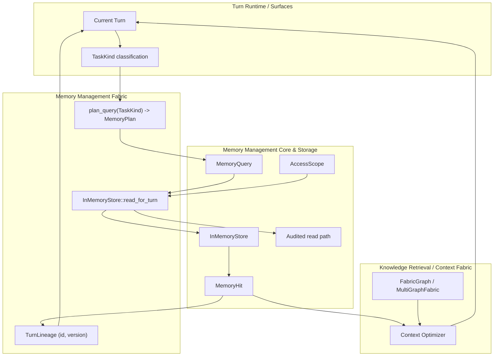
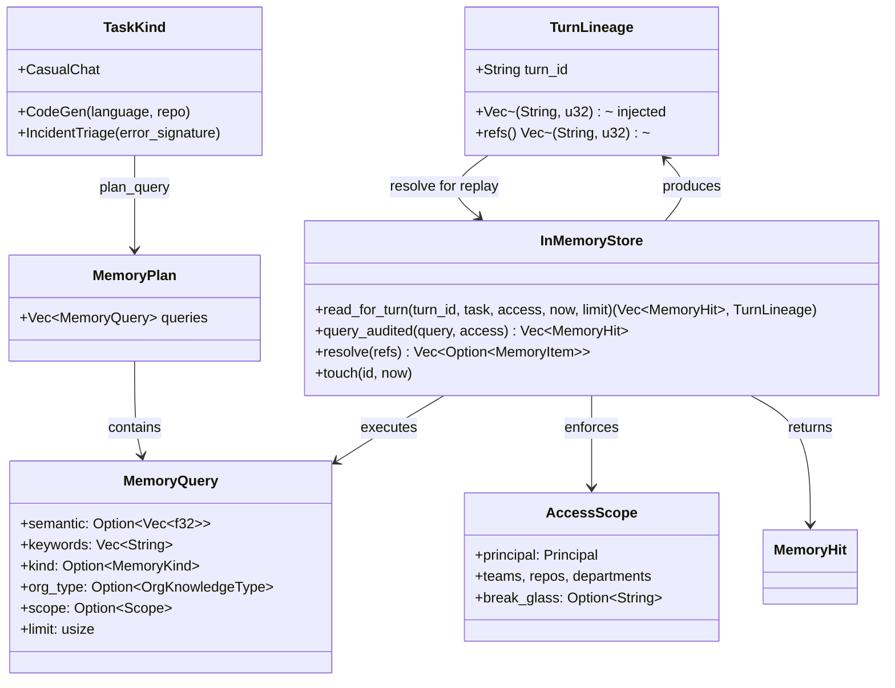
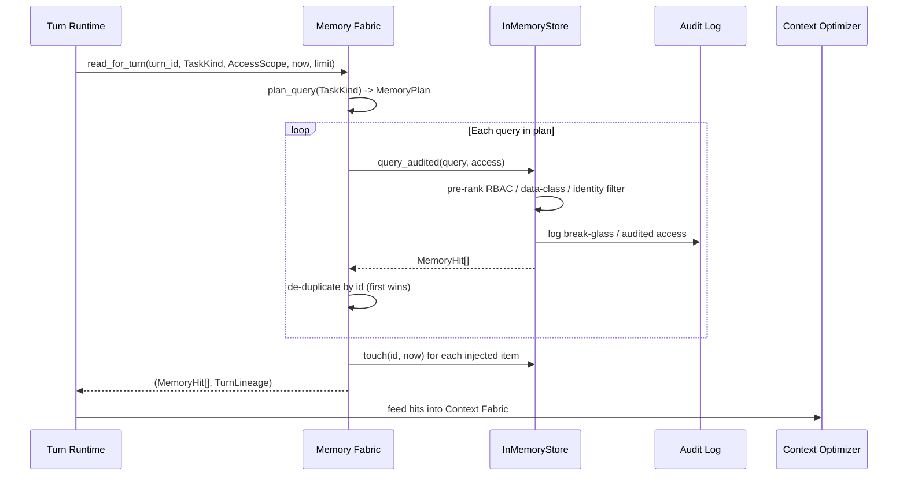
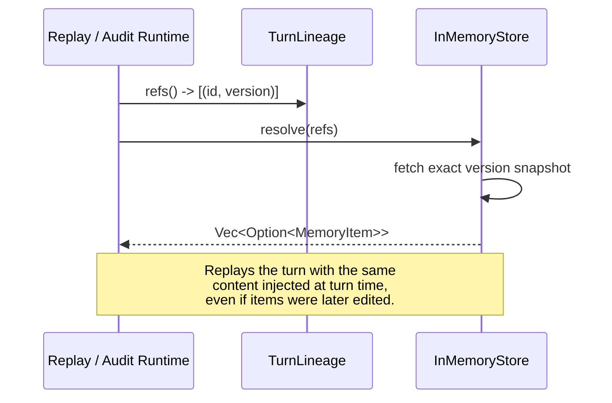
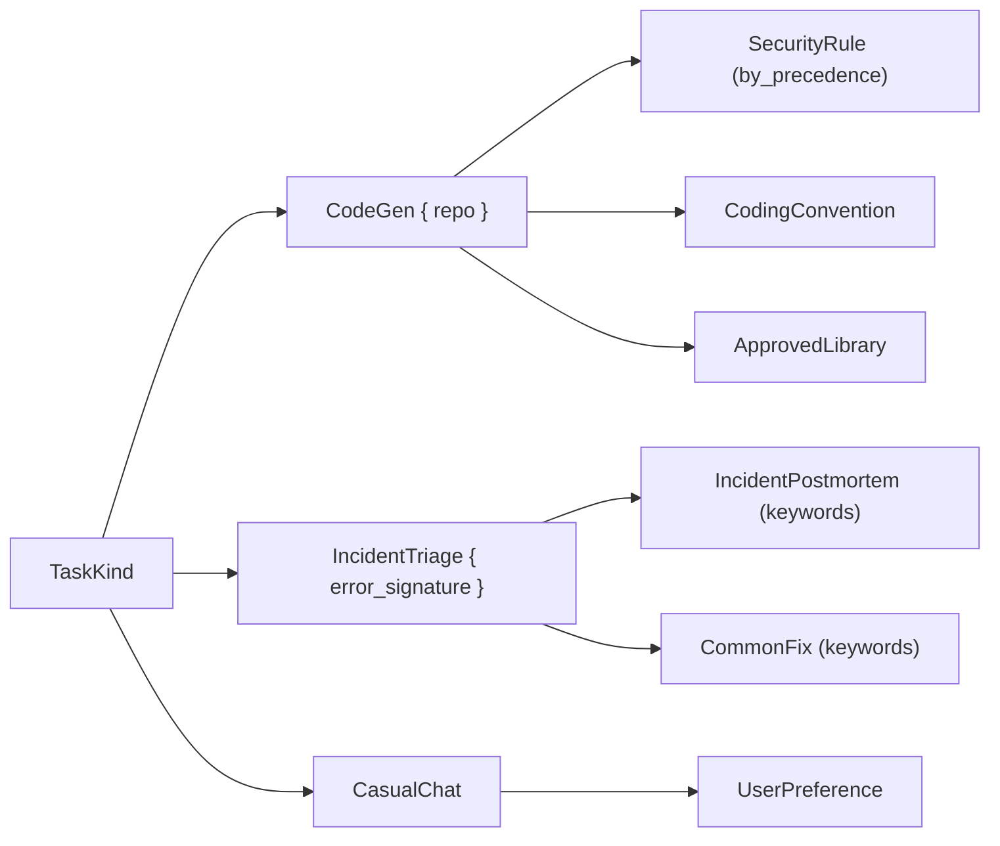
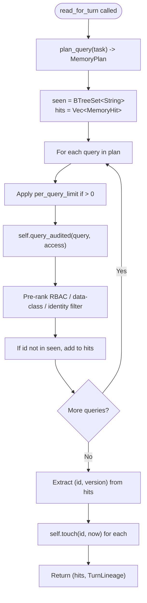

# Memory Management Fabric

The **Memory Management Fabric** module (`crates/ainxt-memory/src/fabric.rs`) implements the Context-Fabric read integration for long-term memory. Rather than maintaining a separate retrieval pipeline, memory is treated as **layer 12 of the Context Fabric**: it is read by the same Context Optimizer that consumes symbol graphs, call graphs, architecture contracts, and documentation, using identical pre-rank RBAC, data-class, and identity-scope discipline.

This module provides the clean public entrypoints the runtime needs to wire memory into the turn pipeline without re-implementing retrieval. It has two responsibilities:

1. **Task-driven query planning** — decide which memory sub-types are relevant for a turn based on the task class (code generation, incident triage, casual chat).
2. **Per-turn lineage capture** — record the exact `(id, version)` of every injected memory item so a turn can be forensically replayed even after the underlying items have been edited or superseded.

For the foundational memory data model, storage semantics, and governance controls, see the linked module documentation below. This document focuses on the fabric integration layer itself.

---

## Core Concepts

| Concept | Description |
|--------|-------------|
| `TaskKind` | The task class of the current turn: `CodeGen`, `IncidentTriage`, or `CasualChat`. This is the runtime's own vocabulary, not a provider's, and is the sole input to query planning. |
| `MemoryPlan` | An ordered list of [`MemoryQuery`](memory_management_core.md) objects produced by `plan_query`. The union of these queries is what the Context Optimizer should retrieve for the turn. |
| `TurnLineage` | A serializable record of every `(item_id, version)` injected into a turn, enabling deterministic forensic replay via [`InMemoryStore::resolve`](memory_management_storage.md). |
| `read_for_turn` | The single Context-Fabric read path on [`InMemoryStore`](memory_management_storage.md): plan, query with pre-rank filtering, de-duplicate, mark used, and return hits plus lineage. |

---

## Architecture

The diagram shows the fabric layer as a thin bridge between the turn runtime and the memory store. The runtime supplies a `TaskKind`; the fabric translates it into a `MemoryPlan`; the store executes the planned queries under the caller's `AccessScope`; and the resulting `MemoryHit`s flow into the Context Optimizer alongside other fabric layers. `TurnLineage` is emitted in parallel so the turn can be replayed later.

---

## Component Relationships

---

## Data Flow

### Turn-Time Memory Injection

### Forensic Replay from Lineage

---

## Query Planning by Task

`plan_query` is pure and deterministic. It maps each `TaskKind` to a small, ordered set of `MemoryQuery` objects. The ordering matters: de-duplication keeps the first (highest-priority) hit for any id.

| Task | Retrieved sub-types | Scope / filter |
|------|---------------------|----------------|
| `CodeGen { repo }` | `SecurityRule`, `CodingConvention`, `ApprovedLibrary` | `Scope::Repo(repo)` |
| `IncidentTriage { error_signature }` | `IncidentPostmortem`, `CommonFix` | keyword = error signature |
| `CasualChat` | `UserPreference` | `MemoryKind::UserPreference` |

This design prevents the Context Optimizer from having to guess which memory sub-types are relevant. It also prevents cross-task leakage: a code-generation turn will not surface incident postmortems or personal preferences, and an incident triage turn will not surface coding conventions.

---

## `read_for_turn` Process Flow

Key properties of this path:

- **No scope bypass**: planning is not a substitute for access control. Every planned query still passes `query_audited`, which applies the caller's `AccessScope`.
- **Break-glass audit**: if an admin reads another user's personal memory via `break_glass`, the access is recorded on every read path, including turn-time injection.
- **Usage-based decay**: `touch(id, now)` updates `MemoryItem::last_used`, so freshly injected old facts are not penalized as stale.
- **Version immutability**: hits are snapshot copies at the resolved version; lineage captures `(id, version)` for replay.

---

## Dependencies

### Upstream (this module uses)

| Module | Components Used | Why |
|--------|-----------------|-----|
| [memory_management_core](memory_management_core.md) | `MemoryItem`, `MemoryQuery`, `MemoryHit`, `MemoryKind`, `OrgKnowledgeType`, `Scope`, `Embedding`, `DecayParams` | Core memory data model and query envelope. |
| [memory_management_storage](memory_management_storage.md) | `InMemoryStore`, `query_audited`, `resolve`, `touch`, redactor, audit hasher, schema registry | Persistent store and governed read/write paths. |
| [memory_management_oki](memory_management_oki.md) | `OrgPayload::*` sub-types | Typed org-knowledge payloads referenced in planned queries. |

### Downstream (this module is used by)

| Module | Integration Point |
|--------|-------------------|
| [knowledge_retrieval_context_retrieval_routing](knowledge_retrieval_context_retrieval_routing.md) | Memory hits are fed into the Context Optimizer / `MultiGraphFabric` as layer 12 of the fabric. |
| [runtime_engine](runtime_engine.md) | `Engine` and turn surfaces call `read_for_turn` during turn construction. |
| [memory_management_flywheel](memory_management_flywheel.md) | Feedback events and curation sweeps may consume `TurnLineage` to understand which memories influenced a turn. |
| [evaluation_testing_replay](evaluation_testing_replay.md) | Replay infrastructure uses `TurnLineage::refs` with `InMemoryStore::resolve` for deterministic re-execution. |

---

## Security, Governance, and Compliance

- **Pre-rank filtering**: every query is still subject to identity scope, data class, and RBAC scope filtering before ranking. Query planning does not widen access.
- **Audited reads**: the `query_audited` path ensures break-glass and other sensitive reads are logged in the store's audit chain.
- **Immutable versions**: `MemoryItem` versions are append-only. `TurnLineage` therefore remains a stable reference for replay and compliance investigations.
- **No PII leakage across tasks**: `CasualChat` only retrieves `UserPreference`; `CodeGen` only retrieves repo-scoped org knowledge; `IncidentTriage` only retrieves postmortems and fixes by error signature.

---

## Testing and Invariants

The module's tests encode the following design invariants:

1. **Context-Fabric planning and turn lineage**: a `CodeGen` turn retrieves `CodingConvention`, `ApprovedLibrary`, and `SecurityRule` for the repo; it does not retrieve `IncidentPostmortem` or `UserPreference`.
2. **Incident planning**: an `IncidentTriage` turn retrieves postmortems and common fixes by keyword, not code conventions.
3. **Forensic replay**: after editing a `UserPreference`, resolving the original `TurnLineage` returns the version that was injected at turn time, not the current version.
4. **Identity-scope enforcement**: an outsider without repo membership receives empty results even when the planner targets that repo.

---

## See Also

- [memory_management_core](memory_management_core.md) — memory data model, query envelope, and hit scoring.
- [memory_management_storage](memory_management_storage.md) — `InMemoryStore`, redaction, audit chain, schema registry, and version resolution.
- [memory_management_oki](memory_management_oki.md) — typed org-knowledge payloads and schema versioning.
- [memory_management_flywheel](memory_management_flywheel.md) — feedback-driven memory curation and improvement.
- [memory_management_promotion](memory_management_promotion.md) — promotion of candidate memories into durable, authoritative knowledge.
- [knowledge_retrieval_context_retrieval_routing](knowledge_retrieval_context_retrieval_routing.md) — Context Optimizer and fabric routing where memory is consumed as layer 12.
- [runtime_engine](runtime_engine.md) — turn execution engine that invokes the fabric read path.
- [evaluation_testing_replay](evaluation_testing_replay.md) — deterministic replay using `TurnLineage`.
