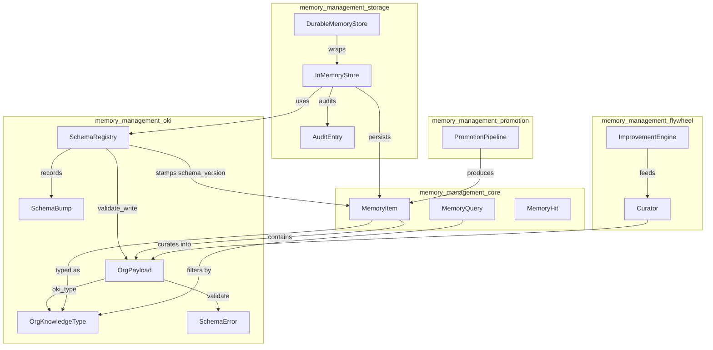
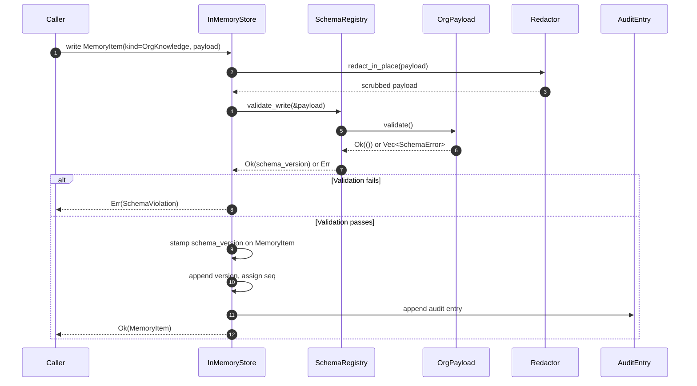
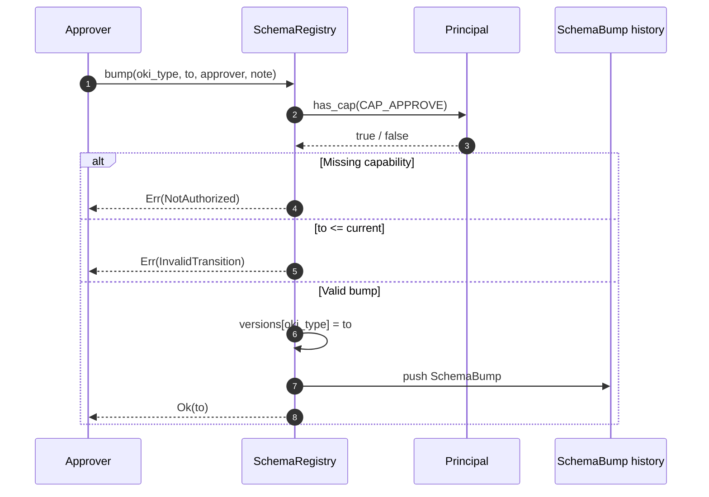
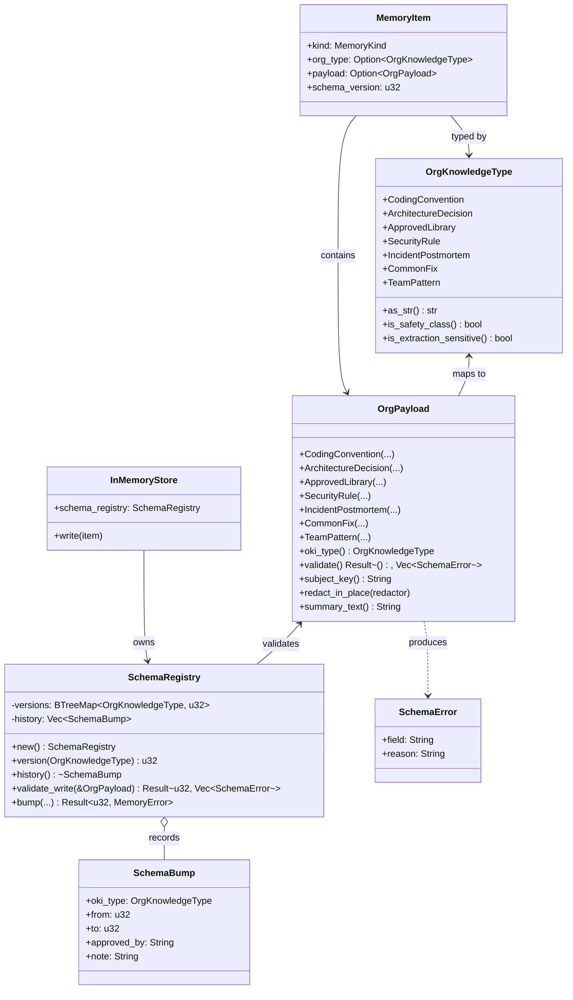
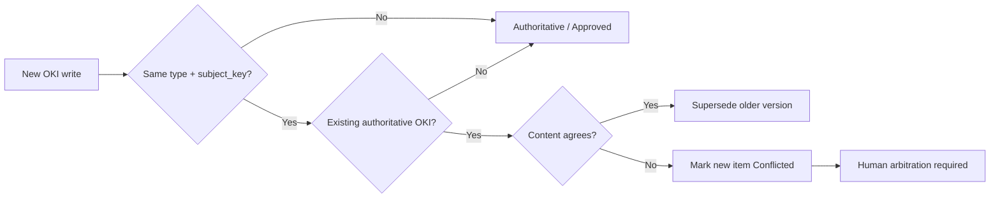

# memory_management_oki

The **memory_management_oki** module defines the canonical **Org-Knowledge Item (OKI)** type system and its governed, versioned schema registry. It is the typed-payload layer of the broader [`memory_management`](memory_management.md) subsystem: every piece of organizational knowledge is a strongly-typed, schema-validated record rather than an unstructured blob, and every schema change is itself a governed, auditable act.

This module lives inside `crates/ainxt-memory/src/oki.rs` and is consumed by the storage, promotion, fabric, and flywheel layers of the memory system.

---

## What this module does

- Enumerates the **7 canonical OKI types** an organization can record: coding conventions, architecture decisions, approved libraries, security rules, incident postmortems, common fixes, and team patterns.
- Provides a **typed payload enum** (`OrgPayload`) where each variant carries the structured fields required for its type.
- Enforces **per-type schema validation** on every write; invalid payloads are rejected, never persisted as text.
- Maintains a **versioned schema registry** (`SchemaRegistry`) that records which schema version is in force for each OKI type and keeps an append-only history of governed schema bumps.
- Supports **compliance redaction** across every free-text field of a typed payload, so secrets/PII cannot hide inside structured substance.
- Computes **subject keys** for conflict detection: two OKIs of the same type and subject that disagree cannot both be authoritative.

---

## Core concepts

### OrgKnowledgeType

`OrgKnowledgeType` is the closed enum of organizational-knowledge categories. Each variant is intentionally narrow so that retrieval, governance, and conflict resolution can be type-aware.

| Variant | Purpose |
|---------|---------|
| `CodingConvention` | Language-level style/rule guidance with do/don't examples and enforcement level. |
| `ArchitectureDecision` | ADR-style record of a decision, context, consequences, and alternatives. |
| `ApprovedLibrary` | Blessed dependency with version range, reason, and disallowed alternatives. |
| `SecurityRule` | Mechanically checkable rule tied to an action, data class, severity, and enforcement. |
| `IncidentPostmortem` | Timeline, root cause, blast radius, error signatures, remediation, and owner. |
| `CommonFix` | Error pattern → fix template, with verified/false-positive counts. |
| `TeamPattern` | When-to-use / when-not-to-use guidance scoped to a team. |

Two type-level predicates are exposed:

- `is_safety_class()` — `SecurityRule` and `ArchitectureDecision` win injection precedence over conventions and preferences.
- `is_extraction_sensitive()` — `SecurityRule` and `ApprovedLibrary` are treated as reconnaissance-sensitive; unscoped bulk sweeps are guarded by the store's extraction cap.

### OrgPayload

`OrgPayload` is the typed substance of an OKI. Each variant mirrors one `OrgKnowledgeType` and carries the fields required by that schema. Validation is performed by `OrgPayload::validate()`, which returns **all** failing fields rather than stopping at the first.

Key operations:

- `oki_type()` — returns the corresponding `OrgKnowledgeType`.
- `validate()` — enforces required-field rules per variant.
- `subject_key()` — returns the conflict axis for the payload (e.g. `approved-library:rust`).
- `redact_in_place(redactor)` — scrubs every free-text field through the configured compliance redactor.
- `summary_text()` — produces a short human-readable summary for indexing/keyword recall.

### SchemaRegistry

`SchemaRegistry` is the load-bearing validation authority for OKI writes. It is not a passive catalog: the store validates every `OrgKnowledge` write through `SchemaRegistry::validate_write()` and stamps the in-force version on the persisted [`MemoryItem`](memory_management_core.md) as `schema_version`.

Registry behavior:

- Starts every `OrgKnowledgeType` at `OKI_SCHEMA_VERSION` (currently `1`).
- `version(oki_type)` returns the current in-force version.
- `validate_write(payload)` runs the payload's shape validation and returns the in-force version.
- `bump(oki_type, to, approver, note)` performs a governed forward-only version bump, requiring the `CAP_APPROVE` capability and appending a `SchemaBump` record to history.

### SchemaBump

Each schema change is recorded as a `SchemaBump` containing the type, from/to versions, approving principal, and human note. The history is append-only so that "which schema version was in force, changed by whom, when" is always answerable.

---

## Architecture

---

## Dependencies

### Upstream (this module uses)

- [`ainxt_types::DataClass`](core_infrastructure.md) — used by `SecurityRule` to tag the applicable data class.
- [`crate::Principal`](memory_management_core.md) and capability constants such as `CAP_APPROVE` — used by `SchemaRegistry::bump` to enforce governed schema changes.
- [`crate::Redactor`](memory_management_storage.md) — trait used by `OrgPayload::redact_in_place` to scrub every free-text field.

### Downstream (this module is used by)

- [`memory_management_storage`](memory_management_storage.md) — `InMemoryStore` owns a `SchemaRegistry` and calls `validate_write` on every `OrgKnowledge` write.
- [`memory_management_core`](memory_management_core.md) — `MemoryItem` carries `org_type`, `payload`, and `schema_version`; `MemoryQuery` can filter by `org_type`.
- [`memory_management_flywheel`](memory_management_flywheel.md) — the curator/improvement engine distills experience into typed `OrgPayload` records.
- [`memory_management_promotion`](memory_management_promotion.md) — promotes curated candidates into authoritative `OrgKnowledge` items whose payloads must validate.
- [`memory_management_session`](memory_management_session.md) — session working memory may reference OKIs and is subject to the same typed-payload rules when promoted.

---

## Data flow: writing an OKI

---

## Data flow: governed schema bump

---

## Component interaction

---

## Process flow: conflict detection

Two OKIs conflict when they share the same `OrgKnowledgeType` and `subject_key` but disagree. The store uses `subject_key()` to park the newer item in `Conflicted` governance state until a human resolves it.

---

## Safety and compliance notes

- **No blob fallback**: `validate_write` returns `Err(Vec<SchemaError>)` for invalid payloads; the store never persists malformed OKIs as text.
- **Governed schema evolution**: `SchemaRegistry::bump` requires `CAP_APPROVE`, only moves versions forward, and records every change.
- **Deep redaction**: `OrgPayload::redact_in_place` scrubs every free-text field of every variant, not just the item-level `title`/`body`/`tags`.
- **Extraction sensitivity**: `SecurityRule` and `ApprovedLibrary` are flagged as reconnaissance-sensitive; bulk unscoped retrieval is capped by the store's extraction guard.
- **Injection precedence**: `SecurityRule` and `ArchitectureDecision` are safety-class and take precedence over conventions and personal preferences when injected into prompts.

---

## How it fits into the system

`memory_management_oki` is the **type system** at the heart of organizational memory. It sits below the retrieval/routing layers of [`knowledge_retrieval`](knowledge_retrieval.md) and above the durable storage backends managed by [`memory_management_storage`](memory_management_storage.md). It enables:

- Type-aware semantic and keyword recall via `MemoryQuery::org_type`.
- Human-gated promotion of raw experience into reusable organizational knowledge via [`memory_management_promotion`](memory_management_promotion.md).
- Forensic replay and auditability via per-item `schema_version` and append-only `SchemaBump` history.
- Safe injection of organizational guidance into prompts, with clear precedence and conflict rules.

For the broader memory lifecycle — including retention, erasure, session caching, and the improvement flywheel — see the related memory modules linked above.
