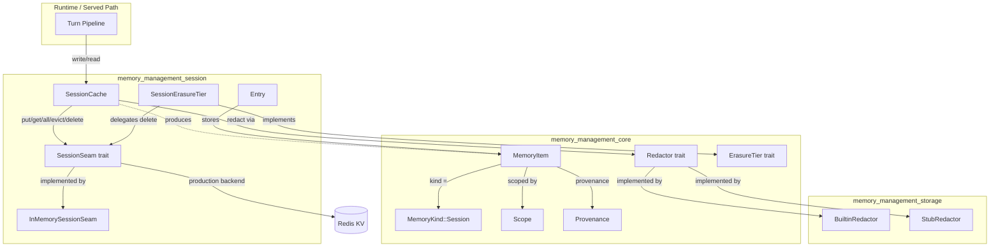
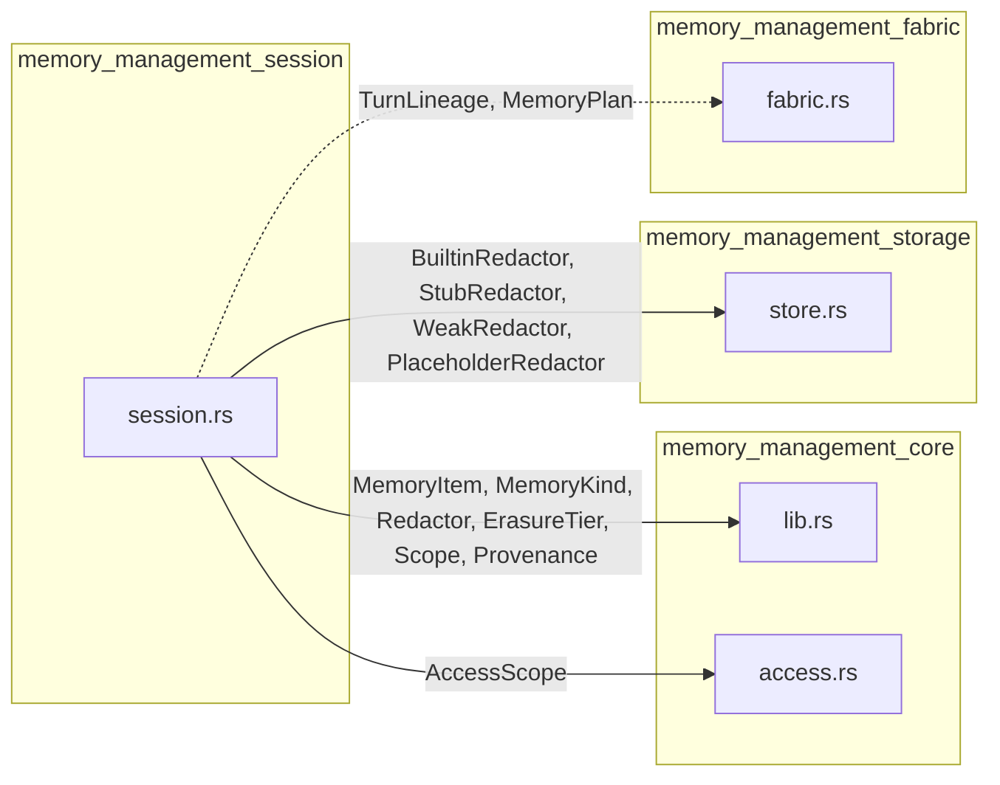
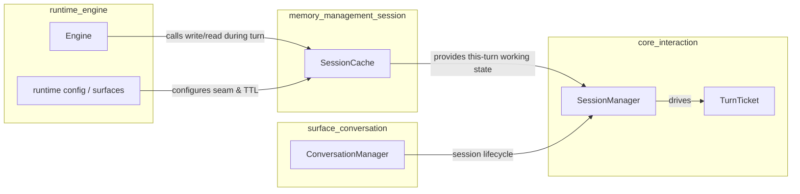
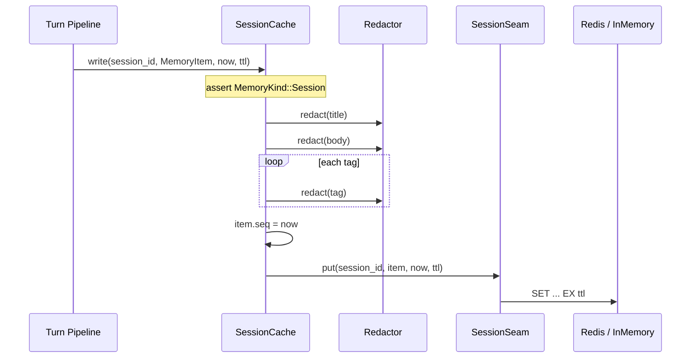
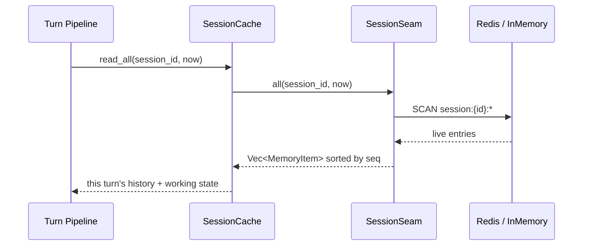
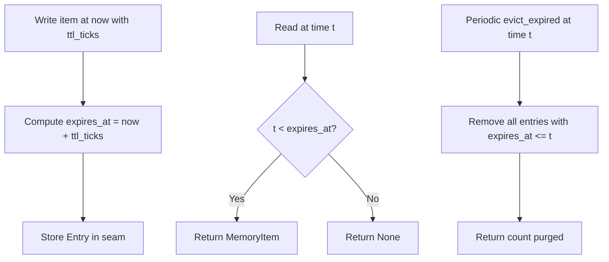
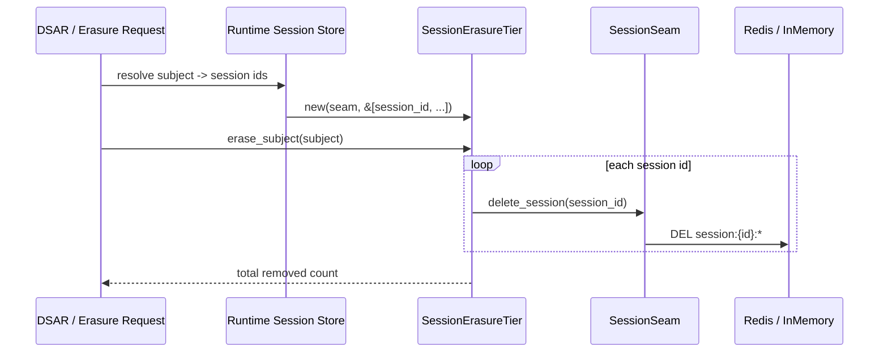

# memory_management_session

## Brief Introduction

The `memory_management_session` module implements the **Session (Redis) working-memory tier** for the AI engine's memory subsystem. It provides a narrow, Redis-shaped key-value seam for persisting short-lived, conversation-scoped scratch state — such as pending tool-call results, condenser windows, and per-turn working context — with a per-conversation TTL. Unlike the durable OKI, episodic, and semantic tiers backed by relational stores, session state is explicitly **never durable**: it lives only for the lifetime of the conversation and is backed by a key-value cache.

The module's primary responsibilities are:

- **Session-scoped storage**: isolate scratch memory per conversation/session id.
- **Compliance on write**: redact every write before it reaches the seam, ensuring PAN/PII/secret data never sits unredacted in ephemeral storage.
- **TTL lifecycle**: model per-key expiry, eviction sweeps, and session deletion.
- **Right-to-erasure cascade**: bind the session tier to the system's erasure framework so subject deletion requests immediately remove relevant session keys.
- **Offline testability**: ship a behavioral in-memory test double so all lifecycle logic is provable without a live Redis.

This module is the lowest-latency, most ephemeral tier in the broader [memory_management](memory_management.md) subsystem and is consumed by the runtime turn pipeline to read/write this turn's history and working state.

---

## Architecture

### Component Overview

### Component Descriptions

| Component | File | Responsibility |
|-----------|------|----------------|
| `SessionSeam` | `session.rs` | A narrow, Redis-shaped key-value port (`put`, `get`, `all`, `evict_expired`, `delete_session`) that decouples tier logic from any concrete Redis client. |
| `InMemorySessionSeam` | `session.rs` | Offline, cloneable, shared-state test double modeling a Redis string-with-TTL store keyed by `(session_id, item_id)`. |
| `SessionCache` | `session.rs` | The governed write/read facade. Composes a `SessionSeam` with a `Redactor` so every write is redacted before reaching the seam. |
| `SessionErasureTier` | `session.rs` | Adapter implementing the crate's `ErasureTier` trait, routing subject erasure requests to `delete_session` on the configured session ids. |
| `Entry` | `session.rs` | Internal tuple storing a `MemoryItem` alongside its absolute expiry timestamp. |

---

## Dependencies

### Within `memory_management`

The session tier depends on [memory_management_core](memory_management_core.md) for the shared memory model (`MemoryItem`, `MemoryKind`, `Scope`, `Provenance`) and the cross-tier contracts (`Redactor`, `ErasureTier`). It reuses redactor implementations from [memory_management_storage](memory_management_storage.md). For the relationship between session scratch state and longer-lived fabric plans, see [memory_management_fabric](memory_management_fabric.md).

### Upstream Consumers

The session cache is called from the runtime turn pipeline ([runtime_engine](runtime_engine.md)) to persist and retrieve per-turn scratch state. Session identity and lifecycle are managed by [core_interaction](core_interaction.md) (`SessionManager`, `TurnTicket`). Conversation surfaces ([surface_conversation](surface_conversation.md)) initiate and terminate sessions, which in turn triggers erasure through `SessionErasureTier`.

---

## Data Flow

### Write Path: Compliance Before Cache

Every write is redacted **before** it reaches the seam. This mirrors the discipline enforced in the durable tiers ([memory_management_storage](memory_management_storage.md), [memory_management_durable](memory_management_durable.md)) and is a core requirement of design §8.4.

### Read Path: This Turn's Working State

Reads return all non-expired items for a session, ordered by the sequence number assigned at write time. The session tier uses its own logical clock for ordering; it is not layered on top of the durable store's clock.

---

## Component Interactions

### SessionCache and SessionSeam

`SessionCache` is generic over any `S: SessionSeam`. This inversion of control means:

- The production deployment supplies a Redis-backed `SessionSeam` implementation (hot-wired in the runtime crate).
- Tests and offline environments use `InMemorySessionSeam`, which shares state across clones via an `Arc<Mutex<HashMap<...>>>`.
- The crate itself does not depend on any Redis client, mirroring how [memory_management_durable](memory_management_durable.md) avoids pulling a database crate.

### SessionCache and Redactor

The `Redactor` trait is defined in [memory_management_core](memory_management_core.md). `SessionCache` owns a `Box<dyn Redactor>` and applies it to `title`, `body`, and every `tag`. This ensures the ephemeral tier participates in the same compliance regime as durable memory writes.

### SessionErasureTier and ErasureTier

`SessionErasureTier` implements the crate-wide `ErasureTier` trait. It does not guess which sessions belong to a data subject; instead, the caller (the runtime's session store) supplies the list of session ids. This design avoids false confidence and keeps the tier stateless with respect to subject→session mappings. For the broader erasure and retention framework, see [memory_management_storage](memory_management_storage.md) and [governance_compliance/lifecycle](governance_compliance_lifecycle.md).

---

## Process Flows

### TTL Expiry and Eviction

In production, Redis handles expiry automatically via per-key TTL. The `evict_expired` method on `InMemorySessionSeam` and `SessionCache` exists so offline tests can deterministically age out keys and assert on purge counts.

### Right-to-Erasure Cascade

The session tier is designated "Redis (immediate)" in the retention table (design §5). Erasure is synchronous and does not wait for TTL expiry. For the full retention, legal hold, and deferred erasure framework, refer to [governance_compliance/lifecycle](governance_compliance_lifecycle.md).

---

## Design Rationale

- **Why a trait seam?** Decoupling from Redis keeps the crate dependency-free and makes the entire TTL/redaction/erasure lifecycle testable offline.
- **Why redact ephemeral state?** Compliance-on-write applies to *every* memory tier. A secret in a scratch tool-call result is still a secret, even if it expires in seconds.
- **Why separate logical clocks?** Session ordering uses the seam's own `now` tick, not the durable store's logical clock, because session scratch state is independent of durable memory layers (design §3: session is not "layer 0 of episodic").
- **Why caller-supplied session list for erasure?** Session ids are not inherently tied to subjects at this layer. Pushing the mapping resolution to the runtime avoids implicit, untestable subject→session indexing inside the tier.

---

## Testing Strategy

The module ships with in-crate tests (`r15_session_seam_ttl_expiry_and_redaction_offline`, `r15_session_seam_scoped_per_session_isolation`) that prove:

1. Redaction runs before the item reaches the seam.
2. TTL expiry removes items at/after `now + ttl_ticks`.
3. `read_all` returns only live items, sorted by sequence.
4. `evict_expired` deterministically purges expired rows.
5. `erase_session` removes all keys for one session without affecting others.
6. Session isolation is enforced by `session_id`.

These tests use `InMemorySessionSeam` and a `StubRedactor`, so no external services are required. The live Redis backend and the served-path call site are intentionally out of scope for this crate; they are hot-wired in the runtime crate.

---

## Related Modules

- [memory_management](memory_management.md) — parent module overview.
- [memory_management_core](memory_management_core.md) — shared memory model, `Redactor`, `ErasureTier`.
- [memory_management_storage](memory_management_storage.md) — redactor implementations and retention-aware storage.
- [memory_management_durable](memory_management_durable.md) — durable SQL-backed memory store.
- [memory_management_fabric](memory_management_fabric.md) — turn lineage and memory fabric plans.
- [memory_management_flywheel](memory_management_flywheel.md) — feedback-driven curation and improvement.
- [memory_management_promotion](memory_management_promotion.md) — promotion of candidates into durable tiers.
- [core_interaction](core_interaction.md) — `SessionManager`, `TurnTicket`, session lifecycle.
- [runtime_engine](runtime_engine.md) — turn pipeline that consumes `SessionCache`.
- [surface_conversation](surface_conversation.md) — chat/conversation surfaces that own sessions.
- [governance_compliance/lifecycle](governance_compliance_lifecycle.md) — retention, DSAR, and erasure governance.
