# Memory Management Storage

The `memory_management_storage` module provides the persistence and governance layer for the AI-native agent platform's long-term memory system. It combines an in-memory reference store (`InMemoryStore`) with a durable, relational backend (`DurableMemoryStore`) to ensure that memory items, audit chains, consent receipts, and erasure records survive restarts while preserving strict compliance, versioning, and tamper-evidence invariants.

This module is part of the larger [`memory_management`](memory_management.md) subsystem, which sits within the [`ai_engine`](ai_engine.md) domain. It is responsible for the "storage" concerns: write-through persistence, hash-chained audit logging, retention and decay policies, right-to-erasure (DPDP/GDPR) processing, retroactive re-redaction, and data-class-routed embedding lifecycle management.

---

## Table of Contents

1. [Purpose and Scope](#purpose-and-scope)
2. [Architecture Overview](#architecture-overview)
3. [Core Components](#core-components)
4. [Data Model](#data-model)
5. [Audit Chain and Tamper Evidence](#audit-chain-and-tamper-evidence)
6. [Compliance and Redaction](#compliance-and-redaction)
7. [Retention, Decay, and Erasure](#retention-decay-and-erasure)
8. [Durable Persistence](#durable-persistence)
9. [Data Flows](#data-flows)
10. [Process Flows](#process-flows)
11. [Dependencies and Integration](#dependencies-and-integration)
12. [Configuration and Deployment](#configuration-and-deployment)
13. [Testing and Offline Operation](#testing-and-offline-operation)
14. [References](#references)

---

## Purpose and Scope

The memory storage layer answers four critical operational requirements for an agent memory system:

1. **Governed Persistence**: Every memory write is attributed, schema-validated, compliance-redacted, and versioned before it is stored. The storage layer guarantees these invariants whether the deployment uses an ephemeral in-process store or a shared Postgres backend.
2. **Tamper-Evident Audit**: All governance events (writes, promotions, erasures, break-glass reads) are appended to a hash chain (`AK`) so that an auditor can verify integrity across restarts and rotations.
3. **Lifecycle Compliance**: Retention TTLs, usage-based decay, right-to-erasure cascades, and consent exports are first-class operations, not afterthoughts.
4. **Operational Durability**: The same logic proven in tests against an in-memory backend runs unchanged against Postgres in production, via a narrow `SqlLike` seam.

The module deliberately avoids RNG and wall-clock dependencies: a logical `seq` clock drives ordering and age calculations, making tests deterministic and replay reproducible.

---

## Architecture Overview

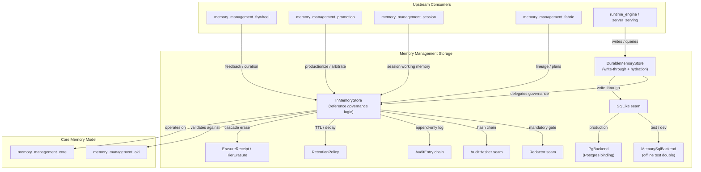

The architecture is layered:

- **Governance layer**: `InMemoryStore` encodes every invariant (RBAC pre-rank, schema validation, redaction, versioning, audit, retention, erasure).
- **Durability layer**: `DurableMemoryStore` wraps the governance layer and adds write-through persistence over any `SqlLike` backend.
- **Backend seam**: `SqlLike` abstracts the relational database, with `MemorySqlBackend` for offline/test use and `PgBackend` for production Postgres.
- **Pluggable seams**: `Redactor` and `AuditHasher` are mandatory but swappable, satisfying the "configurable provider, never configurable off" invariant.

---

## Core Components

### `InMemoryStore`

The reference implementation of [`MemoryStore`](memory_management_core.md). It owns:

- An append-only version history per item id (`items: HashMap<String, Vec<MemoryItem>>`).
- A logical clock (`clock: u64`) and an append-only audit chain (`audit: Vec<AuditEntry>`).
- A mandatory `Redactor` compliance gate.
- Optional embedders for embed-on-write (in-house vs. cloud, data-class routed).
- A `SchemaRegistry` for versioned OKI type validation.
- An optional OKI-extraction guard cap.
- A swappable `AuditHasher` for the chain digest.

`InMemoryStore` is the source of truth for behavior; `DurableMemoryStore` reuses it verbatim and only adds persistence.

### `DurableMemoryStore<D: SqlLike>`

A durable wrapper around `InMemoryStore`. It:

- Hydrates the in-RAM working set from the backend on `open`.
- Write-throughs every mutation to the backend before returning success.
- Persists erasure receipts to the `memory_consent` table.
- Exposes the same governance API as `InMemoryStore` plus durable-specific helpers (`consent_receipts`, `backend`, `take_sync_error`).

### `SqlLike` trait

The narrow relational seam. Each method maps to a single parameterized SQL statement against the canonical schema:

- `upsert_item` / `delete_item` / `load_items` — item version rows.
- `append_audit` / `load_audit` — hash-chained audit rows.
- `record_consent` / `load_consent` — erasure/consent receipts.

### `MemorySqlBackend`

An offline, cloneable fake of the three canonical tables. It models real cross-process durability semantics because clones share the underlying `Arc<Mutex<...>>` tables. This lets the durable store's logic be proven without a live database.

### `PgBackend<E: PgExecutor>`

A driver-agnostic Postgres binding (feature `postgres`). It issues real parameterized SQL but pulls no database crate; a deployment injects an executor over `rust-postgres`, `sqlx`, or a connection pool.

### `AuditEntry` / `AuditRow`

A hash-chained governance log entry. Fields include monotonic `seq`, `action`, `subject`, `detail`, folded `hash`, full-width `digest`, and the `hasher` name for crypto-agility. `AuditRow` is the database DTO; `AuditEntry` is the in-memory domain type. They convert bidirectionally.

### Audit Hashers

- `Sha256AuditHasher` — default, full-width SHA-256.
- `HmacSha256AuditHasher` — keyed HMAC-SHA-256 for deployments requiring a secret key.
- `Fnv1aAuditHasher` — lightweight 64-bit fingerprint used for quick integrity checks and tests.

### Redactors

- `BuiltinRedactor` — the always-on default floor. Detects Luhn-valid PANs, Verhoeff-valid Aadhaar, and high-entropy secret tokens.
- `PlaceholderRedactor` / `StubRedactor` / `WeakRedactor` — test doubles representing stronger, weaker, or stubbed compliance gates.

A real deployment swaps in an adapter over the platform's full compliance engine via `with_redactor`, but the gate is never removed.

### `RetentionPolicy`

Defines TTLs for raw tiers:

- `episodic_ttl` — max age of raw episodic memories.
- `session_ttl` — max inactive age of session working-memory items.
- `feedback_ttl` — max age of raw captured feedback events.

Curated derivatives (prompts, evals, OKIs) outlive the raw events that produced them.

### `ErasureReceipt` / `TierErasure`

`ErasureReceipt` records the outcome of a right-to-erasure request: removed ids, fine-tune lineage flags, the signing audit seq, and per-tier cascade results. `TierErasure` captures the result for each additional tier (session, feedback, etc.).

### `ConsentView` / `SubjectExport`

- `ConsentView` — the "what do you remember about me" response, grouped by `MemoryKind`.
- `SubjectExport` — a machine-readable, full-history export of every version of every item scoped to a subject.

---

## Data Model

### In-Memory Store

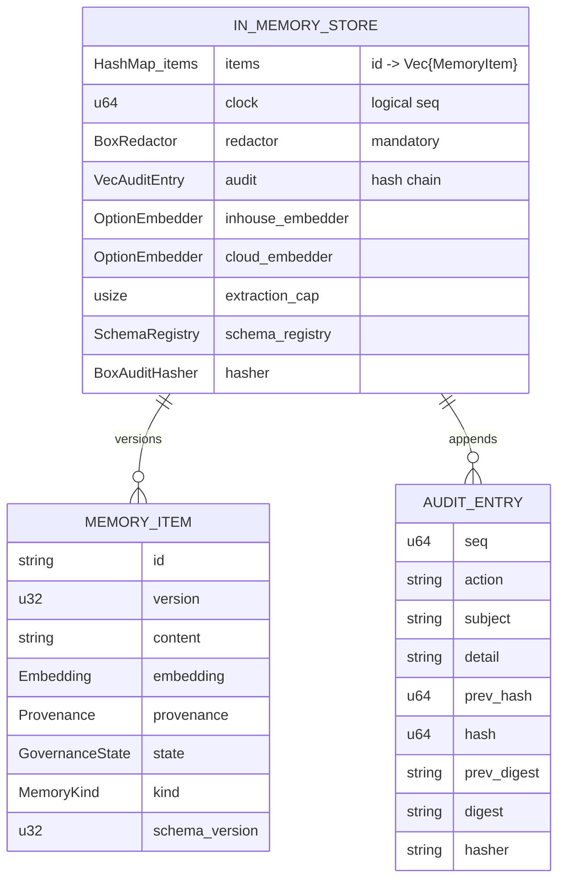

### Durable Schema

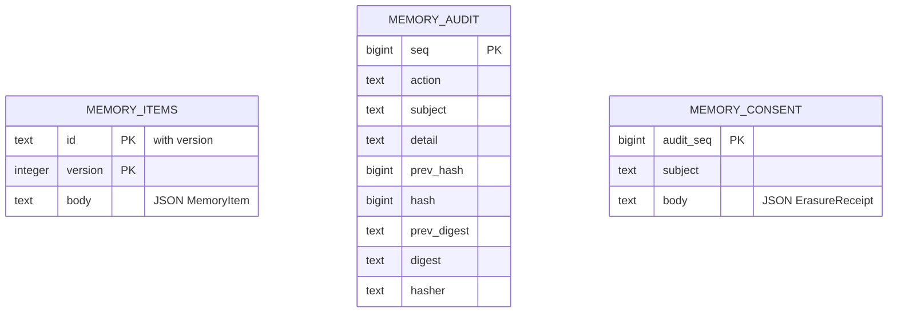

The schema is append-only per `(id, version)`, supporting edit-free versioning and forensic replay. Audit is ordered by `seq` and hash-chained. Consent receipts are keyed to the audit entry that signed them.

---

## Audit Chain and Tamper Evidence

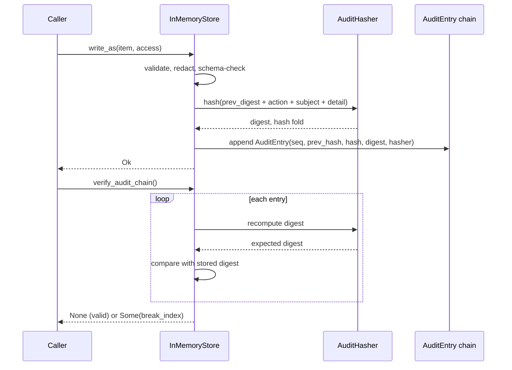

Every governance event appends an `AuditEntry`. The entry includes:

- A 64-bit fold (`hash`) for quick integrity checks.
- A full-width `digest` for authoritative verification.
- The `hasher` name so a verifier can re-run the same function even after a crypto-agility rotation.

`verify_audit_chain` recomputes the chain and returns the first index where the stored digest does not match, or `None` if the chain is intact.

---

## Compliance and Redaction

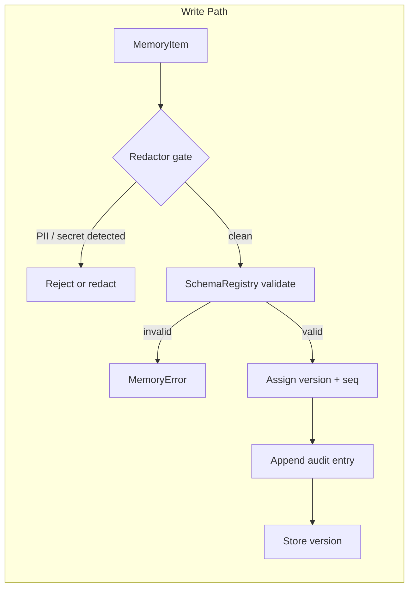

The redactor is a mandatory seam. `InMemoryStore::new` installs `BuiltinRedactor` by default. Deployments call `with_redactor` to substitute a stronger provider (for example, an adapter over the full compliance engine from [`security_config`](security_config.md) or [`safety_guardrails`](safety_guardrails.md)), but the gate can never be removed.

`BuiltinRedactor` provides a conservative, dependency-free floor:

- Luhn-valid card numbers (PAN), including space/dash-grouped variants.
- Verhoeff-valid 12-digit Aadhaar numbers.
- High-signal secret tokens (known key prefixes + long high-entropy strings).

Schema validation is performed through the versioned `SchemaRegistry` from [`memory_management_oki`](memory_management_oki.md); the in-force schema version is stamped on the persisted item.

---

## Retention, Decay, and Erasure

### Retention TTL Sweep

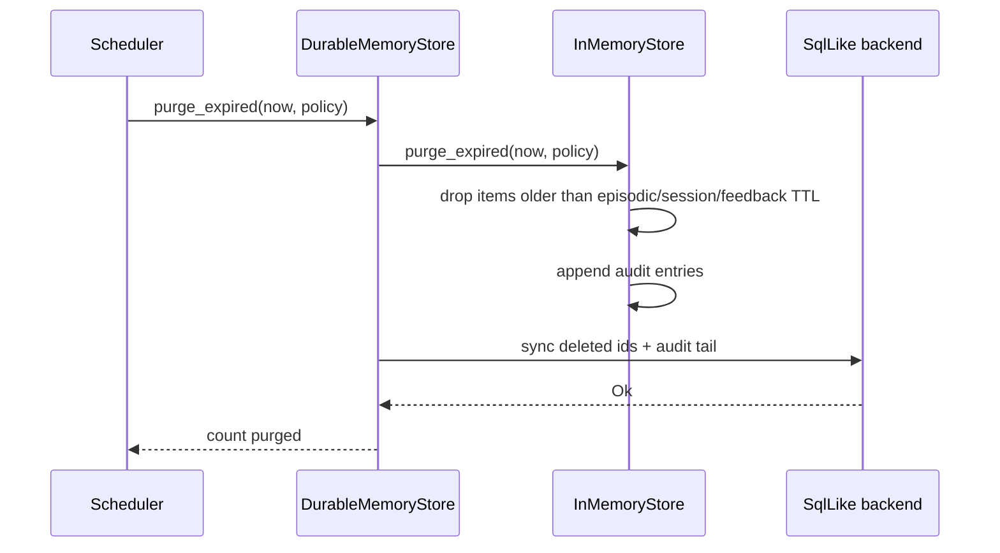

### Right-to-Erasure Cascade

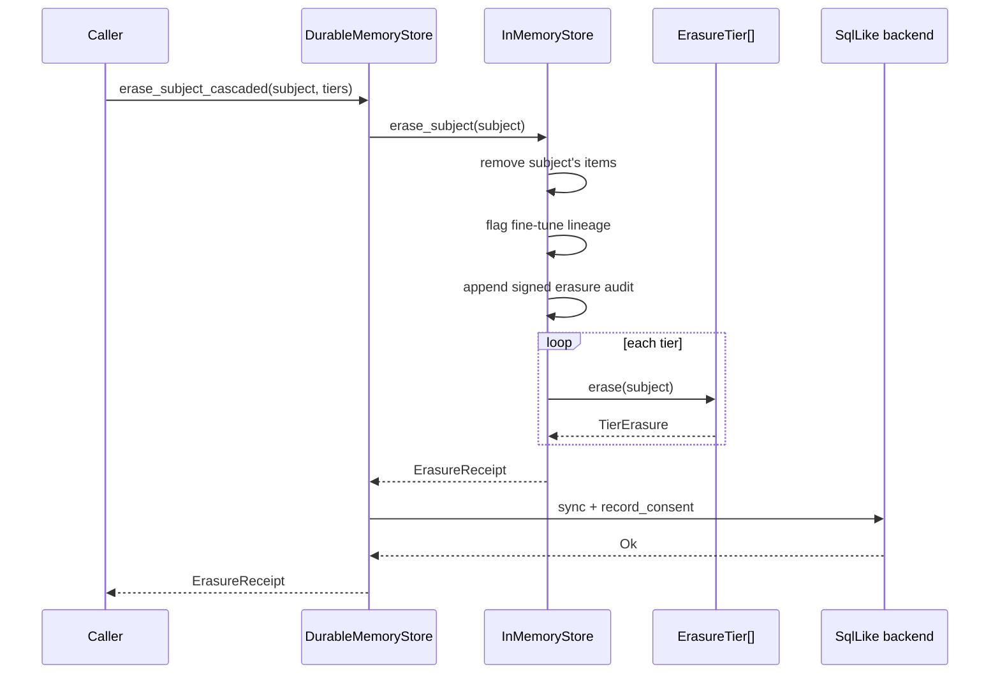

The storage layer supports:

- `purge_expired` — TTL-based removal of raw episodic, session, and feedback tiers.
- `expire_decayed` — usage-based priority decay for facts unconfirmed and unused past a half-life.
- `re_redact` — retroactive re-redaction of the entire corpus when compliance rules are updated.
- `erase_subject` / `erase_subject_cascaded` — DPDP/GDPR right-to-erasure with signed receipts.
- `offboard_subject` — automatic offboarding erasure.
- `remembered_about` / `export_subject` — consent surface and data portability.

Each erasure produces an `ErasureReceipt` persisted to `memory_consent`, keyed to the signing audit entry.

---

## Durable Persistence

### Opening a Durable Store

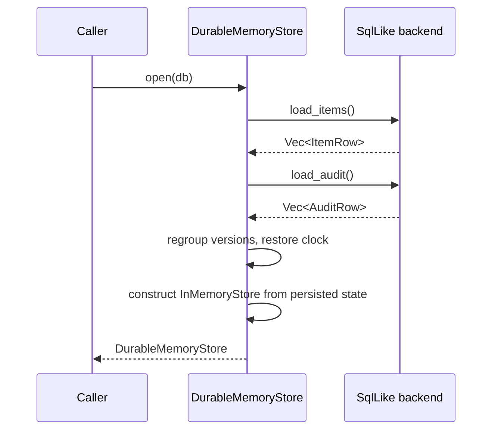

### Write-Through on Mutation

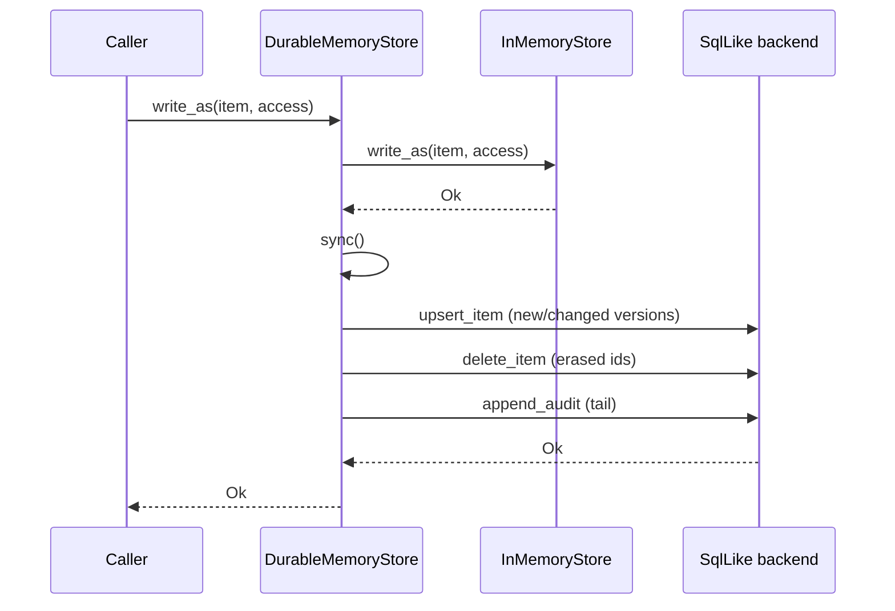

`DurableMemoryStore` is incremental and idempotent:

- Immutable older versions are skipped once persisted.
- Only the current version is re-serialized if its content changed.
- Deleted ids are removed from the backend.
- New audit entries are appended as a tail.

If a backend error occurs in an infallible trait method (e.g., `MemoryStore::delete_as`), it is stashed in `sync_error` and surfaced later via `take_sync_error`.

---

## Data Flows

### Write Flow

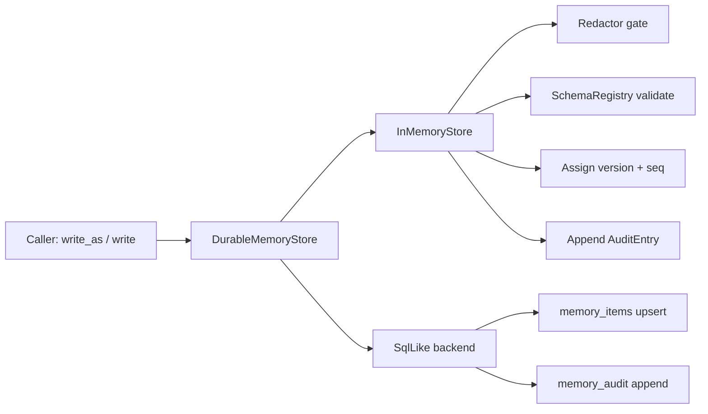

### Query Flow

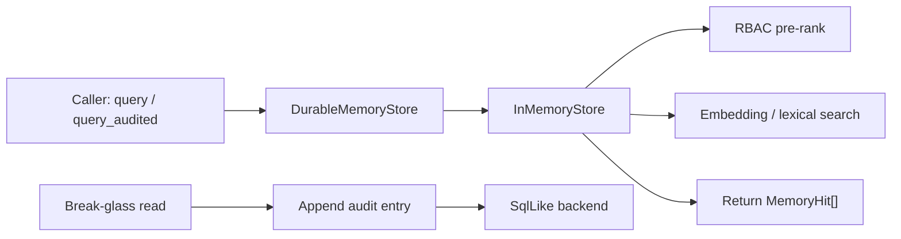

### Erasure Flow

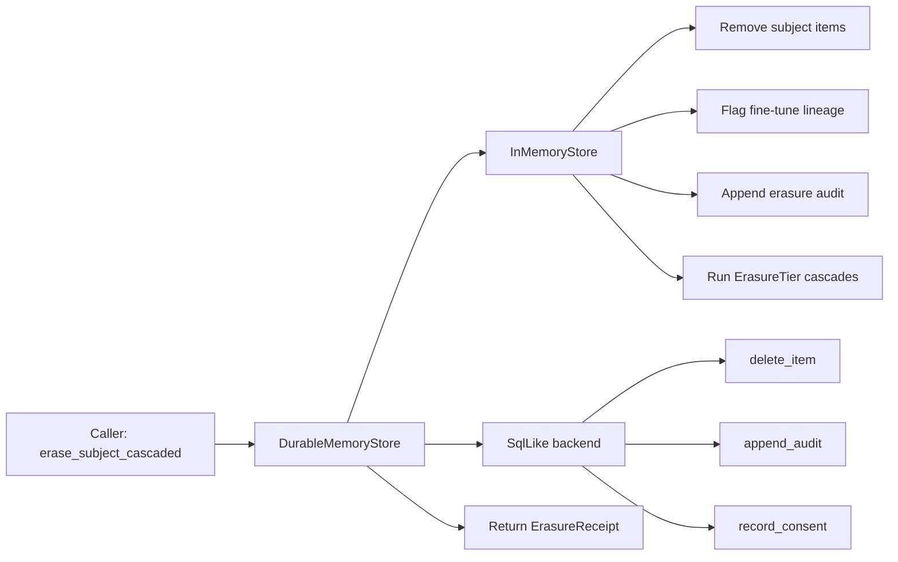

---

## Process Flows

### Startup / Hydration

1. Deployment opens `DurableMemoryStore` over a `SqlLike` backend.
2. Backend loads all item versions, the full audit chain, and consent receipts.
3. Versions are regrouped by id (last = current).
4. The logical clock is restored to the maximum persisted `seq`.
5. `InMemoryStore` is reconstructed from persisted state.

### Normal Operation

1. Upstream callers (runtime, flywheel, session, fabric) invoke storage methods.
2. `InMemoryStore` enforces governance invariants.
3. `DurableMemoryStore` write-throughs the delta to the backend.
4. Audit entries are persisted; erasure receipts are recorded in `memory_consent`.

### Compliance Sweep

1. Scheduler triggers `purge_expired` or `expire_decayed`.
2. `InMemoryStore` applies retention/decay rules and appends audit entries.
3. `DurableMemoryStore` syncs deletions and the audit tail.
4. Optional: `re_redact` retroactively re-scans the corpus when redaction rules change.

### Crypto-Agility Rotation

1. Deployment installs a new `AuditHasher` via `with_audit_hasher`.
2. New audit entries carry the new `hasher` name.
3. `verify_audit_chain` uses the stored `hasher` name per entry to recompute the expected digest.
4. Old entries remain verifiable with their original hasher.

---

## Dependencies and Integration

### Internal Dependencies

| Module | Relationship |
|--------|--------------|
| [`memory_management_core`](memory_management_core.md) | Operates on `MemoryItem`, `MemoryHit`, `MemoryQuery`, `MemoryStore`, `Principal`, `AccessScope`, `Embedding`, `Provenance`, etc. |
| [`memory_management_oki`](memory_management_oki.md) | Uses `SchemaRegistry` and `SchemaBump` to validate versioned OKI type payloads. |
| [`memory_management_flywheel`](memory_management_flywheel.md) | Consumes storage for feedback events, curation, and improvement engine state. |
| [`memory_management_promotion`](memory_management_promotion.md) | Drives `productionize`, `arbitrate`, and governance-state transitions. |
| [`memory_management_session`](memory_management_session.md) | Stores session working-memory items with short TTLs. |
| [`memory_management_fabric`](memory_management_fabric.md) | Reads/writes lineage and memory plans through the store. |
| [`security_config`](security_config.md) | Supplies `Principal`, identity, and (optionally) stronger redaction/audit providers. |
| [`core_infrastructure`](core_infrastructure.md) | Shared types such as `Principal` and governance primitives. |
| [`ai_engine`](ai_engine.md) | The parent domain; storage serves answer synthesis, retrieval, guardrails, and prompt engineering. |

### External Dependencies

- `serde_json` for JSON serialization of `MemoryItem` and `ErasureReceipt` bodies.
- A Postgres driver (injected via `PgExecutor`) when the `postgres` feature is enabled.
- Optional embedder implementations for data-class-routed embed-on-write.

---

## Configuration and Deployment

### Builder Pattern

```rust
let store = DurableMemoryStore::open(pg_backend)?
    .with_redactor(Box::new(my_compliance_redactor))
    .with_embedders(Box::new(inhouse_embedder), Box::new(cloud_embedder))
    .with_extraction_guard(10)
    .with_schema_registry(my_bumped_registry)
    .with_audit_hasher(Box::new(HmacSha256AuditHasher::new(key)));
```

### Key Invariants

- **A1 — Configurable provider, never configurable off**: A `Redactor` is always installed; `with_redactor` only swaps the provider.
- **A2 — Hash chain is never removable**: An `AuditHasher` is always installed; `with_audit_hasher` only swaps the function.
- **A3 — Edit-free versioning**: Every update creates a new `version`; history is never overwritten.
- **A4 — Write-through durability**: Every mutating method on `DurableMemoryStore` syncs to the backend before returning success.
- **A5 — Determinism**: Logical clock and hash chain; no RNG or wall clock.

### Retention Policy Defaults

| Tier | Typical TTL | Purpose |
|------|-------------|---------|
| `Episodic` | 90 days | Raw captured episodic memories |
| `Session` | session lifetime | Working memory per conversation |
| `Feedback` | 180 days | Raw improvement-engine feedback events |

---

## Testing and Offline Operation

The module is designed to be fully testable without a live database:

- `MemorySqlBackend` models the three canonical tables in memory.
- `FakeInHouse` and `FakeCloud` provide deterministic embedders for tests.
- `StubRedactor`, `WeakRedactor`, and `PlaceholderRedactor` exercise different compliance scenarios.
- `Fnv1aAuditHasher` offers a lightweight audit hasher for fast tests.

Cloning `MemorySqlBackend` models multiple worker processes sharing one database, so cross-process durability semantics can be proven in unit tests.

---

## References

- [`memory_management`](memory_management.md) — parent module overview.
- [`memory_management_core`](memory_management_core.md) — core memory types and `MemoryStore` trait.
- [`memory_management_oki`](memory_management_oki.md) — versioned OKI schema registry.
- [`memory_management_flywheel`](memory_management_flywheel.md) — feedback, curation, and improvement engine.
- [`memory_management_promotion`](memory_management_promotion.md) — promotion pipeline and governance transitions.
- [`memory_management_session`](memory_management_session.md) — session working memory.
- [`memory_management_fabric`](memory_management_fabric.md) — lineage and memory plans.
- [`ai_engine`](ai_engine.md) — AI engine domain documentation.
- [`security_config`](security_config.md) — identity, principal, and compliance primitives.
- [`core_infrastructure`](core_infrastructure.md) — shared infrastructure types.
