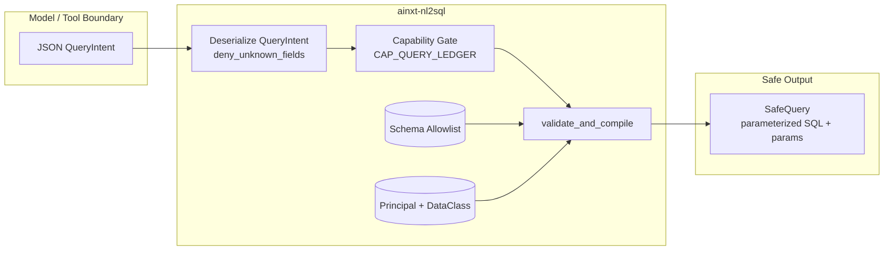
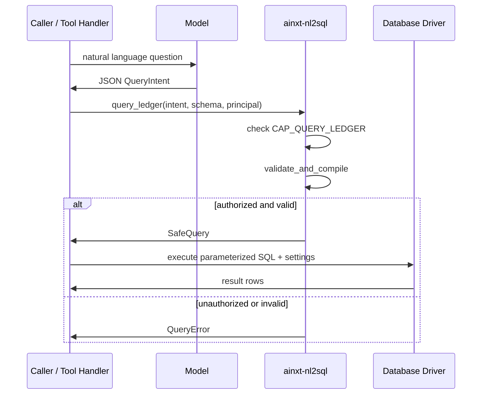
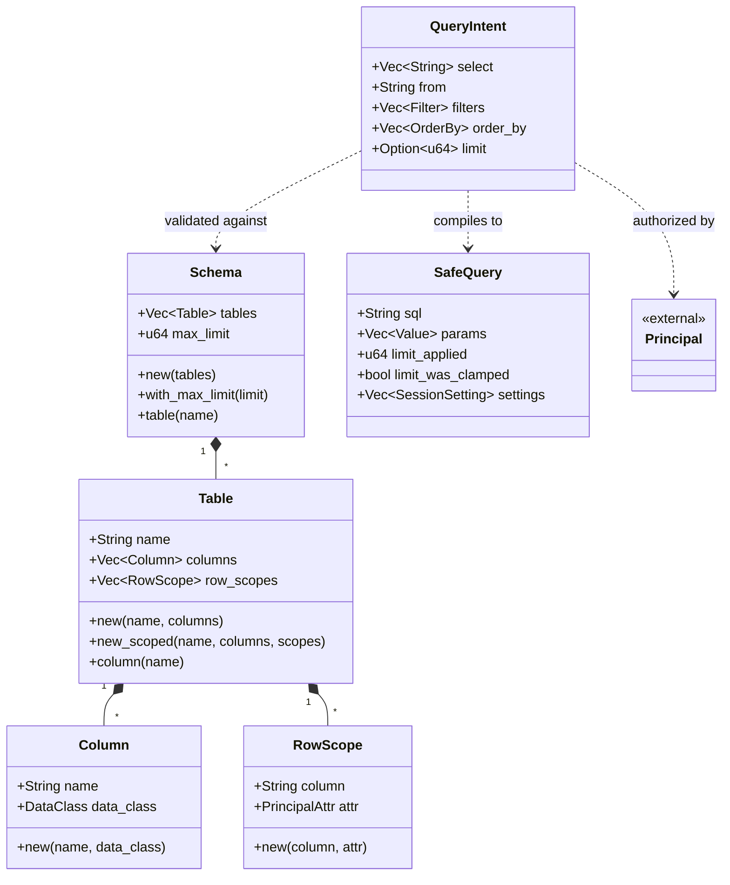

# nl2sql — Safe Natural-Language-to-SQL Boundary

The `nl2sql` module (`ainxt-nl2sql`) is the safe compilation boundary that turns a model's structured natural-language query intent into a bounded, parameterized, authorization-aware SQL statement. It is designed for a payments-platform context where an agent must answer questions over structured ledger and reporting data without ever being allowed to emit raw SQL.

## Purpose

An agent that can translate user questions into database queries is powerful, but allowing a model to emit raw SQL introduces three critical risks:

1. **Exfiltration or mutation** — a crafted or prompt-injected query may read too much, mutate the ledger, or stack statements.
2. **SQL injection** — user-controlled filter values can break out of string literals and become executable code.
3. **Over-privilege reads** — a query may touch columns above the caller's data-class clearance, leaking regulated data.

`nl2sql` eliminates these risks by **never letting the model emit SQL at all**. The model proposes a [`QueryIntent`](nl2sql.md#queryintent), a `SELECT`-only, structured description of what it wants. The crate validates and compiles that intent against an explicit [`Schema`](nl2sql.md#schema) allowlist and an authenticated [`Principal`](security_config_identity.md#principal), producing a [`SafeQuery`](nl2sql.md#safequery): parameterized SQL plus out-of-band parameters.

## Core Guarantees

The module provides four structural guarantees:

| Guarantee | Mechanism |
|-----------|-----------|
| **Allowlist identifiers** | Every table and column must exist in a [`Schema`](nl2sql.md#schema). Identifiers are validated against a strict `[A-Za-z_][A-Za-z0-9_]*` grammar at schema-build time. |
| **Parameterized values** | Filter values are carried out-of-band in [`SafeQuery::params`](nl2sql.md#safequery) as `$1`, `$2`, … placeholders. There is no code path that interpolates a user value into SQL text. |
| **Pre-authorization without existence leak** | Unknown columns and columns above the caller's clearance both return the same [`QueryError::ColumnNotAvailable`](nl2sql.md#queryerror), preventing enumeration attacks. |
| **Bounded results** | Every compiled query carries a `LIMIT`. Missing or oversized limits are clamped to the schema's configured maximum. |

In addition, the module enforces **row-level security** through [`RowScope`](nl2sql.md#rowscope) rules that inject principal-derived predicates into every query over a scoped table. Mutation is structurally impossible because [`QueryIntent`](nl2sql.md#queryintent) has no field for a statement verb, raw fragment, join, subquery, or unknown field.

## Architecture

The module is intentionally a **pure, deterministic compiler**. It performs no I/O, uses no clock or randomness, and does not execute SQL. The compiled [`SafeQuery`](nl2sql.md#safequery) is `Serialize`, so a transport or tool handler can return it over the wire to be executed by the deployment's database driver.

## Component Overview

### Schema Allowlist

The schema is the authoritative allowlist of what the model is permitted to query.

- [`Schema`](nl2sql.md#schema) — a collection of [`Table`](nl2sql.md#table)s plus a global row ceiling (`max_limit`).
- [`Table`](nl2sql.md#table) — an allowlisted table name, its readable [`Column`](nl2sql.md#column)s, and any [`RowScope`](nl2sql.md#rowscope) rules.
- [`Column`](nl2sql.md#column) — a column name and the minimum [`DataClass`](security_config_identity.md#dataclass) clearance required to read it.
- [`RowScope`](nl2sql.md#rowscope) — a row-level-security rule binding a table column to a principal attribute (`department` or `user_id`).

Schema, table, and column construction all validate identifiers and reject duplicates, empty tables, zero limits, and row scopes over unknown columns. Config-loaded schemas route through `try_from` wire types ([`SchemaWire`](nl2sql.md#schemawire), [`TableWire`](nl2sql.md#tablewire), [`ColumnWire`](nl2sql.md#columnwire)) so deserialization cannot bypass validation.

### Query Intent

[`QueryIntent`](nl2sql.md#queryintent) is the only expressive surface the model has over the database:

- `select`: non-empty list of column names to project.
- `from`: single source table name.
- `filters`: AND-combined [`Filter`](nl2sql.md#filter)s over columns.
- `order_by`: [`OrderBy`](nl2sql.md#orderby) terms.
- `limit`: optional row cap.

The type uses `#[serde(deny_unknown_fields)]`, so payloads attempting to smuggle extra fields such as `raw_sql` are rejected at deserialization. There is no representation for `SELECT *`, joins, subqueries, or any DML/DDL statement.

### Compilation Pipeline

[`validate_and_compile`](nl2sql.md#validate_and_compile) performs the following steps:

1. Resolve `from` against the schema allowlist.
2. Require a non-empty projection.
3. Resolve and authorize every `select`, `filter`, and `order_by` column against the principal's clearance.
4. Emit filter values as numbered placeholders, appending values to the parameter vector.
5. Inject row-scope predicates using principal-derived values.
6. Force a bounded `LIMIT`.
7. Assemble the final `SELECT` statement and [`SessionSetting`](nl2sql.md#sessionsetting)s for native DB RLS.

The entrypoint [`query_ledger`](nl2sql.md#query_ledger) adds a coarse capability gate: the principal must hold `CAP_QUERY_LEDGER` (or be `Admin`) before compilation begins.

### Output

[`SafeQuery`](nl2sql.md#safequery) contains:

- `sql`: the compiled SQL using only quoted identifiers and placeholders.
- `params`: the out-of-band parameter vector.
- `limit_applied`: the actual limit used.
- `limit_was_clamped`: whether the requested limit was adjusted.
- `settings`: session settings carrying the caller's identity for defense-in-depth native RLS.

## Data Flow

## Component Interaction

## Row-Level Security

Column clearance ([`DataClass`](security_config_identity.md#dataclass)) governs which columns a principal may read. [`RowScope`](nl2sql.md#rowscope) governs which rows.

A table declares one or more row-scope rules binding a column (for example, `owner_dept`) to a principal attribute (`department` or `user_id`). At compile time, the matching predicate is injected as an additional `AND` conjunct on every query over that table. The value is taken from the authenticated principal, never from the model or user text.

Properties of row-level security in this module:

- **Un-bypassable**: the model's intent has no field that can drop or weaken the predicate.
- **Fail-closed**: if the principal lacks the required attribute, compilation is refused with [`QueryError::RowScopeUnavailable`](nl2sql.md#queryerror) rather than emitting an unscoped scan.
- **Uniform**: even high-clearance principals and admins are scoped to their own rows; clearance widens columns, not rows.
- **Defense-in-depth**: [`SafeQuery::settings`](nl2sql.md#safequery) binds the principal's identity out-of-band for native database RLS policies.

## Security Properties

### Why Mutation Is Impossible

[`QueryIntent`](nl2sql.md#queryintent) has exactly four shapes of field: `select`, `from`, `filters`, `order_by`, and `limit`. None can hold a statement verb. The compiler always begins output with `SELECT ` and never emits a `;`. There is no `Insert`, `Update`, `Delete`, or DDL type. `deny_unknown_fields` rejects any extra JSON field before compilation.

### Injection Resistance

User values are represented only by the [`Value`](nl2sql.md#value) enum (`Int`, `Text`, `Bool`). There is no `Display` or `to_sql` method, so values cannot be interpolated into SQL. Filter values are appended to [`SafeQuery::params`](nl2sql.md#safequery) and referenced only as `$n` placeholders. Even a payload such as `1; DROP TABLE ledger_entries; --` is carried verbatim as a parameter and never appears in the SQL text.

### No Existence Oracle

An unknown column and a column above the caller's clearance both produce [`QueryError::ColumnNotAvailable`](nl2sql.md#queryerror). The error variant is intentionally the same, so an under-cleared caller cannot probe for sensitive column names.

## Integration with the System

`nl2sql` sits within the [`knowledge_retrieval`](knowledge_retrieval.md) area of the AI engine. It complements:

- [`context_retrieval_routing`](context_retrieval_routing.md) and [`retrieval_core`](retrieval_core.md) for unstructured and embedding-based retrieval.
- [`retrieval_advanced`](retrieval_advanced.md) for federated, RLS, and structured query execution at the database layer.
- [`tools_cli`](tools_cli.md), where a tool handler can deserialize a model's JSON proposal and call [`query_ledger`](nl2sql.md#query_ledger) to obtain a safe, executable query.

The module depends on [`security_config_identity`](security_config_identity.md) for [`Principal`](security_config_identity.md#principal) and [`DataClass`](security_config_identity.md#dataclass), which provide identity, clearance, and capability checks. See that module's documentation for details on how principals, capabilities, and data-class sensitivity are modeled.

## Determinism and Testability

The compiler is deterministic and side-effect-free: no I/O, no clock, no randomness. Placeholder numbering is assigned in field order, so the same intent, schema, and principal always produce byte-identical SQL and an identically ordered parameter vector. Every security guarantee is expressed as a property that unit tests can assert directly.

## Key API Reference

| Item | Description |
|------|-------------|
| [`query_ledger`](nl2sql.md#query_ledger) | RBAC-gated entrypoint for transport/tool handlers. |
| [`validate_and_compile`](nl2sql.md#validate_and_compile) | Core compilation from intent to safe query. |
| [`Schema`](nl2sql.md#schema) / [`Table`](nl2sql.md#table) / [`Column`](nl2sql.md#column) | Allowlist types for tables and columns. |
| [`RowScope`](nl2sql.md#rowscope) / [`PrincipalAttr`](nl2sql.md#principalattr) | Row-level-security rule types. |
| [`QueryIntent`](nl2sql.md#queryintent) / [`Filter`](nl2sql.md#filter) / [`OrderBy`](nl2sql.md#orderby) | Structured query intent types. |
| [`SafeQuery`](nl2sql.md#safequery) / [`SessionSetting`](nl2sql.md#sessionsetting) | Compiled, parameterized output. |
| [`QueryError`](nl2sql.md#queryerror) / [`SchemaError`](nl2sql.md#schemaerror) | Runtime refusal and build-time configuration errors. |

## See Also

- [security_config_identity.md](security_config_identity.md) — identity, `Principal`, `DataClass`, and capability model.
- [knowledge_retrieval.md](knowledge_retrieval.md) — overview of the retrieval subsystem.
- [retrieval_advanced.md](retrieval_advanced.md) — structured query execution, RLS, and federation.
- [tools_cli.md](tools_cli.md) — tool handlers and SDK surfaces that consume `SafeQuery`.
