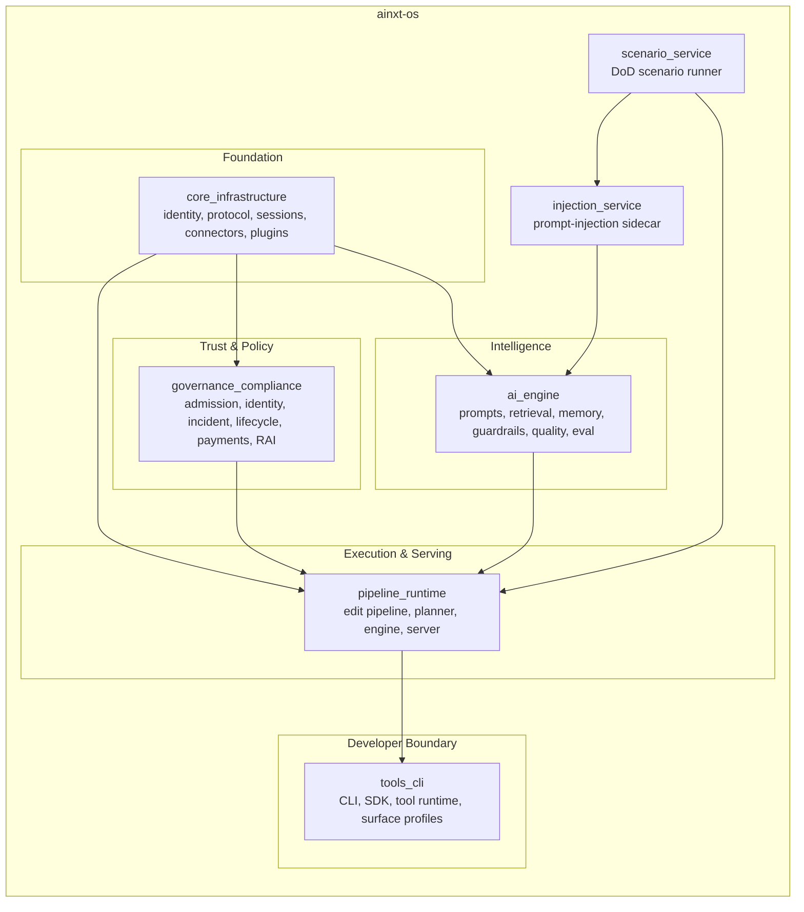
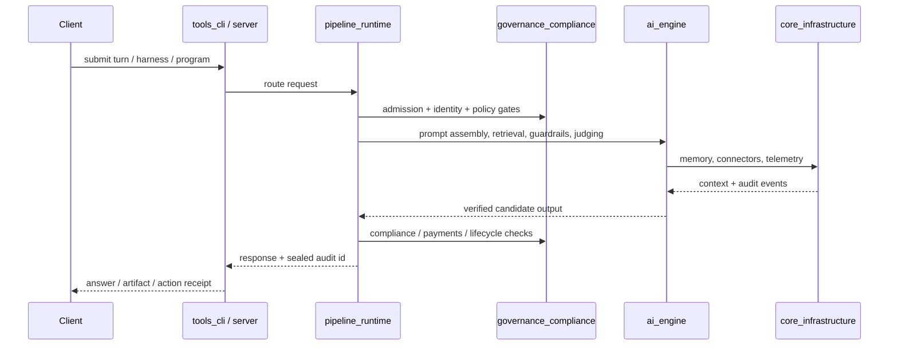

# AiNxt OS — Repository Overview

## Purpose

`ainxt-os` is the repository for the **AiNxt operating system** — a Rust-based platform for building, serving, and governing safe, deterministic, and auditable AI agents. The repository implements the full stack required to turn raw LLM capabilities into enterprise-grade autonomous workloads: core interaction primitives, AI intelligence (prompting, retrieval, memory, quality verification), governance and compliance controls, runtime execution pipelines, developer tooling, and specialized safety services.

The codebase is organized as a workspace of `ainxt-*` crates, grouped into logical modules. Each module is designed to be seam-based, deterministic, and fail-closed, with production I/O injected through caller-supplied adapters so that safety invariants can be tested offline.

---

## End-to-End Architecture

### Module topology

### Request flow

---

## Core Modules

| Module | Responsibility | Documentation |
|--------|----------------|---------------|
| `core_infrastructure` | Shared foundation: identity, configuration, cryptography, protocol, sessions, event log, graph, telemetry, cache, refresh, connectors, plugins, WASM, skills, and surfaces. | [core_infrastructure.md](core_infrastructure/core_infrastructure.md) |
| `ai_engine` | Central intelligence: prompt engineering, knowledge retrieval, memory management, safety guardrails, quality verification, answer/artifact generation, and evaluation testing. | [ai_engine.md](ai_engine/ai_engine.md) |
| `governance_compliance` | Trust and accountability layer: admission, compliance redaction, git-native governance, workload identity, incident response, data lifecycle, payments boundary, responsible AI, workforce, and teams. | [governance_compliance.md](governance_compliance/governance_compliance.md) |
| `pipeline_runtime` | Served execution and delivery: safe code editing, commit-gated edit orchestration, long-horizon program execution, the streaming turn engine, HTTP server, and fleet serving infrastructure. | [pipeline_runtime.md](pipeline_runtime/pipeline_runtime.md) |
| `tools_cli` | Developer-facing boundary: headless CLI, Rust client SDK, deterministic tool runtime with side-effect ledger, declarative surface profiles, and integration tests. | [tools_cli.md](tools_cli/tools_cli.md) |
| `injection_service` | HTTP sidecar implementing the prompt-injection and jailbreak defense stack with layered compliance, guardrails, keyword scanning, and LLM judges. | [injection_service.md](injection_service/injection_service.md) |
| `scenario_service` | Definition-of-Done scenario-matrix runner that drives targets through oracles, adversarial exploration, pairwise planning, and soak modeling to gate releases. | [scenario_service.md](scenario_service/scenario_service.md) |

---

## Key Design Principles

1. **Deterministic core** — scoring, retrieval, drift detection, and replay avoid hidden RNG and wall-clock dependence.
2. **Fail-closed** — missing capabilities, unknown data classes, and unverified outputs are denied by default.
3. **Audit-and-proceed** — compliance scanners and redactors record findings without silently mutating rendered artifacts.
4. **Seam-based I/O** — production stores, transports, and crypto backends are injected; tests use in-memory or deterministic substitutes.
5. **Least privilege** — effective capabilities are the intersection of requested, granted, and principal-held sets.