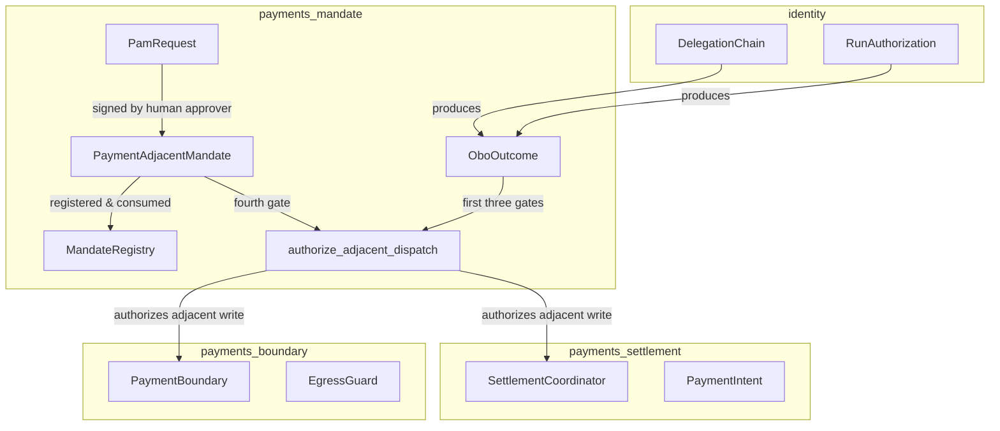
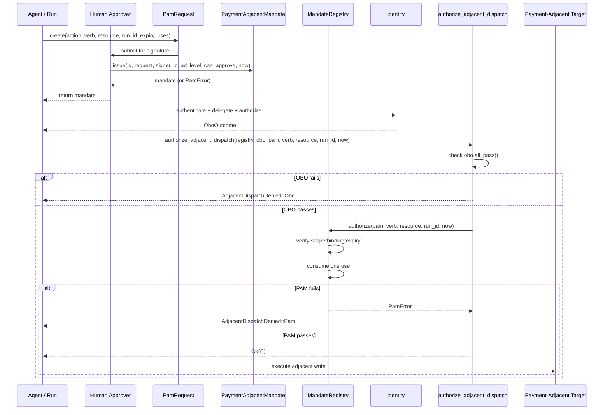
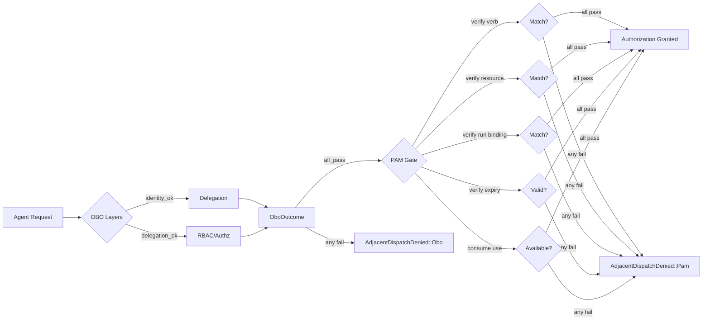
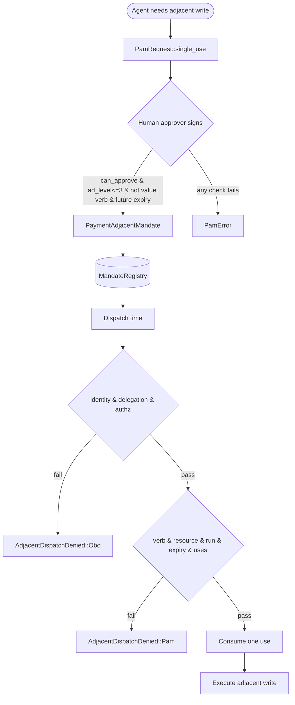

# payments_mandate

The **Payment-Adjacent Mandate (PAM)** module implements the fourth dispatch gate for payment-*adjacent* write actions, as specified in ADR-016 §6. It lives inside the [`payments`](payments.md) subsystem under [`governance_compliance`](governance_compliance.md) and provides a deterministic, fail-closed authorization primitive for operations that are *near* value movement — such as simulating a settlement in a sandbox or drafting a dispute response — while remaining **structurally incapable of expressing value movement**.

A PAM is always:

- **Human-issued, never agent-issued** — only a human approver with `can_approve` and sufficient seniority (`ad_level <= 3`) may sign one.
- **Scoped, bounded, expiring, and single-purpose** — it names exactly one action verb, one resource, a hard expiry, and a small use-count (default one), bound to a single Run identity.
- **Additive to OBO** — it is checked *in addition to* the three on-behalf-of (OBO) layers (identity, delegation, RBAC/authz), never as a substitute for them.

The module is intentionally pure: no clock, no RNG, and no I/O. Logical time is a caller-supplied `u64` tick, making PAM authority reproducible and exhaustively testable.

---

## Core Components

| Component | Responsibility |
|-----------|----------------|
| [`PamRequest`](#pamrequest) | An agent's request for a PAM: verb + resource + Run binding + expiry/uses. Contains no value fields. |
| [`PaymentAdjacentMandate`](#paymentadjacentmandate) | A human-signed mandate. Constructed only after signer-authority and no-value-verb checks pass. |
| [`MandateRegistry`](#mandateregistry) | Stateful use-count ledger. The fourth gate: verifies scope/binding/expiry and consumes one use. |
| [`OboOutcome`](#obooutcome) | Pure model of the three OBO layers evaluated by [`identity`](identity.md). |
| [`authorize_adjacent_dispatch`](#authorize_adjacent_dispatch) | Composes the three OBO gates with the PAM gate in the mandated order. |

---

## Design Guarantees

### 1. Human-Issued Only

[`PaymentAdjacentMandate::issue`](paymentadjacentmandate) refuses unless the signer holds `can_approve` and is senior enough (`ad_level <= 3`). This matches the authority class required by the payment-boundary front-matter subsystem (see [`payments_front_matter`](payments_front_matter.md)).

### 2. Scoped, Bounded, Expiring, Single-Purpose

A PAM carries exactly:

- one `action_verb` (e.g. `"settlement:simulate"`)
- one `resource` (e.g. `"netting-batch:B-42"`)
- one `bound_run_id`
- a hard `not_after` expiry
- a `max_uses` count (default `1`)

It is non-transferable and non-repudiable.

### 3. Structurally Incapable of Value Movement

The [`PaymentAdjacentMandate`](#paymentadjacentmandate) struct has **no** amount, payee, settlement-instruction, or credential field. As a belt-and-suspenders check, [`issue`](#paymentadjacentmandate) also rejects any action verb that expresses value movement (e.g. `settlement:commit`, `payment:send`, `value:move`).

### 4. Verified at Dispatch Alongside OBO

[`MandateRegistry::authorize`](#mandateregistry) is the *fourth* gate, checked after the three OBO layers. It verifies verb + resource + Run binding + expiry and consumes one use. A PAM can never rescue a failed OBO gate.

---

## Architecture

### Component Interaction

---

## Data Flow

---

## Core Component Details

### `PamRequest`

An agent's *request* for a PAM. By construction it carries only:

- `action_verb`: the adjacent action verb
- `resource`: the target resource
- `bound_run_id`: the Run the mandate will be bound to
- `not_after`: requested hard expiry (logical tick, inclusive)
- `max_uses`: requested use-count (clamped to `>= 1`)

The helper `PamRequest::single_use` constructs a default single-use request.

### `PaymentAdjacentMandate`

A human-signed mandate. Constructed exclusively via `issue`, which enforces:

- signer has `can_approve`
- signer `ad_level <= PAM_MAX_SIGNER_AD_LEVEL` (3)
- non-empty verb, resource, and Run binding
- action verb is not a value-movement verb
- expiry is in the future

The struct deliberately omits any value-movement fields. Its `verify` method checks scope, binding, and expiry without mutating state.

### `MandateRegistry`

Tracks per-mandate use-counts in a `BTreeMap<String, u32>`. `authorize` is the stateful fourth gate:

1. Calls `PaymentAdjacentMandate::verify`
2. Checks that consumed uses `< max_uses`
3. Increments the consumed count

This prevents replay of single-use or small-N mandates.

### `OboOutcome`

A pure, decoupled model of the three OBO layers evaluated by [`identity`](identity.md):

- `identity_ok`: acting agent identity is authenticated/non-revoked
- `delegation_ok`: delegation chain grants authority for the action
- `authz_ok`: RBAC/authz permits the action

`OboOutcome::all_pass` requires all three booleans to be true. Keeping this struct in `payments_mandate` avoids a cyclic dependency on `ainxt-identity`.

### `authorize_adjacent_dispatch`

The composed four-gate check. Ordering is strict:

1. Evaluate `obo.all_pass()`.
2. If false, return `AdjacentDispatchDenied::Obo` **without consuming a PAM use**.
3. If true, call `MandateRegistry::authorize`.
4. If that fails, return `AdjacentDispatchDenied::Pam`.

This guarantees that a valid single-use PAM is not burned by an unrelated OBO failure.

---

## Error Model

All failures are fail-closed and represented by [`PamError`](#pamerror) or [`AdjacentDispatchDenied`](#adjacentdispatchdenied):

| Error | Meaning |
|-------|---------|
| `SignerCannotApprove` | Signer lacks `can_approve` (agent or non-approver). |
| `SignerTooJunior` | Signer `ad_level > 3`. |
| `ValueMovementNotRepresentable` | Action verb expresses value movement. |
| `EmptyField` | Verb, resource, or Run binding is empty. |
| `AlreadyExpired` | Expiry is in the past at issuance. |
| `WrongAction` | Presented verb does not match mandate. |
| `WrongResource` | Presented resource does not match mandate. |
| `NotBoundToRun` | Presenting Run differs from bound Run. |
| `Expired` | Mandate has passed `not_after`. |
| `Exhausted` | Use-count is spent. |
| `UnknownMandate` | Mandate id not registered. |

`AdjacentDispatchDenied` wraps either an OBO failure or a PAM failure, preserving the distinction required by the design.

---

## How It Fits into the System

The `payments_mandate` module is one of four submodules inside [`payments`](payments.md):

- [`payments_boundary`](payments_boundary.md): defines the payment perimeter, egress guards, and settlement policies.
- [`payments_front_matter`](payments_front_matter.md): authoring context and change-control for payment-boundary definitions.
- [`payments_settlement`](payments_settlement.md): value-movement intents, sagas, and the `SettlementCoordinator`.
- **`payments_mandate`**: authorization for payment-*adjacent* writes that must not move value.

It depends conceptually on [`identity`](identity.md) for OBO outcomes, but not structurally (the `OboOutcome` model keeps the dependency acyclic). It is consumed by higher-level dispatch surfaces such as [`runtime_engine`](runtime_engine.md) and [`server_serving`](server_serving.md) when authorizing adjacent writes near the payment boundary.

The module also aligns with governance requirements enforced by [`admission`](admission.md) and [`responsible_ai`](responsible_ai.md): human approval, audit correlation, non-repudiation, and fail-closed safety.

---

## Process Flow: Issuing and Consuming a PAM

---

## Determinism and Testability

The module is designed for deterministic, property-based testing:

- Logical time is a `u64` tick supplied by the caller.
- No wall-clock, randomness, or I/O is performed.
- All authorization checks are pure functions.
- The test suite covers human-only issuance, value-verb rejection, scoping, binding, expiry, single-use semantics, and small-N use counts.

---

## See Also

- [`payments`](payments.md) — parent module overview
- [`payments_boundary`](payments_boundary.md) — payment perimeter and egress guards
- [`payments_settlement`](payments_settlement.md) — value-movement settlement coordinator
- [`payments_front_matter`](payments_front_matter.md) — change control for payment definitions
- [`identity`](identity.md) — authentication, delegation, and RBAC/OBO layers
- [`admission`](admission.md) — harness admission and compliance gates
- [`responsible_ai`](responsible_ai.md) — governance, model risk, and oversight
- [`runtime_engine`](runtime_engine.md) — runtime dispatch surfaces that consume mandates
- [`server_serving`](server_serving.md) — serving layer where adjacent writes are dispatched
