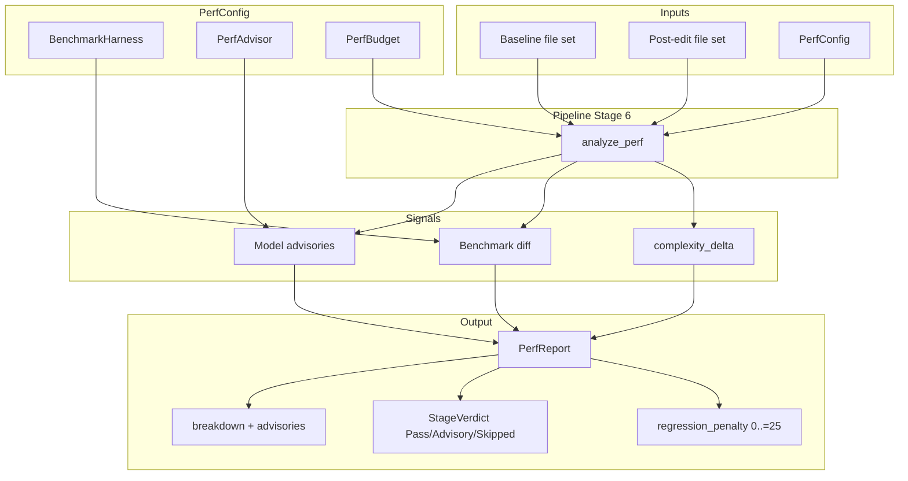
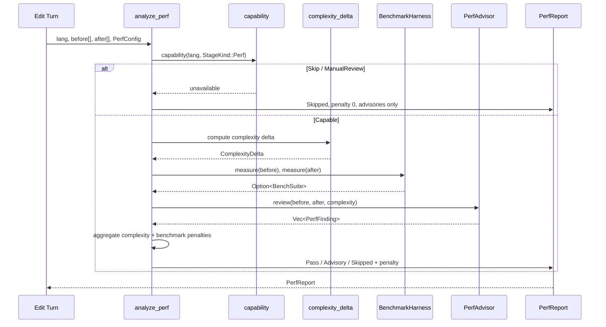
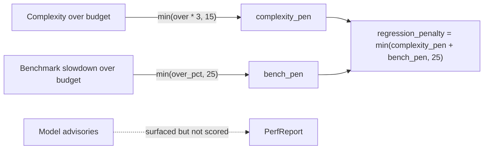
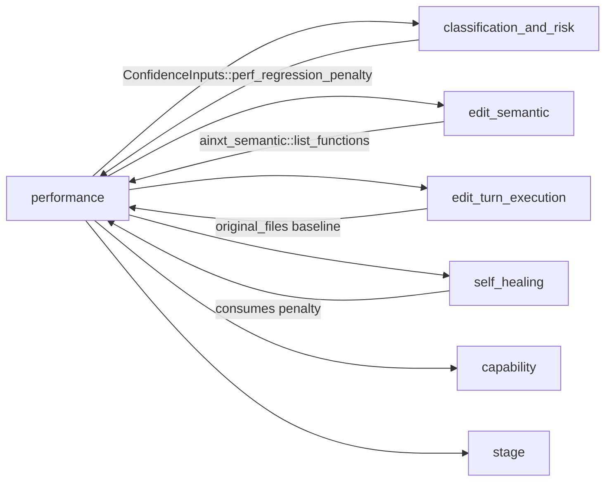
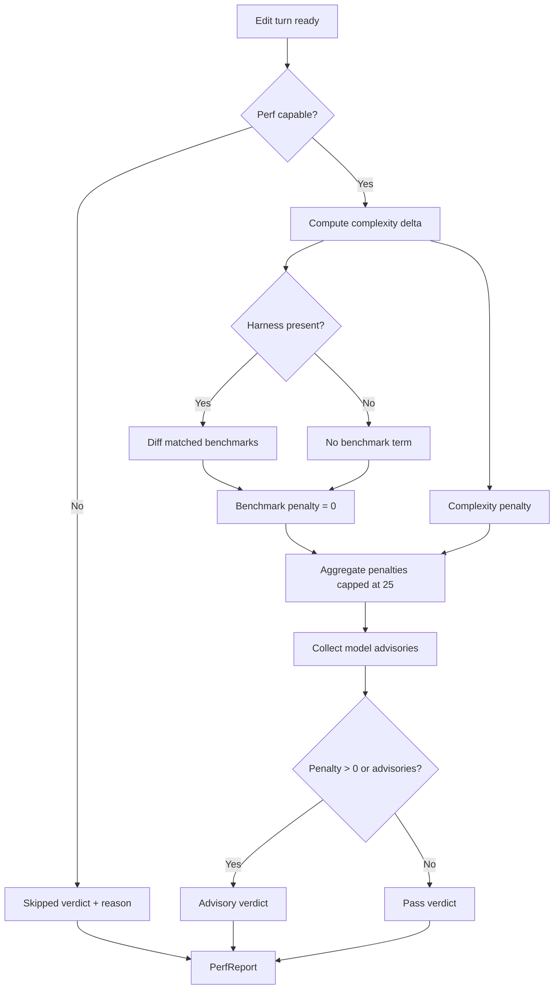

# Performance Analysis Module

## Brief Introduction

The **Performance Analysis** module implements **stage 6** of the code-review pipeline. It closes a critical gap where the `Perf` stage was previously declared but never executed, and where the self-heal loop hard-coded the performance regression penalty to `0`. The module now computes a real, bounded `0..=25` regression penalty that feeds into the downstream [Confidence Score](classification_and_risk.md) and produces an honest, non-gating stage verdict.

Performance Analysis is intentionally **non-gating**: a genuinely necessary slowdown must still be committable by a human, so the stage never emits a hard `Fail`. Instead it returns `Pass`, `Advisory`, or `Skipped`, giving reviewers a scored risk signal plus qualitative model advisories.

---

## Core Responsibilities

1. **Benchmark diffing** — measure baseline vs. post-edit file sets through a pluggable harness seam (`cargo bench`, JMH, `pytest-benchmark`, etc.).
2. **AST-complexity heuristic** — compute added cyclomatic complexity using tree-sitter function spans from [ainxt-semantic](edit_semantic.md), with a lexical fallback for unsupported languages.
3. **Model advisory review** — surface qualitative performance findings (allocation in a loop, N+1 query, blocking I/O) without letting the model influence the numeric penalty.
4. **Penalty aggregation** — combine the deterministic signals into a single `0..=25` regression penalty consumed by the confidence stage.

---

## Architecture

---

## Component Reference

### `PerfConfig`
Deployment-level seams wired once and reused across turns:

| Field | Type | Purpose |
|-------|------|---------|
| `bench` | `&dyn BenchmarkHarness` | Pluggable benchmark harness seam |
| `advisor` | `&dyn PerfAdvisor` | Pluggable model-advisory seam |
| `budget` | `PerfBudget` | Tolerated regression thresholds |

### `PerfBudget`
Per-deployment thresholds:

| Field | Default | Meaning |
|-------|---------|---------|
| `max_complexity_growth` | `5` | Added cyclomatic complexity tolerated before penalty begins |
| `max_regression_ratio` | `1.10` | Benchmark slowdown tolerated before penalty begins (`1.10` = 10%) |

### `BenchmarkHarness` / `BenchSuite` / `BenchSample`
The harness seam measures a file set and returns named nanosecond durations.

- `NoBench` — default no-op harness; always returns `None` so only the AST-complexity signal runs.
- `ScriptedBench` — deterministic offline harness keyed by source substring markers, used in tests and dry-runs.

### `PerfAdvisor` / `PerfFinding`
The model-advisory seam returns qualitative findings.

- `NoAdvisor` — default no-op advisor.
- `HotPathAdvisor` — production-style advisor that flags hot-path issues.

A `PerfFinding` contains a `message` and a `hot_path` boolean. Findings are surfaced verbatim but **never** added to the numeric penalty.

### `ComplexityDelta`
Tracks cyclomatic complexity before and after an edit:

| Field | Meaning |
|-------|---------|
| `before` | Total complexity of baseline file set |
| `after` | Total complexity of post-edit file set |
| `added` | Net added complexity (`0` if simplified or neutral) |

### `PerfReport`
The stage output consumed by the pipeline:

| Field | Meaning |
|-------|---------|
| `regression_penalty` | `0..=25` penalty fed into confidence inputs |
| `verdict` | `Pass`, `Advisory`, or `Skipped` |
| `advisories` | Qualitative model findings |
| `breakdown` | Human-readable per-signal deduction lines |
| `complexity` | Computed `ComplexityDelta` |
| `worst_ratio` | Worst benchmark slowdown ratio, if any |

---

## Data Flow

---

## Penalty Calculation

The final `regression_penalty` is the sum of two deterministic terms, capped at `25`:

- **Complexity term**: `(added_complexity - max_complexity_growth) * 3`, capped at `15`.
- **Benchmark term**: excess slowdown percentage over `max_regression_ratio`, capped at `25`.
- **Model advisories**: always advisory-only; they cannot inflate or gate the score.

---

## Dependencies

- **[classification_and_risk](classification_and_risk.md)** — consumes `regression_penalty` as `ConfidenceInputs::perf_regression_penalty`.
- **[edit_semantic](edit_semantic.md)** — provides tree-sitter function spans for AST complexity calculation.
- **[edit_turn_execution](edit_turn_execution.md)** — supplies the pre-edit baseline (`original_files`) and post-edit file set.
- **[self_healing](self_healing.md)** — uses the penalty during the heal loop; previously hard-coded to `0`.
- `capability` and `stage` — internal pipeline crates that gate stage execution and report stage verdicts.

---

## Process Flow: Running Stage 6

---

## Integration Notes

- The module is designed to be **deterministic**: benchmark and AST-complexity signals are tool-based; model advisories ride alongside but do not decide the verdict.
- A language with no perf tooling returns `Skipped` with a reason, which is an honest scored skip rather than a silent pass.
- Production harness implementations are expected to shell out to the real benchmark runner inside the serving-ops sandbox; see [serving_infrastructure](serving_infrastructure.md) for placement and execution context.
- The `ScriptedBench` and `NoAdvisor` implementations make the stage fully testable offline without model or infrastructure dependencies.

---

## Testing Strategy

The module includes unit tests covering:

- Pure refactor within budget → `Pass`, penalty `0`.
- Large complexity jump → `Advisory`, penalty > `0`.
- Benchmark slowdown over budget → penalty capped at `25`.
- No harness → only complexity signal applies.
- Language without perf tooling → honest `Skipped`.
- Model advisory surfaced but never scored.
- Whole-word cyclomatic keyword matching avoids substring false positives.
