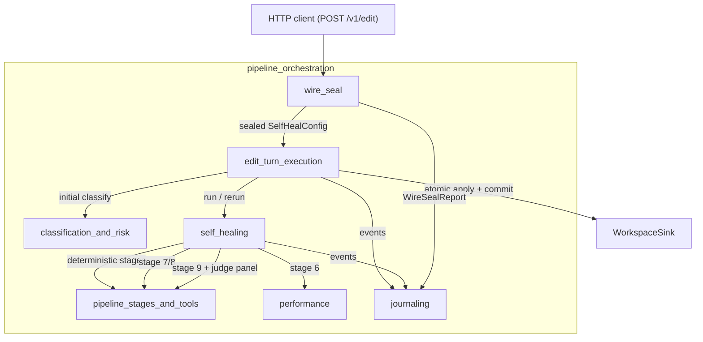
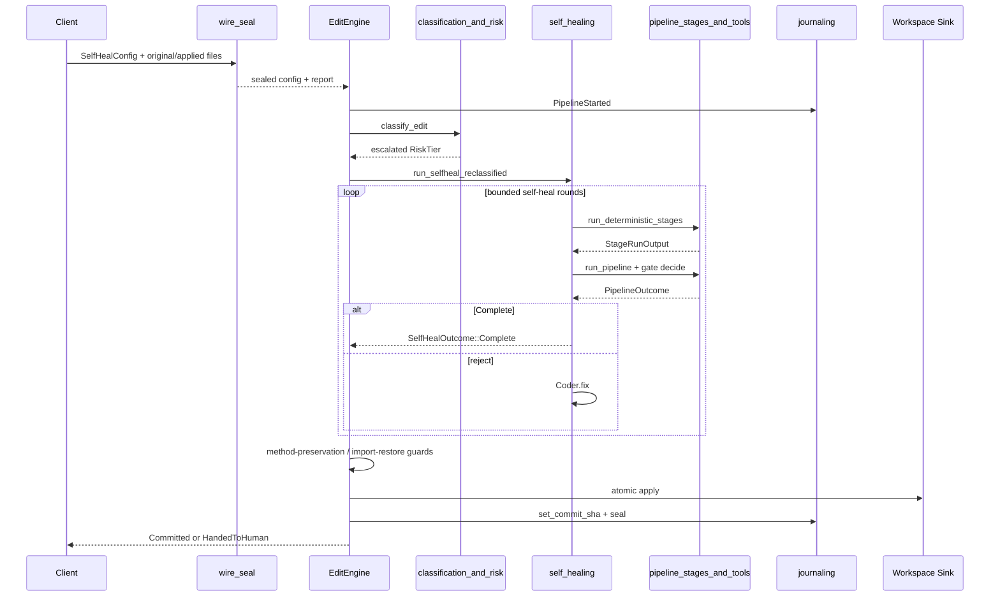
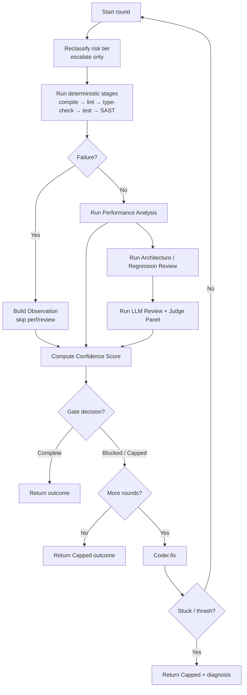

# `pipeline_orchestration` Module Overview

## Purpose

`pipeline_orchestration` is the commit-gated orchestration layer for AI-generated code edits. It lives in `crates/ainxt-pipeline` under the broader `pipeline_runtime` subsystem. Its job is to take a candidate edit (or an agent-expressed semantic operation), run it through a deterministic, auditable sequence of verification stages, optionally heal failures, and either atomically commit the result or hand the turn off to a human reviewer.

The module is built around several safety invariants:

- **Commit-gated writes.** A durable workspace write only happens after the self-heal loop reaches a `Complete` outcome and pre-commit guards pass.
- **Anti-sycophancy.** `CommitApproval` has no public constructor; it can only be produced by an honest `PipelineOutcome::Complete`.
- **Deterministic risk classification.** The risk tier is derived from the actual code diff, not from caller assertions, and can only escalate.
- **Honest stage reporting.** Missing tools report `Skipped` (a penalty), never a fabricated pass.
- **Forensic reproducibility.** Every turn is recorded in a hash-chained, cryptographically sealed journal.

## Architecture

`pipeline_orchestration` is composed of seven tightly-coupled sub-modules:

| Sub-module | Responsibility |
|---|---|
| `edit_turn_execution` | `EditEngine` facade, edit-turn entrypoints, semantic-turn planning, ladder-driven edits, and atomic commit guards. |
| `classification_and_risk` | Deterministic risk tiering, edit classification, and confidence scoring from stage outputs. |
| `pipeline_stages_and_tools` | The twelve canonical pipeline stages (compile, lint, type-check, test, SAST, architecture review, regression detection, LLM review, commit gate). |
| `performance` | Stage 6 performance analysis: benchmark regression, AST complexity, and model advisories. |
| `self_healing` | Bounded fix-and-reverify loop with optional perf, semantic, review, and risk-reclassification seams. |
| `journaling` | Append-only, hash-chained, sealed event log for regulator replay. |
| `wire_seal` | Trust boundary that sanitizes caller-supplied `SelfHealConfig` against deployment-owned policy. |

### High-level component diagram

### Edit-turn data flow

### Self-heal loop detail

## Core Components

The main types and files in `crates/ainxt-pipeline/src` are:

| Type | File | Purpose |
|---|---|---|
| `EditEngine` | `edit_turn.rs` | Long-lived facade that owns the coder, stage tools, SAST scanner, and optional seams. |
| `EditTurn` / `EditRequest` / `EditResponse` | `edit_turn.rs` | One editing turn and its wire types. |
| `SemanticTurn` / `SemanticTurnOutcome` | `semantic_turn.rs` | Planning and gating structural operations. |
| `WiredReplace` / `GuardedApply` | `ladder_driver.rs` | Wired fall-back ladder and pre-commit guards. |
| `PipelineOutcome` / `CommitApproval` | `outcome.rs` | Typed gate result and unforgeable commit token. |
| `SelfHealConfig` / `SelfHealOutcome` | `selfheal.rs` | Loop budget, state, and result. |
| `Coder` trait | `selfheal.rs` | Pluggable fix generator (`IdentityCoder`, model-backed, test coders). |
| `Stage` / `StageReport` / `StageRunOutput` | `stage.rs`, `stages.rs` | Canonical stage vocabulary and runner output. |
| `GatePolicy` / `GateContext` | `gate.rs` | Final commit-gate thresholds and decision context. |
| `Journal` / `JournalRecord` / `SignedSeal` | `journal.rs` | Hash-chained, sealed audit log. |
| `DeploymentEditPolicy` / `WireSealReport` | `wire_seal.rs` | Server-derived policy and override audit record. |
| `EditRiskAssessment` / `ConfidenceScore` / `RiskInputs` | `classify.rs`, `confidence.rs`, `risk.rs` | Risk classification and scoring. |
| `PerfReport` / `PerfConfig` / `BenchmarkHarness` | `perf.rs` | Performance regression analysis. |

## References to Core Component Documentation

- [`edit_turn_execution`](edit_turn_execution.md) — `EditEngine`, edit/semantic turns, ladder driver, and commit guards.
- [`classification_and_risk`](classification_and_risk.md) — deterministic risk tiering, edit classification, and confidence scoring.
- [`pipeline_stages_and_tools`](pipeline_stages_and_tools.md) — canonical stage model, deterministic runner, SAST, semantic review, and commit gate.
- [`performance`](performance.md) — Stage 6 performance analysis and penalty aggregation.
- [`self_healing`](self_healing.md) — bounded fix-and-reverify loop with optional seams.
- [`journaling`](journaling.md) — hash-chained, sealed event log.
- [`wire_seal`](wire_seal.md) — trust boundary for caller-supplied configuration.

## Integration with the Rest of the System

- **Lower-level editing primitives:** [`edit_semantic`](edit_semantic.md) supplies AST transforms, LSP refactor, symbol graphs, and workspace sinks.
- **Quality verification:** [`ai_engine_quality_verification_judge`](ai_engine_quality_verification_judge.md) supplies the independent Judge panel and review oracles used in Tier-2+ turns.
- **Runtime / server:** [`runtime_engine`](runtime_engine.md) and [`server_serving`](server_serving.md) own the HTTP routes and assemble the `EditEngine` at startup.
- **Governance:** capability checks (e.g., `CAP_EDIT_APPLY`) are enforced before any turn is assembled.