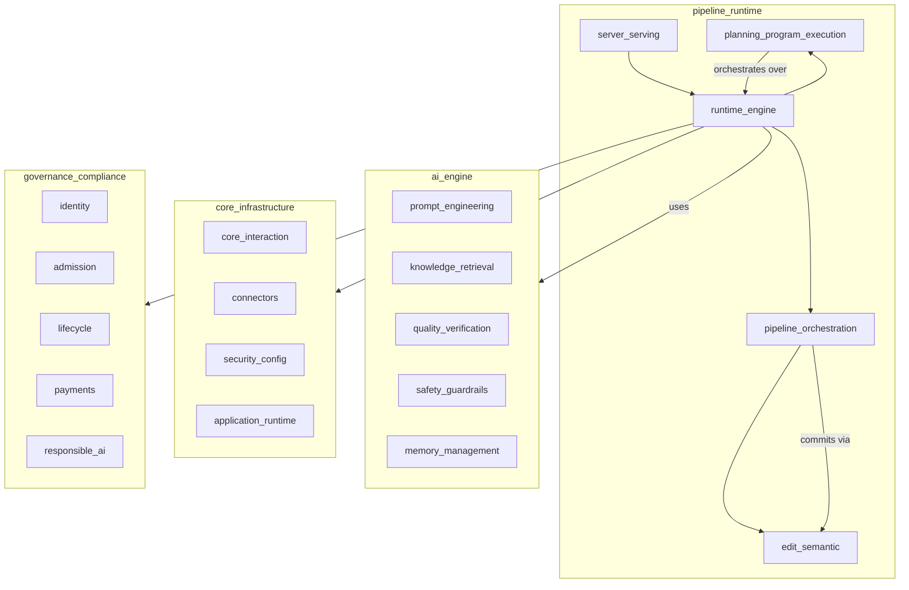
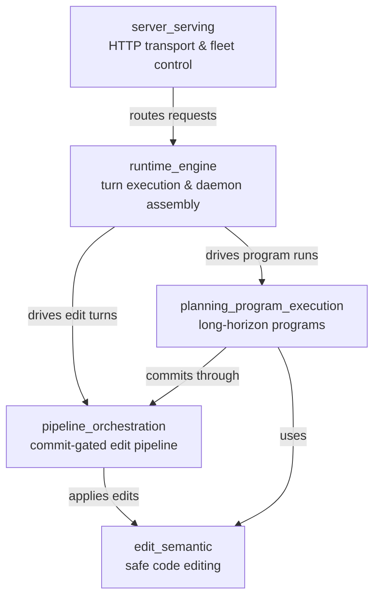
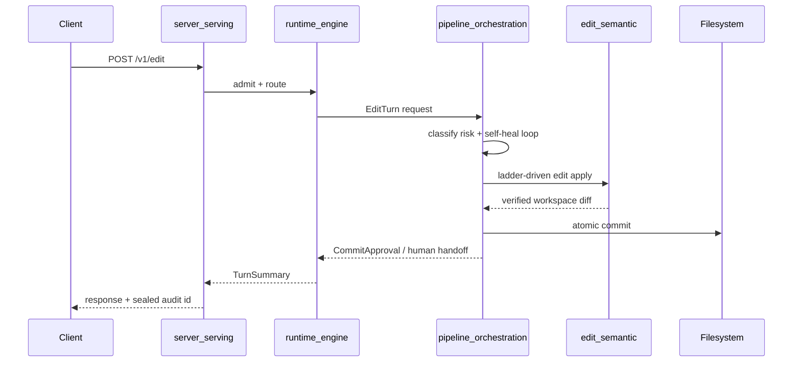

# `pipeline_runtime` Module Overview

## Purpose

`pipeline_runtime` is the **served execution and delivery layer** of the system. It hosts the live runtime that turns AI-generated decisions into verified, governed, and observable actions. The module bridges the higher-level `ai_engine` (prompting, retrieval, quality, safety) and `governance_compliance` layers with the lower-level `core_infrastructure` (sessions, connectors, memory, telemetry) by providing:

- **Code-editing primitives** that safely apply AI-generated edits to real source trees.
- **Commit-gated edit orchestration** that verifies, heals, and either commits edits or escalates to humans.
- **Long-horizon program execution** for multi-step engineering objectives.
- **A streaming turn engine** that runs chat, tool, and workforce turns under policy.
- **An HTTP serving boundary** and fleet control plane that exposes these capabilities to clients.

Everything in `pipeline_runtime` is designed around fail-closed safety: writes are atomic, audits are sealed, gates are mandatory, and partial failures are rolled back rather than silently accepted.

---

## Repository Structure

```
pipeline_runtime/
├── edit_semantic/              # crates/ainxt-edit, crates/ainxt-semantic
├── pipeline_orchestration/     # crates/ainxt-pipeline
├── planning_program_execution/ # crates/ainxt-planner
├── runtime_engine/             # crates/ainxt-runtime, crates/ainxt-runtimed
└── server_serving/             # crates/ainxt-server, crates/ainxt-serving
```

---

## Architecture

### High-level placement



### Internal submodule relationships



### Typical request flow



---

## Core Sub-modules

| Sub-module | Responsibility | Key Crates |
|---|---|---|
| **edit_semantic** | Safe, deterministic code editing: anchor-based patches, AST transforms, LSP refactor, symbol-graph risk analysis, and atomic workspace apply. | `ainxt-edit`, `ainxt-semantic` |
| **pipeline_orchestration** | Commit-gated orchestration of AI-generated edits: risk classification, deterministic verification stages, self-healing, journaling, and atomic commit. | `ainxt-pipeline` |
| **planning_program_execution** | Long-horizon, durable program execution: goal decomposition, dependency-ordered modules, three-way verification, and human governance checkpoints. | `ainxt-planner` |
| **runtime_engine** | Served turn execution and daemon composition: the core `Engine`, model routing, tool dispatch, memory injection, and surfaces for chat, workforce, and program execution. | `ainxt-runtime`, `ainxt-runtimed` |
| **server_serving** | Network-facing HTTP boundary and operational control plane: authentication, route handlers, streaming, plus fleet admission, scheduling, placement, health, rollout, caching, erasure, and attestation. | `ainxt-server`, `ainxt-serving` |

---

## References to Core Component Documentation

- **[edit_semantic.md](edit_semantic.md)** — code-editing substrate, edit ladder, AST engine, symbol graph, and atomic workspace operations.
- **[pipeline_orchestration.md](pipeline_orchestration.md)** — `EditEngine`, self-heal loop, deterministic stages, risk classification, journaling, and wire seal.
- **[planning_program_execution.md](planning_program_execution.md)** — plan definition, durable program execution, supervision, and three-way verification.
- **[runtime_engine.md](runtime_engine.md)** — core `Engine`, model routing, turn pipeline, daemon assembly, and runtime surfaces.
- **[server_serving.md](server_serving.md)** — HTTP server facade, authentication, wire streaming, and serving infrastructure.

## Related Modules

- [ai_engine](ai_engine.md) — prompt engineering, retrieval, quality verification, and memory feeding the runtime.
- [core_infrastructure](core_infrastructure.md) — protocol types, sessions, connectors, caching, and telemetry used by the engine.
- [governance_compliance](governance_compliance.md) — identity, admission, lifecycle, payments, and responsible-AI governance enforced at runtime.
- [tools_cli](tools_cli.md) — client SDK, CLI, and tool runtime consumed by the server and runtime.