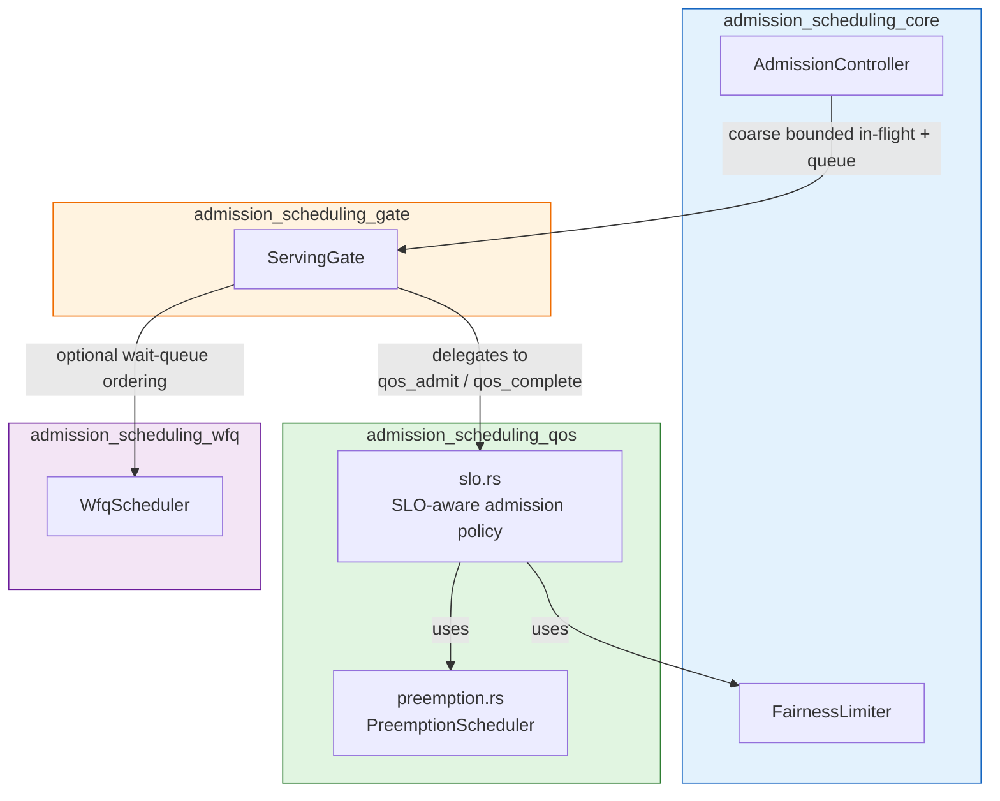
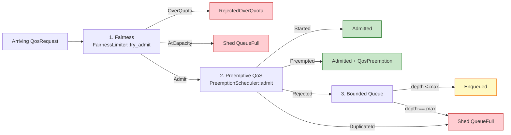
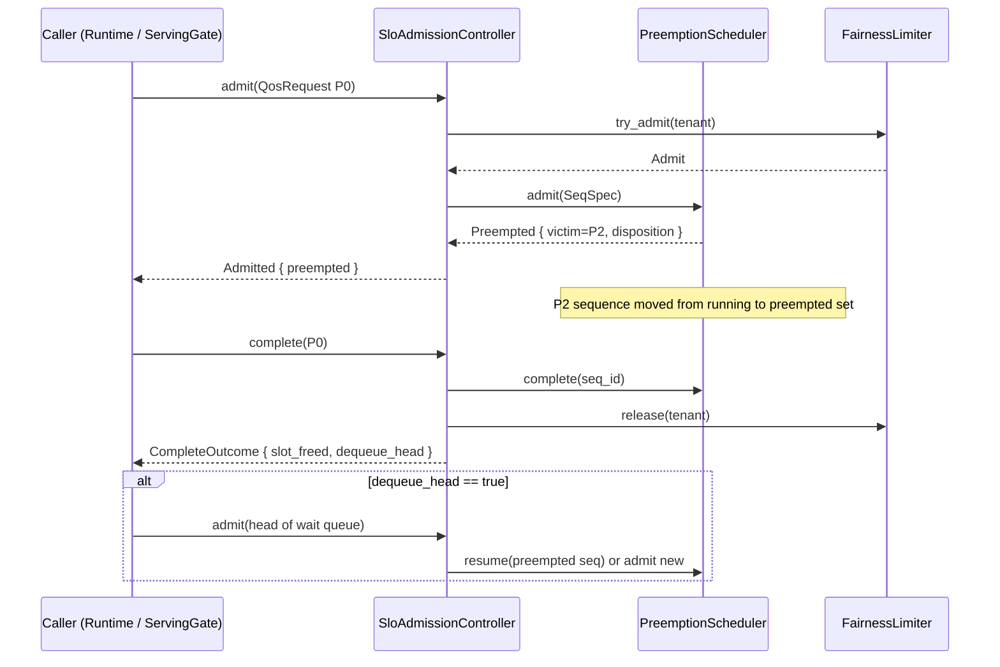
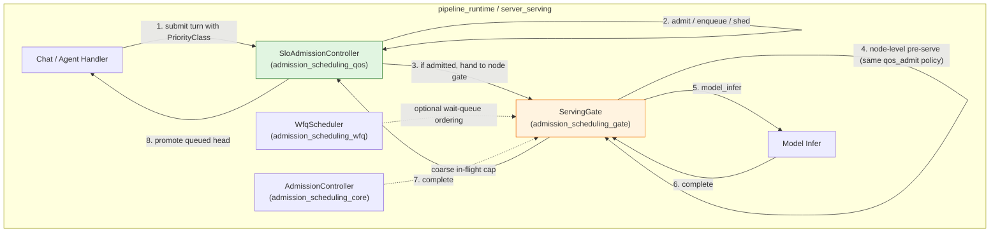

# admission_scheduling_qos

The `admission_scheduling_qos` module implements the **SLO-aware, priority-preemptive admission path** for the serving layer. It is the *pre-node* decision point that determines whether an arriving request may run immediately, preempt lower-priority work, wait in a bounded queue, or be shed with honest backpressure. The module was introduced to close a specific operational gap: the main request path previously submitted turns without a priority class and never invoked the scheduler, allowing incident-critical P0 work to queue behind long-running P2 program runs.

This module is part of the larger [`admission_scheduling`](admission_scheduling.md) subsystem and sits between the coarse-grained concurrency controls in [`admission_scheduling_core`](admission_scheduling_core.md) and the node-level inference gate in [`admission_scheduling_gate`](admission_scheduling_gate.md).

---

## Core Responsibilities

1. **Priority-aware admission** — every arriving [`QosRequest`](admission_scheduling_qos.md#qosrequest) carries a [`PriorityClass`](admission_scheduling_core.md#priorityclass). The controller uses that class to decide whether the request can run now or must displace lower-priority work.
2. **Chunk/step-granular preemption** — via [`PreemptionScheduler`](admission_scheduling_qos.md#preemptionscheduler), long-running work is advanced one unit at a time and can be preempted at unit boundaries, preserving committed progress.
3. **Per-tenant fairness** — integration with [`FairnessLimiter`](admission_scheduling_core.md#fairnesslimiter) ensures no tenant consumes another tenant's reserved share.
4. **Bounded-queue backpressure** — when the pool is full and no lower-priority work is preemptible, arrivals wait in a counted, bounded queue; once the ceiling is reached, subsequent requests are shed honestly.
5. **Kill-switch correlation** — sequences can be tagged with an identity-plane `run_id`, enabling an authority-scoped kill-switch to force-preempt a running sequence regardless of its priority.

---

## Architecture

The module is composed of two source files:

- `crates/ainxt-serving/src/slo.rs` — the main admission policy and reusable `qos_admit` / `qos_complete` functions.
- `crates/ainxt-serving/src/preemption.rs` — the chunk/step-granular preemptive scheduler.



### Design Principles

- **Pure and deterministic** — no clock, no GPU, no async. The policy is a synchronous function of pool state and request attributes.
- **Single source of truth** — the `qos_admit` and `qos_complete` free functions are shared by both `SloAdmissionController` and `ServingGate::pre_serve`, so the standalone controller and the node-level gate can never diverge.
- **Policy-only queue** — the controller holds only a queue-depth counter. The actual request objects and dequeue/wakeup logic live in the caller.
- **P0 protection** — [`PriorityClass::Interactive`](admission_scheduling_core.md#priorityclass) work is never selected as a victim by normal preemption; it can only be displaced by an authority-scoped kill-switch.

---

## Core Components

### `SloAdmissionController`

The main entry point for the SLO-aware admission path. It composes a [`FairnessLimiter`](admission_scheduling_core.md#fairnesslimiter), a [`PreemptionScheduler`](admission_scheduling_qos.md#preemptionscheduler), and a bounded wait queue into one deterministic decision.

```rust
pub struct SloAdmissionController {
    fairness: FairnessLimiter,
    scheduler: PreemptionScheduler,
    max_queue_depth: u32,
    queued: u32,
}
```

Key methods:

- `admit(&mut self, req: &QosRequest) -> SloDecision` — runs fairness → preemptive QoS → bounded-queue backpressure.
- `pre_serve(&mut self, req: &QosRequest) -> SloDecision` — thin alias for `admit`, used by the served surface.
- `complete(&mut self, req: &QosRequest) -> Result<CompleteOutcome, SchedError>` — frees the slot and fairness quota, and signals whether a queued request may be promoted.
- `resume(&mut self, seq_id: u64) -> Result<bool, SchedError>` — resumes a previously-preempted sequence if a slot is free.
- `queue_depth`, `running_count`, `preempted_count`, `tenant_usage` — introspection helpers.

### `QosRequest`

The input to the admission decision. Unlike the node-level [`InferRequest`](admission_scheduling_gate.md#inferrequest), it carries only the information the §2 admission path needs: priority class, tenant, and generation accounting.

```rust
pub struct QosRequest {
    pub seq_id: u64,
    pub priority: PriorityClass,
    pub tenant: TenantId,
    pub total_units: u64,
    pub kv_pages: u32,
    pub run_id: Option<String>,
}
```

- `seq_id` — unique sequence identifier for the scheduler.
- `priority` — the SLO priority class (P0/P1/P2).
- `tenant` — the fairness tenant, typically the JWT `department` claim.
- `total_units` — total chunks/steps the generation will take.
- `kv_pages` — KV pages held by the sequence; drives the evicted-recoverable disposition.
- `run_id` — optional identity-plane run identifier for kill-switch correlation.

### `SloDecision`

The verdict returned by `admit`:

- `Admitted { preempted: Option<QosPreemption> }` — the request runs now; optionally names a preempted lower-priority victim.
- `Enqueued { depth: u32 }` — the request waits in the bounded queue.
- `RejectedOverQuota { quota: u32 }` — the tenant exceeded its WFQ quota.
- `Shed(ShedReason)` — honest backpressure; the queue is full or fairness capacity is exhausted.

### `QosPreemption`

Describes a preemption performed to admit a higher-priority request:

```rust
pub struct QosPreemption {
    pub victim: u64,
    pub victim_priority: PriorityClass,
    pub disposition: KvDisposition,
}
```

### `CompleteOutcome`

Returned by `complete`:

```rust
pub struct CompleteOutcome {
    pub slot_freed: bool,
    pub dequeue_head: bool,
}
```

`dequeue_head` tells the caller that a queued request may now be promoted; the caller re-drives `admit` for the head of its wait queue.

### `PreemptionScheduler`

The chunk/step-granular preemptive scheduler. It maintains:

- a running set of up to `capacity` sequences,
- a set of preempted sequences awaiting resume,
- deterministic victim selection (lowest priority first; ties broken by largest id).

Key methods:

- `admit(spec: SeqSpec) -> Result<AdmitOutcome, SchedError>` — admits a sequence, preempting a strictly-lower-priority incumbent if necessary.
- `advance(id, units)` — advances a running sequence by one or more chunks/steps.
- `complete(id)` — a running sequence finished normally.
- `resume(id)` — resumes a preempted sequence when a slot is free.
- `force_preempt_by_run_id(run_id)` — authority-scoped kill-switch preemption that ignores priority.

### `SeqSpec`

The scheduler's internal representation of a sequence:

```rust
pub struct SeqSpec {
    pub id: u64,
    pub priority: PriorityClass,
    pub tenant: TenantId,
    pub phase: Phase,
    pub total_units: u64,
    pub kv_pages: u32,
    pub run_id: Option<String>,
}
```

### `KvDisposition`

What happens to a preempted sequence's state:

- `EvictedRecoverable { pages, resume_from }` — P1 victims keep recoverable KV and resume from `resume_from`.
- `CheckpointedToPending { resume_from }` — P2 (Batch/Program) victims checkpoint to `PENDING` and re-queue at the Program Supervisor level.

### `PreemptedRecord`

A preempted sequence awaiting resume:

```rust
pub struct PreemptedRecord {
    pub spec: SeqSpec,
    pub resume_from: u64,
    pub disposition: KvDisposition,
}
```

---

## Admission Decision Flow

The `qos_admit` function implements the three-step policy in a fixed order:



1. **Per-tenant fairness** — `FairnessLimiter::try_admit` checks the tenant's WFQ quota. Over-quota requests are rejected without consuming a slot.
2. **Preemptive QoS** — `PreemptionScheduler::admit` tries to place the request. If the pool is full, it preempts the lowest-priority incumbent strictly below the arrival. P0 work is never a victim in normal admission.
3. **Bounded queue** — if the request cannot run and cannot preempt, the fairness slot is released. If the wait queue has room, the request is enqueued; otherwise it is shed.

---

## Preemption Lifecycle



### Progress Preservation

When a sequence is preempted, its `resume_from` is set to the number of completed units. This means:

- A P1 SDLC decode that has generated 37 tokens before preemption resumes from token 38, not from scratch.
- A P2 program run that has completed 30 steps checkpoints to `PENDING` and resumes from step 30 under the Program Supervisor contract.

---

## Kill-Switch Forced Preemption

The scheduler supports an authority-scoped override via `force_preempt_by_run_id`. This is intentionally stronger than normal admission preemption:

- It matches sequences by `run_id`, the same identifier used by the identity plane's `AgentWorkloadCredential`.
- It preempts regardless of priority, including P0/Interactive work.
- It preserves the same disposition rules: Batch victims checkpoint to `PENDING`; others keep evicted-recoverable KV.

This mechanism is the serving-side implementation of the "big red button" described in the governance and identity modules. See [`identity`](../governance_compliance/identity.md) and [`incident`](../governance_compliance/incident.md) for the authority and kill-switch lifecycle.

---

## Integration with the Serving Stack



- The chat/agent handler assigns a [`PriorityClass`](admission_scheduling_core.md#priorityclass) to each turn and calls `SloAdmissionController::admit`.
- If admitted, the turn proceeds to [`ServingGate`](admission_scheduling_gate.md) for node selection and physical inference.
- If enqueued, the handler retains the request object and re-drives admission when `complete` signals `dequeue_head`.
- If shed, the handler returns an honest backpressure response (e.g., HTTP 503 with `retry-after`).

---

## Dependencies

| Dependency | Module | Role |
|------------|--------|------|
| `FairnessLimiter` | [`admission_scheduling_core`](admission_scheduling_core.md) | Per-tenant WFQ quota enforcement |
| `PriorityClass` | [`admission_scheduling_core`](admission_scheduling_core.md) | P0/P1/P2 priority classification |
| `ShedReason` | [`admission_scheduling_core`](admission_scheduling_core.md) | Honest backpressure reason |
| `TenantId` | [`admission_scheduling_core`](admission_scheduling_core.md) | Fairness tenant identity |
| `ServingGate` | [`admission_scheduling_gate`](admission_scheduling_gate.md) | Node-level gate that reuses `qos_admit` |
| `WfqScheduler` | [`admission_scheduling_wfq`](admission_scheduling_wfq.md) | Optional wait-queue ordering |
| `AgentWorkloadCredential` / `run_id` | [`identity`](../governance_compliance/identity.md) | Kill-switch correlation |

---

## Operational Notes

- **Capacity vs. queue depth** — `PreemptionScheduler::capacity` is the pool concurrency. `max_queue_depth` is the number of requests that may wait when the pool is full and no preemption is possible.
- **No unbounded queues** — once `queued == max_queue_depth`, every further arrival is shed. This is the intended degradation mode.
- **Determinism** — victim selection is deterministic: lowest priority, then largest `seq_id`. This makes tests and incident analysis reproducible.
- **No async in the policy** — the controller does not sleep, wake, or perform I/O. The caller owns all timing and request object lifetimes.

---

## Related Documentation

- [`admission_scheduling`](admission_scheduling.md) — parent module overview
- [`admission_scheduling_core`](admission_scheduling_core.md) — `FairnessLimiter`, `AdmissionController`, `PriorityClass`
- [`admission_scheduling_gate`](admission_scheduling_gate.md) — `ServingGate` and node-level inference admission
- [`admission_scheduling_wfq`](admission_scheduling_wfq.md) — weighted-fair queuing for wait-queue ordering
- [`admission_scheduling_idempotency`](admission_scheduling_idempotency.md) — exactly-once billing ledger used by `ServingGate`
- [`identity`](../governance_compliance/identity.md) — identity plane, `AgentWorkloadCredential`, and kill-switch semantics
- [`incident`](../governance_compliance/incident.md) — incident response and kill-switch lifecycle
