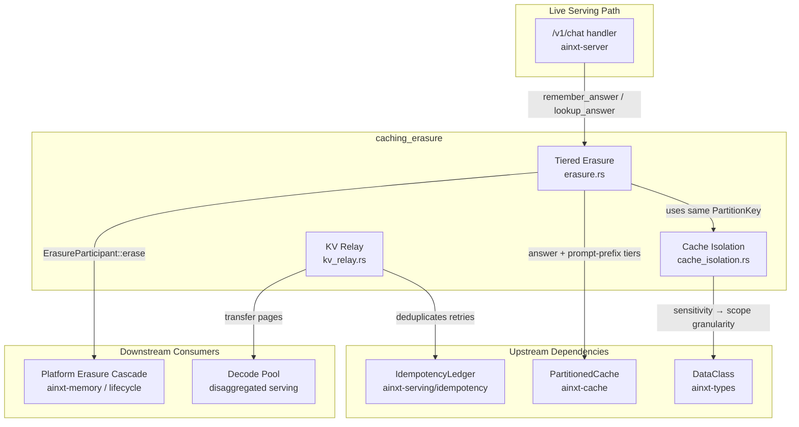
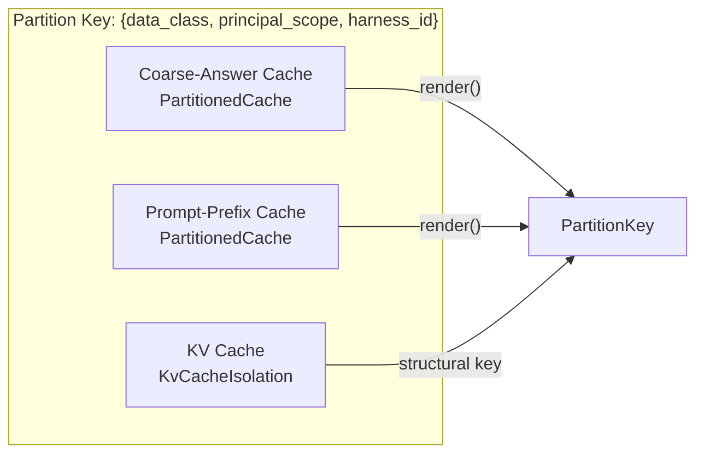
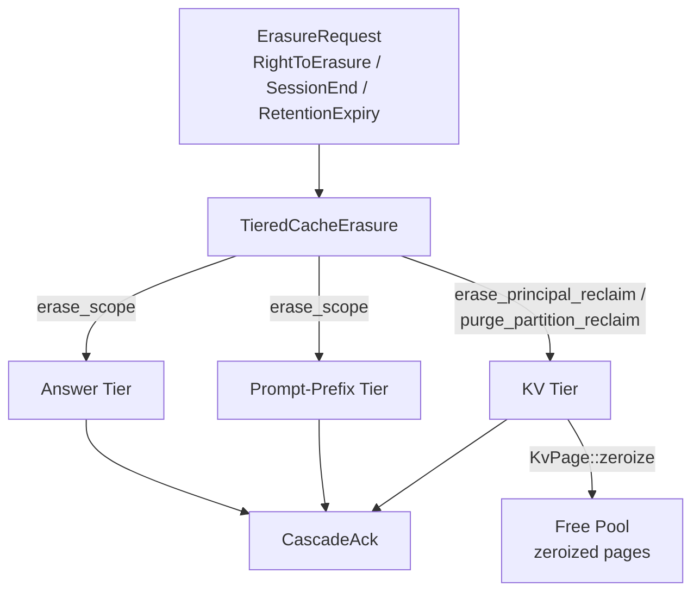
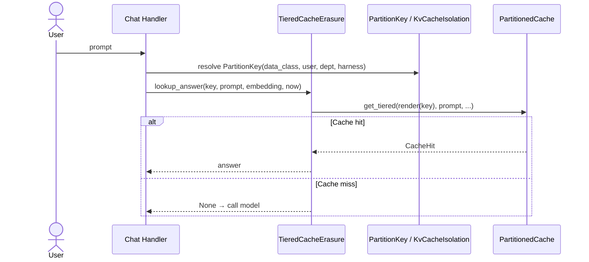
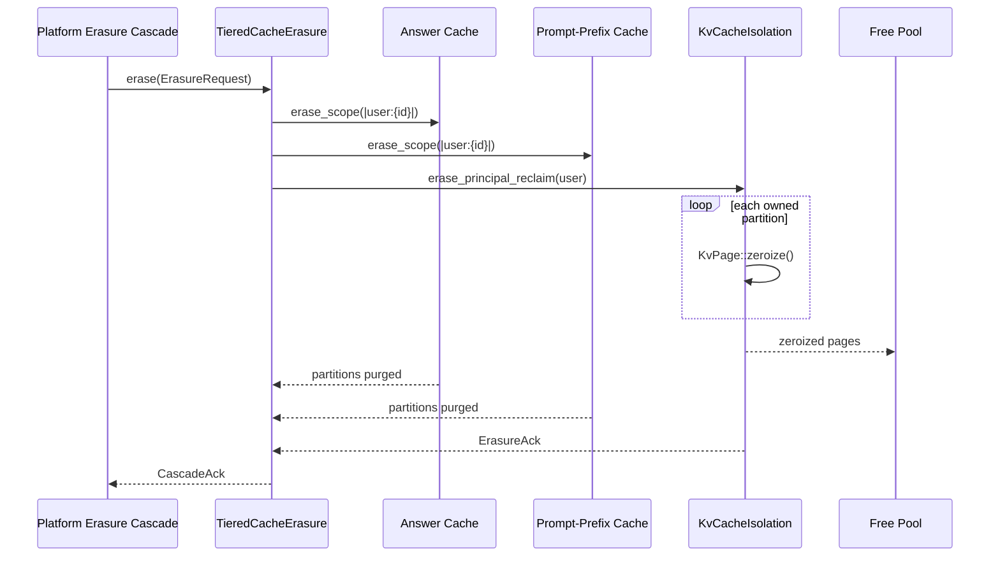

# Caching & Erasure (`caching_erasure`)

## Purpose

The `caching_erasure` module is the serving-ops subsystem that makes inference caching **safe to share** and **safe to erase**. It lives inside the broader [serving infrastructure](serving_infrastructure.md) and is responsible for three tightly related concerns:

1. **Cache isolation** — ensuring that byte-identical prompts from different principals or data classes never share a cache entry, eliminating timing-based cross-tenant leaks.
2. **Tiered erasure** — driving a coordinated purge across the coarse-answer cache, prompt-prefix cache, and KV cache so that a DPDP right-to-erasure or session-end event reaches data that only ever lived in GPU-resident KV memory.
3. **KV relay** — moving paged KV blocks from the prefill pool to the decode pool in a disaggregated serving topology, with credit-based flow control and idempotent retry.

The module is deterministic and pure: it models GPU memory as opaque bytes and uses no clock, RNG, or real network, so its isolation and zeroization invariants are unit-assertable byte-for-byte.

## Where It Fits

`caching_erasure` is a child of [serving_infrastructure](serving_infrastructure.md), which is itself part of [server_serving](server_serving.md). It depends on:

- [`ainxt-cache`](../core_infrastructure/core_interaction.md) for the `PartitionedCache` implementation used by the answer and prompt-prefix tiers.
- [`ainxt-types`](../core_infrastructure/security_config.md) for the `DataClass` sensitivity model that drives partition granularity.
- [`ainxt-serving/idempotency`](server_serving.md) for the `IdempotencyLedger` that makes KV relay retries safe.

The live serving path (e.g. `ainxt-server` chat handlers) populates the answer cache through this module, and the platform erasure cascade (e.g. `ainxt-memory` / lifecycle sweeper) drives erasure through the `ErasureParticipant` trait exposed here.

## Architecture Overview

### Three Cache Tiers

Each of the three boxes below is documented in its own sub-module page: [cache isolation](caching_erasure_cache_isolation.md), [tiered erasure](caching_erasure_tiered_erasure.md), and [KV relay](caching_erasure_kv_relay.md).

SERVING_OPS.md §6 requires three cache tiers to be partitioned by the same key:

### Erasure Paths

## Sub-Modules

| Sub-module | File | Responsibility | Documentation |
|------------|------|----------------|---------------|
| Cache Isolation | `cache_isolation.rs` | Defines the uniform `PartitionKey`, resolves `PrincipalScope` from `DataClass`, and provides `KvCacheIsolation` with zeroize-before-free semantics. | [caching_erasure_cache_isolation.md](caching_erasure_cache_isolation.md) |
| Tiered Erasure | `erasure.rs` | Composes the three cache tiers into a single erasure cascade, exposes the `ErasureParticipant` trait, and provides live-path cache read/write entrypoints. | [caching_erasure_tiered_erasure.md](caching_erasure_tiered_erasure.md) |
| KV Relay | `kv_relay.rs` | Credit-based prefill→decode KV block relay with fabric-aware transport selection and idempotent retry. | [caching_erasure_kv_relay.md](caching_erasure_kv_relay.md) |

## Key Design Decisions

- **Uniform partition key**: All three tiers use `{data_class, principal_scope, harness_id}`. Two byte-identical prompts from different principals are structurally distinct, so there is no hit/miss timing signal to exploit.
- **Data-class-driven scope granularity**: `confidential`, `regulated-payment`, and `pii` isolate per-user; `internal` and `public` may share per-department. Missing department metadata narrows to per-user, never widens.
- **Zeroize-before-free**: KV pages are explicitly overwritten with zeros before their slots return to the free pool, bounding data lifetime even against a future confidential-computing stack bug.
- **Shared answer cache**: `TieredCacheErasure` can be constructed with an `Arc<Mutex<PartitionedCache>>` owned by the live chat surface, ensuring erasure reaches entries the served path actually created.
- **Credit-based relay**: Decode nodes advertise landing capacity as credits; the relay never pushes more pages than credited, preventing prefill bursts from OOMing the decode pool.

## Data Flow

### Cache Hit Path

### Erasure Path

## Related Modules

- [serving_infrastructure](serving_infrastructure.md) — parent module covering placement, health, rollout, admission, scheduling, and attestation.
- [server_serving](server_serving.md) — top-level server module that wires the chat handler to this subsystem.
- [core_interaction](../core_infrastructure/core_interaction.md) — provides `PartitionedCache` and other core interaction primitives.
- [security_config](../core_infrastructure/security_config.md) — provides `DataClass` and the sensitivity model.
